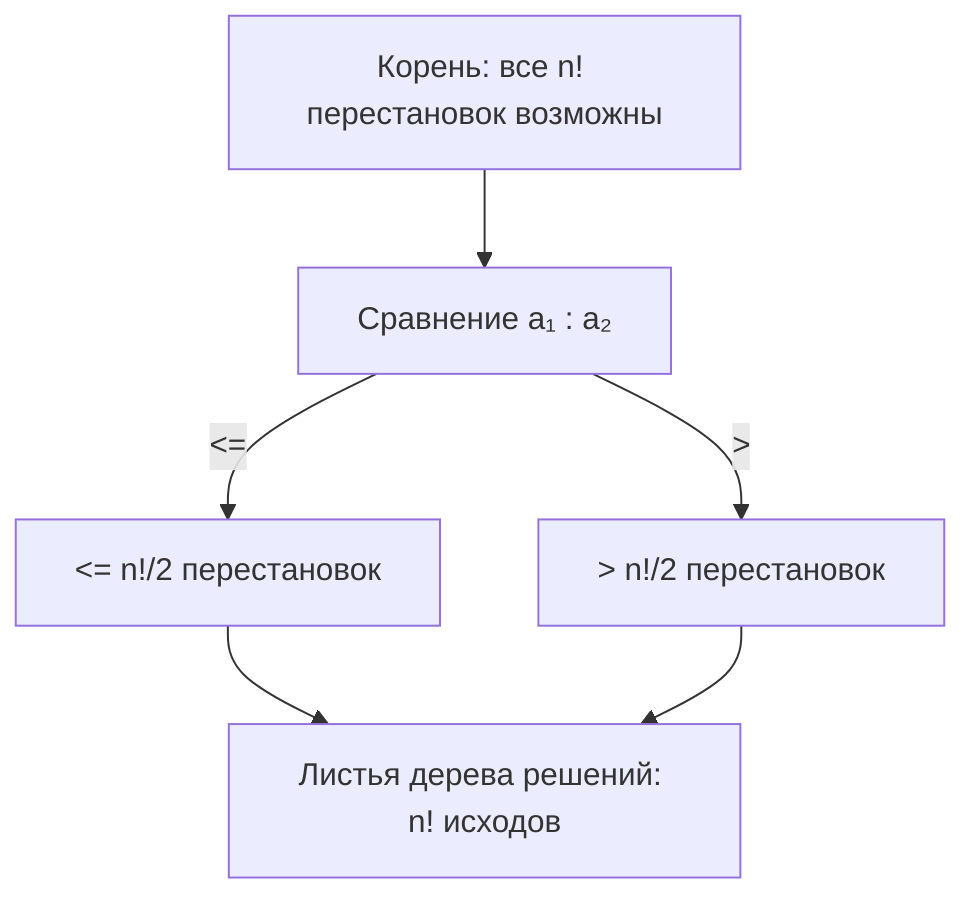
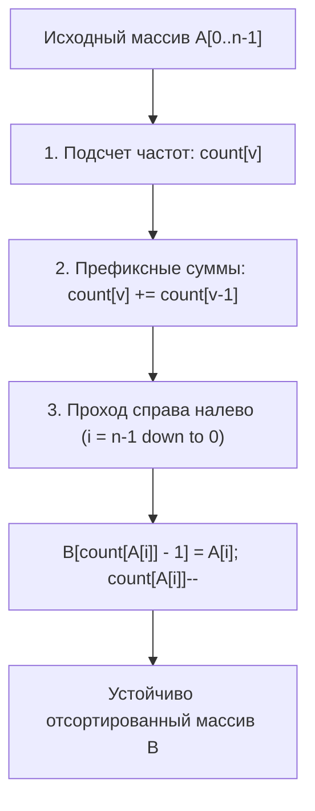
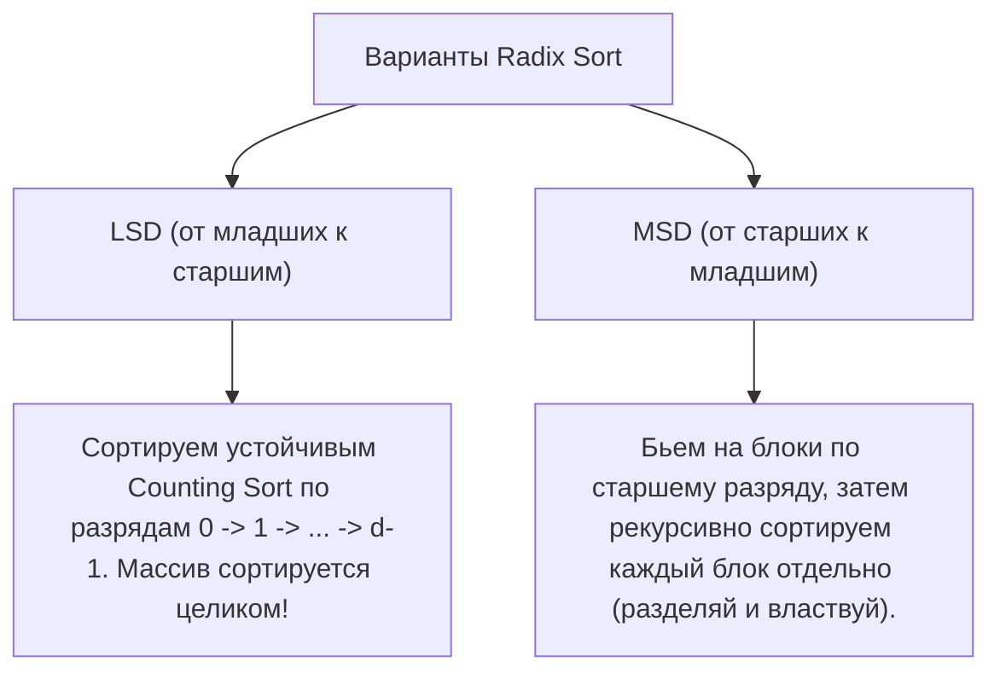
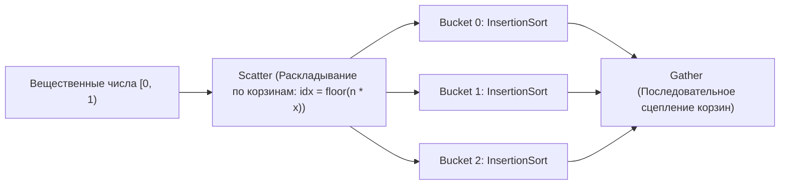

# Лекция 3: Линейные сортировки (Counting Sort, Radix Sort, Bucket Sort)

---

## 1. Рекомендуемая литература и материалы

* **Конспекты ИТМО ДМ-АИСД:** [dm-aisd.yonote.ru/share/itmo_dm_aisd](https://dm-aisd.yonote.ru/share/itmo_dm_aisd)
* **Т. Кормен, Ч. Лейзерсон, Р. Ривест, К. Штайн — «Алгоритмы: построение и анализ» (4-е изд.)**  
  *Глава 8: Сортировка за линейное время (Нижняя граница для сортировок сравнением $\Omega(n \log n)$, Сортировка подсчетом, Поразрядная сортировка, Карманная сортировка).*
* **Конспекты кафедры КТ ИТМО (neerc.ifmo.ru/wiki)**  
  *Статьи: «Сортировка подсчетом», «Цифровая сортировка (LSD/MSD)», «Карманная сортировка».*

---

## 2. Теоретический барьер: почему алгоритмы сравнения не могут работать быстрее $\Omega(n \log n)$

Все универсальные алгоритмы сортировки (Merge Sort, Heap Sort, Quick Sort в среднем) основаны на **попарном сравнении элементов** ($a_i \le a_j$).

### Теорема о нижней оценке для сортировок сравнением:
Любой алгоритм сортировки на основе сравнений в худшем случае требует как минимум $\Omega(n \log n)$ операций сравнения.



* **Идея доказательства через дерево решений:**
  1. Результат сортировки массива из $n$ различных элементов — это одна из $n!$ возможных перестановок.
  2. Алгоритм сравнения можно представить в виде бинарного дерева решений, где каждый внутренний узел — это сравнение $a_i \le a_j$, а каждый лист — итоговая перестановка.
  3. Чтобы уметь отличать все возможные исходы, дерево обязано содержать не менее $n!$ листьев: $L \ge n!$.
  4. Высота бинарного дерева $h$ (наихудшее число сравнений) удовлетворяет:
     $$2^h \ge L \ge n! \implies h \ge \log_2(n!)$$
  5. По формуле Стирлинга $\ln(n!) = n \ln n - n + O(\ln n)$:
     $$h \ge \log_2(n!) = \Omega(n \log n)$$

> **Как обойти барьер $\Omega(n \log n)$?**  
> Отказаться от модели попарных сравнений и использовать **внутреннюю структуру ключей** (числа в фиксированном диапазоне, поразрядное представление, распределение значений).

---

## 3. Сортировка подсчётом (Counting Sort)

### 3.1. Идея и базовая версия
Если известно, что все $n$ элементов массива являются целыми неотрицательными числами из небольшого диапазона $[0, K-1]$, то можно просто подсчитать количество вхождений каждого числа.

1. Заводим массив счётчиков `count` размера $K$, заполненный нулями.
2. Проходим по исходному массиву $A$ и для каждого элемента $A[i]$ делаем `count[A[i]]++`.
3. Перезаписываем массив $A$, выписывая каждое число $v$ ровно `count[v]` раз.

*Недостаток наивной версии:* она уничтожает спутниковые данные (структуры, пары «ключ-значение»). Для реальных задач необходима **устойчивая версия**.

---

### 3.2. Устойчивая версия Counting Sort (Stable Counting Sort)

#### Зачем нужна устойчивость (Stability)?
**Устойчивой** называется сортировка, которая **сохраняет относительный порядок элементов с одинаковыми ключами**. Это критически важно, так как Counting Sort служит базовым кирпичиком для поразрядной сортировки (Radix Sort).

#### Алгоритм устойчивой сортировки подсчетом:
1. **Подсчёт частот:** Вычисляем массив `count[0..K-1]`, где `count[v]` — число элементов равных $v$.
2. **Префиксные суммы:** Преобразуем `count[v]` так, чтобы оно хранило количество элементов, меньших либо равных $v$:
   $$count[v] = count[v] + count[v - 1]$$
   Теперь `count[v]` указывает на **последнюю позицию (1-based)**, на которую должно встать число со значением $v$ в результирующем массиве.
3. **Обратный проход (справа налево):** Идём по исходному массиву $A$ от конца к началу ($i = n - 1 \dots 0$):
   * Ключ $v = A[i]$.
   * Ставим элемент на позицию `count[v] - 1` в выходной массив `B`.
   * Уменьшаем счётчик: `count[v]--`.
   *(Именно проход справа налево гарантирует, что элемент, стоявший правее, попадёт на правую из свободных позиций, обеспечивая устойчивость!)*



#### Пошаговый пример трассировки:
Массив пар (ключ, значение): `A = [(2, 'a'), (0, 'b'), (2, 'c'), (1, 'd'), (0, 'e')]`, $n = 5, K = 3$ (ключи от 0 до 2).
1. Частоты: `count = [2, 1, 2]` (два нуля, одна единица, две двойки).
2. Префиксные суммы:
   * `count[0] = 2` (элементы $\le 0$ займут позиции до индекса 1)
   * `count[1] = 2 + 1 = 3` (элементы $\le 1$ займут позиции до индекса 2)
   * `count[2] = 3 + 2 = 5` (элементы $\le 2$ займут позиции до индекса 4)
3. Проход справа налево:
   * $i = 4$, элемент `(0, 'e')`: ставим в `B[count[0]-1] = B[1]`, `count[0]` становится 1.
   * $i = 3$, элемент `(1, 'd')`: ставим в `B[count[1]-1] = B[2]`, `count[1]` становится 2.
   * $i = 2$, элемент `(2, 'c')`: ставим в `B[count[2]-1] = B[4]`, `count[2]` становится 4.
   * $i = 1$, элемент `(0, 'b')`: ставим в `B[count[0]-1] = B[0]`, `count[0]` становится 0.
   * $i = 0$, элемент `(2, 'a')`: ставим в `B[count[2]-1] = B[3]`, `count[2]` становится 3.
4. Итог: `B = [(0, 'b'), (0, 'e'), (1, 'd'), (2, 'a'), (2, 'c')]`.  
   *Порядок одинаковых ключей: `'b'` остался перед `'e'`, а `'a'` перед `'c'`. Сортировка абсолютно устойчива!*

#### Реализация на C++:
```cpp
#include <vector>

struct Item {
    int key;
    char val;
};

std::vector<Item> stableCountingSort(const std::vector<Item>& arr, int K) {
    int n = arr.size();
    std::vector<int> count(K, 0);
    std::vector<Item> output(n);

    // 1. Подсчет частот ключей
    for (int i = 0; i < n; ++i) {
        count[arr[i].key]++;
    }

    // 2. Префиксные суммы
    for (int i = 1; i < K; ++i) {
        count[i] += count[i - 1];
    }

    // 3. Расстановка справа налево для сохранения устойчивости
    for (int i = n - 1; i >= 0; --i) {
        int k = arr[i].key;
        output[count[k] - 1] = arr[i];
        count[k]--;
    }

    return output;
}
```

* **Сложность по времени:** $\Theta(n + K)$ (линейное время при $K = O(n)$).
* **Сложность по памяти:** $\Theta(n + K)$ (требуется дополнительный выходной массив и массив счётчиков).

---

## 4. Поразрядная сортировка (Radix Sort)

### 4.1. Идея и принцип работы
Что делать, если числа велики (например, 32-битные целые числа, где $K = 2^{32} \approx 4 \cdot 10^9$ и массив счетчиков не поместится в память)?  
Решение: представлять числа в позиционной системе счисления с основанием $B$ (например, $B = 10$, $B = 256$ или $B = 2^{16}$) и сортировать их **поразрядно**.

Существуют два фундаментальных направления:
1. **LSD (Least Significant Digit):** от младших разрядов к старшим.
2. **MSD (Most Significant Digit):** от старших разрядов к младшим.



---

### 4.2. LSD Radix Sort (Младший разряд $\to$ Старший разряд)

#### Почему это работает? (Инвариант корректности)
Если разряды сортируются **устойчивой сортировкой**, то после сортировки по первым $k$ младшим разрядам элементы оказываются упорядоченными по этим $k$ разрядам. При переходе к $(k+1)$-му разряду элементы с одинаковым $(k+1)$-м разрядом останутся взаимно упорядоченными по предыдущим $k$ разрядам в силу устойчивости!

#### Пример:
Сортируем трехзначные числа в десятичной системе: `[170, 045, 075, 090, 002, 024, 802, 066]`
1. **Сортировка по разряду единиц ($10^0$):**  
   `170, 090` (0), `002, 802` (2), `024` (4), `045, 075` (5), `066` (6)  
   $\to$ `[170, 090, 002, 802, 024, 045, 075, 066]`
2. **Сортировка по разряду десятков ($10^1$):**  
   `002, 802` (0), `024` (2), `045` (4), `066` (6), `170, 075` (7), `090` (9)  
   $\to$ `[002, 802, 024, 045, 066, 170, 075, 090]`
3. **Сортировка по разряду сотен ($10^2$):**  
   `002, 024, 045, 066, 075, 090` (0), `170` (1), `802` (8)  
   $\to$ `[002, 024, 045, 066, 075, 090, 170, 802]` — **Массив полностью отсортирован!**

#### Реализация на C++ (LSD):
```cpp
void countingSortByDigit(std::vector<int>& arr, int exp, int base = 10) {
    int n = arr.size();
    std::vector<int> output(n);
    std::vector<int> count(base, 0);

    for (int i = 0; i < n; ++i) {
        int digit = (arr[i] / exp) % base;
        count[digit]++;
    }

    for (int i = 1; i < base; ++i) {
        count[i] += count[i - 1];
    }

    for (int i = n - 1; i >= 0; --i) {
        int digit = (arr[i] / exp) % base;
        output[count[digit] - 1] = arr[i];
        count[digit]--;
    }

    for (int i = 0; i < n; ++i) {
        arr[i] = output[i];
    }
}

void radixSortLSD(std::vector<int>& arr) {
    if (arr.empty()) return;
    int maxVal = arr[0];
    for (int x : arr) if (x > maxVal) maxVal = x;

    // Вызываем устойчивый Counting Sort для каждого разряда (1, 10, 100...)
    for (int exp = 1; maxVal / exp > 0; exp *= 10) {
        countingSortByDigit(arr, exp, 10);
    }
}
```

* **Сложность по времени:** $\Theta(d \cdot (n + B))$, где $d$ — количество разрядов, $B$ — основание системы счисления.  
  Для 32-битных целых чисел при $B = 256$ ($d = 4$ байта): $4 \cdot (n + 256) = \Theta(n)$ — **чистое линейное время**!

---

### 4.3. MSD Radix Sort (Старший разряд $\to$ Младший разряд)

#### Идея и алгоритм (Разбиение на блоки / Buckets):
1. Смотрим на самый **старший разряд** элементов.
2. Раскладываем элементы по $B$ корзинам (блокам) в зависимости от значения старшего разряда.
3. **Рекурсивно** запускаем MSD Radix Sort для каждой корзины отдельно, переходя к следующему младшему разряду.
4. Склеиваем отсортированные корзины в результирующий массив.
5. *Оптимизация:* на маленьких подмассивах ($n \le 16$) рекурсивный MSD переключается на Insertion Sort.
* MSD идеален для лексикографической сортировки строк переменной длины.

---

## 5. Карманная сортировка (Bucket Sort)

### 5.1. Идея и предположения
Карманная сортировка ориентирована на сортировку вещественных чисел, равномерно распределённых на отрезке $[0, 1)$ (или произвольном интервале $[min, max]$).



### 5.2. Шаги алгоритма:
1. Создаём $n$ пустых списков (корзин / buckets).
2. **Разбрасывание (Scatter):** Для каждого элемента $x \in A$ вычисляем индекс корзины:
   $$\text{index} = \lfloor n \cdot x \rfloor$$
   и помещаем $x$ в корзину `buckets[index]`.
3. **Сортировка корзин:** Сортируем каждую непустую корзину (обычно с помощью простой и быстрой на малых размерах сортировки вставками `Insertion Sort`).
4. **Сборка (Gather):** Последовательно выписываем элементы из корзин $0, 1, \dots, n-1$ в результирующий массив.

### 5.3. Реализация на C++:
```cpp
#include <vector>
#include <algorithm>

void bucketSort(std::vector<double>& arr) {
    int n = arr.size();
    if (n <= 1) return;

    // 1. Создаем n корзин
    std::vector<std::vector<double>> buckets(n);

    // 2. Раскладываем элементы по корзинам
    for (int i = 0; i < n; ++i) {
        int b_idx = static_cast<int>(n * arr[i]);
        if (b_idx >= n) b_idx = n - 1; // Защита от границы 1.0
        buckets[b_idx].push_back(arr[i]);
    }

    // 3. Сортируем каждую корзину и собираем результат
    int idx = 0;
    for (int i = 0; i < n; ++i) {
        std::sort(buckets[i].begin(), buckets[i].end()); // Для малых корзин это фактически Insertion Sort
        for (double val : buckets[i]) {
            arr[idx++] = val;
        }
    }
}
```

### 5.4. Анализ сложности Bucket Sort:
* **В среднем (при равномерном распределении):** Каждая корзина содержит в среднем $O(1)$ элементов. Суммарное время сортировки всех корзин линейно:
  $$E[T(n)] = \Theta(n)$$
* **В худшем случае:** Все элементы попали в одну корзину $\implies$ вырождение до сложности внутренней сортировки $\Theta(n^2)$.

---

## 6. Сравнительная сводная таблица линейных сортировок

| Алгоритм | Входные данные | Время в лучшем | Время в среднем | Время в худшем | Память | Устойчивость |
| :--- | :--- | :---: | :---: | :---: | :---: | :---: |
| **Counting Sort** | Целые числа в диапазоне $[0, K)$ | $\Theta(n + K)$ | $\Theta(n + K)$ | $\Theta(n + K)$ | $\Theta(n + K)$ | **Да** (в правильной реализации) |
| **Radix Sort (LSD)** | Числа / строки фиксированной длины $d$ | $\Theta(d(n + B))$ | $\Theta(d(n + B))$ | $\Theta(d(n + B))$ | $\Theta(n + B)$ | **Да** |
| **Bucket Sort** | Равномерно распределённые вещ. числа | $\Theta(n)$ | $\Theta(n)$ | $\Theta(n^2)$ | $\Theta(n)$ | **Да** (при устойчивой сортировке корзин) |
