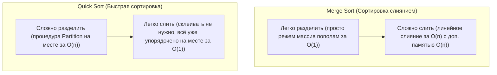
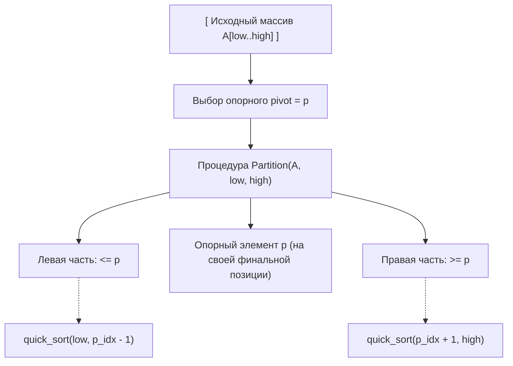
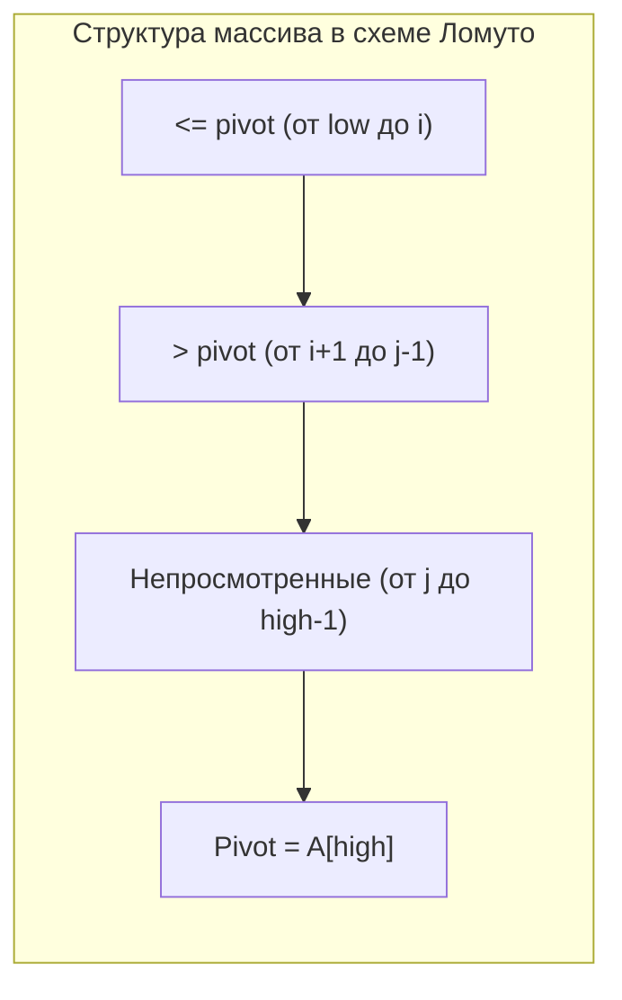
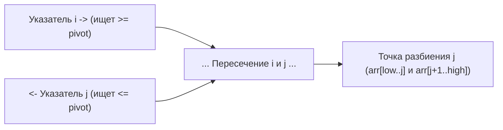
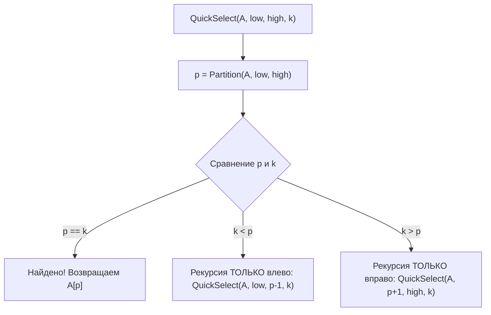

# Лекция 2: Быстрая сортировка (Quick Sort), схемы разбиения и порядковые статистики (Quick Select)

---

## 1. Рекомендуемая литература

* **Т. Кормен, Ч. Лейзерсон, Р. Ривест, К. Штайн — «Алгоритмы: построение и анализ» (4-е изд.)**  
  *Глава 7: Быстрая сортировка (Разбиение Ломуто, рандомизация, анализ в худшем и среднем случае), Глава 9: Медианы и порядковые статистики (Quick Select).*
* **Р. Седжвик, К. Уэйн — «Алгоритмы на C++» / «Algorithms» (4th Edition)**  
  *Раздел: Quicksort (классическое двустороннее разбиение Хоара, проблемы равных ключей, 3-way partition Дейкстры).*
* **Конспекты кафедры КТ ИТМО (neerc.ifmo.ru/wiki)**  
  *Статьи: «Быстрая сортировка», «Порядковые статистики», «Сравнение схем Ломуто и Хоара».*

---

## 2. Связующее звено: Сортировка слиянием (Merge Sort) vs Быстрая сортировка (Quick Sort)

Оба алгоритма используют фундаментальную парадигму **«Разделяй и властвуй» (Divide and Conquer)**, однако философски они противоположны:



* **Merge Sort:** делит массив тривиально пополам, вся работа заключается в последующем слиянии (`merge`). Гарантированное время $\Theta(n \log n)$, но требует $\Theta(n)$ дополнительной памяти.
* **Quick Sort:** выполняет всю тяжелую работу на этапе разделения (`partition`), переставляя элементы относительно опорного (*pivot*). Дополнительной памяти под массив не требуется ($O(1)$ на месте, $O(\log n)$ на стек рекурсии).

---

## 3. Архитектура Quick Sort и идея процедуры Partition

### Общая схема алгоритма:
1. **Выбор опорного элемента (Pivot):** выбирается некоторый элемент $p$ массива (первый, последний, средний или случайный).
2. **Разбиение (Partition):** массив переупорядочивается так, чтобы:
   * все элементы, меньшие или равные $p$, оказались слева от него;
   * все элементы, большие или равные $p$, оказались справа от него.
3. **Рекурсия:** независимо рекурсивно сортируются левая и правая части.



---

## 4. Схема разбиения Ломуто (Lomuto Partition)

### Идея и инвариант
Схема Нико Ломуто (Nico Lomuto) — наиболее простая для понимания и доказательства корректности.  
Обычно в качестве опорного берётся **последний элемент массива**: `pivot = arr[high]`.

Массив делится на 4 зоны при помощи двух указателей $i$ и $j$:
1. $A[low \dots i]$ — элементы, **строго меньшие либо равные** `pivot`.
2. $A[i+1 \dots j-1]$ — элементы, **строго большие** `pivot`.
3. $A[j \dots high-1]$ — ещё **не просмотренные** элементы.
4. $A[high]$ — сам **опорный элемент** (`pivot`).



### Наглядный пошаговый пример трассировки
Массив: `[2, 8, 7, 1, 3, 5, 6, 4]`, `pivot = 4`, `low = 0, high = 7`.
* Изначально: $i = -1$.
* $j=0$: `arr[0] = 2 <= 4` $\implies$ $i=0$, `swap(arr[0], arr[0])`. Массив: `[2, 8, 7, 1, 3, 5, 6, 4]`.
* $j=1$: `arr[1] = 8 > 4` $\implies$ ничего не делаем.
* $j=2$: `arr[2] = 7 > 4` $\implies$ ничего не делаем.
* $j=3$: `arr[3] = 1 <= 4` $\implies$ $i=1$, `swap(arr[1], arr[3])` (меняем 8 и 1). Массив: `[2, 1, 7, 8, 3, 5, 6, 4]`.
* $j=4$: `arr[4] = 3 <= 4` $\implies$ $i=2$, `swap(arr[2], arr[4])` (меняем 7 и 3). Массив: `[2, 1, 3, 8, 7, 5, 6, 4]`.
* $j=5$: `arr[5] = 5 > 4` $\implies$ ничего не делаем.
* $j=6$: `arr[6] = 6 > 4` $\implies$ ничего не делаем.
* Завершение: ставим `pivot` на границу: `swap(arr[i+1], arr[high])` (меняем 8 и 4).  
  **Результат:** `[2, 1, 3, 4, 7, 5, 6, 8]`. Опорный элемент `4` встал строго на индекс 3!

### Реализация на C++ (Схема Ломуто)
```cpp
#include <vector>
#include <utility>

int lomutoPartition(std::vector<int>& arr, int low, int high) {
    int pivot = arr[high]; // Опорный элемент в конце
    int i = low - 1;       // Индекс границы элементов <= pivot

    for (int j = low; j < high; ++j) {
        if (arr[j] <= pivot) {
            ++i;
            std::swap(arr[i], arr[j]);
        }
    }
    std::swap(arr[i + 1], arr[high]);
    return i + 1; // Возвращаем финальный индекс опорного элемента
}

void quickSortLomuto(std::vector<int>& arr, int low, int high) {
    if (low < high) {
        int p = lomutoPartition(arr, low, high);
        quickSortLomuto(arr, low, p - 1);
        quickSortLomuto(arr, p + 1, high);
    }
}
```

---

## 5. Схема разбиения Хоара (Hoare Partition)

### Идея и инвариант
Классическая схема, предложенная изобретателем алгоритма сэром Тони Хоаром (C.A.R. Hoare) в 1959 году.  
Использует **два встречных указателя**:
* левый указатель $i$ начинает движение слева направо в поисках элемента $\ge pivot$;
* правый указатель $j$ начинает движение справа налево в поисках элемента $\le pivot$.
* Когда оба элемента найдены и $i < j$, они меняются местами (`swap`), и указатели продолжают движение навстречу друг другу.
* Процесс останавливается, когда указатели пересекаются ($j \le i$).



### Наглядный пошаговый пример трассировки
Массив: `[5, 3, 8, 4, 2, 7, 1, 6]`, выберем `pivot = arr[low] = 5`, `low = 0, high = 7`.
* $i = -1, j = 8$.
* Двигаем $i$ вправо, пока `arr[i] < 5`: останавливается на $i=0$ (`arr[0]=5`).
* Двигаем $j$ влево, пока `arr[j] > 5`: пропускает 6, останавливается на $j=6$ (`arr[6]=1`).
* Так как $i < j$, меняем местами: `swap(arr[0], arr[6])`. Массив: `[1, 3, 8, 4, 2, 7, 5, 6]`.
* Снова двигаем: $i$ останавливается на $i=2$ (`arr[2]=8 >= 5`), $j$ останавливается на $j=4$ (`arr[4]=2 <= 5`).
* Так как $i < j$, меняем местами: `swap(arr[2], arr[4])`. Массив: `[1, 3, 2, 4, 8, 7, 5, 6]`.
* Снова двигаем: $i$ останавливается на $i=4$ (`arr[4]=8 >= 5`), $j$ останавливается на $j=3$ (`arr[3]=4 <= 5`).
* Указатели пересеклись ($i \ge j$, $4 \ge 3$). Цикл завершён, возвращаем $j = 3$.  
  **Результат:** две части `[1, 3, 2, 4]` (все $\le 5$) и `[8, 7, 5, 6]` (все $\ge 5$).

### Реализация на C++ (Схема Хоара)
```cpp
#include <vector>
#include <utility>

int hoarePartition(std::vector<int>& arr, int low, int high) {
    int pivot = arr[low + (high - low) / 2]; // Защита от худшего случая на отсортированном массиве
    int i = low - 1;
    int j = high + 1;

    while (true) {
        do {
            ++i;
        } while (arr[i] < pivot);

        do {
            --j;
        } while (arr[j] > pivot);

        if (i >= j) {
            return j; // Точка разбиения
        }

        std::swap(arr[i], arr[j]);
    }
}

void quickSortHoare(std::vector<int>& arr, int low, int high) {
    if (low < high) {
        int p = hoarePartition(arr, low, high);
        // Обратите внимание: рекурсивный вызов включает p в левую часть
        quickSortHoare(arr, low, p);
        quickSortHoare(arr, p + 1, high);
    }
}
```

---

## 6. Сравнение схем Ломуто и Хоара

| Критерий | Схема Ломуто (Lomuto) | Схема Хоара (Hoare) |
| :--- | :--- | :--- |
| **Количество указателей** | 2 указателя двигаются в одну сторону ($i, j \to$) | 2 указателя двигаются навстречу ($i \to \dots \leftarrow j$) |
| **Число обменов (swaps)** | Больше ($pprox n$ обменов в среднем) | В среднем **в 3 раза меньше обменов** ($pprox n/3$) |
| **Поведение на одинаковых элементах** | **Критически плохое:** деградирует до $O(n^2)$ | Делит массив почти пополам: стабильно $\Theta(n \log n)$ |
| **Индекс опорного** | Опорный элемент гарантированно встает на свою позицию | Опорный элемент может не быть на границе, возвращается $j$ |
| **Сложность понимания** | Очень простая и наглядная | Требует внимания к граничным условиям и `do-while` |

---

## 7. Анализ сложности Quick Sort

Рекуррентное уравнение времени работы зависит от сбалансированности разбиения:
$$T(n) = T(k) + T(n - k - 1) + \Theta(n)$$

1. **Наилучший случай (Best case):** Опорный элемент всегда делит массив ровно пополам ($k \approx n/2$):
   $$T(n) = 2 T(n/2) + \Theta(n) \implies \Theta(n \log n)$$
2. **Средний случай (Average case):** Для случайных перестановок элементов разбиение в среднем сбалансировано:
   $$T(n) = \Theta(n \log n)$$
3. **Наихудший случай (Worst case):** Опорный всегда оказывается минимумом или максимумом ($k = 0$ или $k = n-1$):
   $$T(n) = T(n - 1) + \Theta(n) \implies \Theta(n^2)$$
   *Пример худшего случая для наивного выбора `pivot`:* уже отсортированный или обратно отсортированный массив.
4. **Память:** $O(1)$ дополнительной памяти под элементы, но $O(\log n)$ глубины стека вызовов (при худшем сценарии $O(n)$).

---

## 8. Порядковые статистики и алгоритм Quick Select

### Определение задачи
**$k$-я порядковая статистика** массива — это элемент, который оказался бы на $k$-й позиции (при 0-индексации) после сортировки массива по возрастанию.
* $k = 0$ — минимум массива.
* $k = n - 1$ — максимум массива.
* $k = \lfloor n / 2 \rfloor$ — медиана массива.

Тривиальное решение через сортировку занимает $O(n \log n)$. Алгоритм **Quick Select** (Хор, 1961) находит ответ в среднем за **линейное время $O(n)$**!

### Принцип работы Quick Select
Используется та же процедура `partition`, но рекурсивный вызов идёт **только в одну из половин**:
1. Выполняем разбиение: получаем индекс опорного $p$.
2. Если $p == k$, искомый элемент найден! Возвращаем `arr[p]`.
3. Если $k < p$, искомый элемент гарантированно лежит в левой половине $\implies$ рекурсивно ищем только в `arr[low..p-1]`.
4. Если $k > p$, искомый элемент в правой половине $\implies$ рекурсивно ищем в `arr[p+1..high]`.



### Реализация на C++
```cpp
#include <vector>
#include <utility>

// Используем Lomuto partition для простоты
int partition(std::vector<int>& arr, int low, int high) {
    int pivot = arr[high];
    int i = low - 1;
    for (int j = low; j < high; ++j) {
        if (arr[j] <= pivot) {
            ++i;
            std::swap(arr[i], arr[j]);
        }
    }
    std::swap(arr[i + 1], arr[high]);
    return i + 1;
}

int quickSelect(std::vector<int>& arr, int low, int high, int k) {
    if (low == high) {
        return arr[low];
    }

    int p = partition(arr, low, high);

    if (p == k) {
        return arr[p];
    } else if (k < p) {
        return quickSelect(arr, low, p - 1, k);
    } else {
        return quickSelect(arr, p + 1, high, k);
    }
}
```

### Анализ сложности Quick Select:
* **В среднем:** На каждом шаге размер задачи уменьшается примерно вдвое:
  $$T(n) = n + \frac{n}{2} + \frac{n}{4} + \dots \le 2n = \Theta(n)$$
  Нахождение медианы и любой порядковой статистики происходит за **линейное время $\Theta(n)$**!
* **В худшем случае:** Если опорный всегда неудачный: $\Theta(n^2)$.  
  *(Примечание: алгоритм «медианы медиан» Блюма-Флойда-Пратта-Ривеста-Тарджана гарантирует $O(n)$ даже в худшем случае).*
