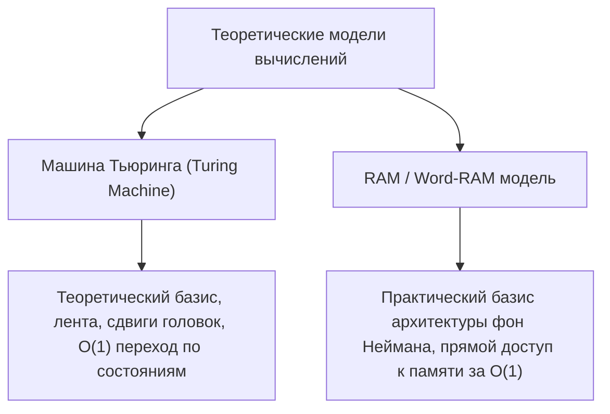
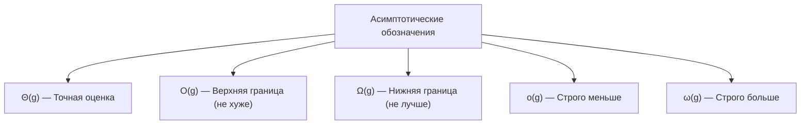
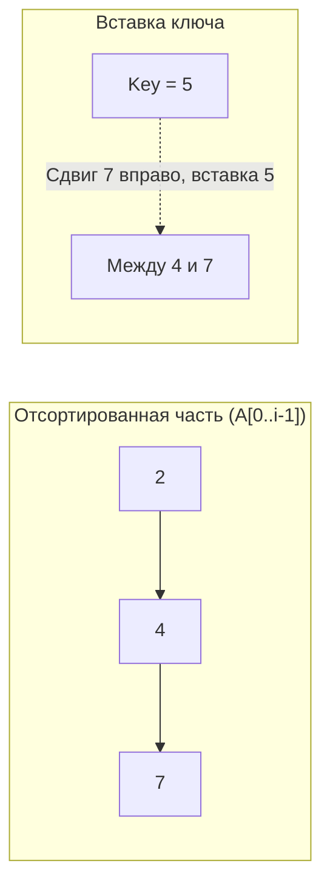
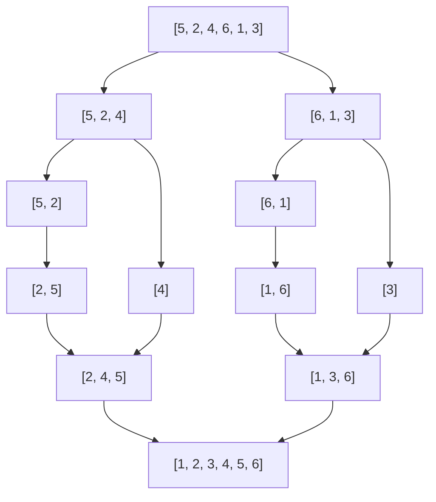

# Лекция-практика 1: Модели вычислений, анализ алгоритмов и базовые сортировки

---

## 1. Рекомендуемая литература

* **Т. Кормен, Ч. Лейзерсон, Р. Ривест, К. Штайн — «Алгоритмы: построение и анализ» (4-е изд.)**  
  *Главы 1, 2, 3 (Роль алгоритмов, Сортировка вставками, Анализ алгоритмов, Асимптотические обозначения), Глава 2 (Сортировка слиянием).*
* **Р. Седжвик, К. Уэйн — «Алгоритмы на C++» / «Algorithms» (4th Edition)**  
  *Разделы: Элементарные сортировки (Insertion Sort), Сортировка слиянием (Merge Sort), Математические модели производительности.*
* **Конспекты кафедры КТ ИТМО (neerc.ifmo.ru/wiki)**  
  *Статьи: «RAM-машина», «Машина Тьюринга», «Асимптотический анализ сложности», «Сортировка вставками», «Сортировка слиянием».*

---

## 2. Модели вычислений

Для строгого математического анализа эффективности алгоритмов необходимо абстрагироваться от конкретного «железа», тактовой частоты процессора и оптимизаций компилятора. Для этого вводятся формальные модели вычислений.



---

### 2.1. Машина Тьюринга (Turing Machine)

#### Определение
**Машина Тьюринга (МТ)** — это фундаментальная абстрактная математическая модель вычислений, предложенная Аланом Тьюрингом в 1936 году.  
Формально детерминированная одноленточная МТ задаётся кортежем из 7 элементов:
$$M = \langle Q, \Sigma, \Gamma, \delta, q_0, q_{accept}, q_{reject} \rangle$$
где:
* $Q$ — конечное множество состояний управляющего устройства;
* $\Sigma$ — входной алфавит (не содержит символ пробела $\text{\textvisiblespace}$);
* $\Gamma$ — ленточный алфавит, $\Sigma \subset \Gamma$ и $\text{\textvisiblespace} \in \Gamma$;
* $\delta: Q \times \Gamma \to Q \times \Gamma \times \{L, R, N\}$ — функция переходов;
* $q_0 \in Q$ — начальное состояние;
* $q_{accept} \in Q$ — допускающее состояние;
* $q_{reject} \in Q$ — отвергающее состояние ($q_{accept} \ne q_{reject}$).

#### Физический смысл и интуиция
Машина состоит из:
1. **Бесконечной ленты**, разбитой на дискретные ячейки, в каждой из которых записан символ ленточного алфавита.
2. **Считывающей/записывающей головки**, которая в каждый такт времени находится над одной ячейкой.
3. **Управляющего автомата** с конечной памятью (текущее состояние $q \in Q$).

На каждом шаге машина считывает символ под головкой, меняет состояние, записывает новый символ и сдвигает головку на 1 ячейку влево ($L$), вправо ($R$) или остаётся на месте ($N$).

#### Пример
**Проверка слова на палиндромность над алфавитом $\{0, 1\}$:**  
Головка считывает крайний левый символ, запоминает его в состоянии ($q_{saw\_0}$), заменяет на пробел, бежит в самый конец ленты, проверяет соответствие крайнего правого символа, стирает его и бежит обратно. Если слово длины $n$, такой бег «туда-обратно» займет $\Theta(n^2)$ шагов.

---

### 2.2. Модель Random Access Machine (RAM) и Word-RAM

#### Определение RAM и Word-RAM
* **RAM (Random Access Machine)** — модель машины с произвольным доступом к памяти. Содержит бесконечный набор ячеек (регистров) памяти $R[0], R[1], R[2], \dots$. Доступ к ячейке по её номеру (адресу) осуществляется за константное время $O(1)$.
* **Word-RAM (Слово-ориентированная RAM-машина)** — реалистичное уточнение стандартной модели RAM, моделирующее современные 64-битные CPU:
  1. Память состоит из машинных слов фиксированного размера $w$ бит (обычно $w = 32$ или $w = 64$).
  2. Размер слова связан с размером входа $n$: $w \ge \log_2 n$, чтобы машинное слово могло хранить указатель на любую ячейку выделенной памяти.
  3. Все базовые процессорные инструкции над машинными словами ($+, -, \times, /, \%, \&, |, \oplus, \ll, \gg$, прямое сравнение) выполняются за **$O(1)$ элементарных тактов**.

#### Смысл для программиста
Word-RAM является стандартной моделью анализа сложности алгоритмов в Computer Science (в Кормене, Седжвике, на олимпиадах и в ITMO). Она отражает реальное поведение процессоров архитектуры x86-64/ARM.

---

### 2.3. Закон адресации памяти

#### Определение
**Закон адресации памяти** — базовый принцип архитектуры фон Неймана и модели RAM, согласно которому **любая ячейка оперативной памяти имеет уникальный числовой адрес, и время доступа к значению по этому адресу не зависит от его номера и расположения**:
$$T(\text{read}(address)) = O(1), \qquad T(\text{write}(address, value)) = O(1)$$

#### Формула адресного преобразования в массиве
В языках C/C++ массив `T arr[N]` располагается в непрерывном блоке оперативной памяти. Адрес $i$-го элемента вычисляется за 1 такт аппаратным блоком процессора ALU по формуле:
$$\text{Address}(arr[i]) = \text{BaseAddress}(arr) + i \cdot \text{sizeof}(T)$$

* **Смысл:** Процессору не нужно перебирать предыдущие $i-1$ элементов, чтобы добраться до $i$-го. Индексация в массиве — это мгновенная операция сложения и умножения адреса.

---

## 3. Алгоритмы и их свойства

### Определение
**Алгоритм** — это конечная, точно определённая последовательность вычислительных шагов или инструкций, которая принимает некоторый набор значений в качестве входа (Input) и преобразует его в результат на выходе (Output), решая поставленную вычислительную задачу.

### Фундаментальные свойства алгоритма:
1. **Дискретность** — процесс решения задачи расчленён на отдельные элементарные шаги.
2. **Детерминированность (определённость)** — при одинаковых входных данных каждый шаг однозначно определён, отсутствуют двусмысленности.
3. **Конечность (результативность)** — для любых допустимых входных данных алгоритм завершает работу за конечное число шагов.
4. **Массовость** — алгоритм применим не к одному единичному примеру, а к целому классу задач с произвольными допустимыми входными данными.
5. **Корректность** — для каждого корректного входа алгоритм останавливается и выдает математически верный результат.

---

## 4. Асимптотический анализ сложности ($O, \Omega, \Theta, o, \omega$)

Пусть $f(n)$ и $g(n)$ — асимптотически неотрицательные функции трудоёмкости (числа операций) от размера входа $n \in \mathbb{N}$.



### 4.1. О-большое: $O(g(n))$ (Асимптотическая верхняя граница)
* **Математическое определение:**
  $$O(g(n)) = \big\{ f(n) \mid \exists c > 0, n_0 \in \mathbb{N} : \forall n \ge n_0 \implies 0 \le f(n) \le c \cdot g(n) \big\}$$
* **Смысл:** Алгоритм работает не хуже, чем константа, умноженная на $g(n)$. Это гарантированная оценка «сверху» (наихудший сценарий).
* **Пример:** Линейный поиск в массиве из $n$ чисел делает не более $n$ сравнений: $T(n) = n = O(n)$.

---

### 4.2. Омега-большое: $\Omega(g(n))$ (Асимптотическая нижняя граница)
* **Математическое определение:**
  $$\Omega(g(n)) = \big\{ f(n) \mid \exists c > 0, n_0 \in \mathbb{N} : \forall n \ge n_0 \implies 0 \le c \cdot g(n) \le f(n) \big\}$$
* **Смысл:** Гарантированная оценка «снизу». Задача требует как минимум $c \cdot g(n)$ операций в худшем или лучшем случае.
* **Пример:** Любой алгоритм сортировки на основе сравнений требует $\Omega(n \log n)$ операций в худшем случае.

---

### 4.3. Тета: $\Theta(g(n))$ (Асимптотически точная граница)
* **Математическое определение:**
  $$\Theta(g(n)) = \big\{ f(n) \mid \exists c_1, c_2 > 0, n_0 \in \mathbb{N} : \forall n \ge n_0 \implies 0 \le c_1 \cdot g(n) \le f(n) \le c_2 \cdot g(n) \big\}$$
* **Критерий:** $f(n) = \Theta(g(n)) \iff f(n) = O(g(n)) \land f(n) = \Omega(g(n))$.
* **Смысл:** Функция $f(n)$ зажата в «коридоре» между $c_1 g(n)$ и $c_2 g(n)$.
* **Пример:** $3n^2 + 5n - 7 = \Theta(n^2)$.

---

### 4.4. Строгие оценки: $o(g(n))$ и $\omega(g(n))$
* **$o(g(n))$ (о-малое):** $f(n)$ пренебрежимо мала по сравнению с $g(n)$ на бесконечности:
  $$\lim_{n \to \infty} \frac{f(n)}{g(n)} = 0$$
  *Пример:* $2n = o(n^2)$.
* **$\omega(g(n))$ (омега-малое):** $f(n)$ растёт строго быстрее, чем $g(n)$:
  $$\lim_{n \to \infty} \frac{f(n)}{g(n)} = +\infty$$
  *Пример:* $n^2 = \omega(n)$.

---

## 5. Сортировка вставками (Insertion Sort)

### Определение
**Сортировка вставками (Insertion Sort)** — это алгоритм сортировки, работающий на месте (in-place), в котором элементы входного массива последовательно просматриваются слева направо, и каждый очередной элемент вставляется на подходящую позицию в уже отсортированную левую часть массива путём сдвига элементов, больших текущего, вправо.

### Смысл и метафора
Это естественный способ, которым люди обычно упорядочивают карты в руке во время карточной игры: левая часть карт уже отсортирована по рангу, берётся новая карта из колоды и продвигается влево до тех пор, пока не встретится карта меньшего достоинства.



### Пошаговый пример
Дан массив: `[5, 2, 4, 6, 1, 3]`
1. $i=1$, $\text{key}=2$: $5 > 2 \implies$ сдвигаем 5. Массив: `[2, 5, 4, 6, 1, 3]`.
2. $i=2$, $\text{key}=4$: $5 > 4 \implies$ сдвигаем 5, вставляем 4. Массив: `[2, 4, 5, 6, 1, 3]`.
3. $i=3$, $\text{key}=6$: $5 < 6 \implies$ сдвигов нет. Массив: `[2, 4, 5, 6, 1, 3]`.
4. $i=4$, $\text{key}=1$: все элементы сдвигаются вправо, 1 встаёт в начало. Массив: `[1, 2, 4, 5, 6, 3]`.
5. $i=5$, $\text{key}=3$: элементы 4, 5, 6 сдвигаются. Итог: `[1, 2, 3, 4, 5, 6]`.

### Реализация на C++
```cpp
void insertionSort(std::vector<int>& arr) {
    int n = arr.size();
    for (int i = 1; i < n; ++i) {
        int key = arr[i];
        int j = i - 1;
        // Сдвигаем элементы arr[0..i-1], которые больше key, на одну позицию вперед
        while (j >= 0 && arr[j] > key) {
            arr[j + 1] = arr[j];
            --j;
        }
        arr[j + 1] = key;
    }
}
```

### Анализ сложности Insertion Sort:
* **Время в лучшем случае:** $\Theta(n)$ (массив уже отсортирован, внутренний цикл `while` делает ровно 1 проверку).
* **Время в худшем случае:** $\Theta(n^2)$ (массив отсортирован в обратном порядке, сумма $\sum_{i=1}^{n-1} i = \frac{n(n-1)}{2}$ сдвигов).
* **Время в среднем:** $\Theta(n^2)$.
* **Память:** $O(1)$ (in-place).
* **Устойчивость (Stable):** Да, сохраняет порядок равных ключей.

---

## 6. Сортировка слиянием (Merge Sort)

### Определение
**Сортировка слиянием (Merge Sort)** — классический эффективный алгоритм сортировки, основанный на парадигме **«Разделяй и властвуй» (Divide and Conquer)**:
1. **Разделяй (Divide):** Массив разбивается пополам на два подмассива размера $\approx n/2$.
2. **Властвуй (Conquer):** Рекурсивно сортируются левая и правая половины.
3. **Комбинируй (Combine / Merge):** Два упорядоченных подмассива сливаются в один отсортированный массив за один линейный проход.

### Смысл и принцип слияния
Слияние двух отсортированных массивов размера $n/2$ требует всего одного линейного прохода $\Theta(n)$ с помощью двух указателей: мы сравниваем текущие наименьшие элементы в двух половинах и наименьший из них выписываем в итоговый массив.



### Пошаговый пример слияния (Merge Step)
Сливаем `L = [2, 4, 5]` и `R = [1, 3, 6]`:
* Сравниваем `L[0]=2` и `R[0]=1`: берем 1. Итог: `[1]`.
* Сравниваем `L[0]=2` и `R[1]=3`: берем 2. Итог: `[1, 2]`.
* Сравниваем `L[1]=4` и `R[1]=3`: берем 3. Итог: `[1, 2, 3]`.
* Сравниваем `L[1]=4` и `R[2]=6`: берем 4. Итог: `[1, 2, 3, 4]`.
* Сравниваем `L[2]=5` и `R[2]=6`: берем 5. Итог: `[1, 2, 3, 4, 5]`.
* В `L` кончились элементы: дописываем остаток `R`: `[1, 2, 3, 4, 5, 6]`.

### Реализация на C++
```cpp
void merge(std::vector<int>& arr, int left, int mid, int right) {
    int n1 = mid - left + 1;
    int n2 = right - mid;

    std::vector<int> L(n1), R(n2);
    for (int i = 0; i < n1; ++i) L[i] = arr[left + i];
    for (int j = 0; j < n2; ++j) R[j] = arr[mid + 1 + j];

    int i = 0, j = 0, k = left;
    while (i < n1 && j < n2) {
        if (L[i] <= R[j]) { // Знак <= обеспечивает стабильность сортировки
            arr[k++] = L[i++];
        } else {
            arr[k++] = R[j++];
        }
    }
    while (i < n1) arr[k++] = L[i++];
    while (j < n2) arr[k++] = R[j++];
}

void mergeSort(std::vector<int>& arr, int left, int right) {
    if (left < right) {
        int mid = left + (right - left) / 2;
        mergeSort(arr, left, mid);
        mergeSort(arr, mid + 1, right);
        merge(arr, left, mid, right);
    }
}
```

### Анализ сложности Merge Sort:
Рекуррентное соотношение времени работы:
$$T(n) = 2 T(n/2) + \Theta(n)$$
По основной теореме о рекуррентных соотношениях (Master Theorem):
$$T(n) = \Theta(n \log n)$$
* **Время в лучшем, среднем и худшем случае:** всегда $\Theta(n \log n)$.
* **Дополнительная память:** $\Theta(n)$ (на хранение временных подмассивов при слиянии).
* **Устойчивость (Stable):** Да (при условии `L[i] <= R[j]`).

---

## 7. Сравнительная таблица алгоритмов сортировки

| Алгоритм | Лучшее время | Среднее время | Худшее время | Доп. память | Устойчивость | Особенности применения |
| :--- | :---: | :---: | :---: | :---: | :---: | :--- |
| **Insertion Sort** | $\Theta(n)$ | $\Theta(n^2)$ | $\Theta(n^2)$ | $O(1)$ | Да | Идеален для маленьких ($n \le 32$) и почти отсортированных массивов |
| **Merge Sort** | $\Theta(n \log n)$ | $\Theta(n \log n)$ | $\Theta(n \log n)$ | $\Theta(n)$ | Да | Гарантированное время, устойчив, идеален для связных списков и внешней сортировки |
