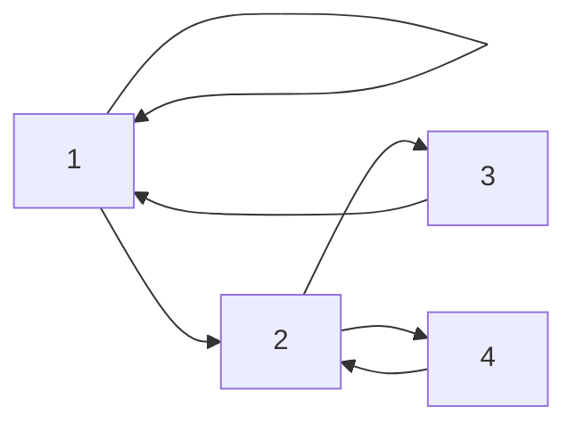
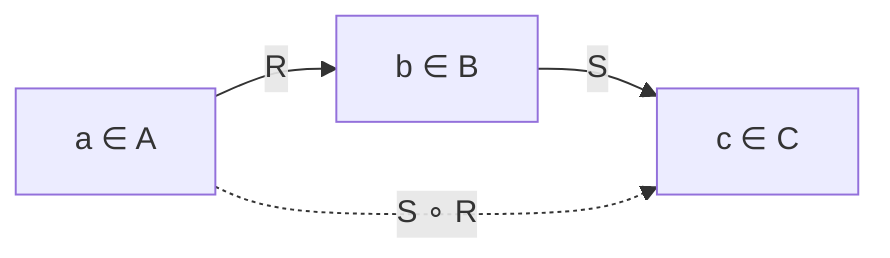
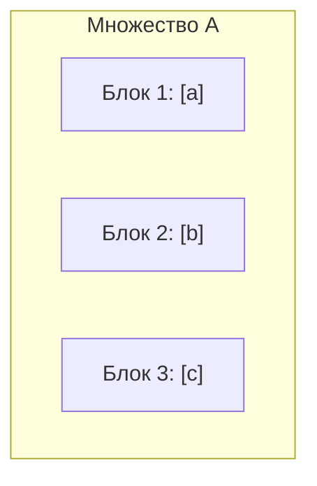

# Лекция 5: Бинарные отношения и отношения эквивалентности

> **Дисциплина**: Дискретная математика  
> **Лектор**: Константин Чухарев (ИТМО, осенний семестр 2026)  
> **Ключевые темы**: Бинарные отношения, способы представления (матрицы, орграфы), базовые свойства, операции над отношениями, композиция, замыкания, алгоритм Уоршелла, отношение эквивалентности, классы эквивалентности, теорема о разбиении, фактор-множество, факторизация и построение $\mathbb{Q}$, корректность операций, применения в Computer Science (SQL CTE, ДКА, трейты в языках программирования).

---

## 1. Введение и базовые определения

В теории множеств изучается внутренняя структура объектов («что есть в системе»). Однако математические и программные модели требуют описания взаимосвязей между элементами («как объекты связаны между собой»).

> «Реляционный взгляд на данные описывает их в их естественной структуре.»  
> — *Эдгар Кодд (создатель реляционной модели данных)*

### 1.1. Понятие бинарного отношения

Пусть $A$ и $B$ — произвольные множества. Напомним, что их **декартовым (прямым) произведением** называется множество упорядоченных пар:
$$A \times B = \{(a, b) \mid a \in A, \; b \in B\}$$

> [!NOTE] **Определение 1 (Бинарное отношение)**  
> **Бинарным отношением** между множествами $A$ и $B$ называется произвольное подмножество $R \subseteq A \times B$.  
> Если $A = B$, то $R \subseteq A \times A = A^2$ называется **бинарным отношением на множестве $A$**.

Если пара $(a, b) \in R$, то говорят, что элемент $a$ **находится в отношении $R$** с элементом $b$. Принята инфиксная запись:
$$(a, b) \in R \iff aRb$$
Если пара не принадлежит отношению:
$$(a, b) \notin R \iff a \not R b$$

### 1.2. Область определения и область значений

Для произвольного отношения $R \subseteq A \times B$:
1. **Область определения** (Domain):
   $$\mathrm{Dom}(R) = \{a \in A \mid \exists b \in B: (a, b) \in R\}$$
2. **Область значений** (Range / Image):
   $$\mathrm{Ran}(R) = \{b \in B \mid \exists a \in A: (a, b) \in R\}$$

### 1.3. Особые бинарные отношения на множестве $A$

На любом множестве $A$ всегда тривиально существуют три отношения:
1. **Пустое отношение** $\emptyset \subset A \times A$: не связано ни одного элемента ($\forall a, b \in A: a \not R b$).
2. **Тождественное (диагональное) отношение** $\mathrm{id}_A$ (или $\Delta_A$):
   $$\mathrm{id}_A = \{(a, a) \mid a \in A\}$$
   Оно выражает строгое равенство: $a\,\mathrm{id}_A\,b \iff a = b$.
3. **Полное (универсальное) отношение** $U = A \times A$: связаны абсолютно все элементы ($\forall a, b \in A: aUb$).

---

## 2. Способы представления бинарных отношений

Бинарные отношения на конечных множествах $A = \{a_1, a_2, \dots, a_n\}$ допускают три эквивалентных способа задания.

### 2.1. Множество упорядоченных пар (теоретико-множественный способ)
Перечисление элементов:
$$R = \{(a_1, b_1), (a_2, b_2), \dots\}$$
Пример: $A = \{1, 2, 3\}$, $R = \{(1, 1), (1, 2), (2, 3), (3, 1)\}$.

### 2.2. Булева матрица смежности (матрица инцидентности)
Пусть $|A| = n$, $|B| = m$. Матрицей отношения $R \subseteq A \times B$ называется булева матрица $M_R = (M_{ij}) \in \{0, 1\}^{n \times m}$, где:
$$M_{ij} = \begin{cases} 1, & \text{если } (a_i, b_j) \in R, \\ 0, & \text{если } (a_i, b_j) \notin R. \end{cases}$$

- **Строка $i$** показывает, с какими элементами связан элемент $a_i$.
- **Столбец $j$** показывает, какие элементы связаны с элементом $b_j$.
- Для тождественного отношения $\mathrm{id}_A$ матрица $M_{\mathrm{id}_A} = I_n$ (единичная матрица, единицы строго на главной диагонали).

### 2.3. Ориентированный граф (орграф)
- Вершины орграфа — элементы множества $A$.
- Направленная дуга (ребро) $(a \to b)$ проводится тогда и только тогда, когда $aRb$.
- Петля у вершины $a$ соответствует паре $(a, a) \in R$.



*Пример графа отношения $R = \{(1, 1), (1, 2), (2, 3), (3, 1), (2, 4), (4, 2)\}$.*

---

## 3. Фундаментальные свойства бинарных отношений

Свойства классифицируют природу связи. Пусть $R$ — отношение на множестве $A$.

### 3.1. Рефлексивность и иррефлексивность

#### Рефлексивность
> [!NOTE] **Определение 2 (Рефлексивность)**  
> Отношение $R$ называется **рефлексивным**, если каждый элемент связан сам с собой:  
> $$\forall a \in A.\; aRa$$

- **На языке матриц**: все диагональные элементы равны единице ($M_{ii} = 1$ для всех $i = 1, \dots, n$).
- **В орграфе**: у абсолютно каждой вершины есть петля.
- **Примеры**:
  - Равенство ($a = a$),
  - Нестрогие неравенства: $a \le a$ на $\mathbb{R}$,
  - Делимость: $a \mid a$ на $\mathbb{N}$ (т.к. $a = 1 \cdot a$),
  - Сравнимость по модулю: $a \equiv a \pmod m$.

#### Иррефлексивность (антирефлексивность)
> [!NOTE] **Определение 3 (Иррефлексивность)**  
> Отношение $R$ называется **иррефлексивным**, если ни один элемент не связан сам с собой:  
> $$\forall a \in A.\; \neg(aRa)$$

- **На языке матриц**: на главной диагонали стоят исключительно нули ($M_{ii} = 0$ для всех $i$).
- **В орграфе**: нет ни одной петли.
- **Примеры**:
  - Строгие неравенства: $a < a$ ложно для всех $a$,
  - Отношение строгого подмножества: $X \subsetneq X$ ложно,
  - Отношение родства «быть отцом», «быть сыном».

#### Различие: иррефлексивность vs нерефлексивность
Это классическая ловушка дискретной математики:
- **Нерефлексивно** — это просто отрицание рефлексивности:
  $$\neg(\forall a \in A.\; aRa) \iff \exists a \in A.\; \neg(aRa)$$
  Оно требует лишь наличия *хотя бы одного* элемента без петли. При этом у остальных элементов петли могут быть.
- **Иррефлексивно** — категорический запрет на любые петли:
  $$\forall a \in A.\; \neg(aRa)$$
- **Вывод**: иррефлексивность строго сильнее «не рефлексивности». Более того, отношение может не быть ни рефлексивным, ни иррефлексивным (например, если на множестве $\{1, 2\}$ пара $(1, 1) \in R$, а $(2, 2) \notin R$).

---

### 3.2. Симметричность, антисимметричность и асимметричность

#### Симметричность
> [!NOTE] **Определение 4 (Симметричность)**  
> Отношение $R$ называется **симметричным**, если для любых элементов наличие связи в одну сторону влечет связь в обратную сторону:  
> $$\forall a, b \in A.\; (aRb \implies bRa)$$

- **На языке матриц**: матрица симметрична относительно главной диагонали: $M = M^T$ ($M_{ij} = M_{ji}$).
- **В орграфе**: каждое ребро между различными вершинами двунаправлено (если есть стрелка $a \to b$, то обязательно есть и $b \to a$).
- **Примеры**:
  - Равенство ($a = b \implies b = a$),
  - «Быть однокурсником», «жить в одном городе»,
  - Ортогональность прямых/векторов, параллельность,
  - Расстояние меньше $\varepsilon$: $|x - y| < \varepsilon$.

#### Антисимметричность
> [!NOTE] **Определение 5 (Антисимметричность)**  
> Отношение $R$ называется **антисимметричным**, если встречные связи возможны только для совпадающих элементов:  
> $$\forall a, b \in A.\; (aRb \land bRa \implies a = b)$$  
> Эквивалентная формулировка: если $a \ne b$, то пары $(a, b)$ и $(b, a)$ не могут одновременно принадлежать $R$.

- **На языке матриц**: вне главной диагонали нет симметричных единиц (если $i \ne j$ и $M_{ij} = 1$, то $M_{ji} = 0$). На диагонали при этом могут быть как 0, так и 1!
- **В орграфе**: между двумя различными вершинами не может быть встречных дуг (допустима максимум одна направленная дуга). Наличие петель разрешено.
- **Примеры**:
  - Отношение $\le$: если $a \le b$ и $b \le a$, то $a = b$.
  - Отношение делимости на $\mathbb{N}$: если $a \mid b$ и $b \mid a$, то $a = b$.
  - Включение множеств $\subseteq$: если $X \subseteq Y$ и $Y \subseteq X$, то $X = Y$.

> [!WARNING] **Симметричность и антисимметричность — НЕ противоположности!**  
> 1. Тождественное отношение $\mathrm{id}_A = \{(a, a) \mid a \in A\}$ **одновременно симметрично и антисимметрично**!  
>    - Симметрично: $(a, a) \in \mathrm{id}_A \implies (a, a) \in \mathrm{id}_A$.  
>    - Антисимметрично: $(a, a) \in \mathrm{id}_A \land (a, a) \in \mathrm{id}_A \implies a = a$.  
> 2. Пустое отношение $\emptyset$ также одновременно симметрично и антисимметрично.  
> 3. Отношение $R = \{(1, 2), (2, 1), (2, 3)\}$ на $\{1, 2, 3\}$ не является ни симметричным (нет $(3, 2)$), ни антисимметричным (есть взаимная пара $(1, 2)$ и $(2, 1)$ при $1 \ne 2$).

#### Асимметричность
> [!NOTE] **Определение 6 (Асимметричность)**  
> Отношение $R$ называется **асимметричным**, если:  
> $$\forall a, b \in A.\; (aRb \implies \neg(bRa))$$

> [!IMPORTANT] **Критерий асимметричности**  
> Отношение асимметрично тогда и только тогда, когда оно **антисимметрично и иррефлексивно**:  
> $$\text{Асимметричность} \iff \text{Антисимметричность} \land \text{Иррефлексивность}$$

*Доказательство*:  
1. Пусть $R$ асимметрично.  
   - Если $aRa$, то по асимметричности $\neg(aRa)$ — противоречие. Значит, $\forall a: \neg(aRa)$ (иррефлексивно).  
   - Если $aRb$ и $bRa$, то из $aRb$ следует $\neg(bRa)$ — противоречие. Следовательно, посылка $aRb \land bRa$ ложна при $a \ne b$, то есть антисимметричность выполнена.  
2. Наоборот, пусть $R$ иррефлексивно и антисимметрично. Пусть $aRb$. Если бы $bRa$, то по антисимметричности $a = b$. Но тогда $aRa$, что противоречит иррефлексивности. Значит, $\neg(bRa)$. $\blacksquare$

- **Примеры**: строгое отношение порядка $<$ на $\mathbb{R}$, строгое включение $\subsetneq$.

---

### 3.3. Транзитивность и ее варианты

#### Транзитивность
> [!NOTE] **Определение 7 (Транзитивность)**  
> Отношение $R$ называется **транзитивным**, если цепочка из двух шагов обязывает к существованию прямого перехода:  
> $$\forall a, b, c \in A.\; (aRb \land bRc \implies aRc)$$

- **На языке матриц**: если $M_{ik} = 1$ и $M_{kj} = 1$, то $M_{ij} = 1$. (В булевом матричном умножении: $M_R \odot M_R \le M_R$).
- **В орграфе**: для любого пути длины 2 ($a \to b \to c$) обязательно наличествует дуга $a \to c$.
- **Примеры**:
  - Отношения равенства и эквивалентности,
  - Отношения порядка: $<, \le, >, \ge$,
  - Делимость: $a \mid b \land b \mid c \implies a \mid c$.
  - Отношение предка: предок предка — предок.

#### Нетранзитивность vs антитранзитивность
- **Нетранзитивность** (отрицание транзитивности):
  $$\exists a, b, c \in A.\; (aRb \land bRc \land \neg(aRc))$$
  Достаточно найти хотя бы одну тройку, где правило двух шагов нарушается.
  *Пример*: отношение соседства. Если дом $A$ соседствует с $B$, а $B$ соседствует с $C$, то $A$ вовсе не обязан соседствовать с $C$.
- **Антитранзитивность**:
  $$\forall a, b, c \in A.\; (aRb \land bRc \implies \neg(aRc))$$
  *Пример*: отношение «быть непосредственным родителем». Если $A$ — родитель $B$, а $B$ — родитель $C$, то $A$ заведомо не является родителем $C$ (он приходится $C$ дедушкой/бабушкой).
  *Пример*: отношение победы в игре «Камень, Ножницы, Бумага»: Камень побеждает Ножницы, Ножницы побеждают Бумагу, но Камень НЕ побеждает Бумагу (Бумага оборачивает Камень).

---

### 3.4. Сводная таблица свойств

| Свойство | Логическая формула | Матрица $M_R$ | Орграф |
| :--- | :--- | :--- | :--- |
| **Рефлексивность** | $\forall a.\; aRa$ | $M_{ii} = 1$ | Петли у всех вершин |
| **Иррефлексивность** | $\forall a.\; \neg(aRa)$ | $M_{ii} = 0$ | Полное отсутствие петель |
| **Симметричность** | $aRb \implies bRa$ | $M = M^T$ | Все ребра двунаправлены |
| **Антисимметричность** | $aRb \land bRa \implies a = b$ | $i \ne j \implies M_{ij} \cdot M_{ji} = 0$ | Нет противоположных дуг ($a \ne b$) |
| **Асимметричность** | $aRb \implies \neg(bRa)$ | $M_{ij} \cdot M_{ji} = 0$ и $M_{ii} = 0$ | Нет петель и нет встречных дуг |
| **Транзитивность** | $aRb \land bRc \implies aRc$ | $M_R \odot M_R \le M_R$ | Для любого пути $a \to b \to c$ есть $a \to c$ |

---

## 4. Операции над бинарными отношениями

Поскольку отношения суть множества пар, над ними определены все теоретико-множественные операции (объединение $R \cup S$, пересечение $R \cap S$, разность $R \setminus S$, симметрическая разность $R \oplus S$, дополнение $\overline{R} = (A \times B) \setminus R$).

Специфическими для отношений являются алгебраические операции:

### 4.1. Обратное отношение (Inverse relation)

> [!NOTE] **Определение 8 (Обратное отношение)**  
> Пусть $R \subseteq A \times B$. **Обратным отношением** называется отношение $R^{-1} \subseteq B \times A$:  
> $$R^{-1} = \{(b, a) \mid (a, b) \in R\}$$

- **Связь с матрицей**: матрица обратного отношения является транспонированной:
  $$M_{R^{-1}} = (M_R)^T$$
- **В орграфе**: обращение соответствует развороту направления всех дуг на противоположные.
- **Теорема**: Отношение $R$ на множестве $A$ симметрично тогда и только тогда, когда:
  $$R = R^{-1}$$
- **Свойства**:
  1. $(R^{-1})^{-1} = R$,
  2. $(R \cup S)^{-1} = R^{-1} \cup S^{-1}$,
  3. $(R \cap S)^{-1} = R^{-1} \cap S^{-1}$,
  4. $(\overline{R})^{-1} = \overline{R^{-1}}$.

---

### 4.2. Композиция (произведение) отношений

> [!NOTE] **Определение 9 (Композиция отношений)**  
> Пусть $R \subseteq A \times B$ и $S \subseteq B \times C$. **Композицией** отношений $S$ и $R$ (обозначается $S \circ R$ или $R \circ S$ в зависимости от соглашения; в курсе принята стандартная математическая нотация справа налево) называется отношение:  
> $$S \circ R = \{(a, c) \in A \times C \mid \exists b \in B : (a, b) \in R \land (b, c) \in S\}$$



*Пример*: Пусть $R$ — отношение «быть родителем» ($aRb \iff a$ родитель $b$). Тогда $R \circ R$ — это отношение «быть родителем родителя», то есть «быть дедушкой или бабушкой».

#### Матричное представление композиции
Матрица композиции находится через булево произведение матриц:
$$M_{S \circ R} = M_R \odot M_S$$
где булево произведение вычисляется по формуле:
$$(M_R \odot M_S)_{ik} = \bigvee_{j=1}^{|B|} (M_{R, ij} \land M_{S, jk})$$
(дизъюнкция конъюнкций, аналогично стандартному умножению матриц, где умножение заменено на $\land$, а сложение — на $\lor$).

#### Свойства композиции
1. **Ассоциативность**:
   $$(T \circ S) \circ R = T \circ (S \circ R)$$
2. **Некоммутативность**: в общем случае $S \circ R \ne R \circ S$ (даже когда $A = B = C$).
3. **Обращение композиции**:
   $$(S \circ R)^{-1} = R^{-1} \circ S^{-1}$$
   *(Порядок сомножителей меняется на противоположный!)*
4. **Дистрибутивность** относительно объединения:
   $$T \circ (R \cup S) = (T \circ R) \cup (T \circ S)$$

---

### 4.3. Степени отношения и пути в графе

Пусть $R$ — отношение на множестве $A$. Степени отношения определяются индуктивно:
$$R^1 = R, \qquad R^{k+1} = R^k \circ R \quad (k \ge 1)$$
По соглашению, нулевая степень: $R^0 = \mathrm{id}_A$.

> [!IMPORTANT] **Теорема о пути длины $k$**  
> Пара $(a, c) \in R^k$ тогда и только тогда, когда в орграфе отношения $R$ существует ориентированный путь из вершины $a$ в вершину $c$ ровно из $k$ дуг:  
> $$a = x_0 \xrightarrow{R} x_1 \xrightarrow{R} x_2 \xrightarrow{R} \dots \xrightarrow{R} x_k = c$$

---

## 5. Замыкания бинарных отношений (Closures)

Нередко исходное отношение не обладает желаемым свойством (рефлексивностью, симметричностью, транзитивностью), но нам необходимо найти «минимальное надмножество», удовлетворяющее этому требованию.

> [!NOTE] **Определение 10 (Замыкание отношения)**  
> Замыканием отношения $R$ относительно свойства $\mathcal{P}$ называется отношение $R'$, такое что:  
> 1. $R \subseteq R'$;  
> 2. $R'$ обладает свойством $\mathcal{P}$;  
> 3. $R'$ минимально: если любое $R''$ обладает свойством $\mathcal{P}$ и $R \subseteq R''$, то $R' \subseteq R''$.

### 5.1. Рефлексивное замыкание
Добавляются недостающие петли для каждого элемента:
$$R^= = R \cup \mathrm{id}_A$$
Матрица: $M_{R^=} = M_R \lor I_n$.

### 5.2. Симметричное замыкание
Добавляются недостающие встречные ребра:
$$R^s = R \cup R^{-1}$$
Матрица: $M_{R^s} = M_R \lor M_R^T$.

### 5.3. Транзитивное замыкание (Transitive Closure)

> [!NOTE] **Определение 11 (Транзитивное замыкание)**  
> Транзитивным замыканием отношения $R$ (обозначается $R^+$) называется наименьшее транзитивное отношение, содержащее $R$:  
> $$R^+ = \bigcup_{k=1}^\infty R^k$$

- **Смысл**: $(a, b) \in R^+ \iff$ существует ориентированный путь *любой положительной длины* из $a$ в $b$.
- Для конечного множества с $n$ вершинами любой простой путь имеет длину не более $n$. Циклы не создают новых достижимых вершин. Поэтому:
  $$R^+ = \bigcup_{k=1}^n R^k = R^1 \cup R^2 \cup \dots \cup R^n$$
- **Рефлексивно-транзитивное замыкание** $R^*$ (звезда Клини):
  $$R^* = R^+ \cup \mathrm{id}_A = \bigcup_{k=0}^n R^k$$
  выражает факт достижимости за 0 или более шагов.

#### Почему одного прохода добавления пар недостаточно?
Рассмотрим отношение $R = \{(1, 2), (2, 3), (3, 4)\}$.
- В первом проходе по парам $(1, 2)$ и $(2, 3)$ добавляется $(1, 3)$, а по $(2, 3)$ и $(3, 4)$ добавляется $(2, 4)$. Получаем отношение $R \cup R^2$.
- Однако появилась новая пара $(1, 3)$, которая вместе со старой парой $(3, 4)$ формирует цепочку $1 \to 3 \to 4$. Чтобы замкнуть ее, требуется добавить ребро $(1, 4)$.
- Таким образом, добавление ребер порождает новые цепочки. Число шагов в наивном подходе пропорционально диаметру графа.

---

### 5.4. Алгоритм Уоршелла (Warshall's Algorithm)

Наивное вычисление $R^+ = \bigcup_{k=1}^n R^k$ через матричные умножения требует $O(n \cdot n^3) = O(n^4)$ (или $O(n^3 \log n)$ с бинарным возведением в степень).  
Стивен Уоршелл (1962) предложил алгоритм динамического программирования за время $\mathcal{O}(n^3)$ и память $\mathcal{O}(n^2)$ (на месте).

#### Идея алгоритма
Введем предикат $W^{(k)}[i][j]$: существует ли путь из вершины $i$ в вершину $j$, в котором все промежуточные вершины принадлежат подмножеству $\{1, 2, \dots, k\}$.
- База: $W^{(0)}[i][j] = M_R[i][j]$ (только непосредственные дуги).
- Переход от шага $k-1$ к шагу $k$:
  $$W^{(k)}[i][j] = W^{(k-1)}[i][j] \;\lor\; \Big(W^{(k-1)}[i][k] \;\land\; W^{(k-1)}[k][j]\Big)$$
  Смысл: путь из $i$ в $j$ либо уже существовал без вершины $k$, либо он проходит через вершину $k$ (путь из $i$ в $k$ + путь из $k$ в $j$).

```mermaid
graph LR
    I["Вершина i"] -->|W^(k-1)| K["Вершина k"]
    K -->|W^(k-1)| J["Вершина j"]
    I -.->|Новый путь W^(k)| J
```

#### Реализация на C++
```cpp
#include <iostream>
#include <vector>

// Вычисление транзитивного замыкания алгоритмом Уоршелла
void warshallTransitiveClosure(std::vector<std::vector<bool>>& reach, int n) {
    // Внешний цикл перебирает промежуточную вершину k!
    for (int k = 0; k < n; ++k) {
        for (int i = 0; i < n; ++i) {
            if (reach[i][k]) { // Оптимизация: если нет пути из i в k, пропускаем
                for (int j = 0; j < n; ++j) {
                    reach[i][j] = reach[i][j] || reach[k][j];
                }
            }
        }
    }
}
```

> [!TIP] **Связь с алгоритмом Флойда–Уоршелла**  
> Алгоритм Флойда–Уоршелла для поиска кратчайших путей взвешенного графа получен из алгоритма Уоршелла заменой операции $\lor$ на $\min$, а $\land$ на $+$:  
> $$d^{(k)}[i][j] = \min(d^{(k-1)}[i][j], \; d^{(k-1)}[i][k] + d^{(k-1)}[k][j])$$

---

## 6. Отношение эквивалентности

Отношение эквивалентности — фундаментальнейший аппарат абстракции в математике и информатике. Оно формализует концепцию: «что в рассматриваемом контексте считается одним и тем же».

> «И вещи, совпадающие друг с другом, равны между собой.»  
> — *Евклид, «Начала»*

### 6.1. Определение

> [!NOTE] **Определение 12 (Отношение эквивалентности)**  
> Бинарное отношение $\sim$ на множестве $A$ называется **отношением эквивалентности**, если оно одновременно:  
> 1. **Рефлексивно**: $\forall a \in A.\; a \sim a$;  
> 2. **Симметрично**: $\forall a, b \in A.\; a \sim b \implies b \sim a$;  
> 3. **Транзитивно**: $\forall a, b, c \in A.\; (a \sim b \land b \sim c) \implies a \sim c$.

#### Зачем нужна транзитивность?
Если отношение рефлексивно и симметрично (такое отношение называют отношением *толерантности* или *сходства*), элементы могут объединяться в перекрывающиеся цепочки.  
*Пример*: Пусть $a \sim b \iff |a - b| \le 1$.  
Тогда $0.8 \sim 1.5$ и $1.5 \sim 2.2$. Но $0.8 \not\sim 2.2$, так как $|2.2 - 0.8| = 1.4 > 1$. Классы начинают «размываться» и пересекаться.  
Транзитивность — это жесткий геометрический закон, запрещающий частичное перекрытие: элементы либо не связаны вовсе, либо принадлежат единому неделимому монолитному блоку.

---

### 6.2. Классы эквивалентности

> [!NOTE] **Определение 13 (Класс эквивалентности)**  
> Пусть $\sim$ — отношение эквивалентности на $A$, и $a \in A$. **Классом эквивалентности** элемента $a$ называется подмножество всех элементов, эквивалентных $a$:  
> $$[a]_\sim = \{x \in A \mid x \sim a\}$$  
> (Также обозначается как $[a]$, $\bar{a}$ или $a/\sim$). Элемент $a$ называется **представителем** этого класса.

> [!IMPORTANT] **Теорема 1 (Фундаментальные свойства классов эквивалентности)**  
> Пусть $\sim$ — отношение эквивалентности на множестве $A$. Для любых $a, b \in A$ справедливо:  
> 1. $a \in [a]$ (каждый элемент принадлежит собственному классу).  
> 2. $[a] = [b] \iff a \sim b$ (классы совпадают тогда и только тогда, когда их представители эквивалентны).  
> 3. Либо $[a] = [b]$, либо $[a] \cap [b] = \emptyset$ (два класса либо полностью совпадают, либо не имеют ни одного общего элемента).

#### Строгое доказательство Теоремы 1:
1. **Пункт 1**: По рефлексивности отношения $\sim$ имеем $a \sim a$. По определению класса $[a] = \{x \in A \mid x \sim a\}$, следовательно, $a \in [a]$.
2. **Пункт 2 ($\implies$)**: Пусть $[a] = [b]$. По пункту 1, $a \in [a]$. Поскольку $[a] = [b]$, то $a \in [b]$. Но по определению класса $[b]$, принадлежность $a \in [b]$ означает, что $a \sim b$.  
   **Пункт 2 ($\impliedby$)**: Пусть $a \sim b$. Докажем включение $[a] \subseteq [b]$.  
   Возьмем произвольный $x \in [a]$. Это значит, что $x \sim a$.  
   Имеем $x \sim a$ и $a \sim b$. В силу транзитивности получаем $x \sim b$.  
   Но $x \sim b$ означает, что $x \in [b]$. Таким образом, $[a] \subseteq [b]$.  
   Аналогично, в силу симметрии из $a \sim b$ следует $b \sim a$, откуда получаем обратное включение $[b] \subseteq [a]$. Значит, $[a] = [b]$.
3. **Пункт 3**: Докажем методом контрапозиции. Предположим, что классы не дизъюнктны: $[a] \cap [b] \ne \emptyset$.  
   Это означает, что существует некоторый элемент $c \in [a] \cap [b]$.  
   Следовательно, $c \in [a]$ (то есть $c \sim a$, откуда по симметрии $a \sim c$) и $c \in [b]$ (то есть $c \sim b$).  
   В силу транзитивности из $a \sim c$ и $c \sim b$ вытекает $a \sim b$.  
   А по уже доказанному пункту 2 из $a \sim b$ немедленно следует, что $[a] = [b]$. $\blacksquare$

---

## 7. Разбиения множеств и фактор-множество

> «Математика — это искусство давать одно и то же имя разным вещам.»  
> — *Анри Пуанкаре*

### 7.1. Разбиение множества (Partition)

> [!NOTE] **Определение 14 (Разбиение множества)**  
> **Разбиением** множества $A$ называется семейство непустых подмножеств $\mathcal{P} = \{A_i\}_{i \in I}$, таких что:  
> 1. $\forall i \in I: A_i \ne \emptyset$ (все блоки непусты);  
> 2. $\forall i \ne j: A_i \cap A_j = \emptyset$ (блоки попарно не пересекаются);  
> 3. $\bigcup_{i \in I} A_i = A$ (блоки объединяются во все множество $A$).  
> Подмножества $A_i$ называются **блоками** или **частями** разбиения.



### 7.2. Теорема о взаимно-однозначном соответствии

> [!IMPORTANT] **Теорема 2 (Связь эквивалентностей и разбиений)**  
> 1. Всякое отношение эквивалентности $\sim$ на множестве $A$ порождает разбиение множества $A$ на классы эквивалентности:  
>    $$\mathcal{P}_\sim = \{[a]_\sim \mid a \in A\}$$  
> 2. Обратно: всякое разбиение $\mathcal{P} = \{A_i\}_{i \in I}$ множества $A$ задает отношение эквивалентности $\sim_{\mathcal{P}}$, определенное правилом:  
>    $$a \sim_{\mathcal{P}} b \iff \exists i \in I: (a \in A_i \land b \in A_i)$$  
>    (два элемента эквивалентны тогда и только тогда, когда они лежат в одном блоке).  
> 3. Указанные отображения взаимно обратны (биекция между множеством всех эквивалентностей на $A$ и множеством всех разбиений $A$).

#### Доказательство:
1. **От эквивалентности к разбиению**:  
   - Блоки непусты: для любого $a \in A$ элемент $a \in [a]$, следовательно, $[a] \ne \emptyset$.  
   - Блоки попарно не пересекаются: по Теореме 1, если $[a] \ne [b]$, то $[a] \cap [b] = \emptyset$.  
   - Покрытие: так как $\forall a \in A: a \in [a]$, то $A = \bigcup_{a \in A} \{a\} \subseteq \bigcup_{a \in A} [a] \subseteq A$, то есть объединение всех классов в точности дает $A$.
2. **От разбиения к отношению эквивалентности**:  
   - Рефлексивность: так как $\mathcal{P}$ покрывает $A$, каждый $a \in A$ принадлежит какому-то блоку $A_i$. Значит, $a$ и $a$ лежат в одном блоке $\implies a \sim a$.  
   - Симметричность: условие «$a$ и $b$ лежат в одном блоке» симметрично относительно $a$ и $b$.  
   - Транзитивность: пусть $a$ и $b$ лежат в блоке $A_i$, а $b$ и $c$ лежат в блоке $A_j$. Тогда $b \in A_i \cap A_j$. Но блоки разбиения попарно не пересекаются, значит, $A_i = A_j$. Следовательно, $a$ и $c$ лежат в одном блоке $A_i \implies a \sim c$. $\blacksquare$

---

### 7.3. Фактор-множество (Quotient Set)

> [!NOTE] **Определение 15 (Фактор-множество)**  
> Множество всех классов эквивалентности множества $A$ по отношению $\sim$ называется **фактор-множеством** множества $A$ по отношению $\sim$ и обозначается:  
> $$A/\sim \;= \{[a]_\sim \mid a \in A\}$$

Отображение $\pi: A \to A/\sim$, сопоставляющее каждому элементу его класс эквивалентности $\pi(a) = [a]$, называется **естественной (канонической) проекцией (факторизацией)**. Каноническая проекция всегда сюръективна.

#### Примеры:
1. **Сравнение по модулю $m$ на $\mathbb{Z}$**:
   $$a \sim b \iff a \equiv b \pmod m \iff m \mid (a - b)$$
   Фактор-множество — кольцо вычетов:
   $$\mathbb{Z}/\equiv_m \;= \mathbb{Z}_m = \{[0], [1], \dots, [m - 1]\}$$
2. **Крайние случаи**:
   - По отношению равенства $\mathrm{id}_A$: фактор-множество состоит из одноэлементных классов: $A/\mathrm{id}_A = \{\{a\} \mid a \in A\} \cong A$.
   - По полному отношению $A \times A$: фактор-множество состоит из одного-единственного класса: $A/(A \times A) = \{A\}$.

---

## 8. Построение числовых систем через фактор-множества

Факторизация позволяет строго конструировать фундаментальные математические структуры.

### 8.1. Конструкция поля рациональных чисел $\mathbb{Q}$

Как в строгой математике определяются дроби $\frac{1}{2}, \frac{2}{4}, \frac{3}{6}$? С точки зрения синтаксиса это разные записи, но значение числа одно. Они суть элементы одного класса эквивалентности!

Рассмотрим декартово произведение множества целых чисел и ненулевых целых чисел:
$$P = \mathbb{Z} \times (\mathbb{Z} \setminus \{0\})$$
Элементами $P$ являются пары целых чисел $(a, b)$, где $b \ne 0$ (неформально: числитель и знаменатель).

> [!NOTE] **Определение 16 (Эквивалентность дробей)**  
> Введем на $P$ бинарное отношение $\sim$:  
> $$(a, b) \sim (c, d) \iff a \cdot d = b \cdot c$$  
> *(школьное правило равенства перекрестных произведений)*

#### Доказательство, что $\sim$ — отношение эквивалентности:
1. **Рефлексивность**: $(a, b) \sim (a, b)$, так как $a \cdot b = b \cdot a$ в силу коммутативности умножения в $\mathbb{Z}$.
2. **Симметричность**: если $(a, b) \sim (c, d)$, то $ad = bc \implies cb = da \implies (c, d) \sim (a, b)$.
3. **Транзитивность**: пусть $(a, b) \sim (c, d)$ и $(c, d) \sim (e, f)$. Это значит:
   $$ad = bc \quad \text{и} \quad cf = de$$
   Домножим первое равенство на $f$, а второе — на $b$:
   $$adf = bcf, \qquad bcf = bde \implies adf = bde$$
   Перегруппируем:
   $$d \cdot (af - be) = 0$$
   По определению множества $P$, вторая компонента пары $(c, d)$ ненулевая: $d \ne 0$. В кольце целых чисел нет делителей нуля, следовательно:
   $$af - be = 0 \implies af = be \implies (a, b) \sim (e, f)$$
   Транзитивность строго доказана!

Таким образом, **поле рациональных чисел $\mathbb{Q}$ по определению есть фактор-множество**:
$$\mathbb{Q} = (\mathbb{Z} \times (\mathbb{Z} \setminus \{0\})) \,/\, \sim$$
А конкретная дробь $\frac{a}{b}$ — это просто символическое имя класса эквивалентности $[(a, b)]$.

---

### 8.2. Корректность (well-definedness) операций на классах

Когда мы определяем операцию над классами эквивалентности через их представителей, возникает критическая опасность: **не будет ли результат зависеть от случайно выбранного представителя?**

Определим операцию сложения на $\mathbb{Q}$:
$$[(a, b)] + [(c, d)] := [(ad + bc, \; bd)]$$

> [!IMPORTANT] **Теорема 3 (О корректности сложения дробей)**  
> Операция сложения классов корректна (well-defined): если выбрать других представителей тех же классов, $(a', b') \sim (a, b)$ и $(c', d') \sim (c, d)$, то результат сложения окажется тем же самым классом:  
> $$[(a'd' + b'c', \; b'd')] = [(ad + bc, \; bd)]$$

#### Строгое доказательство:
Нам дано:
1. $(a', b') \sim (a, b) \iff a'b = b'a$
2. $(c', d') \sim (c, d) \iff c'd = d'c$

Требуется доказать, что:
$$(a'd' + b'c', \; b'd') \sim (ad + bc, \; bd)$$
По определению отношения $\sim$, это равносильно равенству перекрестных произведений:
$$(a'd' + b'c') \cdot (bd) \stackrel{?}{=} (b'd') \cdot (ad + bc)$$

Раскроем левую часть (LHS):
$$\mathrm{LHS} = a'd'bd + b'c'bd = (a'b) \cdot (d'd) + (c'd) \cdot (b'b)$$

Подставим исходные равенства $a'b = b'a$ и $c'd = d'c$:
$$\mathrm{LHS} = (b'a) \cdot (d'd) + (d'c) \cdot (b'b)$$

Раскроем правую часть (RHS):
$$\mathrm{RHS} = b'd'ad + b'd'bc = (b'a) \cdot (d'd) + (d'c) \cdot (b'b)$$

Получили тождественное равенство $\mathrm{LHS} = \mathrm{RHS}$. Знаменатель $b'd' \cdot bd \ne 0$, так как ни один из сомножителей не равен нулю.  
Следовательно, результат сложения не зависит от выбора представителей. Операция корректна. $\blacksquare$

---

## 9. Применения в Computer Science и программировании

### 9.1. SQL: факторизация (`GROUP BY`) и замыкание (`WITH RECURSIVE`)

1. **`GROUP BY` как факторизация**:
   Оператор `GROUP BY column_name` производит разбиение отношения кортежей таблицы на классы эквивалентности по предикату:
   $$t_1 \sim t_2 \iff t_1[\text{column\_name}] = t_2[\text{column\_name}]$$
   Каждая выходная строка агрегатной функции вычисляется на одном классе эквивалентности.

2. **`WITH RECURSIVE` для транзитивного замыкания**:
   В реляционной алгебре транзитивное замыкание не выразимо базовыми операциями (теорема Ахо–Ульмана). Для нахождения достижимости в графе зависимостей или иерархии сотрудников используется рекурсивный CTE:
   ```sql
   -- Поиск всех предков/руководителей (транзитивное замыкание)
   WITH RECURSIVE Hierarchy AS (
       -- База: прямое отношение R
       SELECT employee_id, manager_id FROM employees WHERE employee_id = 42
       UNION
       -- Рекурсивный шаг: R^(k+1) = R^k ∘ R
       SELECT e.employee_id, e.manager_id
       FROM employees e
       JOIN Hierarchy h ON e.employee_id = h.manager_id
   )
   SELECT * FROM Hierarchy;
   ```

### 9.2. Хеш-таблицы и классы эквивалентности

Хеш-функция $h: K \to \{0, 1, \dots, m-1\}$ разбивает бесконечное множество возможных ключей $K$ на $m$ классов эквивалентности:
$$k_1 \sim_h k_2 \iff h(k_1) = h(k_2)$$
Каждый bucket (корзина) хеш-таблицы — это класс эквивалентности.
- **Коллизия** — наличие двух различных ключей $k_1 \ne k_2$, принадлежащих одному классу эквивалентности.
- По принципу Дирихле (Dirichlet drawer principle), если $|K| > m$, коллизии неизбежны.

### 9.3. Минимизация детерминированных конечных автоматов (ДКА)

В теории компиляторов и формальных языков состояния ДКА склеиваются по отношению неразличимости Нероуда:
$$p \sim q \iff \forall w \in \Sigma^* : (\hat{\delta}(p, w) \in F \iff \hat{\delta}(q, w) \in F)$$
Фактор-множество $Q/\sim$ задает состояния минимального ДКА (алгоритм Хопкрофта).

### 9.4. Отношения эквивалентности в языках программирования

В современных языках программирования семантика равенства строго разделяется:
- **Rust**:
  - `PartialEq`: требует только симметричности и транзитивности. Допускает отсутствие рефлексивности! Классический пример — числа с плавающей точкой `f32`/`f64`, где согласно стандарту IEEE 754:
    $$\text{NaN} == \text{NaN} \implies \text{false}$$
  - `Eq`: маркерный трейт (подтип `PartialEq`), гарантирующий полную математическую эквивалентность, включая рефлексивность ($\forall x: x == x$). Только типы, реализующие `Eq`, могут служить ключами в `HashSet` и `HashMap`.
- **C++20 Concepts**:
  Концепт `std::equality_comparable<T>` формально требует, чтобы оператор `==` на объектах типа `T` задавал математическое отношение эквивалентности (рефлексивность, симметричность, транзитивность).

---

## 10. Решение контрольных задач лекции

### Задача 1 (Лекция 4, слайд 27)
> **Условие**: Для отношения $R = \{(1, 2), (2, 3), (3, 1)\}$ на множестве $A = \{1, 2, 3\}$ проверьте рефлексивность, симметричность и транзитивность.
- **Рефлексивность**: Проверяем петли: $(1, 1) \notin R$. Отношение **не рефлексивно** (и более того, является **иррефлексивным**, так как нет ни одной петли).
- **Симметричность**: Пара $(1, 2) \in R$, однако обратная пара $(2, 1) \notin R$. Отношение **не симметрично** (является **асимметричным**, так как нет ни одной встречной стрелки).
- **Транзитивность**: Имеем $(1, 2) \in R$ и $(2, 3) \in R$. Если бы отношение было транзитивным, то пара $(1, 3)$ обязана была бы принадлежать $R$. Но $(1, 3) \notin R$. Отношение **не транзитивно**.

### Задача 2 (Лекция 4, слайд 27)
> **Условие**: Построить отношение на $\{1, 2, 3\}$, рефлексивное и симметричное, но не транзитивное. Выписать его матрицу.
- **Решение**: Чтобы отношение было рефлексивным, оно должно содержать все петли: $\{(1, 1), (2, 2), (3, 3)\}$. Чтобы было симметричным, ребра должны быть взаимными. Добавим пары $(1, 2)$ и $(2, 1)$, а также $(2, 3)$ и $(3, 2)$.  
  Тогда $1 \sim 2$ и $2 \sim 3$, но пара $(1, 3)$ отсутствует.  
  Отношение: $R = \{(1, 1), (2, 2), (3, 3), (1, 2), (2, 1), (2, 3), (3, 2)\}$.  
  Матрица смежности:
  $$M_R = \begin{pmatrix} 1 & 1 & 0 \\ 1 & 1 & 1 \\ 0 & 1 & 1 \end{pmatrix}$$

### Задача 3 (Лекция 4, слайд 27)
> **Условие**: Чем антисимметричность отличается от асимметричности? Приведите отношение, антисимметричное, но не асимметричное.
- **Решение**: Антисимметричность разрешает наличие петель $(a, a) \in R$, запрещая лишь взаимные дуги между *различными* вершинами. Асимметричность категорически запрещает любые петли (асимметричность = антисимметричность + иррефлексивность).  
  *Пример*: отношение равенства на множестве $\{1, 2\}$: $R = \{(1, 1), (2, 2)\}$. Оно антисимметрично, но не асимметрично из-за петель. Другой пример: нестрогий порядок $\le$ на $\mathbb{R}$.

### Задача 4 (Лекция 4, слайд 27)
> **Условие**: Построить транзитивное замыкание для $R = \{(a, b), (b, c), (c, d), (d, b)\}$.
- **Решение**:  
  Заметим, что вершины $\{b, c, d\}$ образуют ориентированный цикл: $b \to c \to d \to b$.  
  Следовательно, внутри цикла из любой вершины достижима любая вершина множества $\{b, c, d\}$.  
  А из вершины $a$ есть ребро в $b$, откуда достижимы все вершины цикла.  
  Таким образом, транзитивное замыкание $R^+$ содержит:
  - Пути из $a$: $(a, b), (a, c), (a, d)$;
  - Все пары декартова произведения $\{b, c, d\} \times \{b, c, d\}$:
    $(b, b), (b, c), (b, d), (c, b), (c, c), (c, d), (d, b), (d, c), (d, d)$.
  Итого $R^+ = \{(a, b), (a, c), (a, d)\} \cup (\{b, c, d\} \times \{b, c, d\})$.

### Задача 5 (Лекция 5, слайд 22)
> **Условие**: Докажите, что отношение $aRb \iff a + b \text{ чётно}$ является отношением эквивалентности на $\mathbb{Z}$. Опишите классы.
- **Рефлексивность**: $a + a = 2a$ — четно для любого целого $a$. Значит, $aRa$.
- **Симметричность**: $a + b = b + a$. Если $a + b$ четно, то и $b + a$ четно. Значит, $aRb \implies bRa$.
- **Транзитивность**: Пусть $a + b = 2k$ и $b + c = 2m$. Сложим: $(a + b) + (b + c) = a + 2b + c = 2(k + m)$.  
  Тогда $a + c = 2(k + m - b)$ — четное число. Значит, $aRc$.
- **Классы эквивалентности**: Сумма четна тогда и только тогда, когда слагаемые имеют одинаковую четность.  
  Получаем ровно два класса:
  - $[0] = \{2k \mid k \in \mathbb{Z}\}$ — множество всех четных чисел.
  - $[1] = \{2k + 1 \mid k \in \mathbb{Z}\}$ — множество всех нечетных чисел.  
  Фактор-множество: $\mathbb{Z}/R = \{[0], [1]\} \cong \mathbb{Z}_2$.

### Задача 6 (Лекция 5, слайд 22)
> **Условие**: Пусть $A \sim B \iff J(A, B) = \frac{|A \cap B|}{|A \cup B|} \ge \theta$ (коэффициент Жаккара, $\theta \in (0, 1)$). Является ли такое $\theta$-подобие эквивалентностью?
- **Решение**: Проверим транзитивность. Пусть $\theta = 0.5$.  
  Возьмем $A = \{1, 2\}$, $B = \{2, 3\}$, $C = \{3, 4\}$.  
  - $J(A, B) = \frac{|\{2\}|}{|\{1, 2, 3\}|} = \frac{1}{3} < 0.5$.  
  Подберем множества: пусть $A = \{1, 2, 3\}$, $B = \{2, 3, 4\}$, $C = \{3, 4, 5\}$.  
  $|A \cap B| = 2$, $|A \cup B| = 4 \implies J(A, B) = 2/4 = 0.5 \ge 0.5$ ($A \sim B$).  
  $|B \cap C| = 2$, $|B \cup C| = 4 \implies J(B, C) = 2/4 = 0.5 \ge 0.5$ ($B \sim C$).  
  Однако для $A$ и $C$: $A \cap C = \{3\}$, $|A \cup C| = |\{1, 2, 3, 4, 5\}| = 5$.  
  $J(A, C) = 1/5 = 0.2 < 0.5 \implies A \not\sim C$.  
  Транзитивность **не выполняется**. Отношение подобия Жаккара **не является** отношением эквивалентности (это отношение толерантности).
