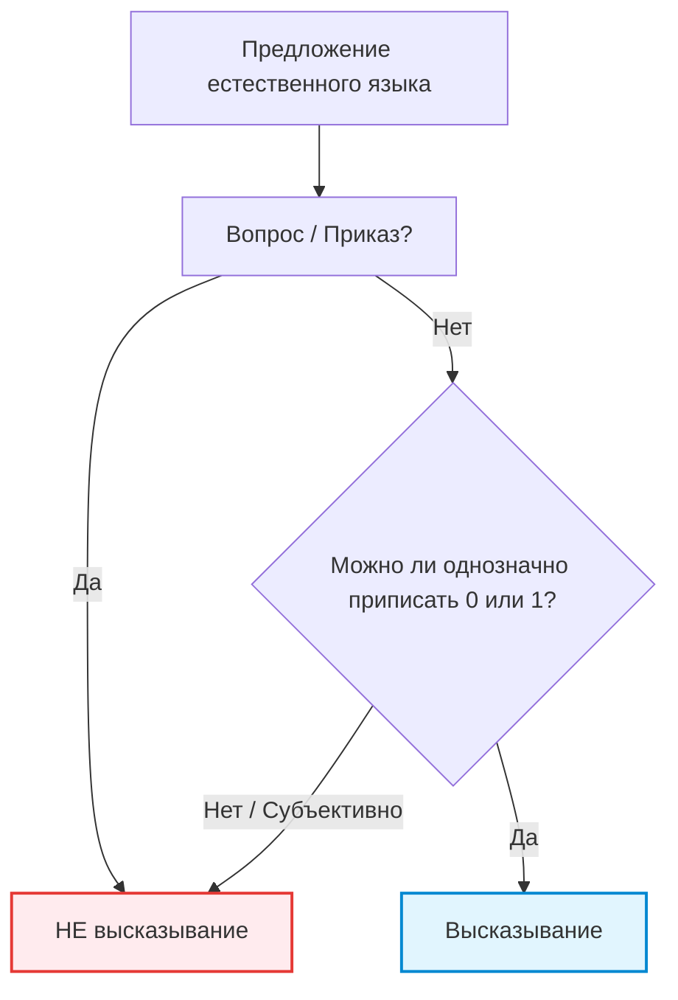
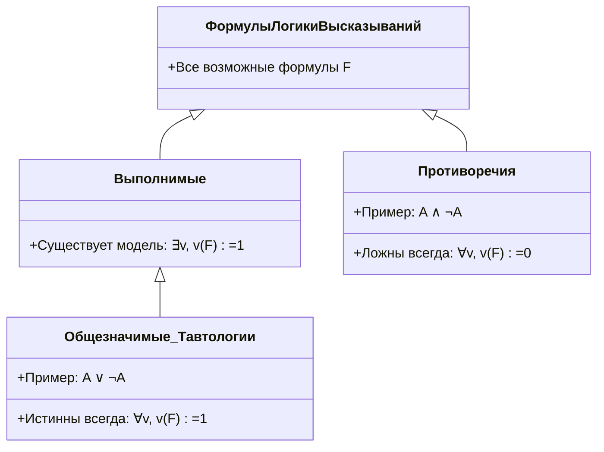

# Лекция 1: Логика высказываний

---

## 1. Рекомендуемая литература

* **Верещагин Н. К., Шень А. — «Языки и исчисления»**  
  *Классический университетский курс: строгая математическая база по логике высказываний, семантике формул и правилам вывода.*
* **Гаврилов Г. П., Сапоженко А. А. — «Задачи и упражнения по дискретной математике»**  
  *Основной задачник для отработки навыков: таблицы истинности, проверка тождеств и доказательство логических следствий (Глава 1: Булевы функции и исчисление высказываний).*
* **Новиков Ф. А. — «Дискретная математика для программистов»**  
  *Практический уклон: применение законов булевой логики к алгоритмам, оптимизации ветвлений и проверке корректности программ.*

---

## 2. Понятие высказывания

### Определение
**Высказывание** — это повествовательное утверждение, о котором можно однозначно сказать, истинно оно ($1$, $\mathrm{True}$) или ложно ($0$, $\mathrm{False}$).

* *Примеры:* «$5 > 3$» — истинное высказывание; «$2 \times 2 = 5$» — ложное высказывание.
* Вопросы («Который час?») и команды («Закрой окно!») высказываниями не являются.



---

### Вакуумная истинность (Vacuous Truth)
**Импликация с ложной посылкой всегда истинна при любом заключении:**

$$0 \to Q \equiv 1 \quad (\forall Q)$$

* **Пояснение:** Утверждение «если $P$, то $Q$» обещает выполнение $Q$ только при условии наступления $P$. Если условие $P$ не выполнено, обещание не нарушено, поэтому высказывание признается истинным.  
* **Пример:** «Если $2 = 3$, то Луна сделана из сыра» — истинно.
* **Применение в математике:** Именно поэтому пустое множество является подмножеством любого множества ($\varnothing \subseteq A$), так как утверждение $\forall x : (x \in \varnothing \to x \in A)$ вакуумно истинно (посылка $x \in \varnothing$ ложна для всех $x$).

> [!NOTE]
> **Пример из программирования (Short-Circuit Evaluation):**  
> В языках программирования условие вида `if (ptr != nullptr && ptr->isValid())` защищает от падения программы благодаря ленивой оценке: если первая часть ложна, всё выражение ложно и дальнейшее вычисление не производится. Аналогично в логике: истинность импликации $P \to Q$ при $P = 0$ не зависит от значения $Q$.

---

## 3. Логические связки и приоритеты

Сложные формулы строятся из простых высказываний с помощью логических связок:

1. **Отрицание (не):** $\neg A$ (или $\overline{A}$) — меняет значение на противоположное.
2. **Конъюнкция (и):** $A \land B$ — истинна, только когда истинны и $A$, и $B$.
3. **Дизъюнкция (или):** $A \lor B$ — истинна, если истинен хотя бы один операнд.
4. **Импликация (если ..., то):** $A \to B$ — ложна только при $1 \to 0$, в остальных случаях истинна.
5. **Эквивалентность (тогда и только тогда):** $A \leftrightarrow B$ — двусторонняя импликация, истинна при $A = B$.

### Сводная таблица истинности

| $A$ | $B$ | $\neg A$ | $A \land B$ | $A \lor B$ | $A \to B$ | $A \leftrightarrow B$ |
| :-: | :-: | :------: | :---------: | :--------: | :-------: | :-------------------: |
| $0$ | $0$ |   $1$    |     $0$     |    $0$     |    $1$    |          $1$          |
| $0$ | $1$ |   $1$    |     $0$     |    $1$     |    $1$    |          $0$          |
| $1$ | $0$ |   $0$    |     $0$     |    $1$     |    $0$    |          $0$          |
| $1$ | $1$ |   $0$    |     $1$     |    $1$     |    $1$    |          $1$          |

### Приоритеты операций (по убыванию старшинства)

1. $\neg$ (отрицание — наивысший приоритет)
2. $\land$ (конъюнкция)
3. $\lor$ (дизъюнкция)
4. $\to$ (импликация)
5. $\leftrightarrow$ (эквивалентность — наинизший приоритет)

```mermaid
graph LR
    subgraph Приоритет операций (от высшего к низшему)
    N["1. Отрицание (¬)"] --> C["2. Конъюнкция (∧)"]
    C --> D["3. Дизъюнкция (∨)"]
    D --> I["4. Импликация (→)"]
    I --> E["5. Эквивалентность (↔)"]
    end
    
    style N fill:#e8f5e9,stroke:#4caf50
    style E fill:#fff3e0,stroke:#ff9800
```

> **Важно:** **Скобки задают порядок!**  
> Скобки имеют абсолютный приоритет и позволяют переопределить стандартный порядок действий: в выражении $(A \lor B) \land C$ сначала выполняется дизъюнкция.

---

## 4. Таблицы истинности, интерпретации и модели

Пусть $V = \{p_1, p_2, \dots, p_n\}$ — множество пропозициональных переменных.

* **Интерпретация** — это функция $v: V \to \{0, 1\}$, которая приписывает конкретное значение истинности каждой переменной формулы.
* **Интерпретация — это строка будущей таблицы истинности.**
* **Проверить формулу** от $n$ переменных — значит перебрать все **$2^n$ интерпретаций** (строк).
* Интерпретация $v$ естественным образом **распространяется с переменных на всю формулу** по правилам логических связок.

### Модель формулы
Интерпретацию $v$, при которой формула истинна ($v(F) = 1$), называют **моделью этой формулы** (обозначается $v \models F$).

---

## 5. Классификация формул по истинности



* **Тавтология (общезначимая):** формула истинна при **всех** возможных интерпретациях (обозначается $\models F$).  
  *Пример:* $A \lor \neg A$ (закон исключенного третьего).
* **Противоречие (тождественно ложная):** формула ложна при **всех** интерпретациях.  
  *Пример:* $A \land \neg A$ (закон непротиворечия).
* **Выполнимая формула:** формула истинна **хотя бы при одной** интерпретации.  
  *(Каждая тавтология выполнима, но не каждая выполнимая формула — тавтология).*

*Связь между классами:* формула $F$ является тавтологией тогда и только тогда, когда ее отрицание $\neg F$ — противоречие:
$$\models F \iff \neg F \text{ — противоречие}$$

---

## 6. Логическая эквивалентность

### Определение
Формулы $A$ и $B$ называются **логически эквивалентными** (обозначается $A \equiv B$), если их истинностные значения совпадают при всех интерпретациях:

$$\forall v : v(A) = v(B)$$

### Критерий
Формулы $A$ и $B$ логически эквивалентны тогда и только тогда, когда формула $A \leftrightarrow B$ является **тавтологией**:

$$A \equiv B \iff \models (A \leftrightarrow B)$$

### Эквивалентность как инструмент переписывания
Эквивалентности позволяют упрощать и преобразовывать формулы:
* **Выражение импликации:** $A \to B \equiv \neg A \lor B$
* **Отрицание импликации:** $\neg(A \to B) \equiv A \land \neg B$
* **Законы де Моргана:**  
  $\neg(A \land B) \equiv \neg A \lor \neg B$  
  $\neg(A \lor B) \equiv \neg A \land \neg B$
* **Закон двойного отрицания:** $\neg\neg A \equiv A$
* **Закон контрапозиции:** $A \to B \equiv \neg B \to \neg A$ *(основа доказательства «от противного»)*
* **Дистрибутивность:** $A \land (B \lor C) \equiv (A \land B) \lor (A \land C)$

---

### Подробный пример: Преобразование и упрощение формулы
*(По материалам задачника Г. П. Гаврилова и А. А. Сапоженко)*

**Задача:** Упростить формулу $F = (A \to B) \land (A \to \neg B)$.

**Пошаговое решение:**
1. Выразим импликацию через дизъюнкцию:  
   $F \equiv (\neg A \lor B) \land (\neg A \lor \neg B)$
2. Применим закон дистрибутивности (вынесем общий множитель $\neg A$ за скобки):  
   $F \equiv \neg A \lor (B \land \neg B)$
3. По закону непротиворечия конъюнкция $B \land \neg B \equiv 0$:  
   $F \equiv \neg A \lor 0$
4. Свойство константы $0$ для дизъюнкции:  
   $F \equiv \neg A$

**Вывод:** Вся сложная конструкция эквивалентна простому отрицанию $\neg A$.

---

## 7. Логическое следствие и правила вывода

### Определение
Формула $B$ называется **логическим следствием** формул $A_1, A_2, \dots, A_n$ (обозначается $A_1, A_2, \dots, A_n \models B$), если на каждой интерпретации, где истинны все посылки $A_i$, истинна и формула $B$:

$$\forall v : \big(v(A_1) = 1 \land \dots \land v(A_n) = 1\big) \implies v(B) = 1$$

---

### Теорема 1: Связь логического следствия и импликации

$$A_1, A_2, \dots, A_n \models B \iff \models (A_1 \land A_2 \land \dots \land A_n) \to B$$

*Формула $B$ является логическим следствием $A_1, \dots, A_n$ тогда и только тогда, когда импликация с их конъюнкцией в посылке является **тавтологией**.*

* **Доказательство:**
  1. ($\implies$) Если все $A_i = 1$, то по определению следствия $B = 1$, значит $1 \to 1 = 1$. Если хотя бы одна $A_i = 0$, то посылка импликации ложна ($0$), и по вакуумной истинности $0 \to B = 1$. Формула истинна всегда (тавтология).
  2. ($\impliedby$) Если импликация — тавтология, то в строках, где все $A_i = 1$ (посылка равна $1$), заключение $B$ не может быть $0$ (иначе $1 \to 0 = 0$). Значит, $B = 1$. $\blacksquare$

---

### Основные правила вывода

```mermaid
graph TD
    subgraph Modus Ponens (Правило отделения)
        MP_Premises["Посылки:<br/>1. P → Q (истинно)<br/>2. P (истинно)"] --> MP_Conclusion["Заключение:<br/>Q (истинно)"]
    end
    
    subgraph Modus Tollens (Правило отрицания)
        MT_Premises["Посылки:<br/>1. P → Q (истинно)<br/>2. ¬Q (Q ложно)"] --> MT_Conclusion["Заключение:<br/>¬P (P ложно)"]
    end
    
    style MP_Conclusion fill:#e8f5e9,stroke:#388e3c,stroke-width:2px
    style MT_Conclusion fill:#fff9c4,stroke:#fbc02d,stroke-width:2px
```

1. **Modus Ponens (правило отделения):**  
   Если истинна импликация $P \to Q$ и истинна посылка $P$, то истинно и заключение $Q$:
   $$P \to Q, \quad P \models Q$$
   *Обоснование:* формула $\big((P \to Q) \land P\big) \to Q$ является **тавтологией**.

2. **Modus Tollens (правило отрицания):**  
   Если истинна импликация $P \to Q$, но заключение $Q$ ложно, то посылка $P$ также ложна:
   $$P \to Q, \quad \neg Q \models \neg P$$
   *Обоснование:* формула $\big((P \to Q) \land \neg Q\big) \to \neg P$ является **тавтологией**.

---

### Практический пример применения Modus Tollens в отладке ПО:
* **Посылка 1 ($P \to Q$):** «Если компилятор оптимизировал цикл ($P$), то ассемблерный листинг содержит векторные инструкции SIMD ($Q$)».
* **Посылка 2 ($\neg Q$):** При анализе сгенерированного бинарного кода векторных инструкций нет (заключение ложно, $\neg Q$).
* **Следствие ($\neg P$):** По правилу Modus Tollens гарантированно заключаем, что оптимизация цикла не сработала ($\neg P$).
