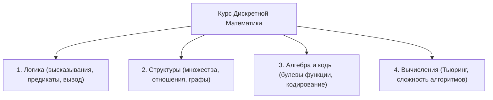
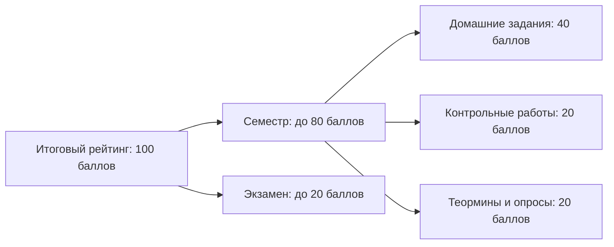

# Вводная лекция: Организация курса и регламент

---

## 1. Программа курса

В рамках семестра изучаются 4 ключевых направления дискретной математики:

---

## 2. Балльно-рейтинговая система (БРС)

Итоговый рейтинг формируется из **100 баллов**:

| Элемент контроля | Баллы | Описание |
| :--- | :---: | :--- |
| **Домашние задания (ДЗ)** | **40** | 3 уровня: База + Челлендж + Бонус (с защитой) |
| **Контрольные работы (КР)** | **20** | 4 работы в семестр (проверка усвоения ДЗ) |
| **Теормины и опросы** | **20** | 2 теормина + флеш-опросники на каждой лекции |
| **Экзамен** | **20** | Итоговый устный/письменный контроль |

* **Работа в семестре:** до **80 баллов**
* **Экзамен:** **12–20 баллов**

### Шкала оценок:
* **90+ баллов** — «Отлично»
* **74+ балла** — «Хорошо»

> **Важно:** Выполнять **всё обязательно**!

---

## 3. Домашние задания и контроль знаний

* **Домашние задания (ДЗ):**
  * Суммарный вес: **40 баллов** за семестр.
  * Структура каждого ДЗ: **База + Челлендж + Бонус**.
  * Обязательное условие: **домашние задания нужно защищать**.
* **Контрольные работы (КР):**
  * Периодичность: **4 штуки в семестр**.
  * Назначение: объективное **подтверждение выполнения ДЗ**.
* **Теоретические минимумы («теормины»):**
  * Количество: **2 штуки** за семестр (контроль знания базовой теории).
* **Флеш-опросники:**
  * Проводятся **на каждой лекции**.
  * Учитываются как оперативный срез знаний и **проверка посещаемости**.

---

## 4. Политика использования ИИ

* **На домашних заданиях (ДЗ):** ИИ **разрешён** (при условии самостоятельного понимания и успешной защиты решения).
* **На контрольных работах (КР) и экзамене:** ИИ **строго запрещён**.

---

## 5. Рекомендуемая литература

* **Верещагин Н. К., Шень А. — Серия «Математическая логика и теория алгоритмов»**  
  *Тома: «Начала теории множеств», «Языки и исчисления», «Вычислимые функции». Базовые университетские учебники.*
* **Гаврилов Г. П., Сапоженко А. А. — «Задачи и упражнения по дискретной математике»**  
  *Основной практический задачник курса с подробными разборами типовых задач.*
* **Новиков Ф. А. — «Дискретная математика для программистов»**  
  *Связующее звено между строгой дискретной математикой и алгоритмами в Computer Science.*

