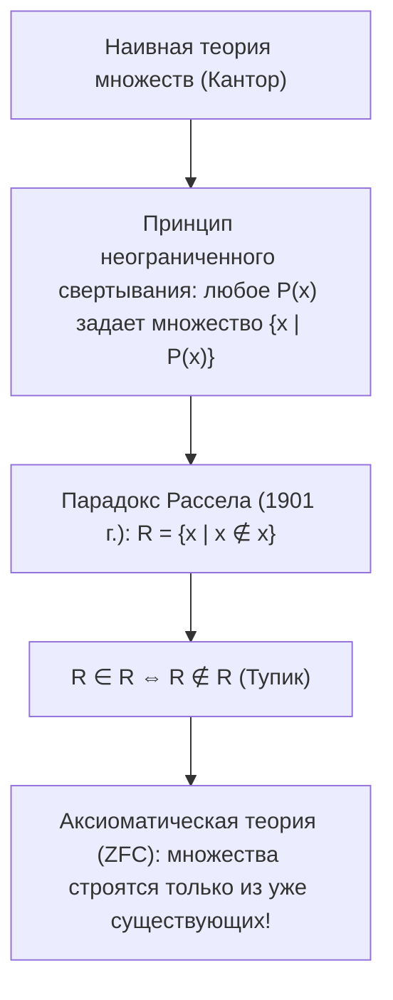
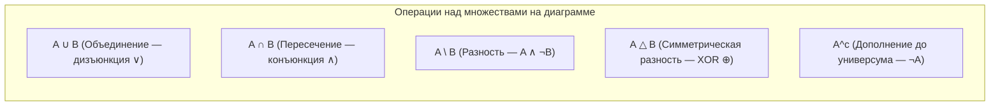
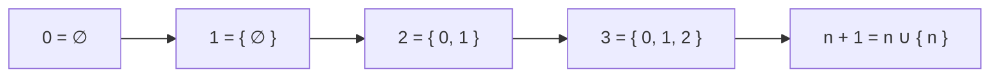

# Лекция 4: Логика и наивная теория множеств

---

## 1. Рекомендуемая литература

* **Верещагин Н. К., Шень А. — «Начала теории множеств» (Серия «Математическая логика и теория алгоритмов»)**  
  *Классическое и наиболее строгое отечественное университетское введение: операции над множествами, парадоксы наивной теории, аксиоматика Цермело-Френкеля, конструкция чисел фон Неймана.*
* **Куратовский К., Мостовский А. — «Теория множеств»**  
  *Фундаментальный труд: углублённый аппарат упорядоченных пар (по Куратовскому), отношений и декартовых произведений.*
* **Гаврилов Г. П., Сапоженко А. А. — «Задачи и упражнения по дискретной математике»**  
  *Глава 2: Множества, отношения, алгебра подмножеств (практические задачи на законы поглощения, разности и симметрической разности).*
* **Конспекты кафедры КТ ИТМО (neerc.ifmo.ru/wiki)**  
  *Разделы: «Теория множеств», «Булеан», «Отношения на множествах».*

---

## 2. Понятие универсума и предикаты принадлежности

### 2.1. Универсум (Универсальное множество $\mathcal{U}$)
В любой прикладной или теоретической математической задаче рассмотрение объектов всегда ограничено определённой предметной областью.
* **Универсум $\mathcal{U}$** — это фиксированное объемлющее множество всех объектов, допустимых в контексте данной задачи.
* Любое рассматриваемое множество $A$ является подмножеством универсума: $A \subseteq \mathcal{U}$.

### 2.2. Характеристический предикат принадлежности
* Выражение $x \in A$ («$x$ принадлежит множеству $A$») — это **одноместный предикат $P_A(x)$**:
  $$P_A(x) = [x \in A] = \begin{cases} 1, & \text{если } x \in A \\ 0, & \text{если } x \notin A \end{cases}$$
* Для каждого конкретного объекта универсума $u \in \mathcal{U}$ значение предиката $P_A(u)$ однозначно истинно либо ложно.

---

## 3. Способы задания множеств

В математике и Computer Science используются два фундаментальных способа задания множеств:

1. **Экстенсиональный (явное перечисление элементов):**
   $$A = \{x_1, x_2, \dots, x_n\}$$
   *Пример:* $A = \{2, 3, 5, 7, 11\}$ — множество первых пяти простых чисел.
2. **Интенсиональный (через характеристическое свойство / предикат):**
   $$A = \{x \in \mathcal{U} \mid P(x)\}$$
   *Читается:* «Множество всех объектов $x$ из универсума $\mathcal{U}$, для которых истинен предикат $P(x)$».  
   *Пример:* $\{x \in \mathbb{R} \mid x^2 - 4 = 0\} = \{-2, 2\}$.

---

## 4. Наивная теория множеств (Георг Кантор) и её парадоксы

### Определение по Кантору (1895 г.)
> **Множество** есть объединение в одно общее определенных, вполне различимых объектов нашего восприятия или нашей мысли, которые называются **элементами множества**.

#### Базовые свойства элементов множества:
1. **Неупорядоченность:** порядок следования элементов не имеет значения:
   $$\{1, 2, 3\} = \{3, 1, 2\}$$
2. **Уникальность (отсутствие дубликатов):** каждый объект входит в множество ровно один раз:
   $$\{1, 2, 2, 3, 3, 3\} = \{1, 2, 3\}$$

---

## 5. Включение и равенство множеств (Аксиома экстенсиональности)

### 5.1. Отношение включения (Подмножество $\subseteq$)
Множество $A$ называется **подмножеством** множества $B$ ($A \subseteq B$), если каждый элемент множества $A$ одновременно является элементом множества $B$:
$$A \subseteq B \iff \forall x \; (x \in A \to x \in B)$$

* **Свойства отношения $\subseteq$:**
  1. Рефлексивность: $\forall A : A \subseteq A$.
  2. Транзитивность: $\forall A, B, C : (A \subseteq B \land B \subseteq C) \implies A \subseteq C$.
  3. Пустое множество: $\varnothing \subseteq A$ для любого множества $A$ (вакуумная истинность: $x \in \varnothing \to x \in A$ всегда истинно, так как посылка ложна).

### 5.2. Равенство множеств ($A = B$)
Два множества $A$ и $B$ равны тогда и только тогда, когда они состоят из одних и тех же элементов:
$$A = B \iff \forall x \; (x \in A \leftrightarrow x \in B) \iff (A \subseteq B) \land (B \subseteq A)$$

> **Метод двух включений:** Стандартный способ доказать в математике равенство $A = B$ — независимо доказать два включения:
> 1. Сначала доказать, что $A \subseteq B$ (взяв произвольный $x \in A$ и показав, что $x \in B$).
> 2. Затем доказать, что $B \subseteq A$ (взяв произвольный $y \in B$ и показав, что $y \in A$).

---

## 6. Геометрическая визуализация: Диаграммы Венна и Круги Эйлера

* **Круги Эйлера** иллюстрируют отношения между множествами с учётом их реальной непустоты или вложенности (например, круг «Студенты» целиком лежит внутри круга «Люди»).
* **Диаграммы Венна** изображают все $2^n$ комбинаций взаимного пересечения $n$ множеств в виде замкнутых областей внутри объемлющего прямоугольника универсума $\mathcal{U}$.

---

## 7. Конструкция натуральных чисел Джона фон Неймана

В современной аксиоматической теории множеств все математические объекты строятся исключительно из **пустого множества $\varnothing$**.  
Джон фон Нейман предложил гениальное теоретико-множественное определение натуральных чисел, где каждое число является **множеством всех предшествующих ему чисел**:

$$0 = \varnothing$$
$$1 = \{0\} = \{\varnothing\}$$
$$2 = \{0, 1\} = \{\varnothing, \{\varnothing\}\}$$
$$3 = \{0, 1, 2\} = \{\varnothing, \{\varnothing\}, \{\varnothing, \{\varnothing\}\}\}$$
$$n + 1 = n \cup \{n\}$$

* **Следствие:** При такой конструкции мощность множества $n$ в точности равна числу $n$, а отношение порядка $<$ эквивалентно отношению принадлежности $\in$:
  $$a < b \iff a \in b$$

---

## 8. Законы алгебры множеств

Операции над множествами изоморфны операциям булевой логики высказываний (изоморфизм между булевой алгеброй множеств и алгеброй логики):

| Закон | Объединение ($\cup$) и Пересечение ($\cap$) | Логический аналог |
| :--- | :--- | :--- |
| **Коммутативность** | $A \cup B = B \cup A$   $A \cap B = B \cap A$ | $A \lor B = B \lor A$   $A \land B = B \land A$ |
| **Ассоциативность** | $(A \cup B) \cup C = A \cup (B \cup C)$   $(A \cap B) \cap C = A \cap (B \cap C)$ | $(A \lor B) \lor C = A \lor (B \lor C)$   $(A \land B) \land C = A \land (B \land C)$ |
| **Дистрибутивность** | $A \cap (B \cup C) = (A \cap B) \cup (A \cap C)$   $A \cup (B \cap C) = (A \cup B) \cap (A \cup C)$ | $A \land (B \lor C) = (A \land B) \lor (A \land C)$   $A \lor (B \land C) = (A \lor B) \land (A \lor C)$ |
| **Идемпотентность** | $A \cup A = A$   $A \cap A = A$ | $A \lor A = A$   $A \land A = A$ |
| **Законы де Моргана** | $\overline{A \cup B} = \overline{A} \cap \overline{B}$   $\overline{A \cap B} = \overline{A} \cup \overline{B}$ | $\neg (A \lor B) = \neg A \land \neg B$   $\neg (A \land B) = \neg A \lor \neg B$ |
| **Законы дополнения** | $A \cup \overline{A} = \mathcal{U}$   $A \cap \overline{A} = \varnothing$   $\overline{\overline{A}} = A$ | $A \lor \neg A = 1$   $A \land \neg A = 0$   $\neg \neg A = A$ |

---

## 9. Законы поглощения множеств (Absorption Laws)

Законы поглощения играют ключевую роль в минимизации булевых выражений и упрощении теоретико-множественных формул:

$$A \cup (A \cap B) = A$$
$$A \cap (A \cup B) = A$$

### Доказательство закона $A \cup (A \cap B) = A$:
1. $A \cap B \subseteq A$ (любой элемент пересечения лежит в $A$).
2. Объединяя множество $A$ с его подмножеством, мы не добавляем новых элементов:
   $$A \subseteq A \cup (A \cap B) \subseteq A \cup A = A$$
3. Следовательно, по теореме о двух включениях: $A \cup (A \cap B) = A$. $\blacksquare$

---

## 10. Булеан множества (Power Set $\mathcal{P}(A)$)

### Определение
**Булеаном** (множеством всех подмножеств) множества $A$ называется семейство всех его подмножеств:
$$\mathcal{P}(A) = 2^A = \{X \mid X \subseteq A\}$$

* **Теорема о мощности булеана:** Если $|A| = n$ — конечное множество, то:
  $$|\mathcal{P}(A)| = 2^n$$
* **Идея доказательства:** Каждое подмножество $X \subseteq A$ однозначно задаётся двоичным вектором длины $n$ (где 1 означает включение элемента, а 0 — невключение). Число таких векторов равно $2^n$.

---

## 11. Упорядоченная пара и Декартово произведение

### 11.1. Определение упорядоченной пары по Куратовскому (1921 г.)
В наивной теории множеств порядок элементов не определён (например, $\{a, b\} = \{b, a\}$).  
Казимир Куратовский строго определил **упорядоченную пару** $(a, b)$ через стандартные множества:

$$(a, b) \stackrel{\text{def}}{=} \big\{ \{a\}, \; \{a, b\} \big\}$$

#### Теорема о фундаментальном свойстве упорядоченной пары:
$$(a, b) = (c, d) \iff a = c \;\land\; b = d$$
*Элемент $a$ однозначно восстанавливается как единственный элемент пересечения $\bigcap (a, b) = \{a\}$, а второй элемент $b$ — из объединения $\bigcup (a, b) = \{a, b\}$.*

---

### 11.2. Декартово (прямое) произведение множеств ($A \times B$)
**Декартовым произведением** множеств $A$ и $B$ называется множество всех упорядоченных пар, первый элемент которых принадлежит $A$, а второй — $B$:
$$A \times B = \big\{ (a, b) \mid a \in A \land b \in B \big\}$$

* Для конечных множеств: $|A \times B| = |A| \cdot |B|$.
* **Пример:** $\{1, 2\} \times \{x, y\} = \{(1, x), (1, y), (2, x), (2, y)\}$.
* Декартово произведение **не коммутативно**: $A \times B \ne B \times A$ (если $A \ne B$).
* **Прямой квадрат:** $\mathbb{R}^2 = \mathbb{R} \times \mathbb{R}$ — классическая евклидова плоскость вещественных чисел.
