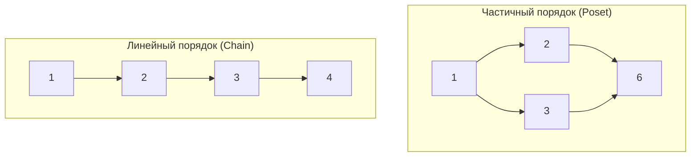
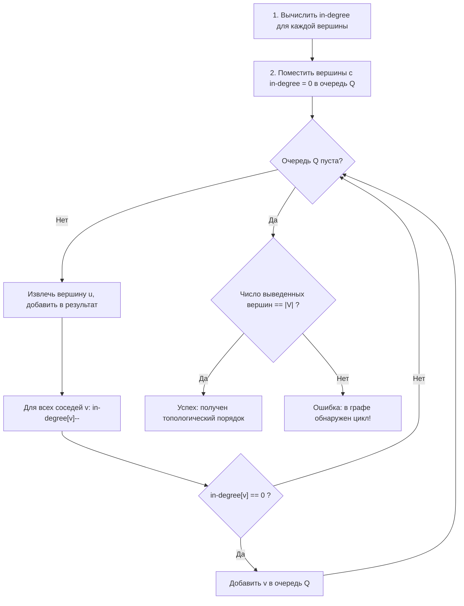
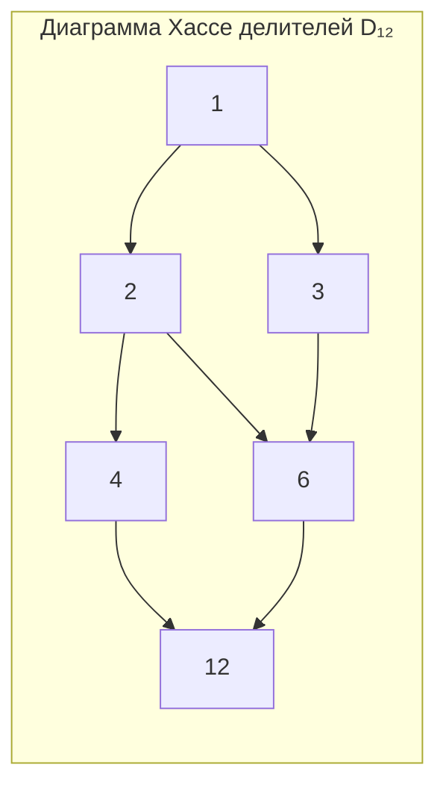
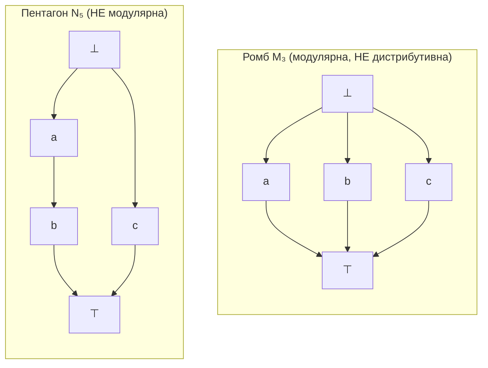
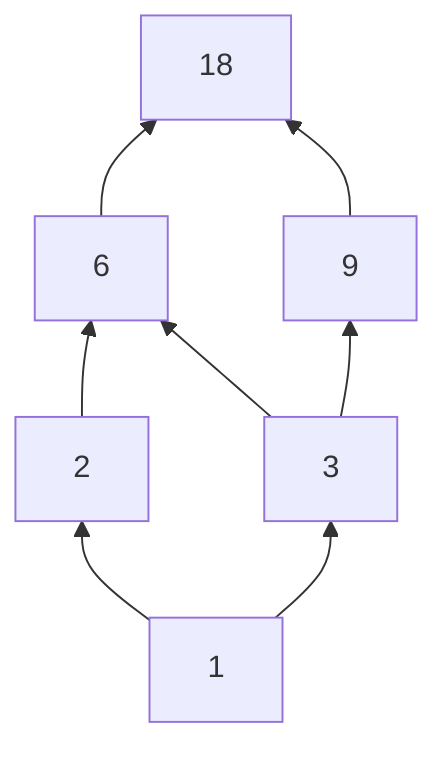

# Лекция 6: Отношения порядка, решётки и их применения в Computer Science

> **Дисциплина**: Дискретная математика  
> **Лектор**: Константин Чухарев (ИТМО, осенний семестр 2026)  
> **Ключевые темы**: Частичный порядок (ЧУМ/Poset), строгий и нестрогий порядок, линейный (тотальный) порядок, плотность, цепи и антицепи, ширина порядка, лексикографический порядок и Shortlex, Rust `PartialOrd`/`Ord`, топологическая сортировка, алгоритм Кана, лемма о спуске, диаграммы Хассе, отношение покрытия, экстремальные элементы (минимальные vs наименьшие), грани, супремум и инфимум, решётки (дистрибутивные, модулярные, булевы алгебры, критерии $M_3$ и $N_5$), полные решётки, теорема Кнастера–Тарского о неподвижной точке, абстрактная интерпретация, иерархии типов, семантическое версионирование, отношение Лампорта и векторные часы, теорема Дилуорса, фундированные порядки и доказательство завершимости.

---

## 1. Введение: природа порядка

В отличие от отношения эквивалентности, которое группирует объекты по признаку неразличимости («склеивает в классы»), отношение порядка **выстраивает элементы в иерархию**.

> «Порядок есть расположение равных и неравных вещей, дающее каждой своё место.»  
> — *Августин Блаженный*

В компьютерных науках отношение порядка формализует концепции:
- **Предшествования во времени**: компиляция зависимостей исходного кода, порядок выполнения инструкций в процессоре;
- **Иерархии вложенности**: подтипы в языках программирования, права доступа, иерархия каталогов файловой системы;
- **Причинно-следственной связи**: отношение «произошло-до» (happened-before) Лесли Лампорта в распределенных системах.

Главная особенность **частичного** порядка — наличие **несравнимых элементов**: они не обязаны предшествовать друг другу и могут выполняться параллельно и независимо.

---

## 2. Частичный порядок и ЧУМ

### 2.1. Нестрогий частичный порядок

> [!NOTE] **Определение 1 (Нестрогий частичный порядок)**  
> Бинарное отношение $\preceq$ на множестве $A$ называется **нестрогим частичным порядком** (или просто частичным порядком), если оно обладает следующими тремя свойствами:  
> 1. **Рефлексивность**: $\forall a \in A.\; a \preceq a$;  
> 2. **Антисимметричность**: $\forall a, b \in A.\; (a \preceq b \land b \preceq a \implies a = b)$;  
> 3. **Транзитивность**: $\forall a, b, c \in A.\; (a \preceq b \land b \preceq c \implies a \preceq c)$.  
> 
> Пара $(A, \preceq)$ называется **частично упорядоченным множеством** (ЧУМ, англ. *partially ordered set*, или *poset*).

#### Классические примеры ЧУМ:
1. **Делимость на $\mathbb{N}$**: $a \preceq b \iff a \mid b$ ($a$ делит $b$).  
   - $a \mid a$ (рефлексивно: $a = 1 \cdot a$).  
   - $a \mid b \land b \mid a \implies a = b$ на натуральных числах (антисимметрично).  
   - $a \mid b \land b \mid c \implies a \mid c$ (транзитивно).  
   *Несравнимость*: числа 2 и 3 несравнимы ($2 \nmid 3$ и $3 \nmid 2$), хотя оба делят 6.
2. **Включение множеств $\subseteq$ на булеане $\mathcal{P}(U)$**:  
   Подмножества $\{1\}$ и $\{2\}$ несравнимы по включению.
3. **Стандартный числовой порядок $\le$ на $\mathbb{R}$**.

---

### 2.2. Строгий частичный порядок

> [!NOTE] **Определение 2 (Строгий частичный порядок)**  
> Бинарное отношение $\prec$ на множестве $A$ называется **строгим частичным порядком**, если оно обладает свойствами:  
> 1. **Иррефлексивность**: $\forall a \in A.\; \neg(a \prec a)$;  
> 2. **Транзитивность**: $\forall a, b, c \in A.\; (a \prec b \land b \prec c \implies a \prec c)$.

> [!IMPORTANT] **Теорема 1 (Об асимметричности строгого порядка)**  
> Если отношение $\prec$ иррефлексивно и транзитивно, то оно автоматически является **асимметричным**:  
> $$\forall a, b \in A.\; (a \prec b \implies \neg(b \prec a))$$

*Доказательство*:  
Предположим противное: пусть существуют $a, b \in A$, такие что $a \prec b$ и $b \prec a$.  
Тогда в силу транзитивности $a \prec a$.  
Однако это напрямую противоречит свойству иррефлексивности $\neg(a \prec a)$.  
Следовательно, одновременное выполнение $a \prec b$ и $b \prec a$ невозможно. $\blacksquare$

---

### 2.3. Взаимосвязь между строгим и нестрогим порядком

> [!IMPORTANT] **Теорема 2 (Канонический мост между порядками)**  
> 1. Всякий нестрогий порядок $\preceq$ порождает **индуцированный строгий порядок** $\prec$ правилом:  
>    $$a \prec b \iff (a \preceq b \land a \ne b)$$  
> 2. Всякий строгий порядок $\prec$ порождает **индуцированный нестрогий порядок** $\preceq$ правилом:  
>    $$a \preceq b \iff (a \prec b \lor a = b)$$  
> Указанные соответствия взаимно обратны.

---

## 3. Классификация порядков: линейность и плотность

### 3.1. Линейный (тотальный) порядок

В частичном порядке элементы могут быть несравнимы. Если потребовать сравнимость любых двух элементов, получаем линейный порядок.

> [!NOTE] **Определение 3 (Линейный порядок / Total Order)**  
> Частичный порядок $\preceq$ на множестве $A$ называется **линейным (тотальным, совершенным) порядком**, если выполнено свойство **сильной связности (трихотомии)**:  
> $$\forall a, b \in A.\; (a \preceq b \lor b \preceq a)$$  
> Множество $A$ с линейным порядком называется **линейно упорядоченным множеством** (или **цепью**).

- $(\mathbb{R}, \le)$ и $(\mathbb{N}, \le)$ — линейные порядки.
- $(\mathbb{N}, \mid)$ и $(\mathcal{P}(A), \subseteq)$ — только частичные порядки.



### 3.2. Плотность порядка

> [!NOTE] **Определение 4 (Плотный порядок)**  
> Линейный порядок $(A, \prec)$ называется **плотным**, если между любыми двумя различными элементами всегда найдется третий:  
> $$\forall a, b \in A.\; (a \prec b \implies \exists c \in A: a \prec c \prec b)$$

- Порядок $(\mathbb{Q}, <)$ и $(\mathbb{R}, <)$ — **плотные** (для любых $a < b$ число $c = \frac{a + b}{2}$ удовлетворяет $a < c < b$).
- Порядок $(\mathbb{Z}, <)$ и $(\mathbb{N}, <)$ — **дискретные** (между $n$ и $n + 1$ нет целых чисел).

---

## 4. Цепи, антицепи и ширина порядка

### 4.1. Определения

> [!NOTE] **Определение 5 (Цепь и антицепь)**  
> Пусть $(A, \preceq)$ — ЧУМ.  
> 1. Подмножество $C \subseteq A$ называется **цепью**, если любые два его элемента сравнимы:  
>    $$\forall x, y \in C:\; (x \preceq y \lor y \preceq x)$$  
> 2. Подмножество $S \subseteq A$ называется **антицепью**, если любые два его различных элемента **несравнимы**:  
>    $$\forall x, y \in S:\; (x \ne y \implies x \not\preceq y \land y \not\preceq x)$$

> [!NOTE] **Определение 6 (Высота и ширина ЧУМ)**  
> - **Высотой** $\mathrm{height}(A)$ частично упорядоченного множества называется максимальная мощность цепи в $A$.  
> - **Шириной** $\mathrm{width}(A)$ частично упорядоченного множества называется максимальная мощность антицепи в $A$.

#### Компьютерный смысл цепей и антицепей:
- **Цепь** моделирует последовательную цепочку шагов (конвейер), где каждый следующий шаг ожидает завершения предыдущего.
- **Антицепь** моделирует совокупность независимых задач, которые могут исполняться строго **параллельно** в разных потоках CPU или на разных узлах кластера.  
- **Ширина ЧУМ** показывает **максимальный параллелизм системы** — минимальное число исполнителей (потоков), необходимое для параллельного выполнения независимых этапов.

---

## 5. Порядки на декартовых произведениях и словах

### 5.1. Лексикографический порядок (Lexicographical Order)

Пусть $(A, \prec_A)$ и $(B, \prec_B)$ — упорядоченные множества.

> [!NOTE] **Определение 7 (Лексикографический порядок пар)**  
> На декартовом произведении $A \times B$ лексикографический порядок $\prec_{\mathrm{lex}}$ задается правилом:  
> $$(a_1, b_1) \prec_{\mathrm{lex}} (a_2, b_2) \iff \Big( a_1 \prec_A a_2 \;\lor\; (a_1 = a_2 \land b_1 \prec_B b_2) \Big)$$

*(Аналогия с телефонным справочником: сначала сравниваются фамилии, а при совпадении — имена).*

> [!IMPORTANT] **Теорема 3 (О линейности лексикографического порядка)**  
> Лексикографический порядок на $A \times B$ является линейным тогда и только тогда, когда **оба** исходных порядка $(A, \prec_A)$ и $(B, \prec_B)$ линейны.

---

### 5.2. Порядок Shortlex (Длинно-лексикографический)

В теоретической информатике и теории формальных языков классический словарный порядок на словах бесконечной длины обладает фатальным недостатком: множество слов $\{b, ab, aab, aaab, \dots\}$ не имеет наименьшего элемента, так как слово $b$ всегда идет позже любого слова, начинающегося на букву $a$.

> [!NOTE] **Определение 8 (Порядок Shortlex / Radix Order)**  
> Пусть $\Sigma$ — алфавит, линейно упорядоченный. Для двух слов $u, v \in \Sigma^*$:  
> $$u \prec_{\mathrm{shortlex}} v \iff (|u| < |v|) \;\lor\; (|u| = |v| \land u \prec_{\mathrm{lex}} v)$$

*Пример над алфавитом $\{a, b\}$, где $a < b$*:
$$\varepsilon \prec a \prec b \prec aa \prec ab \prec ba \prec bb \prec aaa \prec aab \prec \dots$$
**Свойство Shortlex**: В любом непустом множестве слов над конечным алфавитом всегда существует **наименьший элемент**.

---

### 5.3. Моделирование порядка в коде: Rust `PartialOrd` vs `Ord`

В современных языках системного программирования математическое различие между частичным и линейным порядком возведено в систему типов:

- **Rust**:
  ```rust
  // Частичный порядок (ЧУМ): результат сравнения может быть None!
  pub trait PartialOrd<Rhs = Self>: PartialEq<Rhs> {
      fn partial_cmp(&self, other: &Rhs) -> Option<Ordering>;
  }

  // Линейный (тотальный) порядок: сравнимы любые два элемента
  pub trait Ord: Eq + PartialOrd<Self> {
      fn cmp(&self, other: &Self) -> Ordering;
  }
  ```
  *Пример*: типы `f32` и `f64` реализуют только `PartialOrd`, но не `Ord`, потому что `f64::NAN` несравним ни с одним числом: `partial_cmp(NAN, 1.0) == None`.

- **C++20**: концепт `std::totally_ordered` против `std::partially_ordered`.

---

## 6. Топологическая сортировка и алгоритм Кана

### 6.1. Постановка задачи

Часто зависимости между задачами задают частичный порядок (граф зависимостей / DAG), а исполнитель (одноядерный процессор, сборочная утилита `make`, установщик пакетов `apt` / `cargo`) должен выполнить их в **линейной последовательности**.

> [!NOTE] **Определение 9 (Топологическая сортировка)**  
> **Топологической сортировкой** конечного ЧУМ $(A, \preceq)$ называется линейный порядок $\le$ на том же множестве $A$, согласованный с исходным:  
> $$\forall a, b \in A:\; a \preceq b \implies a \le b$$

---

### 6.2. Теоремы о существовании сортировки

> [!IMPORTANT] **Теорема 4 (Лемма о спуске в конечном ЧУМ)**  
> Всякое конечное непустое частично упорядоченное множество содержит хотя бы один **минимальный** элемент и хотя бы один **максимальный** элемент.

*Доказательство*:  
Пусть в конечном непустом ЧУМ $A$ нет минимального элемента.  
Тогда для любого элемента существует строго меньший. Выберем произвольный $a_0 \in A$.  
Существует $a_1 \prec a_0$, затем $a_2 \prec a_1$, и так далее.  
Получаем бесконечную цепочку: $\dots \prec a_k \prec \dots \prec a_1 \prec a_0$.  
Так как множество $A$ конечно, среди элементов цепочки найдутся повторяющиеся: $a_i = a_j$ при $i < j$.  
В силу транзитивности получаем $a_j \prec a_i \implies a_i \prec a_i$, что противоречит иррефлексивности строгого порядка.  
Следовательно, спуск обязан оборваться на минимальном элементе. $\blacksquare$

> [!IMPORTANT] **Теорема 5 (Существование топологической сортировки)**  
> Любое конечное ЧУМ (то есть любой направленный ациклический граф — DAG) допускает хотя бы одну топологическую сортировку.

*Алгоритмическое доказательство*:  
По Лемме о спуске выбираем минимальный элемент $m_1 \in A$. У него нет предшественников, поэтому его можно поставить первым.  
Удаляем $m_1$ из множества. В оставшемся конечном множестве $A \setminus \{m_1\}$ снова выбираем минимальный элемент $m_2$ и ставим его вторым.  
Продолжая процесс, за $n = |A|$ шагов упорядочиваем все элементы в цепь $m_1 \le m_2 \le \dots \le m_n$. $\blacksquare$

---

### 6.3. Алгоритм Кана (Kahn's Algorithm)

Алгоритм Кана находит топологический порядок графа зависимостей за линейное время $\mathcal{O}(|V| + |E|)$.



#### Реализация на C++:
```cpp
#include <iostream>
#include <vector>
#include <queue>

std::vector<int> kahnTopologicalSort(int n, const std::vector<std::vector<int>>& adj) {
    std::vector<int> inDegree(n, 0);
    for (int u = 0; u < n; ++u) {
        for (int v : adj[u]) {
            inDegree[v]++;
        }
    }

    std::queue<int> q;
    for (int i = 0; i < n; ++i) {
        if (inDegree[i] == 0) q.push(i);
    }

    std::vector<int> order;
    while (!q.empty()) {
        int u = q.front();
        q.pop();
        order.push_back(u);

        for (int v : adj[u]) {
            if (--inDegree[v] == 0) {
                q.push(v);
            }
        }
    }

    if (order.size() != n) {
        throw std::runtime_error("Граф содержит ориентированный цикл! Топологическая сортировка невозможна.");
    }
    return order;
}
```

---

## 7. Диаграммы Хассе и отношение покрытия

Граф бинарного отношения частичного порядка содержит колоссальное количество избыточных ребер (все петли рефлексивности и все ребра транзитивных цепочек). Чтобы сделать структуру наглядной, строят ее **транзитивное сокращение**.

### 7.1. Отношение покрытия (Covering Relation)

> [!NOTE] **Определение 10 (Покрытие)**  
> Пусть $(A, \preceq)$ — ЧУМ. Говорят, что элемент $b$ **непосредственно покрывает** элемент $a$ (обозначается $a \prec: b$), если:  
> 1. $a \prec b$;  
> 2. Не существует такого $c \in A$, что $a \prec c \prec b$.

### 7.2. Правила построения диаграммы Хассе
1. **Убрать все петли** (рефлексивность предполагается по умолчанию).
2. **Убрать все ребра, следующие из транзитивности** (оставить только ребра покрытия $\prec:$).
3. **Вертикальная ориентация**: если $a \prec: b$, вершина $b$ рисуется геометрически **выше** вершины $a$.
4. **Стрелки не рисуются**: направление снизу вверх подразумевается автоматически.



*Замечание: ребро $1 \to 4$ не проводится, так как оно транзитивно выводится через $1 \to 2 \to 4$.*

---

## 8. Экстремальные элементы и грани

### 8.1. Минимальные vs Наименьшие (Максимальные vs Наибольшие)

Это одна из важнейших понятийных дихотомий:

| Характеристика | Минимальный элемент $m$ | Наименьший элемент $m_0$ |
| :--- | :--- | :--- |
| **Определение** | $\nexists x \in A:\; x \prec m$ (нет элементов *строго меньше*) | $\forall x \in A:\; m_0 \preceq x$ (*меньше или равен всех*) |
| **Природа свойства** | **Локальное**: не требует сравнимости со всеми | **Глобальное**: обязан быть сравним с абсолютно всеми |
| **Единственность** | Может быть **несколько** | Если существует, то **строго единственен** |
| **Существование в конечном ЧУМ** | Гарантировано всегда (Лемма о спуске) | Не гарантировано |

> [!IMPORTANT] **Теорема 6 (О единственности крайних элементов)**  
> 1. Всякий наименьший элемент является минимальным. Обратное неверно.  
> 2. Наименьший (наибольший) элемент ЧУМ, если существует, то единственен.

*Доказательство единственности*:  
Пусть $m_1$ и $m_2$ — два наименьших элемента.  
Так как $m_1$ наименьший: $m_1 \preceq m_2$.  
Так как $m_2$ наименьший: $m_2 \preceq m_1$.  
По свойству антисимметричности порядка: $m_1 = m_2$. $\blacksquare$

*Контрпример*: во множестве делителей $\{2, 3, 4, 6, 12\}$ по отношению делимости:
- Минимальных элементов два: 2 и 3 (под ними делителей нет).
- Наименьшего элемента **нет вовсе** (числа 2 и 3 несравнимы).

---

### 8.2. Верхние и нижние грани, супремум и инфимум

Пусть $(A, \preceq)$ — ЧУМ, $S \subseteq A$ — подмножество.
- $u \in A$ называется **верхней гранью** $S$, если $\forall s \in S: s \preceq u$.
- $l \in A$ называется **нижней гранью** $S$, если $\forall s \in S: l \preceq s$.

> [!NOTE] **Определение 11 (Супремум и Инфимум)**  
> - **Точная верхняя грань (Супремум / Join)**: $\sup S = \bigvee S$ — **наименьшая** из всех верхних граней подмножества $S$.  
> - **Точная нижняя грань (Инфимум / Meet)**: $\inf S = \bigwedge S$ — **наибольшая** из всех нижних граней подмножества $S$.  
> Для пары элементов $\{a, b\}$ супремум обозначается $a \vee b$, а инфимум — $a \wedge b$.

---

## 9. Решётки (Lattices) и алгебраические структуры

> [!NOTE] **Определение 12 (Решётка)**  
> ЧУМ $(L, \preceq)$ называется **решёткой** (lattice), если для **любой пары элементов** $a, b \in L$ существуют как точная верхняя грань $a \vee b$ (join), так и точная нижняя грань $a \wedge b$ (meet).

### Примеры решёток:
1. Булеан $\mathcal{P}(U)$ с операциями $A \vee B = A \cup B$, $A \wedge B = A \cap B$.
2. Делители натурального числа с операциями $a \vee b = \mathrm{НОК}(a, b)$, $a \wedge b = \mathrm{НОД}(a, b)$.
3. Любое линейно упорядоченное множество с $a \vee b = \max(a, b)$, $a \wedge b = \min(a, b)$.

---

### 9.1. Дистрибутивные и модулярные решётки

> [!NOTE] **Определение 13 (Дистрибутивная решётка)**  
> Решётка называется **дистрибутивной**, если для любых $a, b, c$:  
> $$a \wedge (b \vee c) = (a \wedge b) \vee (a \wedge c)$$

> [!NOTE] **Определение 14 (Модулярная решётка)**  
> Решётка называется **модулярной**, если:  
> $$a \preceq c \implies a \vee (b \wedge c) = (a \vee b) \wedge c$$

> [!IMPORTANT] **Критерии Дедекинда и Биркгофа (Запрещенные подрешётки)**  
> 1. Решётка **модулярна** $\iff$ она не содержит в качестве подрешётки пятивершинный пентагон $N_5$.  
> 2. Решётка **дистрибутивна** $\iff$ она не содержит в качестве подрешётки ни ромб $M_3$, ни пентагон $N_5$.



---

### 9.2. Булева алгебра

> [!NOTE] **Определение 15 (Булева алгебра)**  
> Решётка называется **булевой алгеброй**, если она:  
> 1. Дистрибутивна;  
> 2. Ограничена (имеет наименьший элемент $0$ и наибольший элемент $1$);  
> 3. Дополнена: для каждого $a$ существует дополнение $\bar{a}$, такое что:  
>    $$a \wedge \bar{a} = 0 \quad \text{и} \quad a \vee \bar{a} = 1$$

---

## 10. Неподвижные точки и теорема Кнастера–Тарского

В семантике языков программирования, статическом анализе и рекурсивных типах центральную роль играет нахождение решений рекурсивных уравнений вида $x = f(x)$.

> [!NOTE] **Определение 16 (Полная решётка)**  
> Решётка $L$ называется **полной**, если для **любого** (в том числе бесконечного) подмножества $S \subseteq L$ существуют $\sup S$ и $\inf S$.

> [!IMPORTANT] **Теорема 7 (Кнастер — Тарский, 1928–1955)**  
> Пусть $(L, \preceq)$ — полная решётка, и пусть функция $f: L \to L$ монотонна ($x \preceq y \implies f(x) \preceq f(y)$).  
> Тогда $f$ имеет **наименьшую неподвижную точку** $\mathrm{lfp}(f)$ и **наибольшую неподвижную точку** $\mathrm{gfp}(f)$.  
> Более того:  
> $$\mathrm{lfp}(f) = \bigwedge \{x \in L \mid f(x) \preceq x\}, \qquad \mathrm{gfp}(f) = \bigvee \{x \in L \mid x \preceq f(x)\}$$

#### Применение в CS: Абстрактная интерпретация
Компилятор анализирует значения переменных, аппроксимируя их элементами решётки знаков $\{\bot, -, 0, +, \top\}$:
- $\bot$ — код недостижим;
- $\top$ — знак переменной неизвестен;
- Итерация цикла программы соответствует монотонной функции $f$ на решётке состояний;
- По теореме Кнастера–Тарского итерационный процесс гарантированно сойдется к неподвижной точке $\mathrm{lfp}(f)$, давая строгую гарантию отсутствия деления на ноль.

---

## 11. Порядок в распределенных системах: часы Лампорта и векторные часы

В распределённых системах отсутствует единое глобальное физическое время. В 1978 году Лесли Лампорт формализовал причинно-следственные связи с помощью частичного порядка.

> [!NOTE] **Определение 17 (Отношение «произошло-до» / Happened-Before $\to$)**  
> 1. Если события $a$ и $b$ произошли в одном процессе и $a$ предшествует $b$, то $a \to b$.  
> 2. Если $a$ — событие отправки сообщения, а $b$ — событие его получения, то $a \to b$.  
> 3. Транзитивность: если $a \to b$ и $b \to c$, то $a \to c$.  
> 
> Если $\neg(a \to b)$ и $\neg(b \to a)$, события называются **конкурентными (параллельными)**: $a \parallel b$.

### Векторные часы (Vector Clocks)
Каждый из $N$ процессов хранит вектор $VC[1..N]$:
1. Локальное событие процесса $i$: $VC[i] \gets VC[i] + 1$.
2. Отправка сообщения: процесс прикрепляет копию своего $VC$.
3. Получение сообщения: процесс обновляет $VC[j] \gets \max(VC[j], VC_{\mathrm{msg}}[j])$, после чего инкрементирует $VC[i] \gets VC[i] + 1$.

**Теорема о причинности**:  
$$a \to b \iff (\forall j: VC(a)[j] \le VC(b)[j]) \land (\exists k: VC(a)[k] < VC(b)[k])$$
Если векторы несравнимы покомпонентно — события гарантированно конкурентны (именно так базы данных Dynamo / Cassandra обнаруживают конфликты параллельных записей).

---

## 12. Теоремы Дилуорса, Мирского и фундированные порядки

### 12.1. Теорема Дилуорса и теорема Мирского

> [!IMPORTANT] **Теорема 8 (Дилуорс, 1950)**  
> В любом конечном ЧУМ наименьшее число цепей, на которые можно разбить множество, в точности равно **ширине** ЧУМ (размеру максимальной антицепи):  
> $$\min |\text{разбиение на цепи}| = \max |\text{антицепь}|$$

> [!IMPORTANT] **Теорема 9 (Мирский, 1971 — двойственная теорема)**  
> В любом конечном ЧУМ наименьшее число антицепей, на которые можно разбить множество, в точности равно **высоте** ЧУМ (размеру максимальной цепи):  
> $$\min |\text{разбиение на антицепи}| = \max |\text{цепь}|$$

### 12.2. Фундированные порядки (Well-founded) и доказательство завершимости
Порядок называется **фундированным**, если в нем не существует бесконечных строго убывающих цепочек $a_0 \succ a_1 \succ a_2 \succ \dots$  
- Принцип завершимости алгоритма: сопоставить каждому состоянию программы значение **ранжирующей функции** $r: \text{State} \to W$ в фундированное множество (например, в $\mathbb{N}$). Если на каждом шаге цикла мера строго убывает, алгоритм **гарантированно завершит работу**.

---

## 13. Решение контрольных вопросов лекции

### Вопрос 1
> **Условие**: Проверьте, что делимость является частичным порядком на натуральных числах $\mathbb{N}$.
- **Решение**:  
  1. *Рефлексивность*: для любого $a \in \mathbb{N}$ выполнено $a = 1 \cdot a$, значит $a \mid a$.  
  2. *Антисимметричность*: если $a \mid b$ и $b \mid a$, то $b = k a$ и $a = m b$ для $k, m \in \mathbb{N}$. Отсюда $a = k m a \implies km = 1 \implies k = m = 1$, откуда $a = b$.  
  3. *Транзитивность*: если $a \mid b$ ($b = ka$) и $b \mid c$ ($c = mb$), то $c = m(ka) = (mk)a \implies a \mid c$.  
  Все три аксиомы выполнены, делимость — частичный порядок на $\mathbb{N}$.

### Вопрос 2
> **Условие**: Приведите пример ЧУМ с двумя минимальными элементами и без наименьшего.
- **Решение**: Множество $A = \{2, 3, 6\}$ с отношением делимости. Элементы 2 и 3 минимальны (нет делителей среди элементов $A$), но наименьшего элемента нет, так как 2 и 3 несравнимы.

### Вопрос 3
> **Условие**: Чем супремум отличается от максимума? Приведите пример множества, где супремум есть, а максимума нет.
- **Решение**: Максимум **обязан принадлежать** самому множеству ($\max S \in S$). Супремум — это наименьшая из верхних граней, и он может лежать за пределами множества.  
  *Пример*: интервал $(0, 1) \subset \mathbb{R}$. Верхняя грань $\sup(0, 1) = 1$, однако максимума у интервала нет, так как $1 \notin (0, 1)$.

### Вопрос 4
> **Условие**: Является ли булеан $\{1, 2, 3\}$ с включением решёткой? Дистрибутивной?
- **Решение**: Да, булеан $\mathcal{P}(\{1, 2, 3\})$ является решёткой, так как для любых $A, B$ существуют $A \vee B = A \cup B$ и $A \wedge B = A \cap B$. Она дистрибутивна, так как операции $\cap$ и $\cup$ дистрибутивны друг относительно друга: $A \cap (B \cup C) = (A \cap B) \cup (A \cap C)$. Более того, это булева алгебра.

### Вопрос 5
> **Условие**: Почему частичный порядок допускает параллелизм, а линейный — нет?
- **Решение**: В линейном порядке любые два элемента сравнимы, то есть один обязан предшествовать другому (строгая причинная последовательность). В частичном порядке существуют **несравнимые элементы** (антицепи), между которыми нет отношения зависимости — их вычисление можно выполнять одновременно на независимых вычислительных ядрах.

### Вопрос 6
> **Условие**: Нарисуйте диаграмму Хассе для делителей числа 18.
- **Решение**:  
  Делители 18: $D_{18} = \{1, 2, 3, 6, 9, 18\}$.  
  Отношения покрытия:  
  - $1 \prec: 2$, $1 \prec: 3$;  
  - $2 \prec: 6$;  
  - $3 \prec: 6$, $3 \prec: 9$;  
  - $6 \prec: 18$, $9 \prec: 18$.  
  Диаграмма образует плоский шестиугольник (произведение цепи длины 2 и цепи длины 3).



### Вопрос 7
> **Условие**: Докажите, что в конечном ЧУМ топологическая сортировка существует всегда.
- **Решение**:  
  По лемме о спуске в любом конечном непустом ЧУМ существует хотя бы один минимальный элемент.  
  Выбираем минимальный элемент $m$, помещаем его в начало сортировки и удаляем из множества. Оставшееся множество снова конечно и непусто, значит, содержит свой минимальный элемент.  
  По индукции за $|V|$ шагов все элементы выстраиваются в линейную цепь, не нарушая исходных зависимостей.