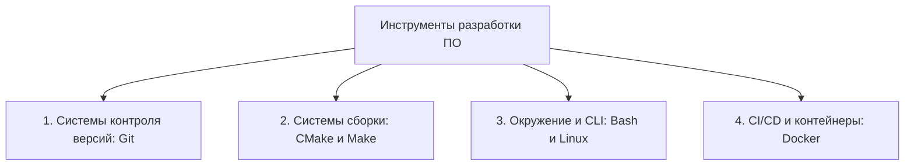
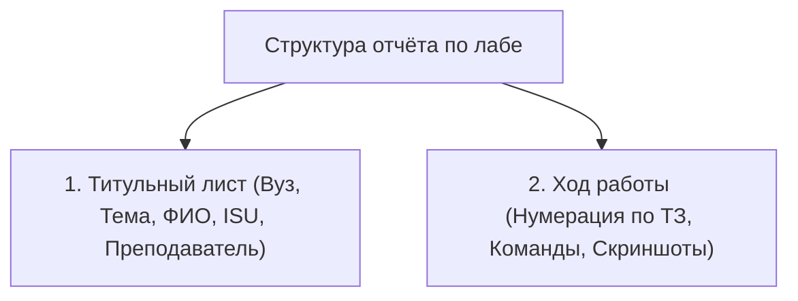

# Инструментальные средства разработки ПО (ИСПРО / ИСРПО)

---

## 1. Информация о курсе

* **Университет:** Университет ИТМО (Санкт-Петербург)
* **Преподаватель:** Повышев Владислав Вячеславович
* **Официальные материалы практик:** [sourcecraft.dev/software-development-tools/practice](https://sourcecraft.dev/software-development-tools/practice?rev=main&clckid=f4d3b050)
* **Методические материалы курса:** [Яндекс Диск](https://disk.yandex.ru/i/u4OEWh9pl1NaNA)

---

## 2. Структура дисциплины

---

## 3. Регламент оформления лабораторных работ

### Формат отчёта
Отчёт формируется в **PDF** и содержит строго два блока:

> [!IMPORTANT]
> В отчёте **не должно быть** разделов «Цель работы», «Задание», «Вывод», «Список литературы». Отчёт должен быть максимально ёмким и технически точным.

---

## 4. Рабочий процесс Git (Git Workflow)

---

## 5. Рекомендуемая литература

* **Скотт Чакон, Бен Страуб — «Pro Git»**  
  *Официальная и наиболее полная книга по архитектуре объектов Git, устройству веток, слияниям и командной работе.*
* **Роберт Мартин — «Чистый код» (Clean Code)**  
  *Стандарты промышленного форматирования, именования функций и проектирования легко поддерживаемых программ.*
* **Brian W. Kernighan, Rob Pike — «The Unix Programming Environment»**  
  *Классическое руководство по работе с командной строкой UNIX/Linux, конвейерами (pipelines) и утилитами POSIX.*
