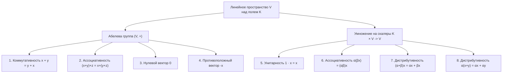

# Лекция 4: Линейные пространства и алгебра матриц

> **Дисциплина**: Линейная алгебра  
> **Лектор**: Факультет КТ / ИСТ, Университет ИТМО (Осенний семестр 2026)  
> **Ключевые темы**: Аксиомы линейного (векторного) пространства над полем $K$, следствия из аксиом, важнейшие примеры ($K^n$, $K[x]$, $M_{m,n}(K)$), прямоугольные матрицы, операции над матрицами, транспонирование и его свойства, умножение матриц («строка на столбец»), ассоциативность умножения, кольцо квадратных матриц $M_n(K)$, некоммутативность, делители нуля и нильпотентность.

---

## 1. Аксиомы линейного пространства

Понятие вектора, интуитивно возникшее в геометрии как «направленный отрезок», в современной высшей алгебре обобщается на любые объекты произвольной природы (числовые наборы, многочлены, функции, матрицы, сигналы), которые можно складывать между собой и умножать на числа (скаляры) с сохранением естественных алгебраических свойств.

> [!NOTE] **Определение 1 (Линейное пространство)**  
> Пусть $K$ — произвольное числовое поле (например, $\mathbb{R}$, $\mathbb{C}$ или $\mathbb{Q}$).  
> **Линейным (векторным) пространством** над полем $K$ называется непустое множество $V$, элементы которого называются **векторами**, снабженное двумя алгебраическими операциями:  
> 1. **Внутренняя операция (сложение векторов)**:  
>    $$+: V \times V \to V, \quad (x, y) \mapsto x + y$$  
> 2. **Внешняя операция (умножение вектора на скаляр поля $K$)**:  
>    $$\cdot: K \times V \to V, \quad (\alpha, x) \mapsto \alpha \cdot x \quad (\text{или просто } \alpha x)$$  
> удовлетворяющими следующим **восьми аксиомам линейного пространства**:

### 1.1. Аксиомы абелевой группы по сложению $(V, +)$
Для любых векторов $x, y, z \in V$:
1. **Коммутативность сложения**:
   $$x + y = y + x$$
2. **Ассоциативность сложения**:
   $$(x + y) + z = x + (y + z)$$
3. **Существование нейтрального элемента по сложению (нулевой вектор)**:
   $$\exists \mathbf{0} \in V \; \forall x \in V:\quad x + \mathbf{0} = x$$
4. **Существование противоположного элемента**:
   $$\forall x \in V \; \exists (-x) \in V:\quad x + (-x) = \mathbf{0}$$

### 1.2. Аксиомы согласования умножения на скаляры
Для любых векторов $x, y \in V$ и любых скаляров $\alpha, \beta \in K$:
5. **Унитарность (свойство единицы поля)**:
   $$1_K \cdot x = x$$
   *(где $1_K$ — мультипликативная единица поля $K$)*
6. **Ассоциативность умножения скаляров на вектор (согласованность)**:
   $$\alpha \cdot (\beta \cdot x) = (\alpha \cdot \beta) \cdot x$$
7. **Дистрибутивность умножения на вектор относительно сложения скаляров**:
   $$(\alpha + \beta) \cdot x = \alpha \cdot x + \beta \cdot x$$
8. **Дистрибутивность умножения на скаляр относительно сложения векторов**:
   $$\alpha \cdot (x + y) = \alpha \cdot x + \alpha \cdot y$$

---

## 2. Фундаментальные следствия из аксиом

Из восьми аксиом строго выводятся свойства, привычные из школьной арифметики, но требующие формального доказательства в абстрактной алгебре.

> [!IMPORTANT] **Теорема 1 (Следствия из аксиом линейного пространства)**  
> Пусть $V$ — линейное пространство над полем $K$. Тогда:  
> 1. Нулевой вектор $\mathbf{0} \in V$ **единственен**.  
> 2. Для каждого вектора $x \in V$ противоположный вектор $-x \in V$ **единственен**.  
> 3. Для любого вектора $x \in V$ умножение на ноль поля дает нулевой вектор: $0_K \cdot x = \mathbf{0}$.  
> 4. Для любого скаляра $\alpha \in K$ умножение на нулевой вектор дает нулевой вектор: $\alpha \cdot \mathbf{0} = \mathbf{0}$.  
> 5. Противоположный вектор равен произведению вектора на элемент $(-1_K)$ поля: $(-1_K) \cdot x = -x$.  
> 6. Произведение $\alpha \cdot x = \mathbf{0}$ тогда и только тогда, когда $\alpha = 0_K$ или $x = \mathbf{0}$.

### Строгие доказательства:

#### 1. Единственность нулевого вектора:
Пусть существуют два нейтральных по сложению элемента: $\mathbf{0}_1$ и $\mathbf{0}_2$.  
Так как $\mathbf{0}_2$ — нейтральный элемент: $\mathbf{0}_1 + \mathbf{0}_2 = \mathbf{0}_1$.  
Так как $\mathbf{0}_1$ — нейтральный элемент: $\mathbf{0}_2 + \mathbf{0}_1 = \mathbf{0}_2$.  
По коммутативности сложения (Аксиома 1): $\mathbf{0}_1 + \mathbf{0}_2 = \mathbf{0}_2 + \mathbf{0}_1$.  
Следовательно: $\mathbf{0}_1 = \mathbf{0}_2$. $\blacksquare$

#### 2. Единственность противоположного вектора:
Пусть для фиксированного вектора $x$ существуют два противоположных: $y_1$ и $y_2$, то есть:
$$x + y_1 = \mathbf{0} \quad \text{и} \quad x + y_2 = \mathbf{0}$$
Рассмотрим элемент $y_1$:
$$y_1 = y_1 + \mathbf{0} = y_1 + (x + y_2) \stackrel{\text{Акс. 2}}{=} (y_1 + x) + y_2 \stackrel{\text{Акс. 1}}{=} (x + y_1) + y_2 = \mathbf{0} + y_2 = y_2$$
Следовательно, $y_1 = y_2$. Противоположный элемент единственен и корректно обозначается $-x$. $\blacksquare$

#### 3. Умножение на ноль поля: $0_K \cdot x = \mathbf{0}$:
В поле $K$ верно: $0_K + 0_K = 0_K$. Умножим обе части на вектор $x$:
$$0_K \cdot x = (0_K + 0_K) \cdot x$$
По свойству дистрибутивности (Аксиома 7):
$$0_K \cdot x = 0_K \cdot x + 0_K \cdot x$$
Прибавим к обеим частям равенства противоположный вектор $-(0_K \cdot x)$:
$$0_K \cdot x + (-(0_K \cdot x)) = (0_K \cdot x + 0_K \cdot x) + (-(0_K \cdot x))$$
Используя ассоциативность и определение противоположного вектора:
$$\mathbf{0} = 0_K \cdot x + (0_K \cdot x + (-(0_K \cdot x))) = 0_K \cdot x + \mathbf{0} = 0_K \cdot x$$
Получаем: $0_K \cdot x = \mathbf{0}$. $\blacksquare$

#### 4. Умножение скаляра на нулевой вектор: $\alpha \cdot \mathbf{0} = \mathbf{0}$:
Вектор удовлетворяет: $\mathbf{0} + \mathbf{0} = \mathbf{0}$. Умножим обе части на $\alpha \in K$:
$$\alpha \cdot \mathbf{0} = \alpha \cdot (\mathbf{0} + \mathbf{0}) \stackrel{\text{Акс. 8}}{=} \alpha \cdot \mathbf{0} + \alpha \cdot \mathbf{0}$$
Прибавляя к обеим частям противоположный вектор $-(\alpha \cdot \mathbf{0})$, аналогично предыдущему пункту получаем: $\alpha \cdot \mathbf{0} = \mathbf{0}$. $\blacksquare$

#### 5. Выражение противоположного вектора: $(-1_K) \cdot x = -x$:
Сложим векторы $x$ и $(-1_K) \cdot x$:
$$x + (-1_K) \cdot x \stackrel{\text{Акс. 5}}{=} 1_K \cdot x + (-1_K) \cdot x \stackrel{\text{Акс. 7}}{=} (1_K + (-1_K)) \cdot x = 0_K \cdot x \stackrel{\text{Пункт 3}}{=} \mathbf{0}$$
Поскольку сумма $x + ((-1_K) \cdot x) = \mathbf{0}$, а противоположный элемент единственен (Пункт 2), отсюда следует, что:
$$(-1_K) \cdot x = -x \quad \blacksquare$$

#### 6. Критерий равенства произведения нулю: $\alpha \cdot x = \mathbf{0} \iff (\alpha = 0_K \lor x = \mathbf{0})$:
- Если $\alpha = 0_K$ или $x = \mathbf{0}$, то по пунктам 3 и 4 произведение равно $\mathbf{0}$.
- Обратно: пусть $\alpha \cdot x = \mathbf{0}$. Если $\alpha = 0_K$, то утверждение доказано. Пусть $\alpha \ne 0_K$. Так как $K$ — поле, для любого ненулевого элемента существует обратный $\alpha^{-1} \in K$. Домножим обе части на $\alpha^{-1}$:
  $$\alpha^{-1} \cdot (\alpha \cdot x) = \alpha^{-1} \cdot \mathbf{0}$$
  Используя аксиому 6 и пункт 4:
  $$(\alpha^{-1} \cdot \alpha) \cdot x = \mathbf{0} \implies 1_K \cdot x = \mathbf{0} \stackrel{\text{Акс. 5}}{\implies} x = \mathbf{0} \quad \blacksquare$$

---

## 3. Важнейшие примеры линейных пространств

### 3.1. Арифметическое линейное пространство $K^n$
Пусть $K$ — поле ($\mathbb{R}, \mathbb{C}, \mathbb{Q}$). Множество $K^n$ состоит из упорядоченных наборов длины $n$:
$$K^n = \{(x_1, x_2, \dots, x_n) \mid x_i \in K\}$$
Операции вводятся **покомпонентно**:
1. Сложение:
   $$(x_1, \dots, x_n) + (y_1, \dots, y_n) = (x_1 + y_1, \dots, x_n + y_n)$$
2. Умножение на скаляр $\alpha \in K$:
   $$\alpha \cdot (x_1, \dots, x_n) = (\alpha x_1, \dots, \alpha x_n)$$
- **Нулевой вектор**: $\mathbf{0} = (0_K, 0_K, \dots, 0_K)$.
- **Противоположный вектор**: $-(x_1, \dots, x_n) = (-x_1, \dots, -x_n)$.
- Все 8 аксиом выполняются автоматически, так как операции сводятся к операциям в поле $K$.  
  Пространство $\mathbb{R}^n$ — стандартная модель аналитической геометрии и машинного обучения.

### 3.2. Пространство многочленов $K[x]$
Множество всех многочленов от переменной $x$ с коэффициентами из поля $K$:
$$p(x) = a_n x^n + a_{n-1} x^{n-1} + \dots + a_1 x + a_0, \quad a_i \in K$$
- Сложение: сложение функций (приведение подобных членов).
- Умножение на скаляр: умножение каждого коэффициента на $\alpha \in K$.
- Нулевой вектор — нулевой многочлен $0$.
- Пространство $K[x]$ является **бесконечномерным линейным пространством**.
- Подмножество $K_{\le n}[x]$ многочленов степени не выше $n$ образует конечномерное линейное пространство размерности $n + 1$ (с базисом $\{1, x, x^2, \dots, x^n\}$).

### 3.3. Пространство прямоугольных матриц $M_{m, n}(K)$
Таблицы элементов поля $K$ размера $m \times n$ с операциями поэлементного сложения и умножения на скаляр (подробно исследовано в следующем разделе).

### 3.4. Пространство функций $\mathcal{F}(X, K)$
Множество всех функций $f: X \to K$, где $X$ — произвольное непустое множество.
$$(f + g)(x) = f(x) + g(x), \qquad (\alpha \cdot f)(x) = \alpha \cdot f(x)$$
*Частный случай*: пространство непрерывных на отрезке функций $C([a, b])$ над полем $\mathbb{R}$.

---

## 4. Прямоугольные матрицы над полем $K$

### 4.1. Определение матрицы

> [!NOTE] **Определение 2 (Прямоугольная матрица)**  
> **Прямоугольной матрицей размера $m \times n$** над полем $K$ называется таблица элементов поля $K$, состоящая из $m$ строк и $n$ столбцов ($m, n \in \mathbb{N}$).  
> Множество всех таких матриц обозначается $M_{m, n}(K)$ или $K^{m \times n}$.  
> Если $m = n$, матрица называется **квадратной порядка $n$** ($M_n(K)$).

Матрицы обозначаются заглавными латинскими буквами ($A, B, C$), а их элементы — строчными буквами с двумя индексами $a_{ij}$, где:
- $i \in \{1, 2, \dots, m\}$ — номер строки;
- $j \in \{1, 2, \dots, n\}$ — номер столбца.

Схематическая запись:
$$A = (a_{ij})_{m \times n} = \begin{pmatrix}
a_{11} & a_{12} & \cdots & a_{1n} \\
a_{21} & a_{22} & \cdots & a_{2n} \\
\vdots & \vdots & \ddots & \vdots \\
a_{m1} & a_{m2} & \cdots & a_{mn}
\end{pmatrix}$$

---

### 4.2. Линейные операции над матрицами

В множестве $M_{m, n}(K)$ вводятся две линейные операции:

1. **Сложение матриц одинакового размера**:  
   Для $A, B \in M_{m, n}(K)$ сумма $C = A + B \in M_{m, n}(K)$ определяется **поэлементно**:
   $$c_{ij} = a_{ij} + b_{ij} \quad \forall i = 1, \dots, m, \; j = 1, \dots, n$$
2. **Умножение матрицы на скаляр поля $K$**:  
   Для $A \in M_{m, n}(K)$ и $\alpha \in K$ матрица $\alpha A \in M_{m, n}(K)$ определяется **поэлементно**:
   $$(\alpha A)_{ij} = \alpha \cdot a_{ij} \quad \forall i = 1, \dots, m, \; j = 1, \dots, n$$

> [!IMPORTANT] **Теорема 2 (Линейное пространство матриц)**  
> Множество матриц $M_{m, n}(K)$ с операциями поэлементного сложения и умножения на скаляр образует **линейное пространство над полем $K$**.  
> - Нулевым элементом пространства является **нулевая матрица** $O_{m, n}$, все элементы которой равны нулю ($o_{ij} = 0_K$).  
> - Противоположной матрицей к $A = (a_{ij})$ является матрица $-A = (-a_{ij})$.  
> - Размерность этого пространства равна $m \cdot n$.

---

## 5. Транспонирование матриц

> [!NOTE] **Определение 3 (Транспонированная матрица)**  
> Пусть $A = (a_{ij}) \in M_{m, n}(K)$. **Транспонированной матрицей** называется матрица $A^T \in M_{n, m}(K)$, полученная заменой строк матрицы $A$ ее столбцами с сохранением их номеров:  
> $$(A^T)_{ij} = a_{ji} \quad \forall i = 1, \dots, n, \; j = 1, \dots, m$$

*Пример*:
$$A = \begin{pmatrix} 1 & 2 & 3 \\ 4 & 5 & 6 \end{pmatrix}_{2 \times 3} \implies A^T = \begin{pmatrix} 1 & 4 \\ 2 & 5 \\ 3 & 6 \end{pmatrix}_{3 \times 2}$$

### 5.1. Свойства операции транспонирования
Для любых матриц соответствующих размеров и любого скаляра $\alpha \in K$:
1. **Инволютивность (двойное транспонирование)**:
   $$(A^T)^T = A$$
2. **Линейность по сложению**:
   $$(A + B)^T = A^T + B^T$$
3. **Согласованность со скаляром**:
   $$(\alpha A)^T = \alpha A^T$$
4. **Антигомоморфизм порядка произведения**:
   $$(AB)^T = B^T A^T$$
   *(при умножении порядок сомножителей меняется на противоположный!)*

### 5.2. Симметричные и кососимметричные матрицы
Для квадратных матриц $A \in M_n(K)$:
- Матрица называется **симметричной**, если $A^T = A$ (то есть $a_{ij} = a_{ji}$).
- Матрица называется **кососимметричной (антисимметричной)**, если $A^T = -A$ (то есть $a_{ij} = -a_{ji}$; в частности, на главной диагонали $a_{ii} = 0$).

> [!TIP] **Теорема о разложении квадратной матрицы**  
> Если характеристика поля $\mathrm{char} K \ne 2$ (например, для $K = \mathbb{R}$ или $\mathbb{C}$), любую квадратную матрицу $A$ можно единственным образом представить в виде суммы симметричной матрицы $S$ и кососимметричной матрицы $K$:  
> $$A = \underbrace{\frac{A + A^T}{2}}_{S = S^T} \;+\; \underbrace{\frac{A - A^T}{2}}_{K = -K^T}$$

---

## 6. Умножение матриц

Операция умножения матриц отражает композицию соответствующих линейных отображений и кардинально отличается от поэлементных операций.

> [!NOTE] **Определение 4 (Произведение матриц)**  
> Умножение матрицы $A$ на матрицу $B$ определено тогда и только тогда, когда **число столбцов матрицы $A$ равно числу строк матрицы $B$** (согласованные размеры):  
> $$A \in M_{m, n}(K), \quad B \in M_{n, p}(K)$$  
> **Произведением матриц** $A$ и $B$ называется матрица $C = AB \in M_{m, p}(K)$, каждый элемент которой вычисляется по правилу **«строка на столбец»**:  
> $$c_{ij} = \sum_{k=1}^n a_{ik} b_{kj} = a_{i1} b_{1j} + a_{i2} b_{2j} + \dots + a_{in} b_{nj}$$  
> для всех $i = 1, \dots, m$ и $j = 1, \dots, p$.

### 6.1. Наглядная схема правила «строка на столбец»

Элемент $c_{ij}$, стоящий на пересечении $i$-й строки и $j$-го столбца матрицы-произведения, равен скалярному произведению $i$-й строки матрицы $A$ на $j$-й столбец матрицы $B$:

$$\begin{pmatrix}
\cdots & \cdots & \cdots \\
a_{i1} & a_{i2} & a_{in} \\
\cdots & \cdots & \cdots
\end{pmatrix}
\begin{pmatrix}
\vdots & b_{1j} & \vdots \\
\vdots & b_{2j} & \vdots \\
\vdots & b_{nj} & \vdots
\end{pmatrix}
=
\begin{pmatrix}
& \vdots & \\
\cdots & c_{ij} & \cdots \\
& \vdots &
\end{pmatrix}$$

### 6.2. Фундаментальные свойства умножения матриц
Пусть матрицы имеют согласованные размеры, $\alpha \in K$:
1. **Ассоциативность**:
   $$(AB)C = A(BC)$$
2. **Дистрибутивность относительно сложения**:
   $$A(B + C) = AB + AC \quad \text{и} \quad (A + B)C = AC + BC$$
3. **Согласованность с умножением на скаляр**:
   $$\alpha (AB) = (\alpha A)B = A(\alpha B)$$
4. **Существование единичной матрицы**:  
   Для любой матрицы $A \in M_{m, n}(K)$:
   $$I_m A = A = A I_n$$
   где $I_n$ — **единичная матрица порядка $n$**:
   $$I_n = \begin{pmatrix} 1 & 0 & \cdots & 0 \\ 0 & 1 & \cdots & 0 \\ \vdots & \vdots & \ddots & \vdots \\ 0 & 0 & \cdots & 1 \end{pmatrix} = (\delta_{ij})_{n \times n}, \quad \delta_{ij} = \begin{cases} 1, & i = j \\ 0, & i \ne j \end{cases}$$

#### Строгое доказательство ассоциативности умножения матриц:
Пусть $A \in M_{m, n}(K)$, $B \in M_{n, p}(K)$, $C \in M_{p, q}(K)$.  
Рассмотрим элемент матрицы $(AB)C$ с индексами $(i, l)$, где $1 \le i \le m$, $1 \le l \le q$:
$$[ (AB)C ]_{il} = \sum_{j=1}^p [AB]_{ij} \cdot c_{jl} = \sum_{j=1}^p \left( \sum_{k=1}^n a_{ik} b_{kj} \right) c_{jl}$$
По дистрибутивности и ассоциативности операций в поле $K$:
$$[ (AB)C ]_{il} = \sum_{j=1}^p \sum_{k=1}^n a_{ik} b_{kj} c_{jl} = \sum_{k=1}^n a_{ik} \left( \sum_{j=1}^p b_{kj} c_{jl} \right) = \sum_{k=1}^n a_{ik} [BC]_{kl} = [ A(BC) ]_{il}$$
Так как элементы совпадают для всех $i$ и $l$, матрицы тождественно равны: $(AB)C = A(BC)$. $\blacksquare$

---

## 7. Кольцо квадратных матриц $M_n(K)$

Если зафиксировать размер $m = n$, то на множестве $M_n(K)$ определены операции сложения и умножения, не выводящие за пределы множества (замкнутость).

> [!NOTE] **Определение 5 (Кольцо матриц)**  
> Множество квадратных матриц $M_n(K)$ относительно операций сложения и умножения образует **ассоциативное кольцо с единицей $I_n$** (а также ассоциативную алгебру над полем $K$).

Однако алгебраическая структура кольца $M_n(K)$ при $n \ge 2$ кардинально отличается от привычных числовых полей ($\mathbb{R}, \mathbb{C}$):

### 7.1. Некоммутативность умножения
В общем случае для матриц $A, B \in M_n(K)$ ($n \ge 2$):
$$AB \ne BA$$

*Конкретный контрпример ($n = 2$)*:
$$A = \begin{pmatrix} 0 & 1 \\ 0 & 0 \end{pmatrix}, \qquad B = \begin{pmatrix} 0 & 0 \\ 1 & 0 \end{pmatrix}$$
Вычислим произведения:
$$AB = \begin{pmatrix} 0 & 1 \\ 0 & 0 \end{pmatrix} \begin{pmatrix} 0 & 0 \\ 1 & 0 \end{pmatrix} = \begin{pmatrix} 1 & 0 \\ 0 & 0 \end{pmatrix}$$
$$BA = \begin{pmatrix} 0 & 0 \\ 1 & 0 \end{pmatrix} \begin{pmatrix} 0 & 1 \\ 0 & 0 \end{pmatrix} = \begin{pmatrix} 0 & 0 \\ 0 & 1 \end{pmatrix}$$
Очевидно, что $AB \ne BA$!

---

### 7.2. Делители нуля (Zero Divisors)

В числовых полях действует правило: если $a \cdot b = 0$, то либо $a = 0$, либо $b = 0$.  
В кольцах матриц $M_n(K)$ ($n \ge 2$) **это правило грубо нарушается**!

> [!WARNING] **Определение 6 (Делители нуля)**  
> Ненулевая матрица $A \ne O$ называется **делителем нуля**, если существует ненулевая матрица $B \ne O$, такая что:  
> $$AB = O \quad \text{или} \quad BA = O$$

*Пример делителей нуля*:
Возьмем матрицы:
$$A = \begin{pmatrix} 1 & 0 \\ 0 & 0 \end{pmatrix} \ne O, \qquad B = \begin{pmatrix} 0 & 0 \\ 0 & 1 \end{pmatrix} \ne O$$
Их произведение:
$$AB = \begin{pmatrix} 1 & 0 \\ 0 & 0 \end{pmatrix} \begin{pmatrix} 0 & 0 \\ 0 & 1 \end{pmatrix} = \begin{pmatrix} 0 & 0 \\ 0 & 0 \end{pmatrix} = O$$
Произведение двух ненулевых матриц дало строго нулевую матрицу!

---

### 7.3. Нильпотентные матрицы

> [!NOTE] **Определение 7 (Нильпотентная матрица)**  
> Матрица $N \in M_n(K)$ называется **нильпотентной**, если существует натуральное число $k \in \mathbb{N}$, такое что:  
> $$N^k = O$$  
> Наименьшее такое $k$ называется **индексом нильпотентности**.

*Пример нильпотентной матрицы индекса 2*:
$$N = \begin{pmatrix} 0 & 1 \\ 0 & 0 \end{pmatrix} \ne O$$
$$N^2 = \begin{pmatrix} 0 & 1 \\ 0 & 0 \end{pmatrix} \begin{pmatrix} 0 & 1 \\ 0 & 0 \end{pmatrix} = \begin{pmatrix} 0 & 0 \\ 0 & 0 \end{pmatrix} = O$$

*Пример нильпотентной матрицы индекса 3 в $M_3(K)$ (строго верхнетреугольная матрица)*:
$$N = \begin{pmatrix} 0 & 1 & 0 \\ 0 & 0 & 1 \\ 0 & 0 & 0 \end{pmatrix}, \quad N^2 = \begin{pmatrix} 0 & 0 & 1 \\ 0 & 0 & 0 \\ 0 & 0 & 0 \end{pmatrix}, \quad N^3 = \begin{pmatrix} 0 & 0 & 0 \\ 0 & 0 & 0 \\ 0 & 0 & 0 \end{pmatrix} = O$$

> [!IMPORTANT] **Критерий обратимости матриц**  
> В силу наличия делителей нуля не всякая ненулевая матрица обладает обратной.  
> Матрица $A \in M_n(K)$ **обратима** (существует $A^{-1}$, такая что $A A^{-1} = A^{-1} A = I_n$) тогда и только тогда, когда ее определитель отличен от нуля: $\det A \ne 0_K$.  
> Множество всех обратимых матриц образует группу относительно умножения — **общую линейную группу** $GL_n(K)$.

---

## 8. Сводная сравнительная таблица структур

| Свойство | Поле скаляров $K$ ($\mathbb{R}, \mathbb{C}$) | Пространство векторов $K^n$ | Кольцо матриц $M_n(K)$ ($n \ge 2$) |
| :--- | :--- | :--- | :--- |
| **Сложение** | Абелева группа | Абелева группа | Абелева группа |
| **Умножение элементов** | Поле (коммутативно) | Только скалярное произведение ($V \times V \to K$) | Замкнутое кольцо матриц |
| **Коммутативность умножения** | Всегда: $ab = ba$ | — | **Ложно**: $AB \ne BA$ |
| **Делители нуля** | Отсутствуют ($ab = 0 \implies a=0 \lor b=0$) | — | **Существуют**: $A \ne 0, B \ne 0 \implies AB = 0$ |
| **Нильпотентные элементы** | Только 0 | — | **Существуют**: $N^k = 0$ при $N \ne 0$ |
| **Обратный элемент по умножению** | Существует для всех $a \ne 0$ | — | Существует только для $\det A \ne 0$ |
