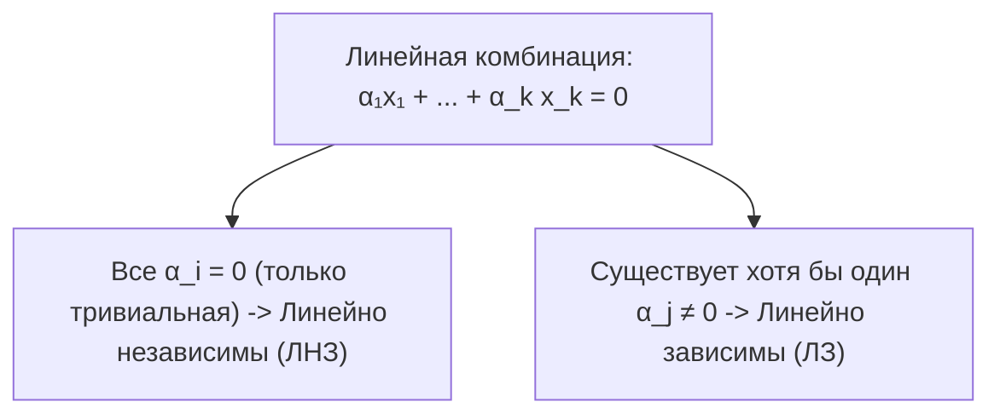
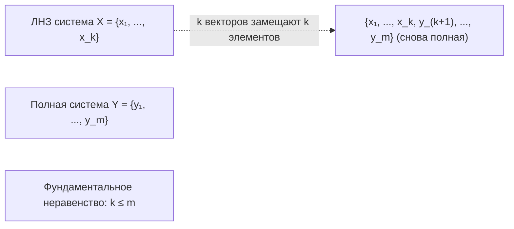

# Лекция 5: Линейная зависимость, подпространства и лемма Штейница о замещении

> **Дисциплина**: Линейная алгебра  
> **Лектор**: Факультет КТ / ИСТ, Университет ИТМО (Осенний семестр 2026)  
> **Ключевые темы**: Линейные комбинации, тривиальные и нетривиальные комбинации, линейная зависимость и независимость, критерий линейной зависимости, свойства систем векторов, линейные подпространства и их критерий, линейная оболочка ($\operatorname{span}$), полные системы (порождающие множества), теорема о замещении (лемма Штейница), базис и размерность конечномерного пространства.

---

## 1. Линейные комбинации векторов

Пусть $V$ — линейное (векторное) пространство над произвольным числовым полем $K$ ($\mathbb{R}, \mathbb{C}, \mathbb{Q}$).

> [!NOTE] **Определение 1 (Линейная комбинация)**  
> Пусть $x_1, x_2, \dots, x_k \in V$ — система векторов, а $\alpha_1, \alpha_2, \dots, \alpha_k \in K$ — скаляры из поля $K$.  
> **Линейной комбинацией** векторов $x_1, \dots, x_k$ с коэффициентами $\alpha_1, \dots, \alpha_k$ называется вектор:  
> $$v = \sum_{i=1}^k \alpha_i x_i = \alpha_1 x_1 + \alpha_2 x_2 + \dots + \alpha_k x_k \in V$$  
> Числа $\alpha_1, \dots, \alpha_k$ называются **коэффициентами** линейной комбинации.

Линейная комбинация называется:
- **Тривиальной**, если **все** её коэффициенты равны нулю:
  $$\alpha_1 = \alpha_2 = \dots = \alpha_k = 0_K$$
  Значение любой тривиальной линейной комбинации тождественно равно нулевому вектору: $\sum_{i=1}^k 0_K \cdot x_i = \mathbf{0}$.
- **Нетривиальной**, если **хотя бы один** из её коэффициентов отличен от нуля:
  $$\exists j \in \{1, \dots, k\} : \alpha_j \ne 0_K$$

---

## 2. Линейная зависимость и независимость

Центральный вопрос линейной алгебры: может ли нетривиальная линейная комбинация векторов обратиться в нулевой вектор?

### 2.1. Определения

> [!NOTE] **Определение 2 (Линейная независимость)**  
> Система векторов $\{x_1, x_2, \dots, x_k\} \subset V$ называется **линейно независимой** (ЛНЗ), если равенство её линейной комбинации нулевому вектору:  
> $$\alpha_1 x_1 + \alpha_2 x_2 + \dots + \alpha_k x_k = \mathbf{0}$$  
> возможно **только тогда, когда комбинация тривиальна**:  
> $$\alpha_1 = \alpha_2 = \dots = \alpha_k = 0_K$$

> [!NOTE] **Определение 3 (Линейная зависимость)**  
> Система векторов $\{x_1, x_2, \dots, x_k\} \subset V$ называется **линейно зависимой** (ЛЗ), если существует **нетривиальная** линейная комбинация этих векторов, равная нулевому вектору:  
> $$\exists (\alpha_1, \dots, \alpha_k) \ne (0, \dots, 0) : \quad \sum_{i=1}^k \alpha_i x_i = \mathbf{0}$$

---

### 2.2. Критерий линейной зависимости

> [!IMPORTANT] **Теорема 1 (Критерий линейной зависимости)**  
> Система векторов $\{x_1, x_2, \dots, x_k\}$ ($k \ge 2$) линейно зависима тогда и только тогда, когда **хотя бы один из векторов системы является линейной комбинацией остальных векторов**.

#### Строгое доказательство:
1. **Необходимость ($\implies$)**:  
   Пусть система $\{x_1, \dots, x_k\}$ линейно зависима. По Определению 3 найдутся коэффициенты $\alpha_1, \dots, \alpha_k$, не все равные нулю, такие что:
   $$\alpha_1 x_1 + \alpha_2 x_2 + \dots + \alpha_k x_k = \mathbf{0}$$
   Пусть $\alpha_j \ne 0_K$ для некоторого индекса $j \in \{1, \dots, k\}$.  
   Так как $K$ — поле, существует обратный элемент $\alpha_j^{-1} \in K$.  
   Перенесем слагаемое $\alpha_j x_j$ в правую часть:
   $$\alpha_j x_j = -\sum_{i \ne j} \alpha_i x_i = \sum_{i \ne j} (-\alpha_i) x_i$$
   Домножим обе части на $\alpha_j^{-1}$:
   $$x_j = \sum_{i \ne j} \left( -\frac{\alpha_i}{\alpha_j} \right) x_i$$
   Вектор $x_j$ выражен в виде линейной комбинации остальных векторов системы.

2. **Достаточность ($\impliedby$)**:  
   Пусть один из векторов, скажем $x_j$, выражается через остальные:
   $$x_j = \sum_{i \ne j} \beta_i x_i$$
   Перенесем $x_j$ в правую часть:
   $$\sum_{i \ne j} \beta_i x_i + (-1_K) x_j = \mathbf{0}$$
   В этой линейной комбинации коэффициент при векторе $x_j$ равен $-1_K \ne 0_K$.  
   Следовательно, получена нетривиальная линейная комбинация, равная $\mathbf{0}$.  
   Значит, система линейно зависима. $\blacksquare$

---

### 2.3. Геометрические и практические примеры

#### Пример 1: Коллинеарность в $\mathbb{R}^2$
Пусть $x_1 = (2, -4)^T$ и $x_2 = (-6, 12)^T$.  
Заметим, что:
$$x_2 = -3 \cdot x_1 \iff 3 x_1 + 1 \cdot x_2 = \mathbf{0}$$
Коэффициенты $(3, 1) \ne (0, 0)$. Векторы пропорциональны (коллинеарны), система $\{x_1, x_2\}$ линейно зависима.

#### Пример 2: Пространство многочленов $\mathbb{R}[x]$
Рассмотрим систему многочленов $\{1, x, x^2\}$.  
Пусть $\alpha_0 \cdot 1 + \alpha_1 \cdot x + \alpha_2 \cdot x^2 = 0$ (тождественно нулевой многочлен).  
Многочлен степени $\le 2$ тождественно равен нулю тогда и только тогда, когда все его коэффициенты равны нулю: $\alpha_0 = \alpha_1 = \alpha_2 = 0$.  
Следовательно, система $\{1, x, x^2\}$ строго **линейно независима**.

---

### 2.4. Фундаментальные свойства линейной зависимости и независимости

> [!IMPORTANT] **Теорема 2 (Свойства систем векторов)**  
> 1. **Свойство нулевого вектора**: если система векторов содержит нулевой вектор $\mathbf{0}$, то она линейно зависима.  
> 2. **Свойство одного вектора**: система из одного вектора $\{x\}$ линейно зависима $\iff x = \mathbf{0}$. Система $\{x\}$ линейно независима $\iff x \ne \mathbf{0}$.  
> 3. **Свойство подсистемы (расширение зависимости)**: если некоторая подсистема данной системы векторов линейно зависима, то и вся система линейно зависима.  
> 4. **Свойство сужения независимости**: если система векторов линейно независима, то любая её подсистема также линейно независима.  
> 5. **Лемма о добавлении вектора**: если система $\{x_1, \dots, x_k\}$ линейно независима, а система $\{x_1, \dots, x_k, y\}$ линейно зависима, то вектор $y$ однозначно выражается в виде линейной комбинации векторов $x_1, \dots, x_k$.

#### Строгие доказательства:
1. **Пункт 1**: Пусть $\mathbf{0} \in \{x_1, \dots, x_k\}$, например, $x_1 = \mathbf{0}$.  
   Тогда составим комбинацию: $1_K \cdot x_1 + 0 \cdot x_2 + \dots + 0 \cdot x_k = 1_K \cdot \mathbf{0} = \mathbf{0}$.  
   Коэффициент при $x_1$ равен $1 \ne 0$, комбинация нетривиальна $\implies$ система ЛЗ. $\blacksquare$

2. **Пункт 3**: Пусть исходная система $S = \{x_1, \dots, x_k, x_{k+1}, \dots, x_m\}$, и ее подсистема $S' = \{x_1, \dots, x_k\}$ ЛЗ.  
   Тогда существуют не все равные нулю $\alpha_1, \dots, \alpha_k$, такие что $\sum_{i=1}^k \alpha_i x_i = \mathbf{0}$.  
   Дополним эту комбинацию нулевыми коэффициентами для остальных векторов:
   $$\alpha_1 x_1 + \dots + \alpha_k x_k + 0 \cdot x_{k+1} + \dots + 0 \cdot x_m = \mathbf{0} + \mathbf{0} = \mathbf{0}$$
   В расширенной комбинации набор коэффициентов $(\alpha_1, \dots, \alpha_k, 0, \dots, 0)$ содержит ненулевые элементы. Значит, вся система $S$ линейно зависима. $\blacksquare$

3. **Пункт 4**: Является прямым следствием пункта 3 методом контрапозиции: если бы у независимой системы существовала зависимая подсистема, то по пункту 3 вся система была бы зависима — противоречие. $\blacksquare$

4. **Пункт 5**: По условию $\{x_1, \dots, x_k, y\}$ ЛЗ, то есть существуют скаляры $\alpha_1, \dots, \alpha_k, \beta$, не все равные нулю, такие что:
   $$\alpha_1 x_1 + \dots + \alpha_k x_k + \beta y = \mathbf{0}$$
   Если бы $\beta = 0$, то получили бы нетривиальную комбинацию $\alpha_1 x_1 + \dots + \alpha_k x_k = \mathbf{0}$, что невозможно ввиду линейной независимости $\{x_1, \dots, x_k\}$.  
   Следовательно, $\beta \ne 0$. Деля на $-\beta$, выражаем $y$:
   $$y = \sum_{i=1}^k \left(-\frac{\alpha_i}{\beta}\right) x_i \quad \blacksquare$$

---

## 3. Линейные подпространства

### 3.1. Определение и критерий подпространства

> [!NOTE] **Определение 4 (Линейное подпространство)**  
> Непустое подмножество $L \subseteq V$ линейного пространства $V$ над полем $K$ называется **линейным подпространством** (обозначается $L \le V$), если $L$ само является линейным пространством над тем же полем $K$ относительно индуцированных операций сложения и умножения на скаляр.

Вместо проверки всех 8 аксиом пространства используется фундаментальный критерий замкнутости:

> [!IMPORTANT] **Теорема 3 (Критерий линейного подпространства)**  
> Непустое подмножество $L \subseteq V$ является линейным подпространством тогда и только тогда, когда выполнены следующие два условия замкнутости:  
> 1. **Замкнутость относительно сложения**:  
>    $$\forall x, y \in L \implies x + y \in L$$  
> 2. **Замкнутость относительно умножения на скаляр**:  
>    $$\forall \alpha \in K, \; \forall x \in L \implies \alpha \cdot x \in L$$  
> *(Эквивалентная формулировка в одно действие)*:  
> $$\forall \alpha, \beta \in K, \; \forall x, y \in L \implies \alpha x + \beta y \in L$$

#### Доказательство:
- **Необходимость ($\implies$)**: По определению линейного пространства операции $+: L \times L \to L$ и $\cdot: K \times L \to L$ не выводят за пределы $L$.
- **Достаточность ($\impliedby$)**:
  1. Аксиомы коммутативности, ассоциативности и дистрибутивностей (аксиомы 1, 2, 5, 6, 7, 8) наследуются автоматически, так как они выполнены для всех элементов объемлющего пространства $V$.
  2. Проверим существование нулевого вектора: так как $L \ne \emptyset$, существует хотя бы один вектор $x \in L$. По условию 2 при $\alpha = 0_K$ получаем $0_K \cdot x = \mathbf{0} \in L$. Нейтральный элемент принадлежит $L$.
  3. Проверим существование противоположного вектора: для любого $x \in L$ положим $\alpha = -1_K \in K$. По условию 2 $(-1_K) \cdot x = -x \in L$.  
  Все 8 аксиом линейного пространства выполнены в $L$. $\blacksquare$

---

## 4. Линейная оболочка и полные системы

### 4.1. Линейная оболочка ($\operatorname{span}$)

> [!NOTE] **Определение 5 (Линейная оболочка / Span)**  
> Пусть $S = \{x_1, x_2, \dots, x_k\} \subset V$ — произвольное подмножество векторов.  
> **Линейной оболочкой** системы $S$ (обозначается $\operatorname{span}(S)$, $\operatorname{Lin}(S)$ или $\langle x_1, \dots, x_k \rangle$) называется множество **всех возможных линейных комбинаций** этих векторов:  
> $$\operatorname{span}(x_1, \dots, x_k) = \left\{ \sum_{i=1}^k \alpha_i x_i \;\Bigg|\; \alpha_i \in K \right\}$$

> [!IMPORTANT] **Свойства линейной оболочки**  
> 1. $\operatorname{span}(S)$ является линейным подпространством в $V$.  
> 2. $\operatorname{span}(S)$ — **наименьшее** по включению линейное подпространство, содержащее множество $S$.  
> 3. Если вектор $y \in \operatorname{span}(S)$, то $\operatorname{span}(S \cup \{y\}) = \operatorname{span}(S)$ (добавление зависимого вектора не увеличивает оболочку).

---

### 4.2. Полная система векторов (порождающее множество)

> [!NOTE] **Определение 6 (Полная система векторов)**  
> Система векторов $Y = \{y_1, y_2, \dots, y_m\} \subset V$ называется **полной** (или **порождающей системой**, системой образующих пространства $V$), если её линейная оболочка совпадает со всем пространством $V$:  
> $$\operatorname{span}(y_1, y_2, \dots, y_m) = V$$  
> Иными словами, любой вектор $v \in V$ может быть представлен в виде линейной комбинации векторов системы $Y$.

Линейное пространство $V$ называется **конечномерным**, если в нем существует конечная полная система векторов.

---

## 5. Связь между полными и линейно независимыми системами: Лемма Штейница о замещении

Фундаментальный мост между линейной независимостью и порождающими множествами задается классической **леммой Штейница о замещении** (Steinitz exchange lemma, 1913).

> [!IMPORTANT] **Теорема 4 (Лемма Штейница о замещении)**  
> Пусть $V$ — линейное пространство над полем $K$.  
> Пусть $X = \{x_1, x_2, \dots, x_k\} \subset V$ — **линейно независимая** система векторов,  
> а $Y = \{y_1, y_2, \dots, y_m\} \subset V$ — **полная** система векторов ($\operatorname{span}(Y) = V$).  
> Тогда:  
> 1. Число векторов в независимой системе **не превосходит** числа векторов в полной системе:  
>    $$k \le m$$  
> 2. Векторами системы $X$ можно последовательно заменить $k$ векторов системы $Y$ так, что полученная система из $m$ векторов останется полной.

---

### 5.1. Полное строгое доказательство леммы Штейница

Доказательство проведем методом математической индукции по размеру линейно независимой системы $k$.

#### База индукции ($k = 1$):
Пусть дана система из одного вектора $\{x_1\}$.  
Так как $X$ линейно независима, вектор $x_1 \ne \mathbf{0}$.  
Так как система $Y = \{y_1, \dots, y_m\}$ полна, вектор $x_1$ раскладывается по ней:
$$x_1 = \alpha_1 y_1 + \alpha_2 y_2 + \dots + \alpha_m y_m$$
Так как $x_1 \ne \mathbf{0}$, хотя бы один из коэффициентов $\alpha_j \ne 0_K$. Не умаляя общности (перенумеровав при необходимости векторы $Y$), будем считать, что $\alpha_1 \ne 0$.  
Тогда выразим вектор $y_1$ через $x_1$ и остальные $y_j$:
$$y_1 = \frac{1}{\alpha_1} x_1 - \sum_{j=2}^m \frac{\alpha_j}{\alpha_1} y_j$$
Следовательно, $y_1 \in \operatorname{span}(x_1, y_2, \dots, y_m)$.  
Так как все остальные $y_2, \dots, y_m$ тривиально лежат в этой оболочке, то:
$$V = \operatorname{span}(y_1, y_2, \dots, y_m) \subseteq \operatorname{span}(x_1, y_2, \dots, y_m) \subseteq V$$
Мы заменили вектор $y_1$ на $x_1$, и новая система $\{x_1, y_2, \dots, y_m\}$ осталась полной.  
Так как $x_1 \ne \mathbf{0}$, среди векторов $Y$ нашёлся хотя бы один ($m \ge 1$), поэтому $k = 1 \le m$. База доказана.

---

#### Индукционный переход ($k \to k + 1$):
**Предположение индукции**: пусть для независимой системы из $k$ векторов $\{x_1, \dots, x_k\}$ доказано, что $k \le m$, и в системе $Y$ можно заменить $k$ векторов (пусть первых $k$ векторов) на $x_1, \dots, x_k$, так что система:
$$Y_k = \{x_1, x_2, \dots, x_k, y_{k+1}, \dots, y_m\}$$
является полной в $V$.

**Шаг индукции**: пусть теперь дана независимая система $\{x_1, \dots, x_k, x_{k+1}\}$.  
Предположим от противного, что $k = m$ (то есть независимых векторов оказалось строго больше, чем исходных образующих: $k + 1 > m$).  
Тогда на шаге $k$ все векторы $Y$ уже заменены, и система $Y_m = \{x_1, \dots, x_m\}$ сама является полной системой ($V = \operatorname{span}(x_1, \dots, x_m)$).  
Но тогда вектор $x_{k+1} = x_{m+1} \in V$ обязан раскладываться по этой системе:
$$x_{m+1} = \beta_1 x_1 + \dots + \beta_m x_m$$
Перенося $x_{m+1}$ в левую часть, получаем нетривиальную линейную комбинацию:
$$\beta_1 x_1 + \dots + \beta_m x_m - 1_K \cdot x_{m+1} = \mathbf{0}$$
Это означает, что система $\{x_1, \dots, x_m, x_{m+1}\}$ линейно зависима, что напрямую **противоречит** её исходной линейной независимости!  
Следовательно, предположение $k = m$ неверно, и обязательно:
$$k < m \iff k + 1 \le m$$

Осталось показать шаг замещения для вектора $x_{k+1}$.  
Так как система $Y_k = \{x_1, \dots, x_k, y_{k+1}, \dots, y_m\}$ полна, разложим $x_{k+1}$ по ней:
$$x_{k+1} = \gamma_1 x_1 + \dots + \gamma_k x_k + \delta_{k+1} y_{k+1} + \dots + \delta_m y_m$$
Хотя бы один из коэффициентов $\delta_j$ ($j \in \{k+1, \dots, m\}$) обязан быть **отличен от нуля**.  
*(Действительно, если бы все $\delta_{k+1} = \dots = \delta_m = 0$, то $x_{k+1}$ выражался бы только через $x_1, \dots, x_k$, что противоречит линейной независимости системы $X$)*.  
Пусть (перенумеровав оставшиеся $y$) $\delta_{k+1} \ne 0_K$.  
Тогда выражаем $y_{k+1}$:
$$y_{k+1} = \frac{1}{\delta_{k+1}} x_{k+1} - \sum_{i=1}^k \frac{\gamma_i}{\delta_{k+1}} x_i - \sum_{j=k+2}^m \frac{\delta_j}{\delta_{k+1}} y_j$$
Значит, $y_{k+1} \in \operatorname{span}(x_1, \dots, x_k, x_{k+1}, y_{k+2}, \dots, y_m)$.  
Новая система $Y_{k+1} = \{x_1, \dots, x_k, x_{k+1}, y_{k+2}, \dots, y_m\}$ содержит $k+1$ векторов из $X$ и является полной в $V$.  
Индукционный переход полностью доказан. $\blacksquare$

---

## 6. Базис и размерность линейного пространства

Лемма Штейница лежит в основе строгого фундамента понятий базиса и размерности.

### 6.1. Понятие базиса

> [!NOTE] **Определение 7 (Базис)**  
> Система векторов $B = \{e_1, e_2, \dots, e_n\} \subset V$ называется **базисом** линейного пространства $V$, если выполнены два равносильных условия:  
> 1. $B$ линейно независима и полна ($\operatorname{span}(B) = V$);  
> 2. Каждый вектор $v \in V$ **единственным образом** представляется в виде линейной комбинации векторов базиса:  
>    $$v = \sum_{i=1}^n \lambda_i e_i = \lambda_1 e_1 + \dots + \lambda_n e_n$$  
> Коэффициенты $(\lambda_1, \dots, \lambda_n)$ называются **координатами** вектора $v$ в базисе $B$.

---

### 6.2. Теорема об инвариантности размерности

> [!IMPORTANT] **Теорема 5 (О числе элементов в базисе)**  
> В любом конечномерном линейном пространстве $V$ **все базисы содержат одинаковое количество векторов**.

#### Строгое доказательство:
Пусть $B_1 = \{e_1, \dots, e_n\}$ и $B_2 = \{f_1, \dots, f_m\}$ — два произвольных базиса пространства $V$.  
1. Так как $B_1$ линейно независим, а $B_2$ полон, по лемме Штейница (Теорема 4) получаем:
   $$n \le m$$
2. Так как $B_2$ линейно независим, а $B_1$ полон, по лемме Штейница получаем:
   $$m \le n$$
Из двух неравенств $n \le m$ и $m \le n$ следует, что:
$$n = m \quad \blacksquare$$

> [!NOTE] **Определение 8 (Размерность)**  
> Количество векторов в любом базисе пространства $V$ называется **размерностью линейного пространства** и обозначается $\dim_K V$ (или $\dim V$).

---

## 7. Сводная таблица понятий

| Понятие | Математическое условие | Смысл в конечномерном $V$ |
| :--- | :--- | :--- |
| **Линейная комбинация** | $\sum_{i=1}^k \alpha_i x_i$ | Взвешенная сумма элементов пространства |
| **Линейная зависимость (ЛЗ)** | $\sum \alpha_i x_i = \mathbf{0}, \; \exists \alpha_j \ne 0$ | Избыточность: хотя бы один вектор выражается через другие |
| **Линейная независимость (ЛНЗ)** | $\sum \alpha_i x_i = \mathbf{0} \implies \forall i: \alpha_i = 0$ | Отсутствие избыточности: ни один вектор нельзя выразить через остальные |
| **Подпространство $L \le V$** | $x, y \in L, \alpha \in K \implies x + y \in L, \alpha x \in L$ | Замкнутость относительно сложения и масштабирования |
| **Линейная оболочка $\operatorname{span}(S)$** | Множество всех лин. комбинаций $S$ | Наименьшее подпространство, натянутое на $S$ |
| **Полная система** | $\operatorname{span}(Y) = V$ | Порождает все пространство (векторов не меньше, чем $\dim V$) |
| **Базис** | ЛНЗ + полная система | Минимальная порождающая и максимальная независимая система |
| **Лемма Штейница** | $X$ — ЛНЗ ($k$), $Y$ — полная ($m$) | Гарантия фундаментального неравенства $k \le m$ |
