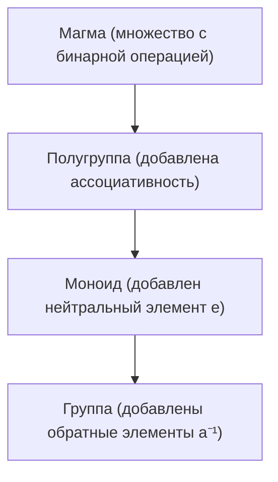
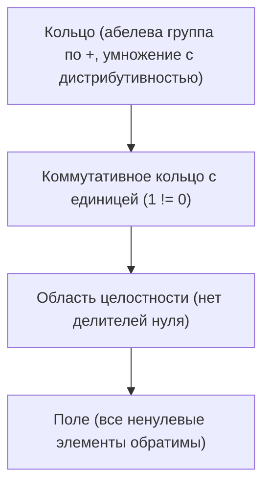
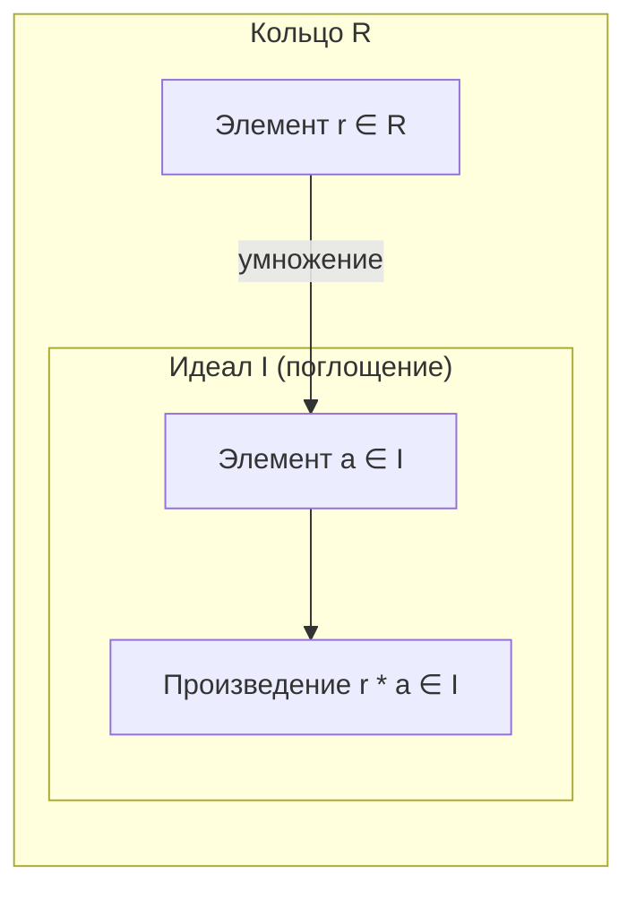

# Лекция 2: Моноиды, группы, кольца и поля (КТ)

---

## 1. Рекомендуемая литература

* **Винберг Э. Б. — «Курс алгебры»**  
  *Глава 1: Базовые алгебраические структуры. Фундаментальный университетский курс с глубоким разбором полугрупп, моноидов и групп преобразований.*
* **Кострикин А. И. — «Введение в алгебру. Часть I: Основы алгебры»**  
  *Классический учебник: детальные доказательства единственности нейтрального и обратного элементов, свойства симметрических групп и полей.*
* **Проскуряков И. В. — «Сборник задач по линейной алгебре»**  
  *Разделы I и II: Практические упражнения на проверку аксиом бинарных операций, умножение перестановок и кольца вычетов.*
* **Ленг С. — «Алгебра»**  
  *Справочное руководство: обобщенное определение идеалов, фактор-колец и универсальных свойств алгебраических систем.*

---

## 2. Бинарные операции на множествах

### Определение
Пусть $M$ — непустое множество. **Бинарной операцией** на множестве $M$ называется отображение, которое любой упорядоченной паре элементов $(m_1, m_2) \in M \times M$ ставит в соответствие единственный элемент $m_1 * m_2 \in M$:

$$* : M \times M \to M, \quad (m_1, m_2) \mapsto m_1 * m_2$$

### Свойство замкнутости и контрпримеры:
Ключевое требование: **результат операции обязан принадлежать исходному множеству $M$** (замкнутость).

* **Контрпример (не бинарная операция):**  
  Вычитание на множестве натуральных чисел $\mathbb{N} = \{1, 2, 3, \dots\}$:  
  $(n_1, n_2) \mapsto n_1 - n_2$.  
  Для пары $(2, 5)$ разность $2 - 5 = -3 \notin \mathbb{N}$. Результат вышел за пределы множества $\mathbb{N}$, поэтому вычитание **не является** бинарной операцией на $\mathbb{N}$.

### Примеры корректных бинарных операций:
1. **Сложение и умножение** на множествах $\mathbb{Z}, \mathbb{Q}, \mathbb{R}, \mathbb{C}$:  
   Сумма и произведение любых двух чисел из этих множеств дают число из того же множества.
2. **Взятие максимума / минимума:**  
   Отображение $(a, b) \mapsto \max(a, b)$ корректно определено на $\mathbb{R}$.
3. **Симметрическая разность множеств:**  
   На булеане (множестве всех подмножеств) $\mathcal{P}(U)$ операция $A \mathbin{\Delta} B = (A \setminus B) \cup (B \setminus A)$ ассоциативна и замкнута.
4. **Конкатенация строк в программировании:**  
   Если $S$ — алфавит, а $S^*$ — множество строк, то склеивание $(s_1, s_2) \mapsto s_1 + s_2$ замкнуто (`"itmo" + "_ct" = "itmo_ct"`).

---

## 3. Моноиды

### Определение моноида
**Моноидом** называется пара $(M, *)$, состоящая из непустого множества $M$ и заданной на нём ассоциативной бинарной операции $*$, обладающая нейтральным (единичным) элементом.

### Аксиомы моноида:
1. **Ассоциативность:**
   $$\forall a, b, c \in M : (a * b) * c = a * (b * c)$$
2. **Существование нейтрального (единичного) элемента $e$:**
   $$\exists e \in M : \forall a \in M \implies e * a = a * e = a$$

### Коммутативный (абелев) моноид:
Если дополнительно выполняется перестановочность операндов:
$$\forall a, b \in M : a * b = b * a$$
то моноид называется **коммутативным**.

---

### Теорема 1: Единственность нейтрального элемента
**В любом моноиде существует ровно один нейтральный элемент.**

**Доказательство:**
1. Предположим противное: пусть в моноиде $M$ существуют два нейтральных элемента $e_1$ и $e_2$.
2. Рассмотрим произведение $e_1 * e_2$:
   * Так как $e_1$ — нейтральный элемент, то применение его к $e_2$ не меняет $e_2$:
     $$e_1 * e_2 = e_2$$
   * С другой стороны, так как $e_2$ — нейтральный элемент, применение его к $e_1$ не меняет $e_1$:
     $$e_1 * e_2 = e_1$$
3. Приравнивая левые части, получаем:
   $$e_1 = e_2$$
Следовательно, нейтральный элемент единственен. $\blacksquare$

---

### Примеры моноидов:
* $(\mathbb{Z}, +)$ — коммутативный моноид относительно сложения. Нейтральный элемент $e = 0$ ($a + 0 = 0 + a = a$).
* $(\mathbb{N}_0, +)$ — моноид целых неотрицательных чисел по сложению ($e = 0$).
* $(\mathbb{N}, \cdot)$ — коммутативный моноид относительно умножения. Нейтральный элемент $e = 1$ ($a \cdot 1 = 1 \cdot a = a$).
* $(\Sigma^*, \text{concat})$ — некоммутативный моноид строк (слов) над алфавитом $\Sigma$. Нейтральный элемент — пустая строка $\varepsilon$ (`"abc" + "" = "abc"`).

---

## 4. Моноид отображений $\operatorname{Maps}(X, X)$

Пусть $X$ — произвольное непустое множество.  
Обозначим через $M = \operatorname{Maps}(X, X)$ (или $X^X$) множество **всех функций (отображений)**, действующих из $X$ в $X$.

### Операция композиции (суперпозиции) функций:
Зададим бинарную операцию композиции $\circ$ (в классической математической нотации справа налево):
$$(f \circ g)(x) = f(g(x)) \quad \forall x \in X$$
То есть сначала на элемент действует правая функция $g$, а затем к полученному значению применяется левая функция $f$.

### Проверка аксиом моноида:
1. **Замкнутость:** если $g: X \to X$ и $f: X \to X$, то их композиция $f \circ g$ также является функцией из $X$ в $X$.
2. **Ассоциативность:** для любых отображений $f, g, h \in \operatorname{Maps}(X, X)$ и любого $x \in X$:
   $$\big((f \circ g) \circ h\big)(x) = (f \circ g)(h(x)) = f\big(g(h(x))\big)$$
   $$\big(f \circ (g \circ h)\big)(x) = f\big((g \circ h)(x)\big) = f\big(g(h(x))\big)$$
   Значения совпадают во всех точках, следовательно: $(f \circ g) \circ h = f \circ (g \circ h)$.
3. **Нейтральный элемент:** тождественное отображение $\operatorname{id}_X(x) = x$.
   Для любой функции $f$:
   $$(f \circ \operatorname{id}_X)(x) = f(\operatorname{id}_X(x)) = f(x) \implies f \circ \operatorname{id}_X = f$$
   $$(\operatorname{id}_X \circ f)(x) = \operatorname{id}_X(f(x)) = f(x) \implies \operatorname{id}_X \circ f = f$$

---

### Подробный практический пример вычисления композиций

Пусть множество состоит из трех элементов: $X = \{a, b, c\}$.  
Заданы два отображения $\sigma_1, \sigma_2 \in \operatorname{Maps}(X, X)$:

$$\sigma_1: \quad a \mapsto b, \quad b \mapsto c, \quad c \mapsto a$$
$$\sigma_2: \quad a \mapsto b, \quad b \mapsto a, \quad c \mapsto a$$

#### 1. Вычисление композиции $\sigma_1 \circ \sigma_2$ (сначала действует $\sigma_2$, затем $\sigma_1$):
* Для элемента $a$:
  $$a \xrightarrow{\sigma_2} b \xrightarrow{\sigma_1} c \implies (\sigma_1 \circ \sigma_2)(a) = c$$
* Для элемента $b$:
  $$b \xrightarrow{\sigma_2} a \xrightarrow{\sigma_1} b \implies (\sigma_1 \circ \sigma_2)(b) = b$$
* Для элемента $c$:
  $$c \xrightarrow{\sigma_2} a \xrightarrow{\sigma_1} b \implies (\sigma_1 \circ \sigma_2)(c) = b$$

В двухстрочной записи:
$$\sigma_1 \circ \sigma_2 = \begin{pmatrix} a & b & c \\ c & b & b \end{pmatrix}$$

#### 2. Вычисление композиции $\sigma_2 \circ \sigma_1$ (сначала действует $\sigma_1$, затем $\sigma_2$):
* Для элемента $a$:
  $$a \xrightarrow{\sigma_1} b \xrightarrow{\sigma_2} a \implies (\sigma_2 \circ \sigma_1)(a) = a$$
* Для элемента $b$:
  $$b \xrightarrow{\sigma_1} c \xrightarrow{\sigma_2} a \implies (\sigma_2 \circ \sigma_1)(b) = a$$
* Для элемента $c$:
  $$c \xrightarrow{\sigma_1} a \xrightarrow{\sigma_2} b \implies (\sigma_2 \circ \sigma_1)(c) = b$$

В двухстрочной записи:
$$\sigma_2 \circ \sigma_1 = \begin{pmatrix} a & b & c \\ a & a & b \end{pmatrix}$$

#### Вывод:
$$\sigma_1 \circ \sigma_2 \ne \sigma_2 \circ \sigma_1$$
Наглядно доказано, что моноид отображений $\operatorname{Maps}(X, X)$ при $|X| \ge 2$ **не является коммутативным**.

---

## 5. Группы

### Определение группы
**Группой** называется моноид $(G, *)$, в котором **для каждого элемента существует симметричный (обратный) элемент**:

$$\forall a \in G \quad \exists a^{-1} \in G : a * a^{-1} = a^{-1} * a = e$$

---

### Почему $\operatorname{Maps}(X, X)$ не является группой?
Чтобы функция $f: X \to X$ имела обратную функцию $f^{-1}$ такую, что $f \circ f^{-1} = f^{-1} \circ f = \operatorname{id}_X$, функция обязана быть **взаимно-однозначной (биекцией)**:
1. **Инъективность:** разные элементы должны переходить в разные ($x_1 \ne x_2 \implies f(x_1) \ne f(x_2)$). В отображении $\sigma_2$ из предыдущего примера элементы $b$ и $c$ склеиваются в $a$, поэтому однозначно восстановить прообраз невозможно.
2. **Сюръективность:** каждый элемент области прибытия должен быть чьим-то образом.

Следовательно, множество всех функций $\operatorname{Maps}(X, X)$ группой не является.

### Симметрическая группа $\operatorname{Bij}(X, X)$ (или $S_n$)
Если сузить множество $\operatorname{Maps}(X, X)$ только до **биективных отображений** (биекций):
$$G = \operatorname{Bij}(X, X) = \{f \in \operatorname{Maps}(X, X) \mid f \text{ — биекция}\}$$
то $G$ образует **группу относительно композиции**:
* Композиция биекций биективна.
* Тождественное отображение $\operatorname{id}_X$ биективно.
* У любой биекции существует корректно определенная обратная биекция $f^{-1}$.

Для конечного множества из $n$ элементов $X = \{1, 2, \dots, n\}$ группа $\operatorname{Bij}(X, X)$ называется **симметрической группой степени $n$** и обозначается $S_n$. Её порядок равен $|S_n| = n!$.

---

### Теорема 2: Единственность обратного элемента в группе
**В любой группе для каждого элемента $a \in G$ обратный элемент $a^{-1}$ единственен.**

**Доказательство:**
1. Пусть для элемента $a$ существуют два обратных элемента: $b$ и $c$.
2. По определению обратного элемента:
   $$a * b = b * a = e \quad \text{и} \quad a * c = c * a = e$$
3. Рассмотрим произведение $b * a * c$ и вычислим его двумя способами, пользуясь ассоциативностью:
   * С одной стороны, сгруппируем правые сомножители:
     $$b * (a * c) = b * e = b$$
   * С другой стороны, сгруппируем левые сомножители:
     $$(b * a) * c = e * c = c$$
4. Так как операция ассоциативна, результаты обязаны совпадать:
   $$b = c$$
Следовательно, обратный элемент единственен. $\blacksquare$

---

## 6. Кольца и Поля

### Определение кольца
**Кольцом** называется множество $R$ с двумя бинарными операциями — сложением $(+)$ и умножением $(\cdot)$, удовлетворяющее трем свойствам:
1. $(R, +)$ — абелева группа по сложению (нейтральный элемент обозначается **нулём** $0$, обратный к $a$ — **противоположным** $-a$).
2. Умножение ассоциативно: $(a \cdot b) \cdot c = a \cdot (b \cdot c)$ для всех $a, b, c \in R$.
3. Умножение дистрибутивно относительно сложения (связь двух операций):
   * Левая дистрибутивность: $a \cdot (b + c) = a \cdot b + a \cdot c$
   * Правая дистрибутивность: $(a + b) \cdot c = a \cdot c + b \cdot c$

### Виды колец:
* **Коммутативное кольцо:** если $a \cdot b = b \cdot a$ для всех $a, b \in R$.
* **Кольцо с единицей ($1$):** если существует элемент $1 \in R$ такой, что $a \cdot 1 = 1 \cdot a = a$ для любого $a \in R$.

> В современном университетском курсе алгебры под термином **«кольцо»**, как правило, понимается **ассоциативное кольцо с единицей**.

---

### Свойства любого кольца:

#### 1. Умножение на ноль ($0 \cdot a = a \cdot 0 = 0$)
**Доказательство:**
1. В аддитивной группе $(R, +)$ ноль обладает свойством: $0 = 0 + 0$.
2. Умножим обе части равенства справа на элемент $a$:
   $$0 \cdot a = (0 + 0) \cdot a$$
3. Применяем правую дистрибутивность:
   $$0 \cdot a = 0 \cdot a + 0 \cdot a$$
4. Так как $(R, +)$ — группа, прибавим к обеим частям противоположный элемент $-(0 \cdot a)$:
   $$(0 \cdot a) + \big(-(0 \cdot a)\big) = (0 \cdot a + 0 \cdot a) + \big(-(0 \cdot a)\big)$$
   $$0 = 0 \cdot a + \Big((0 \cdot a) + \big(-(0 \cdot a)\big)\Big)$$
   $$0 = 0 \cdot a + 0 \implies 0 \cdot a = 0$$
Аналогично, используя левую дистрибутивность, получаем $a \cdot 0 = 0$. $\blacksquare$

#### 2. Правило знаков ($(-a) \cdot b = -(a \cdot b) = a \cdot (-b)$)
**Доказательство:**
1. Рассмотрим сумму:
   $$a \cdot b + (-a) \cdot b = (a + (-a)) \cdot b = 0 \cdot b = 0$$
   Так как сумма элементов равна нулю, элемент $(-a) \cdot b$ является противоположным к $a \cdot b$, то есть:
   $$(-a) \cdot b = -(a \cdot b)$$
2. Аналогично:
   $$a \cdot b + a \cdot (-b) = a \cdot (b + (-b)) = a \cdot 0 = 0 \implies a \cdot (-b) = -(a \cdot b)$$
3. Следствие при $a = -1$:
   $$(-1) \cdot b = -(1 \cdot b) = -b$$

---

### Поле

**Полем** называется коммутативное ассоциативное кольцо с единицей $(P, +, \cdot)$, в котором $1 \ne 0$ и **каждый ненулевой элемент обратим по умножению**:
$$\forall a \in P \setminus \{0\} \quad \exists a^{-1} \in P : a \cdot a^{-1} = 1$$

---

### Теорема 3: Необратимость нуля в поле
**Если в кольце с единицей $1 \ne 0$, то нулевой элемент $0$ не имеет обратного по умножению.**

**Доказательство:**
1. Предположим от противного, что для нуля существует обратный по умножению элемент $0^{-1} \in R$.
2. По определению обратного элемента:
   $$0 \cdot 0^{-1} = 1$$
3. Однако по ранее доказанному фундаментальному свойству кольца, умножение любого элемента на ноль дает ноль:
   $$0 \cdot 0^{-1} = 0$$
4. Отсюда следует:
   $$0 = 1$$
5. Это противоречит условию $1 \ne 0$.
Следовательно, ноль ни в каком нетривиальном кольце не может иметь мультипликативно обратного элемента. $\blacksquare$

---

## 7. Делители нуля, области целостности и идеалы

### Делители нуля
Ненулевой элемент $a \in R$ ($a \ne 0$) называется **делителем нуля**, если существует ненулевой элемент $b \in R$ ($b \ne 0$) такой, что:
$$a \cdot b = 0 \quad \text{или} \quad b \cdot a = 0$$

* **Пример в кольце вычетов $\mathbb{Z}_6$:**
  $$2 \ne 0, \quad 3 \ne 0, \quad \text{но } 2 \cdot 3 = 6 \equiv 0 \pmod 6$$
  Числа 2, 3 и 4 являются делителями нуля в $\mathbb{Z}_6$.

### Область целостности
**Областью целостности** называется коммутативное кольцо с единицей ($1 \ne 0$), в котором **отсутствуют делители нуля**:
$$a \cdot b = 0 \implies a = 0 \quad \text{или} \quad b = 0$$

*Примеры областей целостности:* кольцо целых чисел $\mathbb{Z}$, кольцо многочленов $\mathbb{R}[x]$, любое поле.

---

### Идеалы кольца

#### Определение
Непустое подмножество $I \subseteq R$ кольца $R$ называется **идеалом** (двусторонним идеалом), если:
1. **$I$ — подгруппа аддитивной группы $(R, +)$:**
   $$\forall a, b \in I \implies a - b \in I$$
2. **Свойство поглощения (умножение на любой элемент кольца оставляет элемент в идеале):**
   $$\forall a \in I, \quad \forall r \in R \implies r \cdot a \in I \quad \text{и} \quad a \cdot r \in I$$

#### Важнейший пример: Идеал $n\mathbb{Z}$ в кольце целых чисел $\mathbb{Z}$
Пусть $R = \mathbb{Z}$, а $I = n\mathbb{Z}$ — множество всех чисел, кратных фиксированному числу $n$ (например, $n = 7$):
$$I = 7\mathbb{Z} = \{\dots, -14, -7, 0, 7, 14, 21, \dots\}$$

**Проверка аксиом идеала:**
1. Разность двух чисел, делящихся на 7, делится на 7:
   $$7k_1 - 7k_2 = 7(k_1 - k_2) \in 7\mathbb{Z}$$
2. Если взять любое число $a \in 7\mathbb{Z}$ ($a = 7k$) и умножить на **совершенно любое** целое число $r \in \mathbb{Z}$:
   $$r \cdot a = r \cdot (7k) = 7 \cdot (r \cdot k) \in 7\mathbb{Z}$$
   Результат поглощается множеством $7\mathbb{Z}$!

Идеалы играют в теории колец фундаментальную роль, аналогичную нормальным подгруппам в теории групп: именно по идеалам строятся **фактор-кольца** $R / I$, с которых начинается подробное изучение классов вычетов $\mathbb{Z}_n$ и конечных полей на следующих лекциях.