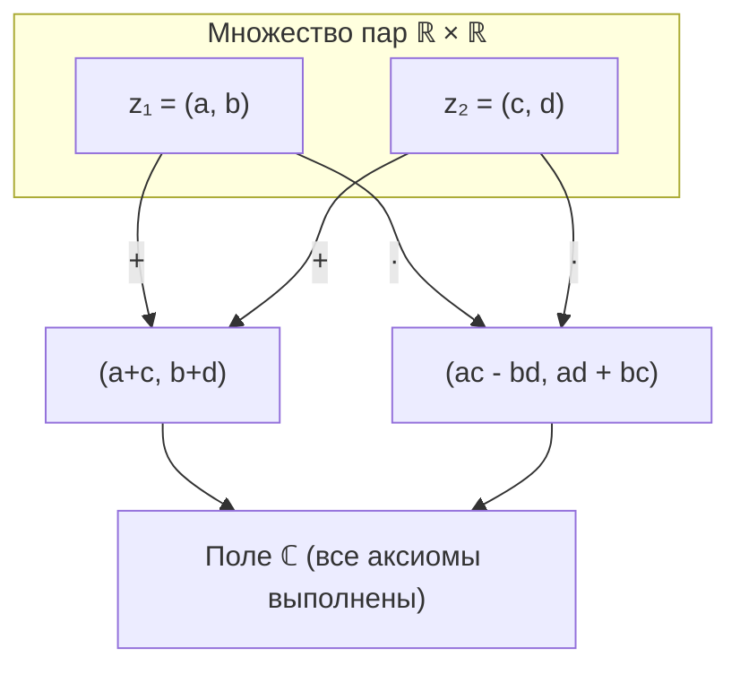
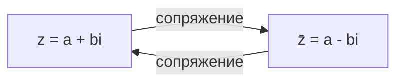
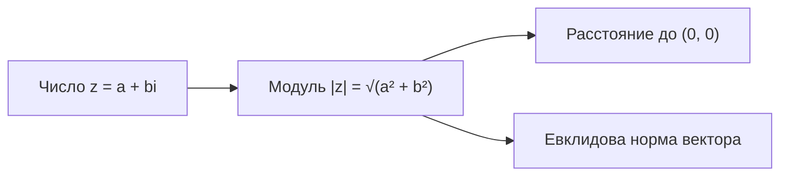
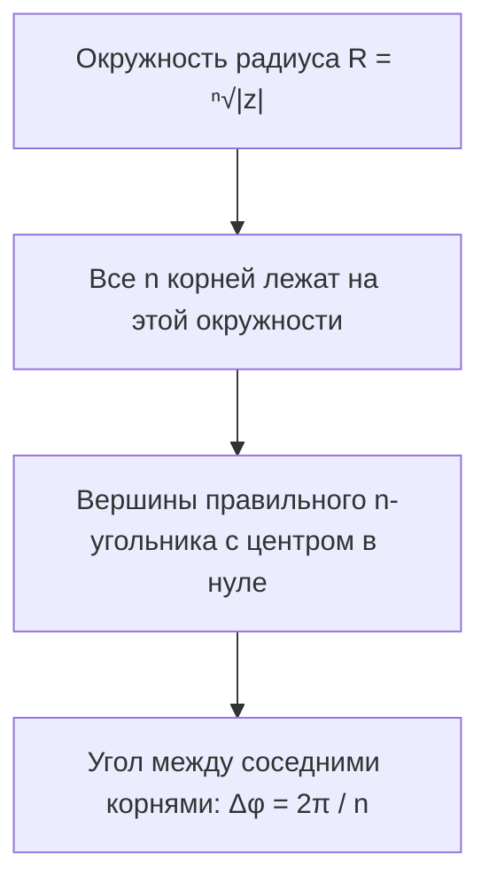

# Лекция 3: Поле комплексных чисел

---

## 1. Рекомендуемая литература

Ниже приведены фундаментальные учебники, соответствующие университетскому курсу высшей алгебры и математического анализа:

* **Кострикин А. И. — «Введение в алгебру. Часть I: Основы алгебры»**  
  * *Специфика:* Классический академический курс мехмата МГУ.
  * *Чем полезна:* Подробно и строго излагает аксиоматику поля комплексных чисел, алгебраическую и тригонометрическую формы, извлечение корней, группу корней из единицы и многочлены над $\mathbb{C}$.
* **Винберг Э. Б. — «Курс алгебры»**  
  * *Специфика:* Глубокий теоретический подход с великолепной геометрической интуицией.
  * *Чем полезна:* Рассматривает поле $\mathbb{C}$ как факторкольцо $\mathbb{R}[x] / (x^2 + 1)$, матричные модели комплексных чисел и конформные геометрические преобразования.
* **Ильин В. А., Позняк Э. Г. — «Линейная алгебра» / «Основы математического анализа»**  
  * *Специфика:* Предельная строгость изложения аналитических аспектов и топологии комплексной плоскости.
  * *Чем полезна:* Полезна для глубокого понимания предела последовательностей комплексных чисел, неравенства треугольника и формулы Эйлера.
* **Фаддеев Д. К., Соминский И. С. — «Сборник задач по высшей алгебре»**  
  * *Специфика:* Эталонный задачник для физико-математических факультетов.
  * *Чем полезна:* Содержит обширные серии упражнений на действия с комплексными числами, формулу Муавра, геометрические множества на плоскости и суммирование тригонометрических рядов.

---

## 2. Аксиоматическое построение поля $\mathbb{C}$ (модель Гамильтона)

Исторически мнимые величины появились в формулах Кардано для решения кубических уравнений, однако строгое теоретико-множественное обоснование комплексных чисел дал Уильям Роуэн Гамильтон в 1835 году, определив их как пары вещественных чисел.

### Определение
**Полем комплексных чисел** называется множество упорядоченных пар вещественных чисел:
$$\mathbb{C} = \mathbb{R}^2 = \big\{(a, b) \mid a, b \in \mathbb{R}\big\}$$
на котором заданы две бинарные операции — **сложение** и **умножение**:

1. **Сложение:**
   $$(a, b) + (c, d) = (a + c, \; b + d)$$
2. **Умножение:**
   $$(a, b) \cdot (c, d) = (ac - bd, \; ad + bc)$$



---

### Проверка аксиом поля для $(\mathbb{C}, +, \cdot)$

#### 1. Аддитивная структура $(\mathbb{C}, +)$ — абелева группа:
* **Ассоциативность и коммутативность** напрямую следуют из ассоциативности и коммутативности сложения в $\mathbb{R}$:
  $$(a, b) + (c, d) = (a + c, b + d) = (c + a, d + b) = (c, d) + (a, b)$$
* **Нейтральный элемент по сложению (ноль):**
  $$0_{\mathbb{C}} = (0, 0)$$
  $$(a, b) + (0, 0) = (a + 0, b + 0) = (a, b)$$
* **Противоположный элемент:** для любого $z = (a, b)$ существует единственный противоположный:
  $$-z = (-a, -b), \quad (a, b) + (-a, -b) = (0, 0)$$

#### 2. Мультипликативная структура $(\mathbb{C} \setminus \{(0, 0)\}, \cdot)$ — абелева группа:
* **Коммутативность умножения:**
  $$(a, b) \cdot (c, d) = (ac - bd, ad + bc) = (ca - db, da + cb) = (c, d) \cdot (a, b)$$
* **Ассоциативность умножения:**
  $$\big((a, b) \cdot (c, d)\big) \cdot (e, f) = (ac - bd, ad + bc) \cdot (e, f)$$
  $$= \big((ac - bd)e - (ad + bc)f, \; (ac - bd)f + (ad + bc)e\big)$$
  $$= \big(a(ce - df) - b(cf + de), \; a(cf + de) + b(ce - df)\big) = (a, b) \cdot \big((c, d) \cdot (e, f)\big)$$
* **Нейтральный элемент по умножению (единица):**
  $$1_{\mathbb{C}} = (1, 0)$$
  $$(a, b) \cdot (1, 0) = (a \cdot 1 - b \cdot 0, \; a \cdot 0 + b \cdot 1) = (a, b)$$

* **Обратный элемент по умножению:**
  Пусть $(a, b) \ne (0, 0)$, то есть $a^2 + b^2 > 0$. Найдем пару $(x, y)$ такую, что:
  $$(a, b) \cdot (x, y) = (1, 0) \iff \begin{cases} ax - by = 1 \\ bx + ay = 0 \end{cases}$$
  Решая эту систему линейных уравнений методом Крамера (определитель $\Delta = a^2 + b^2 \ne 0$):
  $$x = \frac{\begin{vmatrix} 1 & -b \\ 0 & a \end{vmatrix}}{\Delta} = \frac{a}{a^2 + b^2}, \qquad y = \frac{\begin{vmatrix} a & 1 \\ b & 0 \end{vmatrix}}{\Delta} = \frac{-b}{a^2 + b^2}$$
  Таким образом, для любого ненулевого комплексного числа обратный элемент существует, единственен и равен:
  $$(a, b)^{-1} = \left( \frac{a}{a^2 + b^2}, \; \frac{-b}{a^2 + b^2} \right)$$

#### 3. Дистрибутивность умножения относительно сложения:
$$(a, b) \cdot \big((c, d) + (e, f)\big) = (a, b) \cdot (c + e, d + f)$$
$$= \big(a(c + e) - b(d + f), \; a(d + f) + b(c + e)\big)$$
$$= \big((ac - bd) + (ae - bf), \; (ad + bc) + (af + be)\big) = (a, b)(c, d) + (a, b)(e, f)$$

> **Вывод:** Структура $(\mathbb{C}, +, \cdot)$ полностью удовлетворяет всем аксиомам поля.

---

### Вложение поля вещественных чисел $\mathbb{R} \hookrightarrow \mathbb{C}$

Рассмотрим подмножество пар вида $\widetilde{\mathbb{R}} = \{(a, 0) \mid a \in \mathbb{R}\} \subset \mathbb{C}$.  
Проверим арифметику таких пар:
$$(a, 0) + (c, 0) = (a + c, 0)$$
$$(a, 0) \cdot (c, 0) = (ac - 0 \cdot 0, \; a \cdot 0 + 0 \cdot c) = (ac, 0)$$
Отображение $\iota: \mathbb{R} \to \mathbb{C}$, задаваемое правилом $\iota(a) = (a, 0)$, является **инъективным изоморфизмом полей** (мономорфизмом).  
Поэтому множество вещественных чисел $\mathbb{R}$ естественным образом отождествляется с подполем $\widetilde{\mathbb{R}} \subset \mathbb{C}$:
$$a \equiv (a, 0)$$

---

### Мнимая единица

Определим элемент $i \in \mathbb{C}$ как пару:
$$i = (0, 1)$$
Вычислим его квадрат:
$$i^2 = (0, 1) \cdot (0, 1) = (0 \cdot 0 - 1 \cdot 1, \; 0 \cdot 1 + 1 \cdot 0) = (-1, 0) \equiv -1$$

> [!IMPORTANT]
> **Мнимая единица** $i$ — это не «несуществующее число», а упорядоченная пара $(0, 1)$ вещественных чисел. Уравнение $x^2 = -1$, неразрешимое в $\mathbb{R}$, в поле $\mathbb{C}$ имеет ровно два решения: $x = (0, 1) = i$ и $x = (0, -1) = -i$.

---

### Изоморфизм с кольцом матриц (Матричная модель по Кострикину и Винбергу)

Поле комплексных чисел можно строго задать без использования пар, реализовав его как подалгебру вещественных матриц размера $2 \times 2$.  
Зададим биективное отображение:
$$a + bi \longleftrightarrow \begin{pmatrix} a & -b \\ b & a \end{pmatrix} = a \begin{pmatrix} 1 & 0 \\ 0 & 1 \end{pmatrix} + b \begin{pmatrix} 0 & -1 \\ 1 & 0 \end{pmatrix} = a \cdot I + b \cdot J$$
где матрица $J = \begin{pmatrix} 0 & -1 \\ 1 & 0 \end{pmatrix}$ играет роль мнимой единицы:
$$J^2 = \begin{pmatrix} 0 & -1 \\ 1 & 0 \end{pmatrix} \begin{pmatrix} 0 & -1 \\ 1 & 0 \end{pmatrix} = \begin{pmatrix} -1 & 0 \\ 0 & -1 \end{pmatrix} = -I$$
Матричное сложение и умножение в точности воспроизводят операции в $\mathbb{C}$:
$$\begin{pmatrix} a & -b \\ b & a \end{pmatrix} \begin{pmatrix} c & -d \\ d & c \end{pmatrix} = \begin{pmatrix} ac - bd & -(ad + bc) \\ ad + bc & ac - bd \end{pmatrix}$$
Определитель такой матрицы равен:
$$\det \begin{pmatrix} a & -b \\ b & a \end{pmatrix} = a^2 + b^2 = |z|^2$$
что объясняет, почему ненулевой элемент обратим тогда и только тогда, когда $a^2 + b^2 \ne 0$.

---

## 3. Алгебраическая форма комплексного числа

Используя отождествление $a = (a, 0)$ и $i = (0, 1)$, любую пару $z = (a, b)$ можно представить в виде:
$$z = (a, b) = (a, 0) + (0, b) = (a, 0) + (b, 0) \cdot (0, 1) = a + bi$$

### Основные компоненты:
* $z = a + bi$ ($a, b \in \mathbb{R}$) — **алгебраическая форма** комплексного числа.
* $a = \operatorname{Re}(z)$ (от лат. *realis*) — **действительная (вещественная) часть**.
* $b = \operatorname{Im}(z)$ (от лат. *imaginarius*) — **мнимая часть** (обратите внимание: $\operatorname{Im}(z)$ — вещественное число, без $i$!).
* Если $b = 0$, число $z = a$ является **чисто действительным**.
* Если $a = 0$ и $b \ne 0$, число $z = bi$ называется **чисто мнимым**.

### Критерий равенства:
Два комплексных числа равны тогда и только тогда, когда их действительные и мнимые части совпадают по отдельности:
$$a + bi = c + di \iff \begin{cases} a = c \\ b = d \end{cases}$$

> [!WARNING]
> **Неупорядоченность поля $\mathbb{C}$:**  
> В поле комплексных чисел **не существует отношения порядка**, согласованного с операциями поля.  
> *Доказательство:* В любом упорядоченном поле квадрат любого ненулевого элемента положителен ($x^2 > 0$). Если бы $\mathbb{C}$ было упорядоченным полем, то $1 = 1^2 > 0$ и $i^2 > 0 \implies -1 > 0$, откуда $1 + (-1) > 0 \implies 0 > 0$, что невозможно.  
> Поэтому выражения вида $z_1 < z_2$ или $z_1 \ge z_2$ для комплексных чисел **не имеют математического смысла** (сравнивать можно только их модули или вещественные части).

---

## 4. Комплексное сопряжение

### Определение
Для комплексного числа $z = a + bi$ ($a, b \in \mathbb{R}$) **комплексно сопряженным** называется число:
$$\bar{z} = a - bi$$



---

### Фундаментальные свойства комплексного сопряжения

Ответим на все вопросы, поставленные в лекционном плане:

| № | Свойство | Формулировка | Доказательство |
|---|---|---|---|
| 1 | **Сумма** | $\overline{z_1 + z_2} = \bar{z}_1 + \bar{z}_2$ | $(a+c) - (b+d)i = (a - bi) + (c - di)$ |
| 2 | **Разность** | $\overline{z_1 - z_2} = \bar{z}_1 - \bar{z}_2$ | $(a-c) - (b-d)i = (a - bi) - (c - di)$ |
| 3 | **Произведение** | $\overline{z_1 \cdot z_2} = \bar{z}_1 \cdot \bar{z}_2$ | $\overline{(ac-bd) + (ad+bc)i} = (ac-bd) - (ad+bc)i = (a-bi)(c-di)$ |
| 4 | **Частное** | $\overline{\left(\frac{z_1}{z_2}\right)} = \frac{\bar{z}_1}{\bar{z}_2} \quad (z_2 \ne 0)$ | Из $z_1 = \left(\frac{z_1}{z_2}\right) z_2 \implies \bar{z}_1 = \overline{\left(\frac{z_1}{z_2}\right)} \bar{z}_2 \implies \overline{\left(\frac{z_1}{z_2}\right)} = \frac{\bar{z}_1}{\bar{z}_2}$ |
| 5 | **Инволютивность** | $\overline{\overline{z}} = z$ | $\overline{\overline{a + bi}} = \overline{a - bi} = a - (-b)i = a + bi$ |
| 6 | **Вещественная часть** | $\operatorname{Re}(z) = \frac{z + \bar{z}}{2}$ | $\frac{(a+bi) + (a-bi)}{2} = \frac{2a}{2} = a$ |
| 7 | **Мнимая часть** | $\operatorname{Im}(z) = \frac{z - \bar{z}}{2i}$ | $\frac{(a+bi) - (a-bi)}{2i} = \frac{2bi}{2i} = b$ |
| 8 | **Связь с вещественностью**| $z \in \mathbb{R} \iff z = \bar{z}$ | $a + bi = a - bi \iff 2bi = 0 \iff b = 0$ |
| 9 | **Чисто мнимые числа** | $z$ чисто мнимое $\iff z = -\bar{z}$ | $a + bi = -(a - bi) = -a + bi \iff 2a = 0 \iff a = 0$ |

---

### Вычисление обратного элемента и деления через сопряжение

Важнейшее практическое тождество:
$$z \cdot \bar{z} = (a + bi)(a - bi) = a^2 - (bi)^2 = a^2 + b^2 \in \mathbb{R}_{\ge 0}$$
Если $z \ne 0$, то $z \cdot \bar{z} = a^2 + b^2 > 0$. Разделив обе части на $a^2 + b^2$, получаем явное выражение для мультипликативно обратного элемента:
$$z^{-1} = \frac{1}{z} = \frac{\bar{z}}{z \cdot \bar{z}} = \frac{a - bi}{a^2 + b^2} = \frac{a}{a^2 + b^2} - \frac{b}{a^2 + b^2}i$$

#### Пример деления двух чисел:
Вычислим частное $\frac{2 + 5i}{1 - 3i}$:
$$\frac{2 + 5i}{1 - 3i} = \frac{(2 + 5i)(1 + 3i)}{(1 - 3i)(1 + 3i)} = \frac{2 + 6i + 5i + 15i^2}{1^2 + 3^2} = \frac{2 - 15 + 11i}{10} = -\frac{13}{10} + \frac{11}{10}i = -1.3 + 1.1i$$

---

## 5. Геометрическая интерпретация (Комплексная плоскость)

Каждому комплексному числу $z = a + bi$ взаимно однозначно соответствует точка $M(a, b)$ плоскости или ее радиус-вектор $\vec{r} = (a, b)$.  
Такая плоскость называется **комплексной плоскостью** (или *плоскостью Аргана — Гаусса*):
* Горизонтальная ось $Ox$ называется **действительной (вещественной) осью** ($\operatorname{Re}$).
* Вертикальная ось $Oy$ называется **мнимой осью** ($\operatorname{Im}$).

```
                     Im (Мнимая ось)
                        ^
                        |          * z = a + bi = r(cos φ + i sin φ)
                        |         /|
                      b +--------/ |
                        |       /  |
                        |    r /   |
                        |     /    |
                        |    / φ   |
      ------------------+---+------+-----------------> Re (Действительная ось)
                        | 0 |      a
                        |   |
                     -b +---|----+
                        |   |   /
                        |   |  / r
                        |   | /
                        |   |/
                        |   * z̄ = a - bi (Зеркальное отражение)
                        |
```

### Геометрический смысл операций:
1. **Сложение чисел $z_1 + z_2$:** в точности совпадает со сложением радиус-векторов по **правилу параллелограмма**.
2. **Вычитание $z_1 - z_2$:** вектор, направленный из точки $z_2$ в точку $z_1$. Величина $|z_1 - z_2|$ равна евклидову **расстоянию** между точками $z_1$ и $z_2$.
3. **Комплексное сопряжение $z \mapsto \bar{z}$:** **зеркальная симметрия** (осевая симметрия) относительно действительной оси $\operatorname{Re}$.
4. **Умножение на $-1$ ($z \mapsto -z$):** **центральная симметрия** относительно начала координат.

---

## 6. Модуль комплексного числа и его свойства

### Определение
**Модулем (абсолютной величиной)** комплексного числа $z = a + bi$ называется неотрицательное вещественное число:
$$|z| = \sqrt{a^2 + b^2} = \sqrt{z \cdot \bar{z}}$$
Геометрически $|z|$ — это длина радиус-вектора точки $z$, то есть расстояние от точки $z$ до начала координат.



---

### Фундаментальные свойства модуля

1. **Связь с сопряжением:**
   $$z \cdot \bar{z} = |z|^2$$
2. **Невырожденность:**
   $$|z| \ge 0, \quad \text{причем } |z| = 0 \iff z = 0$$
3. **Симметрия:**
   $$|z| = |\bar{z}| = |-z| = |-\bar{z}|$$
4. **Мультипликативность:**
   $$|z_1 \cdot z_2| = |z_1| \cdot |z_2|$$
5. **Модуль частного:**
   $$\left|\frac{z_1}{z_2}\right| = \frac{|z_1|}{|z_2|} \quad (z_2 \ne 0)$$
6. **Неравенство треугольника:**
   $$|z_1 + z_2| \le |z_1| + |z_2|$$
   $$| |z_1| - |z_2| | \le |z_1 - z_2|$$

> [!NOTE]
> Строгие аналитические доказательства всех указанных свойств модуля и тождества параллелограмма вынесены в отдельный документ:  
> **[Линейная алгебра ДЗ 2 (Комплексные числа).md](file:///c:/Users/Bar21/Documents/Линал/Линейная%20алгебра%20ДЗ%202%20(Комплексные%20числа).md)**.

---

## 7. Тригонометрическая форма комплексного числа

Перейдем от декартовых координат $(a, b)$ точки на плоскости к полярным координатам $(r, \phi)$:
$$a = r \cos\phi, \qquad b = r \sin\phi$$
где $r = |z| = \sqrt{a^2 + b^2} \ge 0$.

### Аргумент комплексного числа
Для любого $z \ne 0$ угол $\phi$ между положительным направлением действительной оси и вектором $z$ называется **аргументом** числа $z$:
$$\cos\phi = \frac{a}{|z|} = \frac{a}{\sqrt{a^2 + b^2}}, \qquad \sin\phi = \frac{b}{|z|} = \frac{b}{\sqrt{a^2 + b^2}}$$
* Так как тригонометрические функции периодичны с периодом $2\pi$, аргумент определен с точностью до слагаемого $2\pi k$ ($k \in \mathbb{Z}$):
  $$\operatorname{Arg}(z) = \arg(z) + 2\pi k, \quad k \in \mathbb{Z}$$
* **Главным значением аргумента** $\arg(z)$ называется значение, лежащее в полуинтервале $(-\pi, \pi]$ (в некоторых курсах $[0, 2\pi)$):
  $$\arg(z) = \begin{cases}
  \operatorname{arctg}\frac{b}{a}, & a > 0 \\
  \operatorname{arctg}\frac{b}{a} + \pi, & a < 0, \; b \ge 0 \\
  \operatorname{arctg}\frac{b}{a} - \pi, & a < 0, \; b < 0 \\
  +\frac{\pi}{2}, & a = 0, \; b > 0 \\
  -\frac{\pi}{2}, & a = 0, \; b < 0
  \end{cases}$$
* Для числа $z = 0$ аргумент **не определен** (модуль равен нулю, а направление вектора не имеет смысла).

### Запись в тригонометрической форме:
$$z = |z|(\cos\phi + i\sin\phi) = r(\cos\phi + i\sin\phi)$$

---

### Примеры перевода в тригонометрическую форму:

1. **Число $z = 1 + i$:**
   * $|z| = \sqrt{1^2 + 1^2} = \sqrt{2}$.
   * $\cos\phi = \frac{1}{\sqrt{2}}$, $\sin\phi = \frac{1}{\sqrt{2}} \implies \phi = \frac{\pi}{4}$.
   * $$z = \sqrt{2}\left(\cos\frac{\pi}{4} + i\sin\frac{\pi}{4}\right)$$

2. **Число $z = -\sqrt{3} + i$:**
   * $|z| = \sqrt{(-\sqrt{3})^2 + 1^2} = \sqrt{3 + 1} = 2$.
   * Точка во II четверти: $\phi = \pi - \operatorname{arctg}\frac{1}{\sqrt{3}} = \pi - \frac{\pi}{6} = \frac{5\pi}{6}$.
   * $$z = 2\left(\cos\frac{5\pi}{6} + i\sin\frac{5\pi}{6}\right)$$

3. **Число $z = -2i$:**
   * $|z| = 2$.
   * Точка на отрицательной полуоси $\operatorname{Im}$: $\phi = -\frac{\pi}{2}$.
   * $$z = 2\left(\cos\left(-\frac{\pi}{2}\right) + i\sin\left(-\frac{\pi}{2}\right)\right)$$

---

### Умножение и деление в тригонометрической форме

Пусть даны два комплексных числа:
$$z_1 = r_1(\cos\phi_1 + i\sin\phi_1), \qquad z_2 = r_2(\cos\phi_2 + i\sin\phi_2)$$

#### 1. Теорема об умножении:
$$z_1 \cdot z_2 = r_1 r_2 \Big(\cos(\phi_1 + \phi_2) + i\sin(\phi_1 + \phi_2)\Big)$$

**Доказательство:**
$$z_1 z_2 = r_1 r_2 (\cos\phi_1 + i\sin\phi_1)(\cos\phi_2 + i\sin\phi_2)$$
$$= r_1 r_2 \Big[(\cos\phi_1 \cos\phi_2 - \sin\phi_1 \sin\phi_2) + i(\sin\phi_1 \cos\phi_2 + \cos\phi_1 \sin\phi_2)\Big]$$
Используя тригонометрические формулы косинуса и синуса суммы:
$$\cos(\phi_1 + \phi_2) = \cos\phi_1 \cos\phi_2 - \sin\phi_1 \sin\phi_2$$
$$\sin(\phi_1 + \phi_2) = \sin\phi_1 \cos\phi_2 + \cos\phi_1 \sin\phi_2$$
получаем:
$$z_1 z_2 = r_1 r_2 \big(\cos(\phi_1 + \phi_2) + i\sin(\phi_1 + \phi_2)\big) \quad \blacksquare$$

> [!TIP]
> **Геометрический смысл умножения:** при перемножении комплексных чисел их **модули перемножаются**, а **аргументы складываются**:
> $$|z_1 z_2| = |z_1| \cdot |z_2|, \qquad \operatorname{Arg}(z_1 z_2) = \operatorname{Arg}(z_1) + \operatorname{Arg}(z_2)$$
> Умножение любого вектора на число $\cos\alpha + i\sin\alpha$ означает **поворот плоскости на угол $\alpha$** против часовой стрелки! В частности, умножение на $i = \cos\frac{\pi}{2} + i\sin\frac{\pi}{2}$ поворачивает любой вектор на $90^\circ$.

#### 2. Теорема о делении:
Если $z_2 \ne 0$:
$$\frac{z_1}{z_2} = \frac{r_1}{r_2}\Big(\cos(\phi_1 - \phi_2) + i\sin(\phi_1 - \phi_2)\Big)$$
При делении комплексных чисел их **модули делятся**, а аргумент делителя **вычитается** из аргумента делимого.

---

## 8. Формула Муавра и её следствия

### Теорема (Формула Муавра)
Для любого комплексного числа $z = r(\cos\phi + i\sin\phi)$ и любого целого числа $n \in \mathbb{Z}$:
$$z^n = r^n \big(\cos(n\phi) + i\sin(n\phi)\big)$$

**Доказательство (методом математической индукции для $n \in \mathbb{N}$):**
1. **База индукции:** При $n = 1$ равенство $z^1 = r^1(\cos(1\cdot\phi) + i\sin(1\cdot\phi))$ очевидно истинно.
2. **Шаг индукции:** Пусть формула верна для $n = k$, то есть $z^k = r^k(\cos(k\phi) + i\sin(k\phi))$.  
   Тогда для $n = k + 1$:
   $$z^{k+1} = z^k \cdot z = \Big[r^k(\cos(k\phi) + i\sin(k\phi))\Big] \cdot \Big[r(\cos\phi + i\sin\phi)\Big]$$
   По теореме об умножении в тригонометрической форме:
   $$z^{k+1} = r^{k+1}\Big(\cos(k\phi + \phi) + i\sin(k\phi + \phi)\Big) = r^{k+1}\Big(\cos((k+1)\phi) + i\sin((k+1)\phi)\Big)$$
3. По принципу математической индукции формула Муавра доказана для всех $n \in \mathbb{N}$.
4. Для отрицательных степеней $n = -m$ ($m \in \mathbb{N}$):
   $$z^{-m} = \frac{1}{z^m} = \frac{1(\cos 0 + i\sin 0)}{r^m(\cos(m\phi) + i\sin(m\phi))} = r^{-m}\big(\cos(0 - m\phi) + i\sin(0 - m\phi)\big) = r^{-m}\big(\cos(-m\phi) + i\sin(-m\phi)\big) \quad \blacksquare$$

---

### Практические применения формулы Муавра

#### Пример 1. Возведение в большую степень: $(1 + i)^{10}$
1. Переведем $1 + i$ в тригонометрическую форму:
   $$1 + i = \sqrt{2}\left(\cos\frac{\pi}{4} + i\sin\frac{\pi}{4}\right)$$
2. Применим формулу Муавра для $n = 10$:
   $$(1 + i)^{10} = (\sqrt{2})^{10} \left(\cos\left(10 \cdot \frac{\pi}{4}\right) + i\sin\left(10 \cdot \frac{\pi}{4}\right)\right)$$
3. Упростим параметры:
   $$(\sqrt{2})^{10} = (2^{1/2})^{10} = 2^5 = 32$$
   $$\frac{10\pi}{4} = \frac{5\pi}{2} = 2\pi + \frac{\pi}{2}$$
4. Вычислим значения тригонометрических функций:
   $$\cos\frac{5\pi}{2} = \cos\frac{\pi}{2} = 0, \qquad \sin\frac{5\pi}{2} = \sin\frac{\pi}{2} = 1$$
5. Получаем окончательный ответ:
   $$(1 + i)^{10} = 32(0 + 1i) = 32i$$

---

#### Пример 2. Вывод тригонометрических формул кратных углов: $\cos(3\phi)$ и $\sin(3\phi)$

Применим формулу Муавра для $r = 1$ и $n = 3$:
$$\cos(3\phi) + i\sin(3\phi) = (\cos\phi + i\sin\phi)^3$$
Раскроем правую часть по формуле куба суммы (биному Ньютона):
$$(\cos\phi + i\sin\phi)^3 = \cos^3\phi + 3\cos^2\phi(i\sin\phi) + 3\cos\phi(i\sin\phi)^2 + (i\sin\phi)^3$$
Так как $i^2 = -1$ и $i^3 = -i$:
$$= \cos^3\phi + 3i\cos^2\phi\sin\phi - 3\cos\phi\sin^2\phi - i\sin^3\phi$$
Сгруппируем вещественную и мнимую части:
$$= \big(\cos^3\phi - 3\cos\phi\sin^2\phi\big) + i\big(3\cos^2\phi\sin\phi - \sin^3\phi\big)$$
Приравнивая действительные и мнимые части слева и справа:

1. **Формула для косинуса тройного угла:**
   $$\cos(3\phi) = \cos^3\phi - 3\cos\phi\sin^2\phi = \cos^3\phi - 3\cos\phi(1 - \cos^2\phi) = 4\cos^3\phi - 3\cos\phi$$
2. **Формула для синуса тройного угла:**
   $$\sin(3\phi) = 3\cos^2\phi\sin\phi - \sin^3\phi = 3(1 - \sin^2\phi)\sin\phi - \sin^3\phi = 3\sin\phi - 4\sin^3\phi$$

> Этот метод позволяет мгновенно получать формулы для синуса и косинуса любого кратного угла $\cos(n\phi), \sin(n\phi)$, раскрывая $(\cos\phi + i\sin\phi)^n$ по биному Ньютона.

---

## 9. Извлечение корней из комплексных чисел

### Определение
Пусть $z \in \mathbb{C}$ и $n \in \mathbb{N}$. **Комплексным корнем $n$-й степени из числа $z$** называется любое число $w \in \mathbb{C}$ такое, что:
$$w^n = z$$

---

### Теорема о корнях $n$-й степени
Для любого ненулевого комплексного числа $z = r(\cos\phi + i\sin\phi) \ne 0$ существует **ровно $n$ различных корней $n$-й степени**, которые задаются формулой:

$$w_k = \sqrt[n]{r} \left(\cos\frac{\phi + 2\pi k}{n} + i\sin\frac{\phi + 2\pi k}{n}\right), \quad k = 0, 1, 2, \dots, n - 1$$
где $\sqrt[n]{r}$ — обычный арифметический корень из положительного вещественного числа $r$.

**Доказательство:**
1. Пусть искомый корень записан в тригонометрической форме: $w = \rho(\cos\theta + i\sin\theta)$.
2. По условию $w^n = z$:
   $$\rho^n(\cos(n\theta) + i\sin(n\theta)) = r(\cos\phi + i\sin\phi)$$
3. Два комплексных числа равны тогда и только тогда, когда равны их модули, а аргументы отличаются на кратное $2\pi$:
   $$\rho^n = r \implies \rho = \sqrt[n]{r}$$
   $$n\theta = \phi + 2\pi k \implies \theta_k = \frac{\phi + 2\pi k}{n}, \quad k \in \mathbb{Z}$$
4. При значениях $k = 0, 1, \dots, n-1$ получаем $n$ различных углов, разность любых двух из которых меньше $2\pi$. При $k = n$ аргумент увеличивается на $\frac{2\pi n}{n} = 2\pi$, что возвращает нас к значению $w_0$. Следовательно, ровно $n$ значений являются различными. $\blacksquare$

---

### Геометрическая интерпретация корней



Все $n$ корней $\sqrt[n]{z}$ расположены на окружности с центром в начале координат радиуса $R = \sqrt[n]{|z|}$ и образуют вершины **правильного $n$-угольника**.

---

### Подробный разбор примера: Вычисление $\sqrt[3]{-8}$

Найдем все комплексные корни кубические из числа $z = -8$:
1. Представим $z = -8$ в тригонометрической форме:
   * Модуль: $r = |-8| = 8$.
   * Аргумент: $\phi = \pi$ (отрицательное вещественное число).
   * $$z = 8(\cos\pi + i\sin\pi)$$
2. Применим формулу корней для $n = 3$:
   $$w_k = \sqrt[3]{8} \left(\cos\frac{\pi + 2\pi k}{3} + i\sin\frac{\pi + 2\pi k}{3}\right), \quad k \in \{0, 1, 2\}$$
   Радиус окружности: $R = \sqrt[3]{8} = 2$.
3. Вычисляем каждый корень по очереди:

* **Для $k = 0$:**
  $$w_0 = 2\left(\cos\frac{\pi}{3} + i\sin\frac{\pi}{3}\right) = 2\left(\frac{1}{2} + i\frac{\sqrt{3}}{2}\right) = 1 + i\sqrt{3}$$
* **Для $k = 1$:**
  $$w_1 = 2\left(\cos\frac{\pi + 2\pi}{3} + i\sin\frac{\pi + 2\pi}{3}\right) = 2(\cos\pi + i\sin\pi) = 2(-1 + 0i) = -2$$
* **Для $k = 2$:**
  $$w_2 = 2\left(\cos\frac{\pi + 4\pi}{3} + i\sin\frac{\pi + 4\pi}{3}\right) = 2\left(\cos\frac{5\pi}{3} + i\sin\frac{5\pi}{3}\right) = 2\left(\frac{1}{2} - i\frac{\sqrt{3}}{2}\right) = 1 - i\sqrt{3}$$

#### Геометрическая схема корней $\sqrt[3]{-8}$:
Точки $w_0(1, \sqrt{3})$, $w_1(-2, 0)$ и $w_2(1, -\sqrt{3})$ лежат на окружности радиуса 2 и являются вершинами **правильного (равностороннего) треугольника**:

```
                         Im
                          ^
                          |       * w₀ = 1 + i√3 (60°)
                          |      /
                          |     /
                          |    /  R = 2
                          |   /
   w₁ = -2                |  /
  ---*--------------------+------------------------> Re
  (180°)                  |  \
                          |   \
                          |    \  R = 2
                          |     \
                          |      \
                          |       * w₂ = 1 - i√3 (300° = -60°)
                          v
```

---

### Группа корней из единицы

Важнейший частный случай — вычисление $\sqrt[n]{1}$.  
Так как $1 = 1(\cos 0 + i\sin 0)$, корни из единицы задаются формулой:
$$\varepsilon_k = \cos\frac{2\pi k}{n} + i\sin\frac{2\pi k}{n}, \quad k = 0, 1, \dots, n - 1$$
Если обозначить $\varepsilon_1 = \cos\frac{2\pi}{n} + i\sin\frac{2\pi}{n}$, то по формуле Муавра:
$$\varepsilon_k = (\varepsilon_1)^k$$
* Множество $\mu_n = \{\varepsilon_0, \varepsilon_1, \dots, \varepsilon_{n-1}\}$ образует **конечную циклическую группу** порядка $n$ относительно операции умножения:
  $$\mu_n \cong \mathbb{Z}_n$$
* Элемент $\varepsilon \in \mu_n$ называется **первообразным (примитивным) корнем**, если его степени порождают всю группу $\mu_n$. Корень $\varepsilon_k$ первообразен тогда и только тогда, когда $\operatorname{НОД}(k, n) = 1$.

---

## 10. Формула Эйлера и показательная форма комплексного числа

### Формула Эйлера
Для любого вещественного угла $\phi \in \mathbb{R}$ выполняется равенство:
$$e^{i\phi} = \cos\phi + i\sin\phi$$

> [!NOTE]
> В математическом анализе эта формула строго обосновывается разложением функций в степенные ряды Тейлора:
> $$e^x = \sum_{m=0}^\infty \frac{x^m}{m!}, \qquad \cos\phi = \sum_{m=0}^\infty \frac{(-1)^m \phi^{2m}}{(2m)!}, \qquad \sin\phi = \sum_{m=0}^\infty \frac{(-1)^m \phi^{2m+1}}{(2m+1)!}$$
> Подставляя $x = i\phi$ и группируя четные и нечетные степени:
> $$e^{i\phi} = 1 + i\phi - \frac{\phi^2}{2!} - \frac{i\phi^3}{3!} + \frac{\phi^4}{4!} + \dots = \left(1 - \frac{\phi^2}{2!} + \frac{\phi^4}{4!} - \dots\right) + i\left(\phi - \frac{\phi^3}{3!} + \dots\right) = \cos\phi + i\sin\phi$$

---

### Показательная форма комплексного числа
Любое комплексное число $z \ne 0$ представляется в виде:
$$z = |z| e^{i\phi} = r e^{i\phi}$$
где $r = |z|$ — модуль, $\phi = \operatorname{Arg}(z)$ — аргумент.

#### Тождество Эйлера:
При $\phi = \pi$ получаем самое знаменитое уравнение в математике, связывающее пять фундаментальных констант ($0, 1, e, \pi, i$):
$$e^{i\pi} + 1 = 0$$

---

### Арифметика в показательной форме:

Показательная запись делает вычисления максимально компактными и наглядными:
1. **Умножение:**
   $$z_1 \cdot z_2 = (r_1 e^{i\phi_1}) \cdot (r_2 e^{i\phi_2}) = (r_1 r_2) e^{i(\phi_1 + \phi_2)}$$
2. **Деление:**
   $$\frac{z_1}{z_2} = \frac{r_1 e^{i\phi_1}}{r_2 e^{i\phi_2}} = \left(\frac{r_1}{r_2}\right) e^{i(\phi_1 - \phi_2)}$$
3. **Возведение в степень (Муавр):**
   $$z^n = (r e^{i\phi})^n = r^n e^{in\phi}$$
4. **Комплексное сопряжение:**
   $$\bar{z} = r e^{-i\phi}$$

---

## 11. Основная теорема алгебры и алгебраическая замкнутость

Главным стимулом создания поля $\mathbb{C}$ было стремление сделать разрешимыми любые алгебраические уравнения.

### Теорема (Основная теорема алгебры, доказана К. Ф. Гауссом в 1799 г.)
Каждый многочлен ненулевой степени $n \ge 1$ с комплексными коэффициентами:
$$P_n(z) = a_n z^n + a_{n-1} z^{n-1} + \dots + a_1 z + a_0 \quad (a_n \ne 0)$$
имеет в поле $\mathbb{C}$ хотя бы один корень.

### Следствия:
1. **Факторизация на линейные множители:** Любой многочлен степени $n$ разлагается над $\mathbb{C}$ на $n$ линейных множителей:
   $$P_n(z) = a_n(z - z_1)^{k_1}(z - z_2)^{k_2} \dots (z - z_m)^{k_m}$$
   где $z_1, \dots, z_m$ — корни, а $k_1 + \dots + k_m = n$ — их кратности.
2. **Алгебраическая замкнутость:** Поле $\mathbb{C}$ является **алгебраически замкнутым полем**. Никаких «сверхкомплексных» чисел для решения алгебраических уравнений вводить больше не требуется!
3. **Сопряженность корней для вещественных многочленов:** Если все коэффициенты многочлена $P(z)$ вещественны ($a_j \in \mathbb{R}$), а число $z_0 \in \mathbb{C}$ является корнем, то комплексно сопряженное число $\bar{z}_0$ **также обязано быть корнем** той же кратности.

---

## 12. Сводная таблица форм комплексного числа

| Параметр / Форма | Алгебраическая | Тригонометрическая | Показательная |
|---|---|---|---|
| **Вид записи** | $z = a + bi$ | $z = r(\cos\phi + i\sin\phi)$ | $z = r e^{i\phi}$ |
| **Параметры** | $a = \operatorname{Re}(z), \; b = \operatorname{Im}(z)$ | $r = \sqrt{a^2 + b^2}, \; \phi = \operatorname{Arg}(z)$ | $r = |z|, \; \phi = \operatorname{Arg}(z)$ |
| **Сложение / Вычитание**| Покоординатно: $(a_1 \pm a_2) + (b_1 \pm b_2)i$ | Громоздко | Громоздко |
| **Умножение** | По правилу раскрытия скобок ($i^2 = -1$) | $r_1 r_2 (\cos(\phi_1+\phi_2) + i\sin(\phi_1+\phi_2))$ | $r_1 r_2 e^{i(\phi_1+\phi_2)}$ |
| **Деление** | Домножение на сопряженное $\frac{\bar{z}_2}{\|z_2\|^2}$ | $\frac{r_1}{r_2} (\cos(\phi_1-\phi_2) + i\sin(\phi_1-\phi_2))$ | $\frac{r_1}{r_2} e^{i(\phi_1-\phi_2)}$ |
| **Возведение в степень $n$** | Бином Ньютона | Формула Муавра: $r^n (\cos(n\phi) + i\sin(n\phi))$ | $r^n e^{in\phi}$ |
| **Извлечение корня $\sqrt[n]{z}$** | Через системы уравнений | $\sqrt[n]{r}\left(\cos\frac{\phi+2\pi k}{n} + i\sin\frac{\phi+2\pi k}{n}\right)$ | $\sqrt[n]{r} e^{i\frac{\phi+2\pi k}{n}}$ |

---

## 13. Домашнее задание и самостоятельная работа

Для закрепления теоретического материала лекции выполните упражнения и ознакомьтесь со строгими доказательствами в файле домашнего задания:
* 📄 **[Линейная алгебра ДЗ 2 (Комплексные числа).md](file:///c:/Users/Bar21/Documents/Линал/Линейная%20алгебра%20ДЗ%202%20(Комплексные%20числа).md)**

**Содержание домашнего задания:**
1. Строгие доказательства всех 6 фундаментальных свойств модуля и сопряжения ($z \bar{z} = |z|^2$, мультипликативность $|z_1 z_2| = |z_1||z_2|$, неравенство треугольника и тождество параллелограмма).
2. Задачи на вычисление степеней по формуле Муавра: $\left(\frac{1 + i\sqrt{3}}{1 - i}\right)^{12}$.
3. Полное нахождение всех корней степени 4 из числа $-16$ и построение их геометрии.
4. Определение геометрических мест точек на комплексной плоскости (круги, срединные перпендикуляры).
5. Задачи для самостоятельного решения с ответами и указаниями.