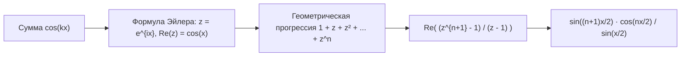
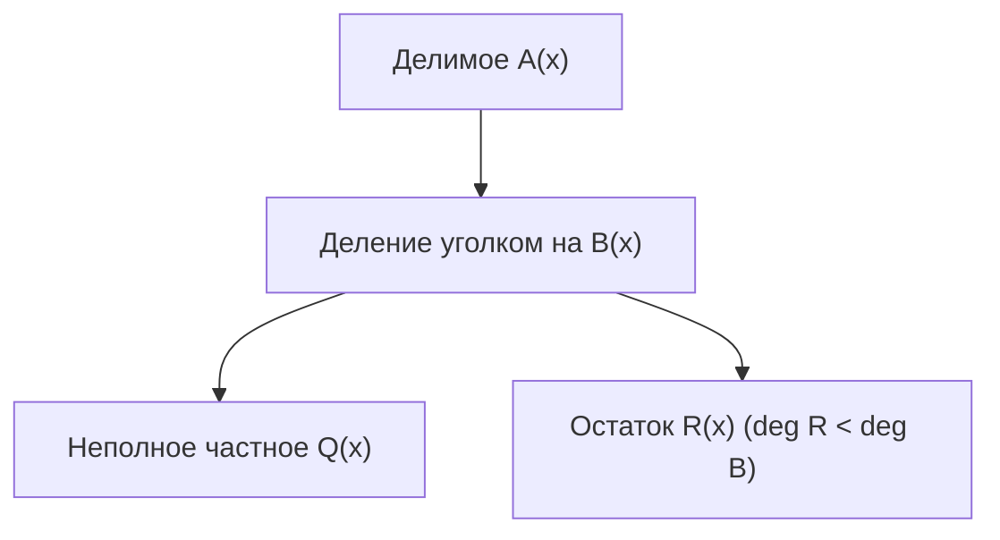
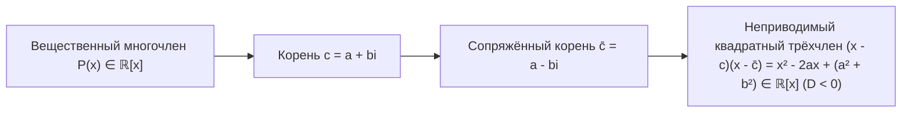

# Лекция 3 (продолжение): Кольцо многочленов, теорема Безу, основная теорема алгебры и теорема Виета

---

## 1. Рекомендуемая литература

* **Кострикин А. И. — «Введение в алгебру. Часть I: Основы алгебры»**  
  *Глава 3: Многочлены (деление с остатком, схема Горнера, корни многочленов, кратные корни, дифференцирование).*
* **Винберг Э. Б. — «Курс алгебры»**  
  *Глава 4: Кольца многочленов, факториальность $K[x]$, неприводимые многочлены над $\mathbb{R}$ и $\mathbb{C}$, геометрический смысл корней.*
* **Курош А. Г. — «Курс высшей алгебры»**  
  *Классическое строгое изложение теоремы Безу, основной теоремы алгебры и симметрических многочленов (формулы Виета).*
* **Фаддеев Д. К., Соминский И. С. — «Сборник задач по высшей алгебре»**  
  *Серии задач на тригонометрические суммы, интерполяцию, деление уголком и разложение на неприводимые множители.*

---

## 2. Тригонометрическое упражнение: суммирование косинусов через комплексную экспоненту

### Задача:
Вычислить тригонометрическую сумму:
$$S_n = \sum_{k=0}^n \cos(kx) = \cos(0) + \cos(x) + \cos(2x) + \dots + \cos(nx)$$

### Решение:
1. По формуле Эйлера: $e^{ikx} = \cos(kx) + i \sin(kx)$, откуда:
   $$\cos(kx) = \operatorname{Re}\left(e^{ikx}\right) = \frac{e^{ikx} + e^{-ikx}}{2}$$
2. Обозначим $z = e^{ix}$. Если $x \ne 2\pi m$ ($m \in \mathbb{Z}$), то $z \ne 1$.
3. Исходная сумма представляет собой вещественную часть суммы геометрической прогрессии со знаменателем $z$:
   $$\sum_{k=0}^n z^k = 1 + z + z^2 + \dots + z^n = \frac{z^{n+1} - 1}{z - 1}$$
4. Преобразуем числитель и знаменатель, вынося половинные углы:
   $$z^{n+1} - 1 = e^{i(n+1)x} - 1 = e^{i\frac{n+1}{2}x} \left( e^{i\frac{n+1}{2}x} - e^{-i\frac{n+1}{2}x} \right) = 2i \sin\left( \frac{n+1}{2}x \right) e^{i\frac{n+1}{2}x}$$
   $$z - 1 = e^{ix} - 1 = 2i \sin\left( \frac{x}{2} \right) e^{i\frac{x}{2}}$$
5. Делим числитель на знаменатель:
   $$\frac{z^{n+1} - 1}{z - 1} = \frac{2i \sin\left(\frac{n+1}{2}x\right) e^{i\frac{n+1}{2}x}}{2i \sin\left(\frac{x}{2}\right) e^{i\frac{x}{2}}} = \frac{\sin\left(\frac{n+1}{2}x\right)}{\sin\left(\frac{x}{2}\right)} e^{i\frac{nx}{2}}$$
6. Беря вещественную часть:
   $$S_n = \operatorname{Re}\left( \frac{\sin\left(\frac{n+1}{2}x\right)}{\sin\left(\frac{x}{2}\right)} \left( \cos\left(\frac{nx}{2}\right) + i \sin\left(\frac{nx}{2}\right) \right) \right) = \frac{\sin\left(\frac{n+1}{2}x\right) \cos\left(\frac{nx}{2}\right)}{\sin\left(\frac{x}{2}\right)}$$

---

## 3. Кольцо многочленов $K[x]$

### 3.1. Определение
Пусть $K$ — произвольное поле ($\mathbb{Q}, \mathbb{R}, \mathbb{C}$).  
**Многочленом (полиномом)** от переменной $x$ над полем $K$ называется формальное алгебраическое выражение вида:
$$P(x) = a_n x^n + a_{n-1} x^{n-1} + \dots + a_1 x + a_0 = \sum_{k=0}^n a_k x^k$$
где коэффициенты $a_i \in K$.

* Если $a_n \ne 0$, то $a_n$ называется **старшим коэффициентом**, а $n$ — **степенью многочлена**:
  $$\deg(P(x)) = n$$
* Если старший коэффициент равен единице ($a_n = 1$), многочлен называется **унитарным (приведённым)**.
* Множество всех многочленов от переменной $x$ над полем $K$ обозначается $K[x]$ (например, $\mathbb{R}[x]$ или $\mathbb{C}[x]$).

### 3.2. Алгебраическая структура $K[x]$
Множество $K[x]$ относительно операций сложения и умножения многочленов образует **коммутативное ассоциативное кольцо с единицей** (единица — многочлен нулевой степени $E(x) \equiv 1$) **без делителей нуля** (область целостности).

### 3.3. Свойства степени многочленов:
1. $\deg(P(x) \cdot Q(x)) = \deg(P(x)) + \deg(Q(x))$
2. $\deg(P(x) + Q(x)) \le \max(\deg(P(x)), \deg(Q(x)))$  
   *(причём если $\deg P \ne \deg Q$, то достигается строгое равенство).*
3. Степень ненулевой константы $c \in K \setminus \{0\}$: $\deg(c) = 0$.
4. **Степень нулевого многочлена** формально полагается равной минус бесконечности:
   $$\deg(0) = -\infty$$
   *(это соглашение сохраняет формулу степени произведения: $-\infty + n = -\infty$).*

---

## 4. Деление с остатком в кольце $K[x]$ и теорема Безу

### 4.1. Теорема о делении с остатком
Для любых двух многочленов $A(x), B(x) \in K[x]$, где $B(x) \ne 0$, **существует и притом единственная пара** многочленов $Q(x)$ (неполное частное) и $R(x)$ (остаток), таких что:
$$A(x) = B(x) \cdot Q(x) + R(x), \qquad \text{причём } \deg(R(x)) < \deg(B(x))$$

### Доказательство:

#### Шаг 1: Существование (Метод математической индукции по степени $n = \deg A$)
Пусть $m = \deg B(x) \ge 0$.
* **База индукции ($n < m$):**  
  Если $\deg A < \deg B$, то просто полагаем:
  $$Q(x) = 0, \qquad R(x) = A(x)$$
  Действительно: $A(x) = B(x) \cdot 0 + A(x)$, при этом $\deg R = \deg A < m$. База доказана.
* **Индукционный переход:**  
  Пусть утверждение доказано для всех многочленов степени $\le n$ ($n \ge m$). Докажем его для многочлена $A(x)$ степени $n + 1$.  
  Пусть $A(x) = a_{n+1} x^{n+1} + \dots$ и $B(x) = b_m x^m + \dots$ ($b_m \ne 0$).  
  Рассмотрим вспомогательный многочлен:
  $$\widetilde{A}(x) = A(x) - \frac{a_{n+1}}{b_m} x^{n+1-m} B(x)$$
  Старшие члены сокращаются: $a_{n+1} x^{n+1} - \frac{a_{n+1}}{b_m} x^{n+1-m} \cdot (b_m x^m) = 0$.  
  Следовательно, $\deg \widetilde{A}(x) \le n$.  
  По предположению индукции для $\widetilde{A}(x)$ существуют $\widetilde{Q}(x)$ и $R(x)$ такие, что:
  $$\widetilde{A}(x) = B(x) \widetilde{Q}(x) + R(x), \quad \deg R < m$$
  Подставляя обратно:
  $$A(x) = B(x) \left( \frac{a_{n+1}}{b_m} x^{n+1-m} + \widetilde{Q}(x) \right) + R(x)$$
  Положив $Q(x) = \frac{a_{n+1}}{b_m} x^{n+1-m} + \widetilde{Q}(x)$, получаем искомое представление. Существование доказано. $\square$

#### Шаг 2: Единственность
Предположим, что существуют два различных разложения:
$$A(x) = B(x) Q_1(x) + R_1(x) = B(x) Q_2(x) + R_2(x)$$
$$B(x) \big( Q_1(x) - Q_2(x) \big) = R_2(x) - R_1(x)$$
Если $Q_1(x) \ne Q_2(x)$, то левая часть имеет степень:
$$\deg\big(B(x) (Q_1 - Q_2)\big) = \deg B + \deg(Q_1 - Q_2) \ge \deg B = m$$
Однако правая часть имеет степень:
$$\deg(R_2 - R_1) \le \max(\deg R_2, \deg R_1) < m$$
Получили строгое противоречие ($\ge m$ и $< m$).  
Следовательно, $Q_1(x) = Q_2(x)$, откуда $R_1(x) = R_2(x)$. Единственность доказана. $\blacksquare$

---

### 4.2. Теорема Безу
**Остаток от деления многочлена $P(x)$ на линейный двучлен $(x - c)$ равен значению этого многочлена в точке $c$:**
$$R = P(c)$$

* **Доказательство:**
  По теореме о делении с остатком на делитель степени $1$:
  $$P(x) = (x - c) Q(x) + R$$
  Так как $\deg R < \deg(x - c) = 1$, остаток $R$ — это константа из поля $K$.  
  Подставим значение $x = c$:
  $$P(c) = (c - c) Q(c) + R = 0 \cdot Q(c) + R = R \implies R = P(c) \quad \blacksquare$$

#### Следствия теоремы Безу:
1. **Критерий делимости на $(x - c)$:**  
   Число $c \in K$ является корнем многочлена $P(x)$ ($P(c) = 0$) тогда и только тогда, когда $P(x)$ делится на $(x - c)$ без остатка:
   $$P(c) = 0 \iff P(x) = (x - c) Q(x)$$
2. Многочлен степени $n$ над полем $K$ не может иметь более $n$ различных корней в $K$.

---

## 5. Основная теорема алгебры (Теорема Гаусса — Д’Аламбера)

### Формулировка
Всякий многочлен $P(x) \in \mathbb{C}[x]$ степени $n \ge 1$ с комплексными коэффициентами **имеет по крайней мере один комплексный корень**:
$$\exists c \in \mathbb{C} : P(c) = 0$$

> Поле комплексных чисел $\mathbb{C}$ является **алгебраически замкнутым полем**.

### Следствие (О полном разложении на линейные множители над $\mathbb{C}$):
Всякий многочлен $P(x) = a_n x^n + \dots + a_0 \in \mathbb{C}[x]$ степени $n \ge 1$ **единственным образом** (с точностью до порядка множителей) раскладывается над полем $\mathbb{C}$ на $n$ линейных множителей:
$$P(x) = a_n (x - c_1)(x - c_2) \cdots (x - c_n)$$
где $c_1, c_2, \dots, c_n \in \mathbb{C}$ — корни многочлена.

---

## 6. Кратность корней многочлена

### Определение
Число $c \in K$ называется **корнем кратности $k$ ($k \ge 1$)** многочлена $P(x)$, если $P(x)$ делится на $(x - c)^k$, но не делится на $(x - c)^{k+1}$:
$$P(x) = (x - c)^k \cdot Q(x), \qquad Q(c) \ne 0$$
* Если $k = 1$, корень называется **простым**.
* Если $k > 1$, корень называется **кратным**.
* С учётом кратности любой многочлен степени $n$ над $\mathbb{C}$ имеет **ровно $n$ комплексных корней**:
  $$\sum_{j=1}^m k_j = n$$

---

## 7. Комплексно сопряжённые корни вещественных многочленов

### Теорема
Пусть $P(x) = \sum_{k=0}^n a_k x^k \in \mathbb{R}[x]$ — многочлен с **вещественными коэффициентами** ($a_k \in \mathbb{R}$).  
Если комплексное число $c = a + bi \in \mathbb{C}$ является корнем многочлена $P(x)$, то сопряжённое число $\bar{c} = a - bi$ также является корнем $P(x)$, причём той же самой кратности:
$$P(c) = 0 \implies P(\bar{c}) = 0$$

### Доказательство:
1. Напомним фундаментальные свойства комплексного сопряжения для любых $z_1, z_2 \in \mathbb{C}$:
   $$\overline{z_1 + z_2} = \bar{z}_1 + \bar{z}_2, \qquad \overline{z_1 \cdot z_2} = \bar{z}_1 \cdot \bar{z}_2, \qquad \overline{z^k} = (\bar{z})^k$$
2. Поскольку все коэффициенты $a_k$ вещественны, то $\bar{a}_k = a_k$.
3. Вычислим значение многочлена от сопряжённого аргумента $\bar{c}$:
   $$P(\bar{c}) = \sum_{k=0}^n a_k (\bar{c})^k = \sum_{k=0}^n \bar{a}_k \overline{(c^k)} = \sum_{k=0}^n \overline{a_k c^k} = \overline{\sum_{k=0}^n a_k c^k} = \overline{P(c)}$$
4. Так как по условию $c$ — корень, то $P(c) = 0$. Следовательно:
   $$P(\bar{c}) = \bar{0} = 0$$
   Число $\bar{c}$ действительно является корнем многочлена $P(x)$. $\blacksquare$

---

## 8. Разложение многочленов над полем вещественных чисел $\mathbb{R}$

### Теорема
Всякий многочлен $P(x) \in \mathbb{R}[x]$ степени $n \ge 1$ раскладывается над полем вещественных чисел $\mathbb{R}$ в произведение **вещественных линейных множителей** и **вещественных квадратных трехчленов с отрицательным дискриминантом**:
$$P(x) = a_n (x - x_1)^{k_1} \dots (x - x_s)^{k_s} (x^2 + p_1 x + q_1)^{m_1} \dots (x^2 + p_r x + q_r)^{m_r}$$
где $p_j^2 - 4q_j < 0$ (неприводимы над $\mathbb{R}$).

### Доказательство:
1. Над $\mathbb{C}$ многочлен раскладывается на $n$ линейных множителей.
2. Каждому вещественному корню $x_j$ соответствует множитель $(x - x_j) \in \mathbb{R}[x]$.
3. Невещественные корни разбиваются на пары сопряжённых: $c = a + bi$ и $\bar{c} = a - bi$.
4. Перемножая пару множителей, соответствующих сопряжённым корням:
   $$(x - c)(x - \bar{c}) = x^2 - (c + \bar{c})x + c\bar{c} = x^2 - 2ax + (a^2 + b^2)$$
   Коэффициенты $-2a$ и $a^2 + b^2$ являются вещественными числами!
   Дискриминант этого трехчлена:
   $$D = (-2a)^2 - 4(a^2 + b^2) = 4a^2 - 4a^2 - 4b^2 = -4b^2 < 0 \quad (b \ne 0)$$
   Таким образом, все комплексные множители объединяются в вещественные неприводимые квадратные трехчлены. $\blacksquare$

---

## 9. Теорема Виета для многочленов $n$-й степени

### Формулировка
Пусть $P(x) = a_n x^n + a_{n-1} x^{n-1} + \dots + a_1 x + a_0 \in \mathbb{C}[x]$ ($a_n \ne 0$) имеет корни $c_1, c_2, \dots, c_n$.  
Тогда элементарные симметрические многочлены от корней выражаются через отношения коэффициентов к старшему:

$$\sigma_1 = \sum_{i=1}^n c_i = c_1 + c_2 + \dots + c_n = -\frac{a_{n-1}}{a_n}$$
$$\sigma_2 = \sum_{1 \le i < j \le n} c_i c_j = c_1 c_2 + c_1 c_3 + \dots = +\frac{a_{n-2}}{a_n}$$
$$\sigma_k = \sum_{1 \le i_1 < \dots < i_k \le n} c_{i_1} \cdots c_{i_k} = (-1)^k \frac{a_{n-k}}{a_n}$$
$$\sigma_n = c_1 c_2 \cdots c_n = (-1)^n \frac{a_0}{a_n}$$

*(Строгое доказательство теоремы Виета через раскрытие скобок унитарного произведения вынесено в ДЗ к лекции).*
