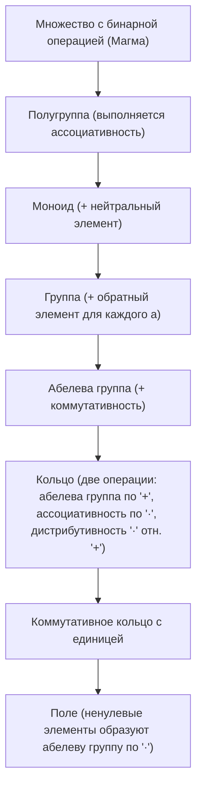

# Справочник: Основные законы и свойства алгебраических операций

Данный справочник содержит строгое математическое описание фундаментальных свойств операций (коммутативность, ассоциативность, дистрибутивность и др.), примеры и контрпримеры из различных разделов математики, сводные таблицы и ссылки на классическую университетскую литературу.

---

## 1. Базовые определения

Пусть $X$ — произвольное непустое множество.
* **Бинарная алгебраическая операция** на $X$ — это отображение:
  $$* \colon X \times X \to X, \quad (a, b) \mapsto a * b$$
  (операция сопоставляет любой упорядоченной паре элементов множества $X$ единственный элемент того же множества — свойство *замкнутости*).

---

## 2. Свойства одиночных бинарных операций

### 2.1. Коммутативность (переместительный закон)

> **Определение:** Операция $*$ называется **коммутативной** на $X$, если порядок операндов не влияет на результат:
> $$\forall a, b \in X \colon \quad a * b = b * a$$

* **Где выполняется:**
  * Сложение и умножение в $\mathbb{N}, \mathbb{Z}, \mathbb{Q}, \mathbb{R}, \mathbb{C}$.
  * Объединение ($\cup$) и пересечение ($\cap$) множеств: $A \cup B = B \cup A$, $A \cap B = B \cap A$.
  * Логические операции конъюнкции ($\wedge$) и дизъюнкции ($\vee$).
  * Скалярное произведение векторов: $\mathbf{a} \cdot \mathbf{b} = \mathbf{b} \cdot \mathbf{a}$.
  * Сложение матриц одинакового размера: $A + B = B + A$.

* **Контрпримеры (где свойство НЕ выполняется):**
  * **Вычитание и деление чисел:** $5 - 3 \neq 3 - 5$; $6 / 2 \neq 2 / 6$.
  * **Умножение квадратных матриц:** в общем случае $A B \neq B A$ (даже если оба произведения определены и имеют одинаковый размер).
  * **Композиция функций / преобразований:** $(f \circ g)(x) \neq (g \circ f)(x)$.
  * **Конкатенация строк:** `"ab" + "cd" = "abcd" \neq "cdab"`.
  * **Векторное произведение в $\mathbb{R}^3$:** обладает свойством *антикоммутативности*:
    $$\mathbf{a} \times \mathbf{b} = -(\mathbf{b} \times \mathbf{a})$$

---

### 2.2. Ассоциативность (сочетательный закон)

> **Определение:** Операция $*$ называется **ассоциативной** на $X$, если расстановка скобок при последовательном применении операции не влияет на результат:
> $$\forall a, b, c \in X \colon \quad (a * b) * c = a * (b * c)$$

* **Значение свойства:** Ассоциативность позволяет однозначно определить выражение из любого числа операндов $a_1 * a_2 * \dots * a_n$ без указания скобок (теорема об обобщённой ассоциативности).

* **Где выполняется:**
  * Сложение и умножение чисел ($\mathbb{Z}, \mathbb{R}, \mathbb{C}$).
  * **Умножение матриц:** $(A B) C = A (B C)$ — матричное умножение ассоциативно, хотя и некоммутативно!
  * Композиция функций: $(f \circ (g \circ h)) = ((f \circ g) \circ h)$.
  * Логические $\wedge, \vee$ и теоретико-множественные $\cap, \cup$.
  * Конкатенация строк: `("a" + "b") + "c" = "a" + ("b" + "c")`.

* **Контрпримеры:**
  * **Вычитание и деление:**
    $$(8 - 4) - 2 = 4 - 2 = 2 \quad \neq \quad 8 - (4 - 2) = 8 - 2 = 6$$
    $$(24 / 6) / 2 = 4 / 2 = 2 \quad \neq \quad 24 / (6 / 2) = 24 / 3 = 8$$
  * **Возведение в степень:**
    $$(2^3)^2 = 8^2 = 64 \quad \neq \quad 2^{(3^2)} = 2^9 = 512$$
    *(по общепринятому соглашению $a^{b^c} = a^{(b^c)}$, т.е. возведение в степень правоассоциативно)*.
  * **Векторное произведение:** $(\mathbf{a} \times \mathbf{b}) \times \mathbf{c} \neq \mathbf{a} \times (\mathbf{b} \times \mathbf{c})$. Вместо ассоциативности выполняется *тождество Якоби*:
    $$\mathbf{a} \times (\mathbf{b} \times \mathbf{c}) + \mathbf{b} \times (\mathbf{c} \times \mathbf{a}) + \mathbf{c} \times (\mathbf{a} \times \mathbf{b}) = \mathbf{0}$$

---

### 2.3. Нейтральный элемент (единичный / нулевой)

> **Определение:** Элемент $e \in X$ называется **нейтральным** относительно операции $*$, если:
> $$\forall a \in X \colon \quad e * a = a * e = a$$
> *(Если $e * a = a$, то $e$ — левый нейтральный; если $a * e = a$ — правый).*

* **Теорема о единственности:** Если нейтральный элемент существует, то он единственен.
* **Примеры:**
  * По сложению в $\mathbb{R}$: нейтральный элемент — число $0$ ($a + 0 = 0 + a = a$).
  * По умножению в $\mathbb{R}$: нейтральный элемент — число $1$ ($a \cdot 1 = 1 \cdot a = a$).
  * По умножению квадратных матриц: единичная матрица $I$ ($A I = I A = A$).
  * В алгебре множеств: для $\cup$ нейтральный — пустое множество $\varnothing$; для $\cap$ — универсальное множество $U$.

---

### 2.4. Симметричный (обратный / противоположный) элемент

> **Определение:** Пусть относительно операции $*$ существует нейтральный элемент $e$. Элемент $a^{-1} \in X$ называется **обратным** к $a$, если:
> $$a * a^{-1} = a^{-1} * a = e$$
> В аддитивной записи (для сложения) обратный элемент обозначается $-a$ и называется **противоположным**: $a + (-a) = 0$.

* **Теорема:** В ассоциативной системе с нейтральным элементом обратный к $a$ (если существует) единственен.

---

### 2.5. Идемпотентность

> **Определение:** Операция $*$ называется **идемпотентной**, если применение операции к двум одинаковым элементам возвращает тот же элемент:
> $$\forall a \in X \colon \quad a * a = a$$

* **Где выполняется:**
  * Операции над множествами: $A \cup A = A$, $A \cap A = A$.
  * Логические связки: $P \wedge P \equiv P$, $P \vee P \equiv P$.
  * Операции выбора максимума и минимума: $\max(a, a) = a$, $\min(a, a) = a$.
* **В обычной арифметике:** сложение и умножение чисел **не** являются идемпотентными (равенство $a + a = a$ выполнено только для $a = 0$, а $a \cdot a = a$ — только для $a \in \{0, 1\}$).

---

## 3. Свойства взаимодействия двух операций

Пусть на множестве $X$ заданы две операции: $\cdot$ (умножение / первая операция) и $+$ (сложение / вторая операция).

### 3.1. Дистрибутивность (распределительный закон)

> **Определение:**
> 1. Операция $\cdot$ называется **леводистрибутивной** относительно $+$, если:
>    $$\forall a, b, c \in X \colon \quad a \cdot (b + c) = (a \cdot b) + (a \cdot c)$$
> 2. Операция $\cdot$ называется **праводистрибутивной** относительно $+$, если:
>    $$\forall a, b, c \in X \colon \quad (b + c) \cdot a = (b \cdot a) + (c \cdot a)$$
> 3. Если операция $\cdot$ одновременно лево- и праводистрибутивна, она называется просто **дистрибутивной** относительно $+$.

*(Примечание: если операция $\cdot$ коммутативна, то из леводистрибутивности автоматически следует праводистрибутивность).*

* **Примеры:**
  * **Числовые кольца и поля ($\mathbb{Z}, \mathbb{Q}, \mathbb{R}, \mathbb{C}$):**
    Умножение дистрибутивно относительно сложения:
    $$a \cdot (b + c) = a \cdot b + a \cdot c$$
  * **Матрицы:**
    Матричное умножение дистрибутивно относительно сложения матриц:
    $$A(B + C) = AB + AC \quad \text{и} \quad (B + C)A = BA + CA$$
    *(Из-за некоммутативности умножения здесь критически важно различать левую и правую дистрибутивность).*
  * **Векторное произведение относительно сложения векторов:**
    $$\mathbf{a} \times (\mathbf{b} + \mathbf{c}) = (\mathbf{a} \times \mathbf{b}) + (\mathbf{a} \times \mathbf{c})$$
  * **Алгебра множеств (Взаимная дистрибутивность):**
    В отличие от чисел, в алгебре множеств **обе** операции дистрибутивны друг относительно друга:
    1. Пересечение дистрибутивно относительно объединения:
       $$A \cap (B \cup C) = (A \cap B) \cup (A \cap C)$$
    2. Объединение дистрибутивно относительно пересечения:
       $$A \cup (B \cap C) = (A \cup B) \cap (A \cup C)$$
  * **Математическая логика:**
    Конъюнкция и дизъюнкция взаимно дистрибутивны:
    $$P \wedge (Q \vee R) \equiv (P \wedge Q) \vee (P \wedge R)$$
    $$P \vee (Q \wedge R) \equiv (P \vee Q) \wedge (P \vee R)$$

* **Важнейшее предостережение (где дистрибутивность ломается):**
  * В обычной числовой арифметике **сложение НЕ дистрибутивно относительно умножения**:
    $$a + (b \cdot c) \neq (a + b) \cdot (a + c)$$
    *(Например: $1 + (2 \cdot 3) = 7$, но $(1 + 2) \cdot (1 + 3) = 3 \cdot 4 = 12$).*

---

### 3.2. Законы поглощения (Absorption laws)

Свойство пары операций, характерное для решёток и булевых алгебр:
$$\forall a, b \in X \colon \quad a \vee (a \wedge b) = a \quad \text{и} \quad a \wedge (a \vee b) = a$$
* **В алгебре множеств:** $A \cup (A \cap B) = A$ и $A \cap (A \cup B) = A$.

---

### 3.3. Законы де Моргана (взаимодействие с унарной операцией отрицания/дополнения)

Если определена унарная операция дополнения / отрицания:
1. Отрицание конъюнкции (пересечения) есть дизъюнкция (объединение) отрицаний:
   $$\overline{A \cap B} = \overline{A} \cup \overline{B} \qquad \neg (P \wedge Q) \equiv \neg P \vee \neg Q$$
2. Отрицание дизъюнкции (объединения) есть конъюнкция (пересечение) отрицаний:
   $$\overline{A \cup B} = \overline{A} \cap \overline{B} \qquad \neg (P \vee Q) \equiv \neg P \wedge \neg Q$$

---

## 4. Сводная таблица свойств в различных структурах

| Свойство | Числа $(\mathbb{R}, +, \cdot)$ | Матрицы $(M_n(\mathbb{R}), +, \cdot)$ | Множества $(\mathcal{P}(U), \cup, \cap)$ | Логика $(\{0,1\}, \vee, \wedge)$ | Векторы $(\mathbb{R}^3, +, \times)$ |
| :--- | :---: | :---: | :---: | :---: | :---: |
| **Коммутативность 1-й оп.** | Да ($a+b=b+a$) | Да ($A+B=B+A$) | Да ($A\cup B = B\cup A$) | Да ($P\vee Q = Q\vee P$) | Да ($\mathbf{a}+\mathbf{b}=\mathbf{b}+\mathbf{a}$) |
| **Коммутативность 2-й оп.** | Да ($ab = ba$) | **Нет** ($AB \neq BA$) | Да ($A\cap B = B\cap A$) | Да ($P\wedge Q = Q\wedge P$) | **Нет** ($\mathbf{a}\times\mathbf{b} = -\mathbf{b}\times\mathbf{a}$) |
| **Ассоциативность 1-й оп.** | Да | Да | Да | Да | Да |
| **Ассоциативность 2-й оп.** | Да | Да | Да | Да | **Нет** (Тождество Якоби) |
| **Дистрибутивность 2-й отн. 1-й** | Да ($a(b+c)=ab+ac$) | Да (левая и правая) | Да ($A\cap(B\cup C)$) | Да ($P\wedge(Q\vee R)$) | Да ($\mathbf{a}\times(\mathbf{b}+\mathbf{c})$) |
| **Дистрибутивность 1-й отн. 2-й** | **Нет** ($a+bc \neq (a+b)(a+c)$) | **Нет** | Да ($A\cup(B\cap C)$) | Да ($P\vee(Q\wedge R)$) | **Нет** |
| **Идемпотентность 1-й оп.** | Нет ($a+a \neq a$) | Нет | Да ($A\cup A = A$) | Да ($P\vee P \equiv P$) | Нет |
| **Идемпотентность 2-й оп.** | Нет ($a\cdot a \neq a$) | Нет | Да ($A\cap A = A$) | Да ($P\wedge P \equiv P$) | Нет ($\mathbf{a}\times\mathbf{a} = \mathbf{0}$) |

---

## 5. Иерархия основных алгебраических структур

Алгебраические системы классифицируются в зависимости от того, какими из перечисленных свойств обладают их операции:

1. **Группа** $(G, *)$:
   * Ассоциативность: $(a * b) * c = a * (b * c)$.
   * Существование нейтрального элемента $e$: $a * e = e * a = a$.
   * Существование обратного $a^{-1}$: $a * a^{-1} = a^{-1} * a = e$.
   * *(Если дополнительно $a * b = b * a$, то группа называется **коммутативной (абелевой)**)*.
2. **Кольцо** $(R, +, \cdot)$:
   * По сложению $+$ — абелева группа (нейтральный $0$, обратный $-a$).
   * По умножению $\cdot$ — ассоциативность: $(a \cdot b) \cdot c = a \cdot (b \cdot c)$.
   * Умножение дистрибутивно относительно сложения: $a(b + c) = ab + ac$ и $(a + b)c = ac + bc$.
3. **Поле** $(F, +, \cdot)$:
   * Является коммутативным кольцом с единицей $1 \neq 0$.
   * Все ненулевые элементы образуют абелеву группу по умножению (для любого $a \neq 0$ существует обратный $a^{-1}$).
   * Классические примеры полей: $\mathbb{Q}, \mathbb{R}, \mathbb{C}$, а также конечные поля Галуа $\mathbb{F}_p$.

---

## 6. Рекомендуемая литература

Для углублённого изучения свойств операций и алгебраических структур рекомендуется обратиться к фундаментальным академическим учебникам:

1. **Кострикин А. И.** *Введение в алгебру. Часть I. Основы алгебры.* — М.: Физматлит, 2004.
   * *Глава 1: Элементарные алгебраические понятия (полугруппы, группы, кольца, поля, аксиомы операций).*
2. **Винберг Э. Б.** *Курс алгебры.* — 3-е изд. — М.: Факториал Пресс, 2002.
   * *Глава 1: Основные структуры (подробно рассмотрены законы дистрибутивности, коммутативности, фактор-структуры).*
3. **Курош А. Г.** *Курс высшей алгебры.* — М.: Наука, 1975 (переизд. Лань, 2021).
   * *Классическое университетское пособие по линейной и общей алгебре.*
4. **Ван дер Варден Б. Л.** *Алгебра.* — М.: Наука, 1976 (пер. с нем.).
   * *Мировая классика абстрактной алгебры. Главы 1–3 посвящены аксиоматике групп, колец и полей.*
5. **Зорич В. А.** *Математический анализ. Часть I.* — М.: МЦНМО, 2019.
   * *Глава 2: Вещественные числа (аксиоматическое построение поля $\mathbb{R}$, аддитивные и мультипликативные аксиомы, дистрибутивность).*
6. **Биркгоф Г., Барти Т.** *Современная прикладная алгебра.* — М.: Мир, 1976.
   * *Отличный источник по полурешёткам, решёткам, булевым алгебрам и законам поглощения/идемпотентности.*
