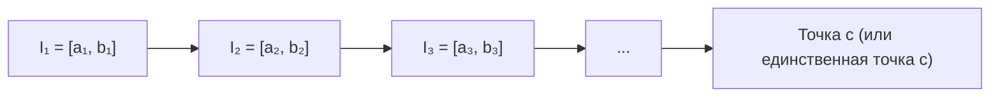
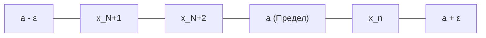
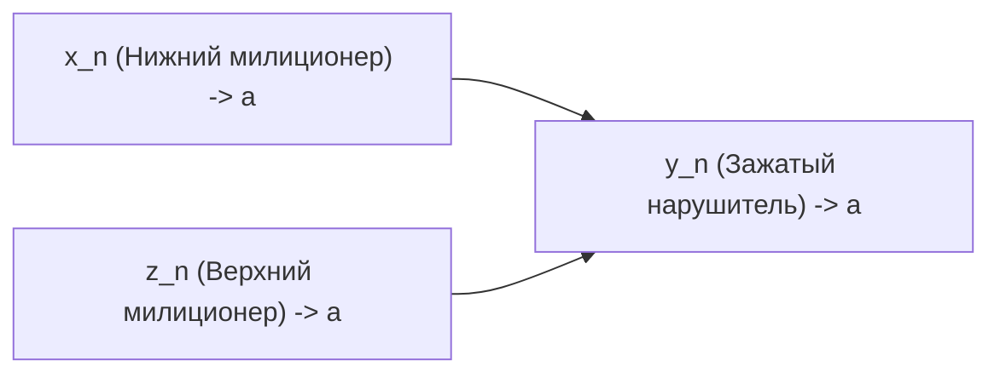
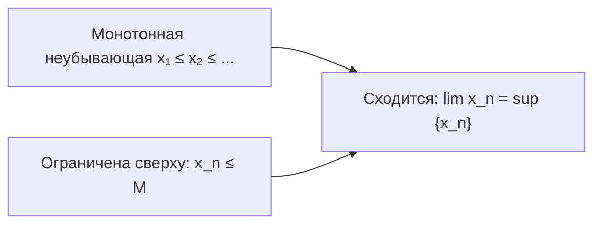

# Лекция 4: Принцип вложенных отрезков Кантора, мощности, грани и пределы последовательностей 💀

---

## 1. Рекомендуемая литература

* **Зорич В. А. — «Математический анализ. Часть I»**  
  *Глава 2: Вещественные числа (Принцип вложенных отрезков Кантора, точность граней $\sup$ и $\inf$). Глава 3: Предел последовательности (Теорема о пределе монотонной последовательности Вейерштрасса, арифметические свойства, лемма о двух милиционерах).*
* **Кудрявцев Л. Д. — «Курс математического анализа. Том 1»**  
  *Глава 1, §3–§5: Полнота множества действительных чисел, несчётность континуума, свойства пределов числовых последовательностей.*
* **Фихтенгольц Г. М. — «Курс дифференциального и интегрального исчисления. Том 1»**  
  *Глава 1: Числовые последовательности и их пределы (Предельный переход в неравенствах, свойства бесконечно малых, число $e$).*

---

## 2. Принцип вложенных отрезков Кантора

### 2.1. Определение системы вложенных отрезков
Последовательность замкнутых отрезков $I_n = [a_n, b_n] \subset \mathbb{R}$ ($n \in \mathbb{N}$) называется **системой вложенных отрезков**, если каждый последующий отрезок целиком содержится в предыдущем:
$$I_1 \supseteq I_2 \supseteq I_3 \supseteq \dots \supseteq I_n \supseteq I_{n+1} \supseteq \dots$$
Это условие равносильно системе неравенств на концы отрезков:
$$a_1 \le a_2 \le a_3 \le \dots \le a_n \le \dots \le b_n \le \dots \le b_3 \le b_2 \le b_1$$

---

### 2.2. Теорема Кантора о вложенных отрезках
1. **(Существование общей точки):** Для любой системы вложенных отрезков существует хотя бы одна точка $c \in \mathbb{R}$, принадлежащая **всем** отрезкам этой системы:
   $$\bigcap_{n=1}^\infty I_n \ne \varnothing \iff \exists c \in \mathbb{R} : \forall n \in \mathbb{N} \implies c \in I_n \; (a_n \le c \le b_n)$$
2. **(Стягивающиеся отрезки и единственность):** Если длины отрезков стремятся к нулю (отрезки стягиваются):
   $$\lim_{n \to \infty} (b_n - a_n) = 0 \iff \forall \varepsilon > 0, \; \exists N(\varepsilon) \in \mathbb{N} : \forall n > N(\varepsilon) \implies b_n - a_n < \varepsilon$$
   то общая точка $c$ **единственна**:
   $$\bigcap_{n=1}^\infty I_n = \{c\}$$

---

### 2.3. Строгое доказательство теоремы Кантора

#### Шаг 1: Доказательство существования (через аксиому непрерывности Дедекинда)
1. Рассмотрим множество всех левых концов $A = \{a_n \mid n \in \mathbb{N}\}$ и множество всех правых концов $B = \{b_m \mid m \in \mathbb{N}\}$.
2. Докажем, что **любой левый конец не превосходит любого правого конца**: $\forall k, m \in \mathbb{N} \implies a_k \le b_m$.
   * Если $k \le m$, то в силу вложенности: $a_k \le a_m \le b_m$.
   * Если $k > m$, то аналогично: $a_k \le b_k \le b_m$.
   Следовательно, неравенство $a_k \le b_m$ выполняется абсолютно для всех пар $(k, m)$.
3. По аксиоме непрерывности Дедекинда для числовой оси $\mathbb{R}$, существует число $c \in \mathbb{R}$, разделяющее числовые множества $A$ и $B$:
   $$\forall k, m \in \mathbb{N} \implies a_k \le c \le b_m$$
4. В частности, положив $k = m = n$, получаем для любого $n \in \mathbb{N}$:
   $$a_n \le c \le b_n \iff c \in [a_n, b_n] = I_n$$
   Таким образом, точка $c$ принадлежит всем отрезкам системы. $\square$

#### Шаг 2: Доказательство единственности от противного (для стягивающихся отрезков)
1. Предположим, что существуют **две различные** общие точки $c_1, c_2 \in \bigcap_{n=1}^\infty I_n$, причём $c_1 < c_2$.
2. Обозначим фиксированное строго положительное расстояние между ними: $d = c_2 - c_1 > 0$.
3. Так как обе точки лежат во всех отрезках:
   $$\forall n \in \mathbb{N} \implies a_n \le c_1 < c_2 \le b_n \implies b_n - a_n \ge c_2 - c_1 = d > 0$$
   Следовательно, длина любого отрезка системы не может быть меньше фиксированного числа $d$:
   $$|I_n| \ge d, \quad \forall n \in \mathbb{N}$$
4. Однако по условию стягиваемости длины отрезков стремятся к нулю: выберем $\varepsilon = \frac{d}{2} > 0$.  
   По определению стягиваемости найдётся такой номер $N$, что для всех $n > N$:
   $$b_n - a_n < \varepsilon = \frac{d}{2}$$
5. Получаем строгое противоречие: $d \le b_n - a_n < \frac{d}{2} \implies d < \frac{d}{2}$, что невозможно при $d > 0$.  
   Следовательно, наше предположение неверно: общая точка $c$ **единственна**. $\blacksquare$

---

## 3. Несчётность континуума (Мощность отрезка $[0, 1]$)

### 3.1. Определение
* Мощность множества точек отрезка $[0, 1]$ (а также всей числовой прямой $\mathbb{R}$) обозначается символом $\mathfrak{c}$ (или $\operatorname{card}([0, 1])$) и называется **мощностью континуума** (от лат. *continuum* — непрерывное).
* **Теорема Кантора:** Мощность континуума строго больше счётной мощности:
  $$\mathfrak{c} = |[0, 1]| = |\mathbb{R}| = 2^{\aleph_0} > \aleph_0$$

### 3.2. Доказательство несчётности через принцип вложенных отрезков
1. Докажем от противного: предположим, что отрезок $[0, 1]$ **счётен**.
2. Тогда все его элементы можно перенумеровать и выписать в виде бесконечной последовательности:
   $$[0, 1] = \{x_1, x_2, x_3, \dots, x_n, \dots\}$$
3. Разобьём отрезок $I_0 = [0, 1]$ на три равные части: $[0, 1/3]$, $[1/3, 2/3]$, $[2/3, 1]$.  
   Точка $x_1$ не может лежать одновременно во всех трёх подотрезках. Выберем тот из них, который **не содержит точку $x_1$**, и обозначим его $I_1 = [a_1, b_1]$. При этом $x_1 \notin I_1$, а длина $|I_1| = \frac{1}{3}$.
4. Разделим $I_1$ на три равные части и выберем отрезок $I_2 \subset I_1$, **не содержащий точку $x_2$**. При этом $x_2 \notin I_2$, а длина $|I_2| = \frac{1}{3^2}$.
5. Продолжая этот процесс по индукции, на $n$-м шаге строим отрезок $I_n \subset I_{n-1}$ длины $|I_n| = \frac{1}{3^n}$, такой что:
   $$x_n \notin I_n$$
6. Мы построили систему вложенных стягивающихся отрезков $I_1 \supseteq I_2 \supseteq \dots \supseteq I_n \supseteq \dots$, длины которых стремятся к нулю: $|I_n| = \frac{1}{3^n} \to 0$.
7. По теореме Кантора существует общая точка $\xi \in \bigcap_{n=1}^\infty I_n \subset [0, 1]$.
8. Зададимся вопросом: **какой номер имеет число $\xi$ в исходной нумерации?**
   * Если $\xi = x_k$ для некоторого $k \in \mathbb{N}$, то по построению $x_k \notin I_k$, следовательно, $\xi \notin I_k$, что противоречит тому, что $\xi$ принадлежит **всем** отрезкам $I_n$!
9. Противоречие доказывает, что элемент $\xi \in [0, 1]$ не вошёл в перечень. Значит, отрезок $[0, 1]$ **несчётен**. $\blacksquare$

---

## 4. Точные числовые грани: Супремум ($\sup$) и Инфимум ($\inf$)

### 4.1. Определения ограниченности
Пусть $E \subset \mathbb{R}$ — непустое числовое подмножество.
* Множество $E$ называется **ограниченным сверху**, если существует число $M \in \mathbb{R}$, такое что:
  $$\forall x \in E \implies x \le M$$
  (число $M$ называется *верхней гранью* множества $E$).
* Множество $E$ называется **ограниченным снизу**, если существует число $m \in \mathbb{R}$, такое что:
  $$\forall x \in E \implies x \ge m$$
  (число $m$ называется *нижней гранью* множества $E$).
* Множество называется **ограниченным**, если оно ограничено и сверху, и снизу: $\exists C > 0 : \forall x \in E \implies |x| \le C$.

---

### 4.2. Точная верхняя грань (Супремум — $\sup E$)
Число $M = \sup E$ называется **точным супремумом (наименьшей из верхних граней)** множества $E$, если оно удовлетворяет двум условиям:
1. **$M$ является верхней гранью:** $\forall x \in E \implies x \le M$.
2. **$M$ — наименьшая из верхних граней:** никакое число, меньшее $M$, уже не является верхней гранью множества $E$:
   $$\forall \varepsilon > 0, \quad \exists x_\varepsilon \in E : x_\varepsilon > M - \varepsilon$$

---

### 4.3. Точная нижняя грань (Инфимум — $\inf E$)
Число $m = \inf E$ называется **точным инфимумом (наибольшей из нижних граней)** множества $E$, если:
1. **$m$ является нижней гранью:** $\forall x \in E \implies x \ge m$.
2. **$m$ — наибольшая из нижних граней:** никакое число, большее $m$, уже не является нижней гранью $E$:
   $$\forall \varepsilon > 0, \quad \exists x_\varepsilon \in E : x_\varepsilon < m + \varepsilon$$

---

### 4.4. Теорема о существовании точных граней
**Всякое непустое ограниченное сверху подмножество $E \subset \mathbb{R}$ имеет в $\mathbb{R}$ точную верхнюю грань $\sup E$.  
Всякое непустое ограниченное снизу подмножество $E \subset \mathbb{R}$ имеет в $\mathbb{R}$ точную нижнюю грань $\inf E$.**

* **Доказательство для $\sup E$:**
  1. Пусть $E \ne \varnothing$ ограничено сверху.
  2. Обозначим через $B$ множество всех верхних граней множества $E$:
     $$B = \{b \in \mathbb{R} \mid \forall x \in E \implies x \le b\}$$
  3. Множество $B \ne \varnothing$ (в силу ограниченности $E$ сверху) и по определению $\forall x \in E, \forall b \in B \implies x \le b$.
  4. По аксиоме Дедекинда существует разделяющее число $c \in \mathbb{R}$, такое что:
     $$\forall x \in E, \; \forall b \in B \implies x \le c \le b$$
  5. Неравенство $x \le c$ ($\forall x \in E$) означает, что $c$ — верхняя грань множества $E$ ($c \in B$).
  6. Неравенство $c \le b$ ($\forall b \in B$) означает, что $c$ не превосходит любой другой верхней грани, то есть является наименьшей из них.
  7. Значит, $c = \sup E$. Для $\inf E$ доказательство полностью аналогично. $\blacksquare$

---

## 5. Предел числовой последовательности

### 5.1. Определение последовательности
**Числовая последовательность** — это функция (отображение) $f: \mathbb{N} \to \mathbb{R}$, ставящая в соответствие каждому натуральному числу $n \in \mathbb{N}$ действительное число $x_n = f(n)$.  
Обозначается: $\{x_n\}_{n=1}^\infty$ или $(x_n)$.

---

### 5.2. Определение предела на языке $\varepsilon$ — $N$ («на языке окрестностей»)
Число $a \in \mathbb{R}$ называется **пределом последовательности** $\{x_n\}$ (пишут: $\lim_{n \to \infty} x_n = a$ или $x_n \to a$), если для любого сколь угодно малого положительного числа $\varepsilon > 0$ существует такой номер $N = N(\varepsilon) \in \mathbb{N}$, начиная с которого все члены последовательности удалены от $a$ менее чем на $\varepsilon$:
$$\lim_{n \to \infty} x_n = a \iff \forall \varepsilon > 0, \; \exists N(\varepsilon) \in \mathbb{N} : \forall n > N(\varepsilon) \implies |x_n - a| < \varepsilon$$

---

### 5.3. Теорема о единственности предела
**Сходящаяся последовательность имеет ровно один предел.**

* **Доказательство от противного:**
  1. Предположим, что последовательность $x_n$ имеет два различных предела:
     $$\lim_{n \to \infty} x_n = a, \qquad \lim_{n \to \infty} x_n = b, \qquad a \ne b$$
  2. Зафиксируем положительное расстояние между ними: $d = |b - a| > 0$.  
     Положим $\varepsilon = \frac{d}{3} = \frac{|b - a|}{3} > 0$.
  3. По определению предела:
     * Для $a$: $\exists N_1 \in \mathbb{N} : \forall n > N_1 \implies |x_n - a| < \varepsilon$.
     * Для $b$: $\exists N_2 \in \mathbb{N} : \forall n > N_2 \implies |x_n - b| < \varepsilon$.
  4. Выберем номер $n > \max(N_1, N_2)$. Тогда по неравенству треугольника:
     $$d = |b - a| = |(b - x_n) + (x_n - a)| \le |b - x_n| + |x_n - a| < \varepsilon + \varepsilon = 2\varepsilon = \frac{2}{3} d$$
  5. Получили: $d < \frac{2}{3} d \implies 1 < \frac{2}{3}$ (при $d > 0$), что абсурдно!  
     Противоречие доказывает, что $a = b$. $\blacksquare$

---

### 5.4. Теорема об ограниченности сходящейся последовательности
**Всякая сходящаяся числовая последовательность ограничена.**

* **Доказательство:**
  1. Пусть $\lim_{n \to \infty} x_n = a$. Возьмем $\varepsilon = 1$.
  2. Найдется номер $N$, такой что $\forall n > N \implies |x_n - a| < 1 \iff a - 1 < x_n < a + 1$.
  3. Вне этого интервала может лежать лишь конечное число первых членов: $x_1, x_2, \dots, x_N$.
  4. Положим:
     $$M = \max\big(|x_1|, |x_2|, \dots, |x_N|, |a| + 1\big)$$
     Тогда $\forall n \in \mathbb{N} \implies |x_n| \le M$, следовательно, последовательность ограничена. $\blacksquare$

---

### 5.5. Теорема о сохранении знака и отделимости от нуля
Если $\lim_{n \to \infty} x_n = a$ и $a > 0$, то начиная с некоторого номера все члены последовательности строго положительны и отделены от нуля:
$$\exists N \in \mathbb{N} : \forall n > N \implies x_n > \frac{a}{2} > 0$$

* **Доказательство:**
  Положим в определении предела $\varepsilon = \frac{a}{2} > 0$. Тогда найдётся $N$ такое, что для всех $n > N$:
  $$|x_n - a| < \frac{a}{2} \iff -\frac{a}{2} < x_n - a < \frac{a}{2} \iff \frac{a}{2} < x_n < \frac{3a}{2}$$
  В частности, $x_n > \frac{a}{2} > 0$. $\blacksquare$

---

## 6. Бесконечно малые последовательности (БМП)

### 6.1. Определение
Последовательность $(\alpha_n)$ называется **бесконечно малой (БМП)**, если её предел равен нулю:
$$\lim_{n \to \infty} \alpha_n = 0$$

### 6.2. Критерий сходимости через БМП
$$\lim_{n \to \infty} x_n = a \iff x_n = a + \alpha_n, \quad \text{где } (\alpha_n) \text{ — БМП}$$

---

### 6.3. Теорема об алгебре бесконечно малых
1. **Сумма и разность:** Сумма/разность двух БМП $(\alpha_n)$ и $(\beta_n)$ есть БМП:
   $$\lim_{n \to \infty} (\alpha_n \pm \beta_n) = 0$$
   *Доказательство:* Для любого $\varepsilon > 0$ найдём $N_1$ и $N_2$, где $|\alpha_n| < \varepsilon/2$ и $|\beta_n| < \varepsilon/2$. Для $n > \max(N_1, N_2)$:
   $$|\alpha_n \pm \beta_n| \le |\alpha_n| + |\beta_n| < \frac{\varepsilon}{2} + \frac{\varepsilon}{2} = \varepsilon$$
2. **Умножение на константу:** Для любого $\lambda \in \mathbb{R}$ последовательность $(\lambda \alpha_n)$ есть БМП.
3. **Произведение БМП на ограниченную:** Если $(\alpha_n)$ — БМП, а $(x_n)$ — ограниченная последовательность ($|x_n| \le M$), то их произведение $(\alpha_n \cdot x_n)$ есть БМП:
   $$|\alpha_n x_n| \le M |\alpha_n| < M \cdot \frac{\varepsilon}{M} = \varepsilon \implies \lim_{n \to \infty} (\alpha_n x_n) = 0$$

---

## 7. Арифметические свойства пределов

Пусть $\lim_{n \to \infty} a_n = a$ и $\lim_{n \to \infty} b_n = b$. Тогда:

1. **Предел суммы/разности:**
   $$\lim_{n \to \infty} (a_n \pm b_n) = a \pm b$$
2. **Предел произведения:**
   $$\lim_{n \to \infty} (a_n \cdot b_n) = a \cdot b$$
   *Доказательство:* Представим $a_n = a + \alpha_n$, $b_n = b + \beta_n$:
   $$a_n b_n = (a + \alpha_n)(b + \beta_n) = ab + \underbrace{a \beta_n + b \alpha_n + \alpha_n \beta_n}_{\text{БМП (по теоремам о БМП)}} \implies \lim_{n \to \infty} (a_n b_n) = ab$$
3. **Предел частного:** Если $b \ne 0$ (при этом $b_n \ne 0$ для больших $n$ в силу отделимости от нуля):
   $$\lim_{n \to \infty} \frac{a_n}{b_n} = \frac{a}{b}$$
   *Доказательство:*
   $$\frac{a_n}{b_n} - \frac{a}{b} = \frac{a + \alpha_n}{b + \beta_n} - \frac{a}{b} = \frac{(a + \alpha_n)b - a(b + \beta_n)}{b(b + \beta_n)} = \frac{b \alpha_n - a \beta_n}{b(b + \beta_n)} = \underbrace{(b \alpha_n - a \beta_n)}_{\text{БМП}} \cdot \underbrace{\frac{1}{b(b + \beta_n)}}_{\text{Ограничена}} = \text{БМП}$$
   Следовательно, предел частного равен $\frac{a}{b}$. $\blacksquare$

---

## 8. Теорема о зажатой последовательности («О двух милиционерах / О сэндвиче»)

### Формулировка
Пусть заданы три последовательности $\{x_n\}$, $\{y_n\}$, $\{z_n\}$, такие что:
1. Начиная с некоторого номера $N_0$, выполнено двойное неравенство:
   $$\forall n > N_0 \implies x_n \le y_n \le z_n$$
2. Крайние последовательности сходятся к **одному и тому же пределу**:
   $$\lim_{n \to \infty} x_n = \lim_{n \to \infty} z_n = a$$
Тогда средняя последовательность $\{y_n\}$ также **сходится**, и её предел равен $a$:
$$\lim_{n \to \infty} y_n = a$$

### Доказательство:
1. Зададим произвольное $\varepsilon > 0$.
2. Так как $x_n \to a$, найдётся номер $N_1$, такой что $\forall n > N_1 \implies a - \varepsilon < x_n < a + \varepsilon$.
3. Так как $z_n \to a$, найдётся номер $N_2$, такой что $\forall n > N_2 \implies a - \varepsilon < z_n < a + \varepsilon$.
4. Выберем номер $N = \max(N_0, N_1, N_2)$. Тогда для всех $n > N$:
   $$a - \varepsilon < x_n \le y_n \le z_n < a + \varepsilon \implies a - \varepsilon < y_n < a + \varepsilon \iff |y_n - a| < \varepsilon$$
   Это означает в точности, что $\lim_{n \to \infty} y_n = a$. $\blacksquare$

### Классический пример:
Вычислить предел $y_n = \frac{\sin(n!)}{\sqrt{n}}$.  
Так как $-1 \le \sin(n!) \le 1$, имеем:
$$-\frac{1}{\sqrt{n}} \le \frac{\sin(n!)}{\sqrt{n}} \le \frac{1}{\sqrt{n}}$$
Так как $\lim_{n \to \infty} \left(-\frac{1}{\sqrt{n}}\right) = \lim_{n \to \infty} \left(\frac{1}{\sqrt{n}}\right) = 0$, по теореме о двух милиционерах:
$$\lim_{n \to \infty} \frac{\sin(n!)}{\sqrt{n}} = 0$$

---

## 9. Теорема Вейерштрасса о пределе монотонной последовательности

### Формулировка
**Всякая монотонная ограниченная последовательность имеет конечный предел:**
1. Если последовательность $\{x_n\}$ **не убывает** ($x_1 \le x_2 \le \dots$) и **ограничена сверху**, то она сходится, причём её предел равен её точной верхней грани:
   $$\lim_{n \to \infty} x_n = \sup_{n \in \mathbb{N}} \{x_n\}$$
2. Если последовательность $\{x_n\}$ **не возрастает** ($x_1 \ge x_2 \ge \dots$) и **ограничена снизу**, то она сходится, причём её предел равен её точной нижней грани:
   $$\lim_{n \to \infty} x_n = \inf_{n \in \mathbb{N}} \{x_n\}$$

### Доказательство (для неубывающей последовательности):
1. Пусть $\{x_n\}$ неубывает и ограничена сверху.
2. Множество значений $E = \{x_n \mid n \in \mathbb{N}\}$ непусто и ограничено сверху.  
   По теореме о существовании супремума существует число $a = \sup E$.
3. Докажем, что $\lim_{n \to \infty} x_n = a$:
   * По свойству супремума (1): $\forall n \in \mathbb{N} \implies x_n \le a < a + \varepsilon$.
   * По свойству супремума (2): для любого $\varepsilon > 0$ найдётся хотя бы один элемент последовательности $x_N$, такой что:
     $$x_N > a - \varepsilon$$
4. Так как последовательность неубывает, то для всех номеров $n > N$:
   $$x_n \ge x_N > a - \varepsilon$$
5. Объединяя неравенства для всех $n > N$:
   $$a - \varepsilon < x_n \le a < a + \varepsilon \iff |x_n - a| < \varepsilon$$
   Следовательно, по определению предела: $\lim_{n \to \infty} x_n = a = \sup E$. $\blacksquare$
