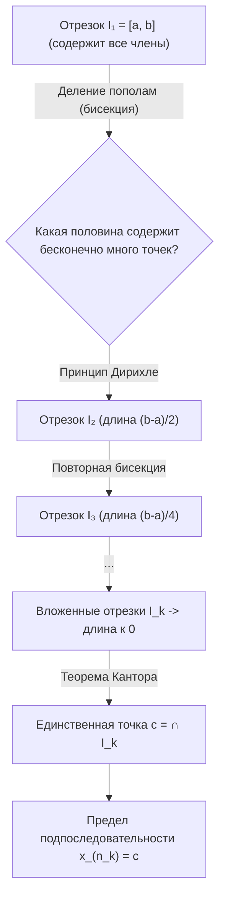
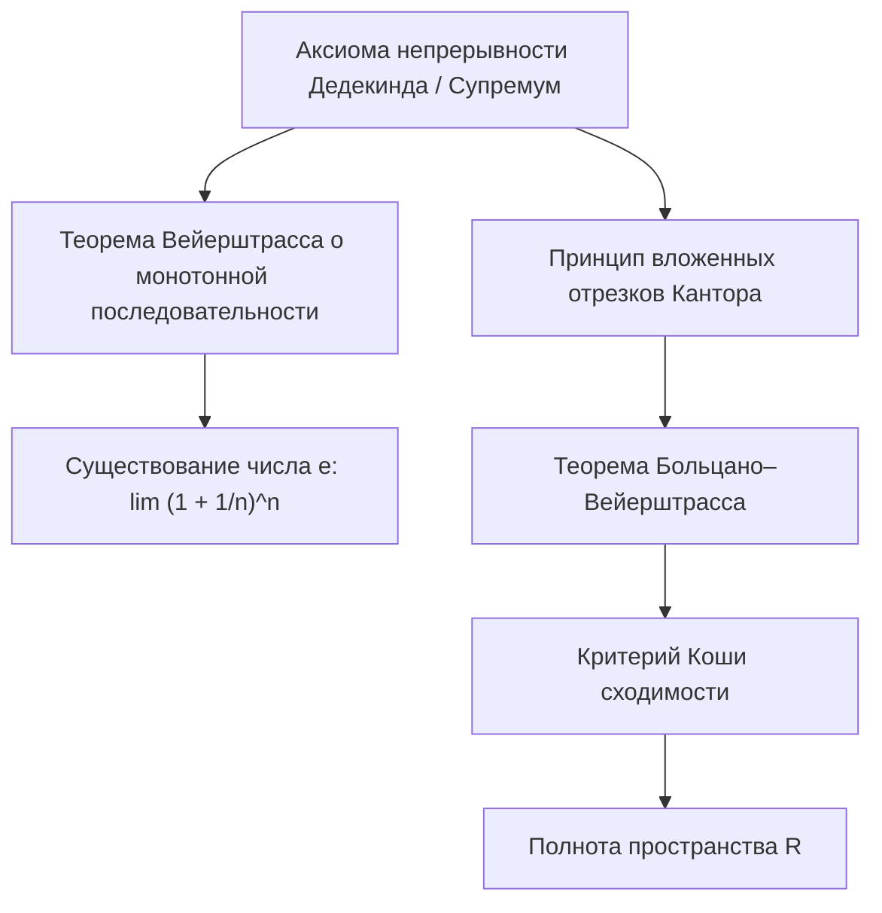

# Лекция 5: Второй замечательный предел, теорема Больцано–Вейерштрасса и критерий Коши

> **Дисциплина**: Математический анализ  
> **Лектор**: Факультет ИВТ / ИСТ, Университет ИТМО (Осенний семестр 2026)  
> **Ключевые темы**: Число $e$, второй замечательный предел, монотонность и ограниченность последовательности $(1 + 1/n)^n$, ряд для числа $e$, подпоследовательности, частичные пределы, теорема Больцано–Вейерштрасса (метод бисекции отрезка), фундаментальные последовательности (последовательности Коши), критерий Коши сходимости числовых последовательностей, полнота множества действительных чисел $\mathbb{R}$, гармонический ряд.

---

## 1. Второй замечательный предел и определение числа $e$

Одной из фундаментальнейших математических констант анализа является основание натуральных логарифмов — число Эйлера (Непера) $e$. В этой лекции мы строго обоснуем его существование как предела монотонной ограниченной последовательности.

### 1.1. Формулировка теоремы

> [!NOTE] **Теорема 1 (О существовании предела последовательности $(1 + 1/n)^n$)**  
> Числовая последовательность:  
> $$x_n = \left(1 + \frac{1}{n}\right)^n, \quad n \in \mathbb{N}$$  
> является **строго монотонно возрастающей** и **ограниченной сверху** числом $3$.  
> Следовательно, по теореме Вейерштрасса о монотонной последовательности существует конечный вещественный предел:  
> $$\lim_{n \to \infty} \left(1 + \frac{1}{n}\right)^n = e, \qquad 2 < e < 3$$

---

### 1.2. Доказательство монотонного возрастания

Раскроем выражение $x_n = \left(1 + \frac{1}{n}\right)^n$ по формуле **бинома Ньютона**:
$$x_n = \sum_{k=0}^n \binom{n}{k} \cdot 1^{n-k} \cdot \left(\frac{1}{n}\right)^k = 1 + \binom{n}{1}\frac{1}{n} + \binom{n}{2}\frac{1}{n^2} + \dots + \binom{n}{n}\frac{1}{n^n}$$

Распишем биномиальные коэффициенты $\binom{n}{k} = \frac{n(n-1)\dots(n-k+1)}{k!}$:
$$\binom{n}{k}\frac{1}{n^k} = \frac{1}{k!} \cdot \frac{n}{n} \cdot \frac{n-1}{n} \cdot \frac{n-2}{n} \dots \frac{n-(k-1)}{n} = \frac{1}{k!} \left(1 - \frac{1}{n}\right)\left(1 - \frac{2}{n}\right)\dots\left(1 - \frac{k-1}{n}\right)$$

Подставим это представление в формулу для $x_n$:
$$x_n = 1 + 1 + \frac{1}{2!}\left(1 - \frac{1}{n}\right) + \frac{1}{3!}\left(1 - \frac{1}{n}\right)\left(1 - \frac{2}{n}\right) + \dots + \frac{1}{n!}\left(1 - \frac{1}{n}\right)\left(1 - \frac{2}{n}\right)\dots\left(1 - \frac{n-1}{n}\right)$$

Запишем аналогичное разложение для следующего члена $x_{n+1}$:
$$x_{n+1} = 1 + 1 + \frac{1}{2!}\left(1 - \frac{1}{n+1}\right) + \dots + \frac{1}{n!}\left(1 - \frac{1}{n+1}\right)\dots\left(1 - \frac{n-1}{n+1}\right) + \frac{1}{(n+1)!}\left(1 - \frac{1}{n+1}\right)\dots\left(1 - \frac{n}{n+1}\right)$$

Сравним суммы $x_n$ и $x_{n+1}$:
1. Первые два слагаемых одинаковы ($1 + 1 = 2$).
2. Для каждого $k = 2, 3, \dots, n$ и любого $j < k$:
   $$1 - \frac{j}{n} < 1 - \frac{j}{n+1}$$
   Следовательно, каждое $k$-е слагаемое в сумме для $x_{n+1}$ **строго больше** соответствующего слагаемого в сумме для $x_n$.
3. В сумме для $x_{n+1}$ присутствует дополнительное $(n+1)$-е слагаемое, которое строго положительно.

Таким образом, для всех $n \in \mathbb{N}$:
$$x_n < x_{n+1}$$
Последовательность $\{x_n\}$ строго монотонно возрастает. $\blacksquare$

---

### 1.3. Доказательство ограниченности сверху

В представлении для $x_n$ заметим, что для всех $j \ge 1$:
$$1 - \frac{j}{n} < 1$$
Заменим каждую такую скобку единицей:
$$x_n < 1 + 1 + \frac{1}{2!} + \frac{1}{3!} + \dots + \frac{1}{n!} = 2 + \sum_{k=2}^n \frac{1}{k!}$$

> [!TIP] **Лемма об оценке факториала**  
> Для любого натурального $k \ge 2$ верно неравенство: $k! > 2^{k-1}$.  
> *Доказательство*: $k! = 1 \cdot 2 \cdot 3 \cdot \dots \cdot k > \underbrace{1 \cdot 2 \cdot 2 \cdot \dots \cdot 2}_{k-1 \text{ двоек}} = 2^{k-1}$.

Используя эту оценку, мажорируем сумму геометрической прогрессией:
$$\sum_{k=2}^n \frac{1}{k!} < \sum_{k=2}^n \frac{1}{2^{k-1}} = \frac{1}{2} + \frac{1}{4} + \dots + \frac{1}{2^{n-1}}$$

Сумма первых $n-1$ членов геометрической прогрессии с первым членом $b_1 = 1/2$ и знаменателем $q = 1/2$:
$$S_{n-1} = \frac{1}{2} \cdot \frac{1 - (1/2)^{n-1}}{1 - 1/2} = 1 - \frac{1}{2^{n-1}} < 1$$

Подставляем:
$$x_n < 2 + \left(1 - \frac{1}{2^{n-1}}\right) = 3 - \frac{1}{2^{n-1}} < 3$$
Следовательно, для всех $n \in \mathbb{N}$:
$$2 = x_1 < x_n < 3$$
Последовательность ограничена сверху числом $3$. $\blacksquare$

По теореме Вейерштрасса о пределе монотонной ограниченной последовательности, предел существует и удовлетворяет оценке $2 < e \le 3$.

---

### 1.4. Сопряженная последовательность и зажатость числа $e$

Рассмотрим последовательность:
$$y_n = \left(1 + \frac{1}{n}\right)^{n+1} = x_n \cdot \left(1 + \frac{1}{n}\right)$$

- Заметим, что $y_n > x_n$ для всех $n$.
- Последовательность $\{y_n\}$ **строго монотонно убывает**:
  $$\frac{y_{n-1}}{y_n} = \frac{(1 + 1/(n-1))^n}{(1 + 1/n)^{n+1}} = \frac{n^n}{(n-1)^n} \cdot \frac{n^{n+1}}{(n+1)^{n+1}} = \frac{n^{2n+1}}{(n^2-1)^n (n+1)} = \frac{n}{n+1} \left(1 + \frac{1}{n^2-1}\right)^n$$
  По неравенству Бернулли: $\left(1 + \frac{1}{n^2-1}\right)^n > 1 + \frac{n}{n^2-1} > 1 + \frac{n}{n^2} = 1 + \frac{1}{n} = \frac{n+1}{n}$.  
  Отсюда $\frac{y_{n-1}}{y_n} > \frac{n}{n+1} \cdot \frac{n+1}{n} = 1 \implies y_{n-1} > y_n$.
- Предел: $\lim_{n \to \infty} y_n = \lim_{n \to \infty} x_n \cdot \lim_{n \to \infty}\left(1 + \frac{1}{n}\right) = e \cdot 1 = e$.

> [!IMPORTANT] **Двусторонняя оценка числа $e$**  
> Для любого натурального $n$ справедливо строгое неравенство:  
> $$\left(1 + \frac{1}{n}\right)^n < e < \left(1 + \frac{1}{n}\right)^{n+1}$$

---

### 1.5. Формула для числа $e$ через ряд и оценка погрешности

Обозначим $s_n = \sum_{k=0}^n \frac{1}{k!} = 1 + 1 + \frac{1}{2!} + \dots + \frac{1}{n!}$.
Из разложения бинома видно, что $x_n < s_n$. Переходя к пределу при $n \to \infty$, получаем:
$$e \le \lim_{n \to \infty} s_n$$
С другой стороны, для любого фиксированного $m < n$:
$$x_n > 1 + 1 + \frac{1}{2!}\left(1 - \frac{1}{n}\right) + \dots + \frac{1}{m!}\left(1 - \frac{1}{n}\right)\dots\left(1 - \frac{m-1}{n}\right)$$
Устремляя $n \to \infty$ при фиксированном $m$:
$$e \ge 1 + 1 + \frac{1}{2!} + \dots + \frac{1}{m!} = s_m$$
Так как это верно для любого $m$, переходя к пределу по $m \to \infty$, получаем $\lim_{m \to \infty} s_m \le e$.  
Следовательно:
$$e = \lim_{n \to \infty} \sum_{k=0}^n \frac{1}{k!} = \sum_{k=0}^\infty \frac{1}{k!}$$

> [!TIP] **Формула остатка ряда Тейлора для $e$**  
> Для любого $n \in \mathbb{N}$:  
> $$e = s_n + r_n, \qquad 0 < r_n < \frac{1}{n! \cdot n}$$  
> *Доказательство*: $r_n = \frac{1}{(n+1)!} + \frac{1}{(n+2)!} + \dots = \frac{1}{(n+1)!}\left(1 + \frac{1}{n+2} + \frac{1}{(n+2)(n+3)} + \dots\right) < \frac{1}{(n+1)!}\sum_{j=0}^\infty \left(\frac{1}{n+2}\right)^j = \frac{1}{(n+1)!}\frac{1}{1 - 1/(n+2)} = \frac{1}{(n+1)!}\frac{n+2}{n+1} = \frac{1}{n!}\frac{n+2}{(n+1)^2} < \frac{1}{n! \cdot n}$. $\blacksquare$

---

## 2. Подпоследовательности и частичные пределы

### 2.1. Определение подпоследовательности

> [!NOTE] **Определение 2 (Подпоследовательность)**  
> Пусть $\{x_n\}_{n=1}^\infty$ — числовая последовательность. Пусть $\{n_k\}_{k=1}^\infty$ — строго возрастающая последовательность натуральных чисел:  
> $$1 \le n_1 < n_2 < n_3 < \dots < n_k < n_{k+1} < \dots$$  
> Тогда последовательность $\{x_{n_k}\}_{k=1}^\infty$ называется **подпоследовательностью** последовательности $\{x_n\}$.

*Важное замечание*: так как $n_k \in \mathbb{N}$ и строго возрастает, по математической индукции легко показать, что:
$$n_k \ge k \quad \forall k \in \mathbb{N}$$

> [!IMPORTANT] **Теорема о пределе подпоследовательности**  
> Если последовательность $\{x_n\}$ сходится к числу $a$ ($\lim_{n \to \infty} x_n = a$), то любая ее подпоследовательность $\{x_{n_k}\}$ также сходится к числу $a$:  
> $$\lim_{k \to \infty} x_{n_k} = a$$

*Доказательство*: так как $\lim_{n \to \infty} x_n = a$, для любого $\varepsilon > 0$ существует $N(\varepsilon)$, такое что $\forall n > N(\varepsilon): |x_n - a| < \varepsilon$.  
Для подпоследовательности при всех $k > N(\varepsilon)$ выполнено $n_k \ge k > N(\varepsilon)$, следовательно, $|x_{n_k} - a| < \varepsilon$. Значит, $\lim_{k \to \infty} x_{n_k} = a$. $\blacksquare$

---

### 2.2. Частичные пределы, верхний и нижний предел

> [!NOTE] **Определение 3 (Частичный предел)**  
> Элемент $a \in \overline{\mathbb{R}} = \mathbb{R} \cup \{-\infty, +\infty\}$ называется **частичным пределом** последовательности $\{x_n\}$, если существует подпоследовательность $\{x_{n_k}\}$, сходящаяся к $a$.

*Пример*:  
Для последовательности $x_n = (-1)^n$:
- Подпоследовательность четных номеров $x_{2k} = 1 \to 1$.
- Подпоследовательность нечетных номеров $x_{2k-1} = -1 \to -1$.  
Множество частичных пределов: $\{-1, 1\}$.

> [!NOTE] **Определение 4 (Верхний и нижний предел)**  
> - **Верхним пределом** ($\limsup_{n \to \infty} x_n$ или $\varlimsup_{n \to \infty} x_n$) называется точная верхняя грань (наибольший элемент) множества всех частичных пределов.  
> - **Нижним пределом** ($\liminf_{n \to \infty} x_n$ или $\varunderline{\lim}_{n \to \infty} x_n$) называется точная нижняя грань (наименьший элемент) множества всех частичных пределов.  
> 
> **Критерий существования обычного предела**:  
> $$\lim_{n \to \infty} x_n = a \iff \varliminf_{n \to \infty} x_n = \varlimsup_{n \to \infty} x_n = a$$

---

## 3. Теорема Больцано–Вейерштрасса

В отличие от сходящихся последовательностей, произвольная ограниченная последовательность не обязана иметь обычный предел (вспомним $(-1)^n$). Однако фундаментальная теорема Больцано–Вейерштрасса утверждает, что «скрытый» предел у нее есть всегда.

> [!NOTE] **Теорема 2 (Больцано–Вейерштрасса)**  
> Из всякой ограниченной числовой последовательности можно выделить сходящуюся подпоследовательность:  
> $$\{x_n\} \text{ ограничена} \implies \exists \{n_k\} : \lim_{k \to \infty} x_{n_k} = c \in \mathbb{R}$$

### 3.1. Строгое доказательство (метод бисекции)

1. **Базовый отрезок**:  
   Так как последовательность $\{x_n\}$ ограничена, существуют числа $a$ и $b$, такие что все элементы последовательности лежат в отрезке $I_1 = [a, b]$:
   $$\forall n \in \mathbb{N}: \quad a \le x_n \le b$$
   Обозначим $n_1 = 1$, длина отрезка $|I_1| = b - a$.
2. **Шаг бисекции (деления пополам)**:  
   Разделим отрезок $I_1$ средней точкой $m_1 = \frac{a + b}{2}$ на две половины: $[a, m_1]$ и $[m_1, b]$.  
   В отрезке $I_1$ содержится бесконечно много членов последовательности. По принципу Дирихле хотя бы в одной из двух половин содержится бесконечно много элементов последовательности $\{x_n\}$.  
   Обозначим эту половину через $I_2 = [a_2, b_2]$. Ее длина $|I_2| = \frac{b - a}{2}$.  
   Так как в $I_2$ бесконечно много элементов, мы можем выбрать индекс $n_2 > n_1$, такой что $x_{n_2} \in I_2$.
3. **Индуктивный шаг**:  
   Предположим, что уже построены отрезки $I_1 \supset I_2 \supset \dots \supset I_k$ и выбраны индексы $n_1 < n_2 < \dots < n_k$, такие что $x_{n_j} \in I_j$ и длина $|I_j| = \frac{b - a}{2^{j-1}}$.  
   Делим отрезок $I_k$ пополам. Выбираем половину $I_{k+1}$, содержащую бесконечно много членов последовательности $\{x_n\}$.  
   Среди них выбираем номер $n_{k+1} > n_k$, такой что $x_{n_{k+1}} \in I_{k+1}$.
4. **Предельный переход**:  
   Мы построили систему вложенных отрезков:
   $$I_1 \supset I_2 \supset I_3 \supset \dots \supset I_k \supset \dots$$
   с длинами $|I_k| = \frac{b - a}{2^{k-1}} \xrightarrow{k \to \infty} 0$.  
   По **теореме Кантора о вложенных отрезках** существует единственная точка $c$, принадлежащая всем отрезкам:
   $$\{c\} = \bigcap_{k=1}^\infty I_k$$
   Так как по построению $x_{n_k} \in I_k$ и $c \in I_k$, расстояние между ними не превосходит длины отрезка:
   $$|x_{n_k} - c| \le |I_k| = \frac{b - a}{2^{k-1}}$$
   Так как $\lim_{k \to \infty} \frac{b - a}{2^{k-1}} = 0$, по теореме о зажатой последовательности:
   $$\lim_{k \to \infty} |x_{n_k} - c| = 0 \iff \lim_{k \to \infty} x_{n_k} = c$$
   Мы выделили сходящуюся подпоследовательность $\{x_{n_k}\}$. Теорема полностью доказана. $\blacksquare$

---

## 4. Критерий Коши сходимости последовательности

Классическое определение предела $\lim_{n \to \infty} x_n = a$ требует **заранее знать число $a$**, чтобы проверить неравенство $|x_n - a| < \varepsilon$. Однако в прикладных и теоретических задачах значение предела заранее неизвестно.  
Французский математик Огюстен Луи Коши предложил внутренний критерий сходимости, анализирующий лишь взаимное сближение самих членов последовательности.

### 4.1. Фундаментальная последовательность

> [!NOTE] **Определение 5 (Фундаментальная последовательность / последовательность Коши)**  
> Последовательность $\{x_n\}$ называется **фундаментальной**, если для любого $\varepsilon > 0$ существует такой номер $N(\varepsilon) \in \mathbb{N}$, что для любых номеров $n, m > N(\varepsilon)$ расстояние между членами меньше $\varepsilon$:  
> $$\forall \varepsilon > 0 \;\; \exists N \in \mathbb{N} : \;\; \forall n, m > N \implies |x_n - x_m| < \varepsilon$$

*Эквивалентная запись* (положив $m = n + p$, где $p \in \mathbb{N}$ — произвольный сдвиг):
$$\forall \varepsilon > 0 \;\; \exists N \in \mathbb{N} : \;\; \forall n > N, \;\forall p \in \mathbb{N} \implies |x_{n+p} - x_n| < \varepsilon$$

---

### 4.2. Формулировка критерия Коши

> [!IMPORTANT] **Теорема 3 (Критерий Коши сходимости числовых последовательностей)**  
> Числовая последовательность $\{x_n\}$ сходится тогда и только тогда, когда она является фундаментальной:  
> $$\exists a \in \mathbb{R} : \lim_{n \to \infty} x_n = a \iff \{x_n\} \text{ фундаментальна}$$

---

### 4.3. Полное строгое доказательство критерия Коши

Доказательство состоит из двух частей: необходимости и достаточности.

#### Часть 1: Необходимость ($\implies$)
**Дано**: $\lim_{n \to \infty} x_n = a$.  
**Требуется доказать**: $\{x_n\}$ фундаментальна.

Зафиксируем произвольное $\varepsilon > 0$.  
Возьмем $\varepsilon' = \frac{\varepsilon}{2} > 0$.  
По определению предела последовательности, для $\varepsilon'$ существует номер $N \in \mathbb{N}$, такой что:
$$\forall k > N \implies |x_k - a| < \frac{\varepsilon}{2}$$

Пусть теперь $n > N$ и $m > N$. Тогда одновременно:
$$|x_n - a| < \frac{\varepsilon}{2} \quad \text{и} \quad |x_m - a| < \frac{\varepsilon}{2}$$

Оценим разность $|x_n - x_m|$, добавив и вычтя предел $a$, и применив **неравенство треугольника**:
$$|x_n - x_m| = |(x_n - a) - (x_m - a)| \le |x_n - a| + |x_m - a| < \frac{\varepsilon}{2} + \frac{\varepsilon}{2} = \varepsilon$$
Итак, для любых $n, m > N$ верно $|x_n - x_m| < \varepsilon$.  
Необходимость доказана. $\blacksquare$

---

#### Часть 2: Достаточность ($\impliedby$)
**Дано**: $\{x_n\}$ фундаментальна.  
**Требуется доказать**: существует такое $c \in \mathbb{R}$, что $\lim_{n \to \infty} x_n = c$.

Доказательство состоит из трёх последовательных шагов:

##### Шаг 2.1: Ограниченность фундаментальной последовательности
Положим в определении фундаментальности $\varepsilon = 1$.  
Существует номер $N_0 \in \mathbb{N}$, такой что для любых $n, m > N_0$:
$$|x_n - x_m| < 1$$
Зафиксируем $m = N_0 + 1$. Тогда для всех $n > N_0$:
$$|x_n| = |(x_n - x_{N_0 + 1}) + x_{N_0 + 1}| \le |x_n - x_{N_0 + 1}| + |x_{N_0 + 1}| < 1 + |x_{N_0 + 1}|$$
Обозначим:
$$M = \max\{|x_1|, |x_2|, \dots, |x_{N_0}|, |x_{N_0 + 1}| + 1\}$$
Тогда для абсолютно всех $n \in \mathbb{N}$ выполнено $|x_n| \le M$.  
Следовательно, последовательность $\{x_n\}$ **ограничена**.

##### Шаг 2.2: Выделение сходящейся подпоследовательности
По **теореме Больцано–Вейерштрасса** (Теорема 2), из ограниченной последовательности $\{x_n\}$ можно выделить сходящуюся подпоследовательность $\{x_{n_k}\}$:
$$\exists \{n_k\} : \lim_{k \to \infty} x_{n_k} = c \in \mathbb{R}$$

##### Шаг 2.3: Доказательство сходимости всей последовательности к числу $c$
Покажем, что не только подпоследовательность, но и **вся последовательность $\{x_n\}$** сходится к этому числу $c$.

Зафиксируем произвольное $\varepsilon > 0$.  
1. Так как последовательность $\{x_n\}$ фундаментальна, для $\frac{\varepsilon}{2} > 0$ найдётся номер $N_1 \in \mathbb{N}$, такой что:
   $$\forall n, m > N_1 \implies |x_n - x_m| < \frac{\varepsilon}{2} \qquad (*)$$
2. Так как $x_{n_k} \to c$, для $\frac{\varepsilon}{2} > 0$ найдётся номер $K \in \mathbb{N}$, такой что:
   $$\forall k > K \implies |x_{n_k} - c| < \frac{\varepsilon}{2} \qquad (**)$$
3. Выберем индекс $k$ столь большим, чтобы одновременно выполнялись два условия: $k > K$ и $n_k > N_1$ (это всегда возможно, так как $n_k \ge k \to \infty$).  
   Зафиксируем этот номер $n_k$.

Теперь для **любого** номера $n > N_1$ (используя оценку $(*)$ при $m = n_k > N_1$ и оценку $(**)$):
$$|x_n - c| = |(x_n - x_{n_k}) + (x_{n_k} - c)| \le |x_n - x_{n_k}| + |x_{n_k} - c| < \frac{\varepsilon}{2} + \frac{\varepsilon}{2} = \varepsilon$$

Таким образом, для любого $\varepsilon > 0$ найден номер $N_1$, такой что для всех $n > N_1$ выполняется $|x_n - c| < \varepsilon$.  
Это в точности означает, что:
$$\lim_{n \to \infty} x_n = c$$
Достаточность, а вместе с ней и вся теорема Коши, полностью доказана. $\blacksquare$

---

## 5. Значение критерия Коши и полнота $\mathbb{R}$

### 5.1. Полнота числовых систем
Критерий Коши верен во множестве действительных чисел $\mathbb{R}$, но **лоorderжен во множестве рациональных чисел $\mathbb{Q}$**.  
*Пример*: рассмотрим последовательность рациональных чисел, приближающих $\sqrt{2}$:
$$x_1 = 1.4, \quad x_2 = 1.41, \quad x_3 = 1.414, \quad \dots \in \mathbb{Q}$$
Эта последовательность является фундаментальной (расстояния между членами стремятся к нулю). Однако в поле $\mathbb{Q}$ она **не имеет предела**, так как $\sqrt{2} \notin \mathbb{Q}$.  
Свойство, состоящее в том, что всякая фундаментальная последовательность сходится к элементу того же множества, называется **полнотой метрического пространства** (полные нормированные пространства называют банаховыми). Действительная прямая $\mathbb{R}$ полна!

### 5.2. Применение критерия Коши к расходимости гармонического ряда
Рассмотрим последовательность частичных сумм гармонического ряда:
$$h_n = 1 + \frac{1}{2} + \frac{1}{3} + \dots + \frac{1}{n}$$
Докажем её расходимость, проверив отрицание условия Коши.  
Отрицание критерия Коши:
$$\exists \varepsilon_0 > 0 \; \forall N \in \mathbb{N} \; \exists n, m > N : |h_m - h_n| \ge \varepsilon_0$$
Положим $\varepsilon_0 = \frac{1}{2}$. Для любого заданного $N$ возьмем $n = N$ и $m = 2N > N$. Тогда:
$$|h_{2N} - h_N| = \frac{1}{N+1} + \frac{1}{N+2} + \dots + \frac{1}{2N} \ge \underbrace{\frac{1}{2N} + \frac{1}{2N} + \dots + \frac{1}{2N}}_{N \text{ слагаемых}} = N \cdot \frac{1}{2N} = \frac{1}{2} = \varepsilon_0$$
Условие Коши нарушено. Следовательно, гармонический ряд **расходится** к $+\infty$.

---

## 6. Иерархия фундаментальных теорем анализа

Все ключевые теоремы теории пределов в $\mathbb{R}$ логически эквивалентны аксиоме непрерывности (полноты) Дедекинда:

