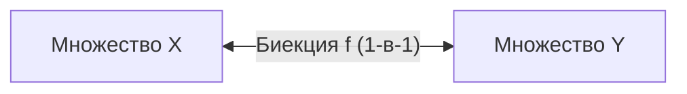
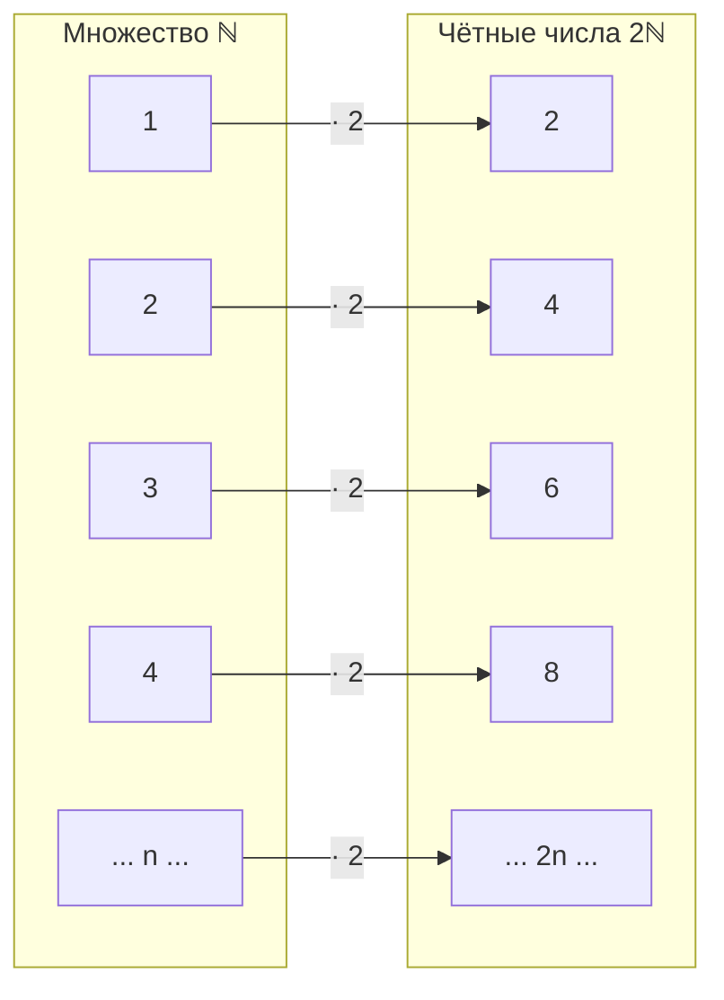
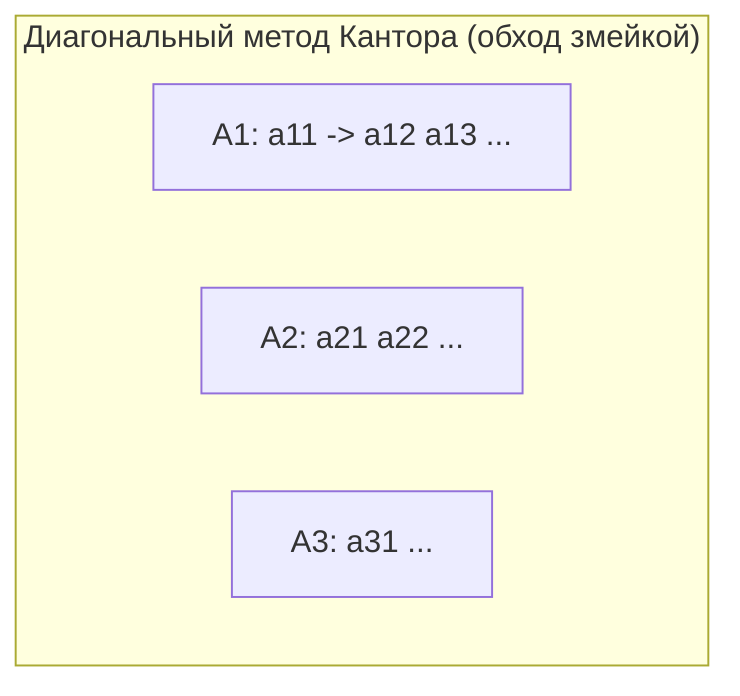
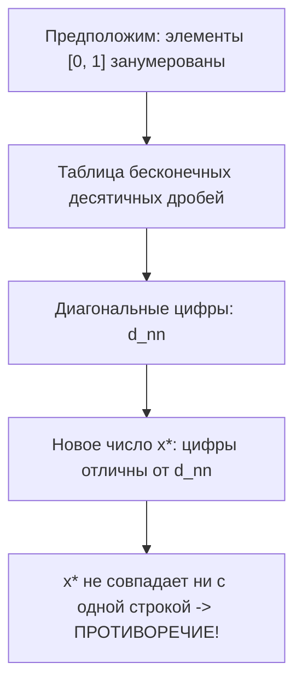

# Лекция 3: Мощность множеств, счётность и континуум

---

## 1. Рекомендуемая литература

* **Зорич В. А. — «Математический анализ. Часть I»**  
  *Глава 1, §3: Мощность множеств. Классическое университетское изложение понятий эквивалентности множеств, счётности и мощности континуума.*
* **Колмогоров А. Н., Фомин С. В. — «Элементы теории функций и функционального анализа»**  
  *Глава 1: Элементы теории множеств. Фундаментальный учебник с подробными доказательствами теорем Кантора, Кантора — Бернштейна и свойств счётных объединений.*
* **Верещагин Н. К., Шень А. — «Начала теории множеств»**  
  *Современный курс: наглядные диаграммы, разбор диагональных аргументов и парадоксов теории бесконечных множеств.*
* **Александров П. С. — «Введение в теорию множеств и общую топологию»**  
  *Строгое академическое введение в кардинальные числа и топологию числовой прямой.*

---

## 2. Понятие равномощности множеств

### Определение
Множества $X$ и $Y$ называются **равномощными** (или *эквивалентными*, обозначается $X \sim Y$), если между ними существует **биективное отображение** (взаимно однозначное соответствие):

$$X \sim Y \iff \exists f \colon X \to Y \quad (f \text{ — биекция})$$

---

### Свойства отношения равномощности
Отношение равномощности является **отношением эквивалентности** на любом семействе множеств:

1. **Рефлексивность ($X \sim X$):**  
   Для любого множества $X$ тождественное отображение $\operatorname{id}_X \colon X \to X$ ($\operatorname{id}_X(x) = x$) является биекцией.
2. **Симметричность ($X \sim Y \implies Y \sim X$):**  
   Если $f \colon X \to Y$ — биекция, то обратное отображение $f^{-1} \colon Y \to X$ также существует и является биекцией.
3. **Транзитивность ($X \sim Y \wedge Y \sim Z \implies X \sim Z$):**  
   Если $f \colon X \to Y$ и $g \colon Y \to Z$ — биекции, то их композиция $g \circ f \colon X \to Z$ также является биекцией.

---

### Мощность множества (кардинальное число)
**Мощностью** (или *кардинальным числом*, обозначается $|X|$ или $\operatorname{card}(X)$) называется общее свойство всех попарно равномощных множеств — инвариант класса эквивалентности по отношению $\sim$:

$$|X| = |Y| \iff X \sim Y$$

* Для конечных множеств мощность совпадает с числом элементов ($|X| = n \in \mathbb{N}_0$).
* Для бесконечных множеств понятие мощности обобщает число элементов в область актуальной бесконечности.

---

## 3. Парадокс Дедекинда и природа бесконечности

Для конечных множеств собственное подмножество никогда не может быть равномощно всему множеству (если $A \subsetneq B$ и $B$ конечно, то $|A| < |B|$).  
В бесконечных множествах это свойство кардинально меняется:

> **Определение (по Дедекинду):**  
> Множество $X$ называется **бесконечным**, если оно **равномощно некоторому своему собственному подмножеству**:
> $$\exists Y \subsetneq X \colon \quad Y \sim X$$

### Классические примеры парадокса Дедекинда:
1. **Множество натуральных чисел и чётные числа ($\mathbb{N} \sim 2\mathbb{N}$):**  
   Зададим отображение $f \colon \mathbb{N} \to 2\mathbb{N}$ формулой $f(n) = 2n$.  
   * $f$ инъективно ($2n_1 = 2n_2 \implies n_1 = n_2$).
   * $f$ сюръективно (любое чётное число $2k$ имеет натуральный прообраз $k$).  
   Значит, чётных чисел **ровно столько же**, сколько всех натуральных чисел.
2. **Отрезок и интервал:**  
   Интервал $(0, 1)$ равномощен всей числовой прямой $\mathbb{R}$.  
   Биекция задается функцией:
   $$f \colon (0, 1) \to \mathbb{R}, \quad f(x) = \operatorname{tg}\left(\pi\left(x - \frac{1}{2}\right)\right)$$
   Интервал конечной длины содержит ровно столько же точек, сколько бесконечная вещественная прямая.

---

## 4. Счётные множества

### Определение
Множество $X$ называется **счётным**, если оно равномощно множеству натуральных чисел $\mathbb{N}$:

$$X \text{ — счётно} \iff X \sim \mathbb{N}$$

Мощность счётного множества обозначается символом **$\aleph_0$** (алеф-ноль):
$$|\mathbb{N}| = \aleph_0$$

* **Эквивалентный смысл:** элементы любого счётного множества можно **занумеровать** натуральными числами (выписать в бесконечную последовательность без повторений и пропусков):
  $$X = \{x_1, x_2, x_3, \dots, x_n, \dots\}$$

### Не более чем счётные множества (НБЧС):
Множество называется **не более чем счётным** (НБЧС), если оно либо **конечно**, либо **счётно** ($|X| \le \aleph_0$).

---

### Фундаментальные свойства счётных множеств:

1. **Свойство подмножеств:**  
   Всякое подмножество счётного множества является **не более чем счётным** (либо конечно, либо счётно).
2. **Бесконечные подмножества:**  
   Всякое **бесконечное** подмножество счётного множества **счётно**.
3. **Удаление конечного подмножества:**  
   Удаление конечного числа элементов из счётного множества оставляет его счётным.  
   *Пояснение:* если из последовательности $\{x_1, x_2, x_3, \dots\}$ вычеркнуть $k$ элементов, оставшиеся элементы просто перенумеруются по порядку: первый оставшийся станет $y_1$, второй $y_2$ и т.д.

---

## 5. Теоремы о счётности объединений

### Теорема 1: Объединение двух счётных множеств счётно
Если множества $A$ и $B$ счётны, то их объединение $A \cup B$ также **счётно**.

**Доказательство (метод чередования элементов):**
1. Пусть $A = \{a_1, a_2, a_3, \dots\}$ и $B = \{b_1, b_2, b_3, \dots\}$. Без ограничения общности считаем $A \cap B = \varnothing$ (если есть общие, удалим повторения).
2. Построим перенумерацию объединенного множества $C = A \cup B$:  
   * Элементам множества $A$ присвоим нечётные номера: $a_k \mapsto 2k - 1$.
   * Элементам множества $B$ присвоим чётные номера: $b_k \mapsto 2k$.
3. Получаем последовательность:
   $$C = \{a_1, b_1, a_2, b_2, a_3, b_3, \dots, a_n, b_n, \dots\}$$
Построена биекция между $C$ и $\mathbb{N}$, следовательно, $A \cup B$ счётно. $\blacksquare$

---

### Теорема 2: Счётное объединение счётных множеств счётно
Пусть $\{A_n\}_{n=1}^\infty$ — счётное семейство счётных множеств. Тогда их объединение:

$$S = \bigcup_{n=1}^\infty A_n \quad \text{— счётно.}$$

**Доказательство (Диагональный метод Кантора):**
1. Запишем элементы всех множеств $A_n$ в виде бесконечной двумерной таблицы:
   $$\begin{array}{ccccc}
   A_1 \colon & a_{1,1} & a_{1,2} & a_{1,3} & \dots \\
   A_2 \colon & a_{2,1} & a_{2,2} & a_{2,3} & \dots \\
   A_3 \colon & a_{3,1} & a_{3,2} & a_{3,3} & \dots \\
   \vdots & \vdots & \vdots & \vdots & \ddots
   \end{array}$$
2. Сгруппируем элементы по сумме индексов $s = i + j$:
   * Диагональ $s = 2$: $a_{1,1}$
   * Диагональ $s = 3$: $a_{2,1}, \; a_{1,2}$
   * Диагональ $s = 4$: $a_{3,1}, \; a_{2,2}, \; a_{1,3}$
   * Диагональ $s = k$: $a_{k-1, 1}, \; a_{k-2, 2}, \; \dots, \; a_{1, k-1}$
3. На каждой диагонали содержится конечное число элементов ($s - 1$ штук).
4. Обходя таблицу последовательно по диагоналям и пропуская ранее встреченные элементы (если множества пересекаются), получаем явную биекцию с $\mathbb{N}$.  
Следовательно, множество $S$ счётно. $\blacksquare$

---

### Следствие: Счётность рациональных чисел $\mathbb{Q}$
Множество всех рациональных чисел $\mathbb{Q}$ **счётно**:

$$|\mathbb{Q}| = \aleph_0$$

*Доказательство:* Всякое рациональное число представимо несократимой дробью $\frac{p}{q}$ ($p \in \mathbb{Z}, q \in \mathbb{N}$). Множество $\mathbb{Q}$ есть счётное объединение подмножеств дробей со знаменателем $q$, либо раскладывается в таблицу пар $(p, q)$, откуда по диагональному методу Кантора следует счётность.

---

## 6. Теорема Кантора — Бернштейна — Шрёдера

### Сравнение мощностей
* Говорят, что мощность множества $A$ **не превосходит** мощности множества $B$ (обозначается $|A| \le |B|$), если существует **инъективное** отображение $f \colon A \to B$:
  $$|A| \le |B| \iff \exists f \colon A \to B \quad (f \text{ — инъекция})$$
* Если $|A| \le |B|$, но $A \not\sim B$, то говорят, что мощность $A$ **строго меньше** мощности $B$ ($|A| < |B|$).

---

### Теорема Кантора — Бернштейна
**Если для двух множеств $A$ и $B$ выполнено $|A| \le |B|$ и $|B| \le |A|$, то множества $A$ и $B$ равномощны:**

$$|A| \le |B| \quad \wedge \quad |B| \le |A| \implies |A| = |B| \quad (A \sim B)$$

*Значение теоремы:* Чтобы доказать равномощность двух множеств, **не обязательно** строить сложную прямую биекцию. Достаточно построить две взаимные инъекции:
$$f \colon A \to B \quad \text{и} \quad g \colon B \to A$$
Теорема гарантирует существование биекции между ними.

---

## 7. Мощность континуума и несчётность $\mathbb{R}$

### Определение
Мощность множества всех вещественных чисел $\mathbb{R}$ (или любого невырожденного отрезка $[a, b]$, $a < b$) называется **мощностью континуума** и обозначается символом **$\mathfrak{c}$** (или $2^{\aleph_0}$):

$$|\mathbb{R}| = |[0, 1]| = |(0, 1)| = \mathfrak{c}$$

---

### Теорема Кантора: Отрезок $[0, 1]$ несчётен ($\mathfrak{c} > \aleph_0$)
Множество вещественных чисел отрезка $[0, 1]$ **не является счётным**.

**Доказательство (Диагональный процесс Кантора):**
1. Предположим от противного, что отрезок $[0, 1]$ счётен. Тогда все его числа можно занумеровать и выписать в бесконечный список в виде бесконечных десятичных дробей:
   $$\begin{aligned}
   x_1 &= 0.{\color{red}d_{11}} d_{12} d_{13} \dots \\
   x_2 &= 0.d_{21} {\color{red}d_{22}} d_{23} \dots \\
   x_3 &= 0.d_{31} d_{32} {\color{red}d_{33}} \dots \\
   &\;\;\vdots
   \end{aligned}$$
   *(где $d_{ij} \in \{0, 1, \dots, 9\}$, исключая периодические хвосты из девяток для однозначности)*.
2. Построим новое вещественное число $x^* = 0.c_1 c_2 c_3 \dots \in [0, 1]$ по следующему правилу выбора диагональных цифр:
   $$c_n = \begin{cases} 1, & \text{если } d_{nn} \ne 1 \\ 2, & \text{если } d_{nn} = 1 \end{cases}$$
3. Сравним сконструированное число $x^*$ с элементами нашего списка:
   * Число $x^*$ отличается от $x_1$ в первой цифре ($c_1 \ne d_{11}$).
   * Число $x^*$ отличается от $x_2$ во второй цифре ($c_2 \ne d_{22}$).
   * В общем виде: число $x^*$ отличается от любого $x_n$ в $n$-й цифре после запятой ($c_n \ne d_{nn}$).
4. Следовательно, число $x^*$ **не совпадает ни с одним числом из нашего списка** ($x^* \ne x_n$ для всех $n \in \mathbb{N}$).
5. Однако $x^* \in [0, 1]$ по построению. Получено противоречие с тем, что в список были включены все числа отрезка.
Значит, предположение неверно $\implies$ отрезок $[0, 1]$ и множество $\mathbb{R}$ **несчётны**. $\blacksquare$

---

## 8. Теорема Кантора о мощности булеана

> **Теорема:** Для любого множества $A$ мощность множества всех его подмножеств $\mathcal{P}(A) = 2^A$ **строго больше** мощности самого множества $A$:
> $$|A| < |\mathcal{P}(A)|$$

* **Следствие:** Не существует «самого мощного множества». Образуется бесконечная возрастающая цепочка мощностей:
  $$|\mathbb{N}| < |\mathcal{P}(\mathbb{N})| < |\mathcal{P}(\mathcal{P}(\mathbb{N}))| < \dots$$
  $$\aleph_0 < 2^{\aleph_0} = \mathfrak{c} < 2^{\mathfrak{c}} < \dots$$
  Бесконечность имеет бесконечно много различных уровней величины.
