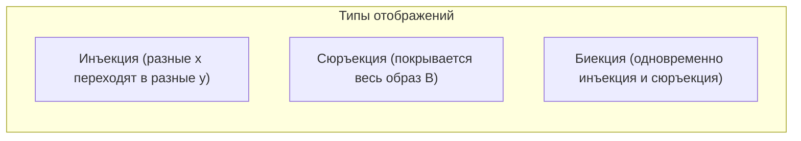
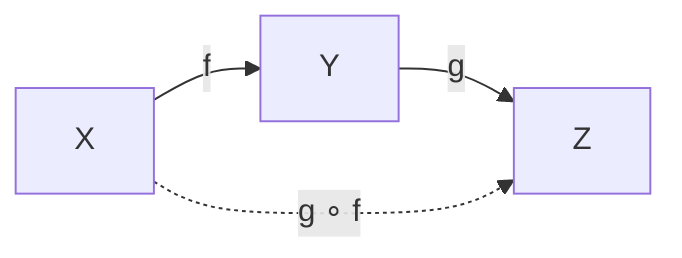

# Лекция 2: Отображения, композиция и аксиоматика Пеано

---

## 1. Рекомендуемая литература

* **Зорич В. А. — «Математический анализ. Часть I»**  
  *Глава 1: Логика и теория множеств. Параграфы об отображениях, биекциях и аксиоматическом описании натуральных и вещественных чисел.*
* **Кудрявцев Л. Д. — «Курс математического анализа. Том 1»**  
  *Глава 1: Введение в анализ. Подробный разбор свойств композиции отображений и метода математической индукции.*
* **Фихтенгольц Г. М. — «Курс дифференциального и интегрального исчисления. Том 1»**  
  *Вводный раздел о множествах, функциях и фундаментальных свойствах числовых систем.*
* **Колмогоров А. Н., Фомин С. В. — «Элементы теории функций и функционального анализа»**  
  *Глава 1: Элементы теории множеств. Строгая база по отображениям, прообразам и мощностям.*

---

## 2. Классификация отображений: инъективность, сюръективность, биективность

Пусть задано отображение $f \colon A \to B$, сопоставляющее каждому элементу $x \in A$ единственный элемент $f(x) \in B$.

### 1. Инъективность (вложение)
Отображение $f \colon A \to B$ называется **инъективным** (инъекцией), если разные элементы множества $A$ переводятся в разные элементы множества $B$:

$$\forall x_1, x_2 \in A \colon \quad x_1 \ne x_2 \implies f(x_1) \ne f(x_2)$$

*Эквивалентное определение через контрапозицию:*
$$\forall x_1, x_2 \in A \colon \quad f(x_1) = f(x_2) \implies x_1 = x_2$$

* *Геометрический смысл (для числовых функций):* любая горизонтальная прямая $y = y_0$ пересекает график функции $y = f(x)$ **не более чем в одной точке**.
* *Пример:* $f(x) = 2x + 1$ на $\mathbb{R}$ инъективна. Функция $f(x) = x^2$ на $\mathbb{R}$ **не** инъективна ($f(-2) = f(2) = 4$).

---

### 2. Сюръективность (накрытие)
Отображение $f \colon A \to B$ называется **сюръективным** (сюръекцией, отображением «на»), если образ множества $A$ совпадает со всем множеством $B$ (каждый элемент множества $B$ имеет хотя бы один прообраз):

$$\forall y \in B \quad \exists x \in A \colon \quad f(x) = y$$

* *Геометрический смысл:* любая горизонтальная прямая $y = y_0$ ($y_0 \in B$) пересекает график функции **хотя бы в одной точке**.
* *Пример:* $f \colon \mathbb{R} \to \mathbb{R}$, $f(x) = x^3$ сюръективна. Функция $f \colon \mathbb{R} \to \mathbb{R}$, $f(x) = x^2$ **не** сюръективна (у отрицательных чисел нет вещественного прообраза). Однако $f \colon \mathbb{R} \to [0, +\infty)$, $f(x) = x^2$ является сюръекцией.

---

### 3. Биективность (взаимно однозначное соответствие)
Отображение $f \colon A \to B$ называется **биективным** (биекцией), если оно одновременно является **инъективным** и **сюръективным**.

* Это означает, что каждому элементу $x \in A$ сопоставляется ровно один элемент $y \in B$, и наоборот: для каждого $y \in B$ существует **ровно один** прообраз $x \in A$.
* *Геометрический смысл:* любая прямая $y = y_0$ пересекает график **ровно в одной точке**.

---

## 3. Композиция отображений

### Определение
Пусть заданы отображения $f \colon X \to Y$ и $g \colon Y \to Z$.  
**Композицией** (суперпозицией) отображений $f$ и $g$ называется отображение, обозначаемое $g \circ f$ (или $g \cdot f$), действующее из $X$ в $Z$ по правилу:

$$(g \circ f)(x) = g\big(f(x)\big) \quad \forall x \in X$$

---

### Теорема 1: Ассоциативность композиции
Пусть $f \colon X \to Y$, $g \colon Y \to Z$, $h \colon Z \to W$. Тогда:

$$h \circ (g \circ f) = (h \circ g) \circ f$$

**Доказательство:**
Вычислим значение обоих сложных отображений на произвольном элементе $x \in X$:
1. Для левой части:
   $$\big(h \circ (g \circ f)\big)(x) = h\Big((g \circ f)(x)\Big) = h\big(g(f(x))\big)$$
2. Для правой части:
   $$\big((h \circ g) \circ f\big)(x) = (h \circ g)(f(x)) = h\big(g(f(x))\big)$$
Значения совпадают во всех точках $x \in X$, следовательно, отображения тождественно равны. $\blacksquare$

---

### Тождественное отображение
Отображение $\operatorname{id}_X \colon X \to X$, задаваемое формулой $\operatorname{id}_X(x) = x$ для всех $x \in X$, называется **тождественным отображением множества $X$**.
* Для любого $f \colon X \to Y$ выполнено:
  $$f \circ \operatorname{id}_X = f \quad \text{и} \quad \operatorname{id}_Y \circ f = f$$

---

## 4. Обратное отображение и критерий обратимости

### Определение обратного отображения
Пусть $f \colon X \to Y$. Отображение $g \colon Y \to X$ называется **обратным** к отображению $f$ (обозначается $f^{-1}$), если:

$$g \circ f = \operatorname{id}_X \quad \text{и} \quad f \circ g = \operatorname{id}_Y$$

То есть для любых $x \in X$ и $y \in Y$:
$$g(f(x)) = x \quad \text{и} \quad f(g(y)) = y$$

---

### Теорема 2 (Критерий обратимости)
**Отображение $f \colon X \to Y$ обратимо тогда и только тогда, когда оно биективно.**

**Доказательство:**
1. **Необходимость ($\implies$):** Пусть $f$ обратимо, то есть существует $g \colon Y \to X$ такое, что $g \circ f = \operatorname{id}_X$ и $f \circ g = \operatorname{id}_Y$.
   * *Инъективность:* пусть $f(x_1) = f(x_2)$. Применим отображение $g$ к обеим частям:
     $$g(f(x_1)) = g(f(x_2)) \implies \operatorname{id}_X(x_1) = \operatorname{id}_X(x_2) \implies x_1 = x_2$$
     Значит, $f$ инъективно.
   * *Сюръективность:* возьмем произвольный $y \in Y$. Положим $x = g(y) \in X$. Тогда:
     $$f(x) = f(g(y)) = \operatorname{id}_Y(y) = y$$
     Прообраз найден для любого $y$, значит, $f$ сюръективно.
   * Следовательно, $f$ биективно.

2. **Достаточность ($\impliedby$):** Пусть $f$ биективно.
   * Так как $f$ сюръективно, для каждого $y \in Y$ существует $x \in X$ такое, что $f(x) = y$.
   * Так как $f$ инъективно, такой $x$ ровно один.
   * Зададим отображение $g \colon Y \to X$, сопоставляя каждому $y$ этот единственный элемент $x$.
   * Тогда по построению $g(y) = x \iff f(x) = y$, откуда $g(f(x)) = x$ и $f(g(y)) = y$.
   * Следовательно, $g = f^{-1}$ — обратное отображение. $\blacksquare$

---

## 5. Аксиоматика Пеано натурального ряда

Натуральные числа $\mathbb{N}$ вводятся аксиоматически через отношение следования (функцию перехода к следующему элементу).

### Аксиомы Пеано:
Пусть $\mathbb{N}$ — непустое множество, на котором задан фиксированный элемент $1$ и отображение $S \colon \mathbb{N} \to \mathbb{N}$ ($S(n)$ — число, «следующее за $n$», т.е. $n + 1$).

1. **Существование единицы:** $1 \in \mathbb{N}$.
2. **Замкнутость следования:** если $n \in \mathbb{N}$, то $S(n) \in \mathbb{N}$.
3. **Единица не следует ни за каким числом:**
   $$\forall n \in \mathbb{N} \colon \quad S(n) \ne 1$$
4. **Инъективность следования (разные числа имеют разные следующие):**
   $$\forall n_1, n_2 \in \mathbb{N} \colon \quad n_1 \ne n_2 \implies S(n_1) \ne S(n_2)$$
5. **Аксиома индукции:** Если подмножество $M \subseteq \mathbb{N}$ таково, что:
   * $1 \in M$;
   * $\forall n \in M \implies S(n) \in M$;  
   то $M = \mathbb{N}$.

---

### Метод математической индукции (ММИ)

**Теорема (Принцип математической индукции):**  
Пусть $P(n)$ — предикат (утверждение, зависящее от натурального параметра $n \in \mathbb{N}$). Утверждение $P(n)$ истинно для всех $n \in \mathbb{N}$, если выполнены два условия:
1. **База индукции:** утверждение $P(1)$ истинно.
2. **Индукционный переход:** для любого $n \in \mathbb{N}$ из истинности $P(n)$ следует истинность $P(n+1)$ ($P(n) \implies P(n+1)$).

*Доказательство:* Рассмотри множество $M = \{n \in \mathbb{N} \mid P(n) = \mathrm{True}\}$. По условию базы $1 \in M$. По условию перехода если $n \in M$, то $S(n) = n+1 \in M$. По 5-й аксиоме Пеано $M = \mathbb{N}$. $\blacksquare$

---

## 6. Арифметика и порядок на $\mathbb{N}$

### Рекурсивное определение сложения:
Операция сложения $+ \colon \mathbb{N} \times \mathbb{N} \to \mathbb{N}$ задается через функцию следования $S$:
1. $m + 1 = S(m)$
2. $m + S(n) = S(m + n)$

### Отношение строгого линейного порядка ($<$):
Для натуральных чисел $n, m \in \mathbb{N}$ отношение $n < m$ определяется соотношением:
$$n < m \iff \exists k \in \mathbb{N} \colon \quad m = n + k$$

---

## 7. Вполне упорядоченность и Сильный ММИ

### Теорема о вполне упорядоченности $\mathbb{N}$:
Всякое непустое подмножество $A \subseteq \mathbb{N}$ имеет наименьший элемент:

$$\forall A \subseteq \mathbb{N}, \quad A \ne \varnothing \implies \exists m_0 \in A \colon \forall m \in A \implies m_0 \le m$$

> [!NOTE]
> Доказательство данной теоремы через метод индукции вынесено в практическое домашнее задание: [ДЗ Матан лекция 2.md](file:///c:/Users/Bar21/Documents/Общая%20папка/ITMO_IS_lectory/Матан/ДЗ%20Матан%20лекция%202.md).

---

### Принцип сильной математической индукции (полная индукция)
**Теорема:** Утверждение $P(n)$ истинно для всех $n \in \mathbb{N}$, если:
1. **База:** $P(1)$ истинно.
2. **Переход:** для любого $n \in \mathbb{N}$, если истинны **все** предшествующие утверждения $P(1), P(2), \dots, P(n)$, то истинно и следующее утверждение $P(n+1)$:
   $$\big(P(1) \wedge P(2) \wedge \dots \wedge P(n)\big) \implies P(n+1)$$

---

## 8. Классические приложения математической индукции

### 1. Числа Фибоначчи и формула Бине
Числа Фибоначчи задаются рекуррентно:
$$F_1 = 1, \quad F_2 = 1, \quad F_n = F_{n-1} + F_{n-2} \quad (n \ge 3)$$

**Формула Бине:**
$$F_n = \frac{1}{\sqrt{5}} \left( \Phi^n - \Psi^n \right)$$
где $\Phi = \frac{1 + \sqrt{5}}{2}$ (золотое сечение), $\Psi = \frac{1 - \sqrt{5}}{2} = 1 - \Phi = -\frac{1}{\Phi}$.  
*Доказательство проводится по принципу сильной индукции с проверкой базы для $n=1$ и $n=2$.*

---

### 2. Основная теорема арифметики
Всякое натуральное число $n > 1$ либо является простым, либо может быть единственным образом (с точностью до порядка множителей) разложено в произведение простых чисел:
$$n = p_1^{\alpha_1} p_2^{\alpha_2} \dots p_k^{\alpha_k}$$
*Существование разложения доказывается по сильной математической индукции:*
* База $n = 2$ — простое число.
* Переход: пусть утверждение верно для всех $k \le n$. Если $n+1$ простое — разложение получено. Если составное, то $n+1 = a \cdot b$, где $1 < a, b \le n$. По предположению индукции $a$ и $b$ раскладываются на простые множители, значит, их произведение $n+1$ также раскладывается.

---

### 3. Бином Ньютона
Для любых элементов коммутативного кольца $a, b$:
$$(a + b)^n = \sum_{k=0}^n C_n^k a^{n-k} b^k$$
где биномиальные коэффициенты:
$$C_n^k = \binom{n}{k} = \frac{n!}{k!(n-k)!}$$
*Доказывается стандартной индукцией с использованием правила Паскаля: $C_n^k + C_n^{k-1} = C_{n+1}^k$.*
