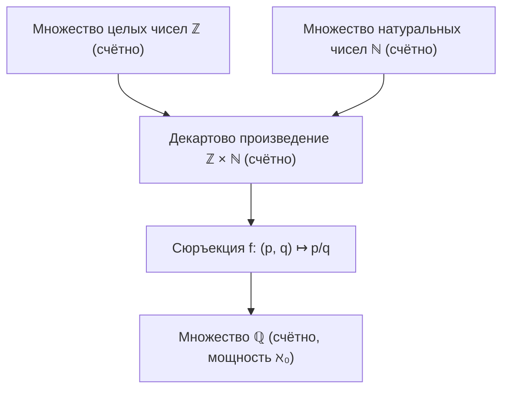
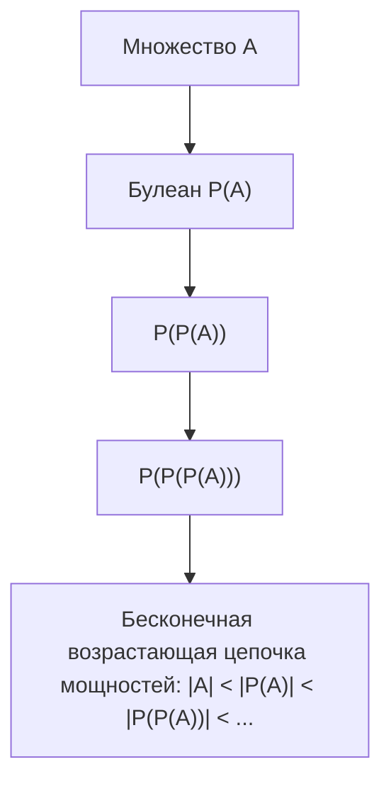
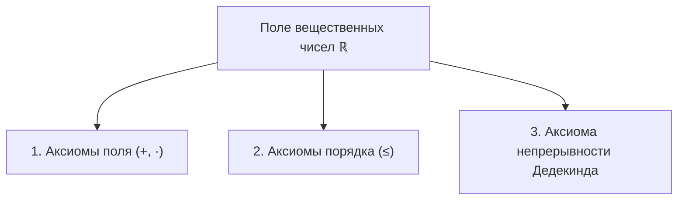
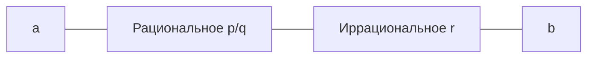

# Лекция 3 (продолжение): Счётность $\mathbb{Q}$, теорема Кантора, поле $\mathbb{R}$ и аксиома непрерывности

---

## 1. Рекомендуемая литература

* **Зорич В. А. — «Математический анализ. Часть I»**  
  *Глава 1: Некоторые общематематические понятия и положения (мощности множеств, счётность), Глава 2: Вещественные числа (аксиоматика $\mathbb{R}$, аксиома полноты/непрерывности, принцип Архимеда).*
* **Кудрявцев Л. Д. — «Курс математического анализа. Том 1»**  
  *Глава 1: Множества и вещественные числа. Предельная строгость изложения дедекиндовых сечений, плотности $\mathbb{Q}$ в $\mathbb{R}$ и граней множеств.*
* **Фихтенгольц Г. М. — «Курс дифференциального и интегрального исчисления. Том 1»**  
  *Введение: Вещественные числа. Классическое фундаментальное описание непрерывности числовой прямой и метода сечений Дедекинда.*

---

## 2. Счётность множества рациональных чисел $\mathbb{Q}$

### Определение множества $\mathbb{Q}$
Множеством рациональных чисел называется множество несократимых дробей:
$$\mathbb{Q} = \left\{ \frac{p}{q} \;\middle|\; p \in \mathbb{Z}, \; q \in \mathbb{N}, \; \operatorname{НОД}(|p|, q) = 1 \right\}$$

### Теорема 1 (Счётность $\mathbb{Q}$)
Множество рациональных чисел $\mathbb{Q}$ равномощно множеству натуральных чисел $\mathbb{N}$:
$$|\mathbb{Q}| = |\mathbb{N}| = \aleph_0$$

### Доказательство:
1. Рассмотрим декартово произведение множеств $\mathbb{Z} \times \mathbb{N} = \{(p, q) \mid p \in \mathbb{Z}, q \in \mathbb{N}\}$.
2. Множество целых чисел $\mathbb{Z}$ счётно: его можно упорядочить в ряд:
   $$0, \; 1, \; -1, \; 2, \; -2, \; 3, \; -3, \; \dots$$
3. Произведение двух счётных множеств счётно. Расположим пары $(p, q)$ в бесконечную таблицу и занумеруем их по диагоналям (метод диагоналей Кантора):
   $$|\mathbb{Z} \times \mathbb{N}| = \aleph_0$$
4. Зададим отображение $f: \mathbb{Z} \times \mathbb{N} \to \mathbb{Q}$, полагая $f(p, q) = \frac{p}{q}$.
   * Отображение $f$ является **сюръективным** (каждое рациональное число представляется хотя бы одной такой дробью).
5. По теореме о мощности подмножеств счётного множества, образ счётного множества при сюръекции не превосходит счётной мощности:
   $$|\mathbb{Q}| \le |\mathbb{Z} \times \mathbb{N}| = \aleph_0$$
6. С другой стороны, натуральные числа вкладываются в рациональные $\mathbb{N} \subset \mathbb{Q} \implies |\mathbb{Q}| \ge |\mathbb{N}| = \aleph_0$.
7. По теореме Кантора — Бернштейна получаем $|\mathbb{Q}| = \aleph_0$. $\blacksquare$

---

## 3. Теорема Кантора о булеане (Теорема о мощности $2^A$)

### Определение: Булеан (множество всех подмножеств)
Для любого множества $A$ его **булеаном** $\mathcal{P}(A)$ (или $2^A$) называется множество всех его подмножеств:
$$\mathcal{P}(A) = \{B \mid B \subseteq A\}$$

* **Пример для конечного множества $A = \{1, 2, 3\}$:**
  В булеане ровно $2^3 = 8$ подмножеств:
  $$\mathcal{P}(\{1, 2, 3\}) = \big\{ \varnothing, \; \{1\}, \; \{2\}, \; \{3\}, \; \{1, 2\}, \; \{1, 3\}, \; \{2, 3\}, \; \{1, 2, 3\} \big\}$$

---

### Теорема 2 (Теорема Кантора)
Для любого множества $A$ мощность его булеана строго больше мощности самого множества:
$$|A| < |\mathcal{P}(A)|$$

### Доказательство:
Требуется показать два факта:
1. Существует инъекция $f: A \to \mathcal{P}(A)$ (значит, $|A| \le |\mathcal{P}(A)|$).
2. Не существует сюръекции $g: A \to \mathcal{P}(A)$ (значит, $|A| \ne |\mathcal{P}(A)|$).

#### Шаг 1 (Инъекция):
Зададим отображение $f: A \to \mathcal{P}(A)$ правилом $f(x) = \{x\}$.  
Если $x_1 \ne x_2$, то $\{x_1\} \ne \{x_2\}$, поэтому $f$ инъективно. Следовательно, $|A| \le |\mathcal{P}(A)|$.

#### Шаг 2 (Отсутствие сюръекции — парадокс диагонали Кантора):
Предположим противное: пусть существует сюръективное отображение $g: A \to \mathcal{P}(A)$.  
Это означает, что для каждого подмножества $X \in \mathcal{P}(A)$ найдётся такой прообраз $x \in A$, что $g(x) = X$.

Рассмотрим диагональное множество Кантора:
$$B = \{x \in A \mid x \notin g(x)\}$$
Поскольку $B \subseteq A$, то $B \in \mathcal{P}(A)$.  
Так как отображение $g$ сюръективно, в множестве $A$ обязан найтись такой элемент $b \in A$, для которого:
$$g(b) = B$$

Зададим вопрос: **принадлежит ли элемент $b$ множеству $B$?**
* **Случай 1:** Пусть $b \in B$.  
  Тогда по определению множества $B$ должно выполняться $b \notin g(b)$. Но $g(b) = B$, следовательно, $b \notin B$. Противоречие.
* **Случай 2:** Пусть $b \notin B$.  
  Так как $g(b) = B$, это означает $b \notin g(b)$. Но по определению множества $B$, всякий элемент со свойством $x \notin g(x)$ обязан принадлежать $B$. Следовательно, $b \in B$. Снова противоречие.

В обоих случаях получаем непреодолимое логическое противоречие ($b \in B \iff b \notin B$).  
Следовательно, наше предположение неверно: **сюръекции $g: A \to \mathcal{P}(A)$ не существует**.

> **Фундаментальное следствие:**  
> Не существует «наибольшей мощности». Беря последовательно булеаны:
> $$|\mathbb{N}| < |\mathcal{P}(\mathbb{N})| < |\mathcal{P}(\mathcal{P}(\mathbb{N}))| < |\mathcal{P}(\mathcal{P}(\mathcal{P}(\mathbb{N})))| < \dots$$
> мы получаем бесконечную иерархию бесконечных мощностей.

---

## 4. Аксиоматика поля вещественных чисел $\mathbb{R}$

Поле вещественных чисел $\mathbb{R}$ — это множество, снабженное операциями сложения ($+$), умножения ($\cdot$) и отношением линейного порядка ($\le$), удовлетворяющее трем группам аксиом:

### 4.1. Группа I: Аксиомы поля
1. **Коммутативность сложения:** $a + b = b + a$
2. **Ассоциативность сложения:** $(a + b) + c = a + (b + c)$
3. **Существование нуля:** $\exists 0 \in \mathbb{R} : a + 0 = a$
4. **Существование противоположного:** $\forall a \in \mathbb{R}, \exists (-a) \in \mathbb{R} : a + (-a) = 0$
5. **Коммутативность умножения:** $a \cdot b = b \cdot a$
6. **Ассоциативность умножения:** $(a \cdot b) \cdot c = a \cdot (b \cdot c)$
7. **Существование единицы:** $\exists 1 \in \mathbb{R} \setminus \{0\} : a \cdot 1 = a$
8. **Существование обратного:** $\forall a \ne 0, \exists a^{-1} \in \mathbb{R} : a \cdot a^{-1} = 1$
9. **Дистрибутивность умножения относительно сложения:** $a \cdot (b + c) = a \cdot b + a \cdot c$
10. **Нетривиальность:** $0 \ne 1$

---

### 4.2. Группа II: Аксиомы порядка
На $\mathbb{R}$ задано отношение $\le$, удовлетворяющее свойствам:
1. **Рефлексивность:** $\forall a : a \le a$
2. **Антисимметричность:** $\forall a, b : (a \le b \land b \le a) \implies a = b$
3. **Транзитивность:** $\forall a, b, c : (a \le b \land b \le c) \implies a \le c$
4. **Линейность (полнота порядка):** $\forall a, b : a \le b \lor b \le a$
5. **Согласованность со сложением:** $\forall a, b, c : a \le b \implies a + c \le b + c$
6. **Согласованность с умножением:** $\forall a, b : (a \ge 0 \land b \ge 0) \implies a \cdot b \ge 0$

---

### 4.3. Группа III: Аксиома непрерывности (Аксиома Дедекинда)

#### Формулировка Дедекинда
Пусть $A$ и $B$ — два непустых подмножества $\mathbb{R}$, такие что всякий элемент множества $A$ не превосходит всякого элемента множества $B$:
$$\forall a \in A, \; \forall b \in B \implies a \le b$$
Тогда **существует хотя бы одно число $c \in \mathbb{R}$**, разделяющее эти множества:
$$\exists c \in \mathbb{R} : \forall a \in A, \; \forall b \in B \implies a \le c \le b$$

> **Историческая ремарка:** Аксиома непрерывности отличает числовую прямую $\mathbb{R}$ от множества рациональных чисел $\mathbb{Q}$. В $\mathbb{Q}$ есть «дыры» (иррациональные числа, такие как $\sqrt{2}$), поэтому множество $\mathbb{Q}$ аксиоме непрерывности **не удовлетворяет** (см. домашнее задание).

---

## 5. Принцип Архимеда и его следствия

### Теорема 3 (Принцип Архимеда)
Множество натуральных чисел $\mathbb{N}$ **не ограничено сверху** в поле вещественных чисел $\mathbb{R}$:
$$\forall x \in \mathbb{R}, \quad \exists n \in \mathbb{N} : n > x$$

### Доказательство:
1. Докажем от противного: предположим, что множество $\mathbb{N}$ ограничено сверху в $\mathbb{R}$.
2. Пусть $A = \mathbb{N}$, а $B = \{x \in \mathbb{R} \mid \forall n \in \mathbb{N} \implies n \le x\}$ — множество всех верхних граней $\mathbb{N}$.
3. Множества $A$ и $B$ непусты и удовлетворяют условию аксиомы Дедекинда: $\forall n \in A, \forall b \in B \implies n \le b$.
4. По аксиоме непрерывности Дедекинда существует разделяющее число $c \in \mathbb{R}$, такое что:
   $$\forall n \in \mathbb{N} \implies n \le c \le b, \quad \forall b \in B$$
5. Так как $n \le c$ для всех $n \in \mathbb{N}$, то число $c$ является наименьшей верхней гранью $\mathbb{N}$ ($c = \sup \mathbb{N}$).
6. Рассмотрим число $c - 1 < c$. Поскольку $c - 1$ строго меньше верхней грани $c$, оно уже не может быть верхней гранью $\mathbb{N}$.
7. Значит, найдётся такой элемент $n_0 \in \mathbb{N}$, что:
   $$n_0 > c - 1$$
8. Прибавим к обеим частям неравенства $1$:
   $$n_0 + 1 > c$$
9. Но по аксиомам Пеано, если $n_0 \in \mathbb{N}$, то и $n_0 + 1 \in \mathbb{N}$!  
   Мы нашли натуральное число $n_0 + 1$, которое строго больше верхней грани $c$.  
   Полученное противоречие опровергает предположение об ограниченности $\mathbb{N}$.  
   Следовательно, множество $\mathbb{N}$ не ограничено сверху в $\mathbb{R}$. $\blacksquare$

---

### Следствия принципа Архимеда:

1. **Бесконечно малые обратные:**
   $$\forall \varepsilon > 0, \quad \exists n \in \mathbb{N} : \frac{1}{n} < \varepsilon$$
   *Доказательство:* По принципу Архимеда для вещественного числа $x = \frac{1}{\varepsilon} > 0$ найдётся $n \in \mathbb{N}$, такое что $n > \frac{1}{\varepsilon} \iff \frac{1}{n} < \varepsilon$.

2. **Соизмеримость отрезков Архимеда:**
   $$\forall x, y \in \mathbb{R}_+ (x > 0, y > 0), \quad \exists n \in \mathbb{N} : n \cdot x > y$$
   *Доказательство:* Применим принцип Архимеда к числу $\frac{y}{x} \in \mathbb{R}$: существует $n \in \mathbb{N} : n > \frac{y}{x} \iff n \cdot x > y$.

3. **Существование целой части (дискретная сетка):**
   $$\forall x \in \mathbb{R}, \; \forall h > 0, \quad \exists ! n \in \mathbb{Z} : n \cdot h \le x < (n + 1) \cdot h$$
   (При $h = 1$ это даёт определение целой части числа: $\lfloor x \rfloor \le x < \lfloor x \rfloor + 1$).

---

## 6. Плотность множеств $\mathbb{Q}$ и $\mathbb{R} \setminus \mathbb{Q}$ в $\mathbb{R}$

### Определение
Подмножество $S \subset \mathbb{R}$ называется **всюду плотным** в $\mathbb{R}$, если в любом открытом интервале $(a, b)$ ($a < b$) содержится хотя бы один элемент из $S$:
$$\forall a, b \in \mathbb{R} \; (a < b) \implies (a, b) \cap S \ne \varnothing$$

### Теорема 4 (Всюду плотность $\mathbb{Q}$ в $\mathbb{R}$)
Между любыми двумя различными вещественными числами $a < b$ лежит хотя бы одно рациональное число $r \in \mathbb{Q}$.

### Теорема 5 (Всюду плотность иррациональных чисел в $\mathbb{R}$)
Между любыми двумя различными вещественными числами $a < b$ лежит хотя бы одно иррациональное число $\xi \in \mathbb{R} \setminus \mathbb{Q}$.

*(Подробные доказательства обеих теорем вынесены в отдельное домашнее задание к данной лекции).*
