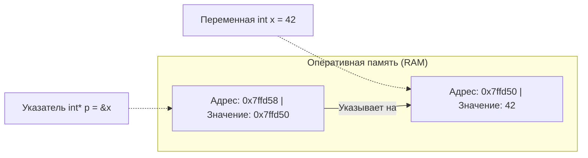
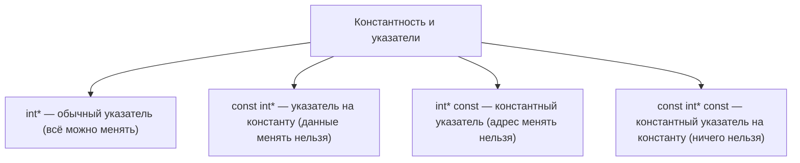
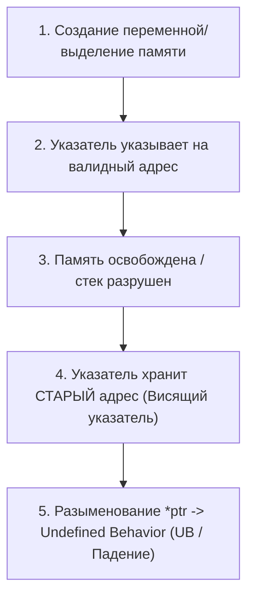
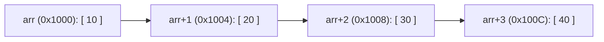

# Лекция 3: Модель памяти, указатели, константность и адресация в C++

---

## 1. Рекомендуемая литература

* **Бьёрн Страуструп — «Язык программирования C++» (4-е изд.)**  
  *Глава 7: Указатели, массивы и ссылки. Детальный разбор низкоуровневой модели памяти и константности.*
* **Скотт Мейерс — «Эффективный и современный C++» (42 рекомендации)**  
  *Правило 8: Предпочитайте `nullptr` нулевым константам `0` и `NULL`. Правило 3: Применяйте `const` везде, где это возможно.*
* **Справочник cppreference.com**  
  *Разделы: «Pointers», «Pointer arithmetic», «nullptr», «cv-qualifiers (const and volatile)».*

---

## 2. Что такое указатель? Модель памяти

### Определение
**Указатель (Pointer)** — это отдельный тип переменной, значением которой является **числовой адрес ячейки оперативной памяти**, где расположен другой объект.



### Размер указателя в системе
Размер указателя определяется разрядностью адресной шины архитектуры процессора:
* В **32-битных системах (x86):** размер любого указателя равен **4 байта** (32 бита, адресует до 4 ГБ RAM).
* В **64-битных системах (x86-64 / ARM64):** размер любого указателя равен **8 байт** (64 бита).

```cpp
int* pInt;
double* pDouble;
char* pChar;

std::cout << sizeof(pInt) << " " << sizeof(pDouble) << " " << sizeof(pChar); 
// На x86-64 выведет: 8 8 8 (размер не зависит от типа адресуемого объекта!)
```

---

## 3. Базовые операторы: `&` (взятие адреса) и `*` (разыменование)

### 3.1. Оператор взятия адреса (`&`)
* Унарный оператор `&` возвращает адрес в памяти, по которому расположен объект (lvalue):
  ```cpp
  int a = 100;
  int* p = &a; // В p записывается адрес переменной a
  ```
* **Важно:** В C++ у любого объекта (переменной в стеке, глобальной переменной, объекта в куче) можно взять адрес, за исключением битовых полей и переменных, объявленных со спецификатором `register`.

### 3.2. Оператор разыменования (`*`)
* Унарный оператор `*` обращается к участку памяти, на который указывает указатель, предоставляя доступ к значению объекта:
  ```cpp
  *p = 200; // По адресу, лежащему в p, записываем 200 (a теперь равна 200)
  int b = *p; // Читаем значение по адресу (b = 200)
  ```

---

## 4. Константность и указатели (Константная семантика)

Спецификатор `const` может относиться как к **самому адресу** (указателю), так и к **данным, на которые он указывает**.



### 4.1. Указатель на константу (`const T*` или `T const*`)
* Указывает на объект, который нельзя изменять через данный указатель. Сам указатель можно перенаправить на другой адрес.
* Правило чтения: читаем справа налево: `const int*` $\to$ «указатель на `const int`».
```cpp
int x = 10, y = 20;
const int* p = &x;

// *p = 15;   // ОШИБКА КОМПИЛЯЦИИ: данные константны!
p = &y;       // РАЗРЕШЕНО: указатель можно перенаправить на другой адрес
```

### 4.2. Константный указатель (`T* const`)
* Сам указатель (адрес) является константой и инициализируется один раз. Перенаправить его нельзя. Однако данные по этому адресу менять можно.
* Чтение: `int* const` $\to$ «константный указатель на `int`».
```cpp
int x = 10, y = 20;
int* const p = &x;

*p = 15;      // РАЗРЕШЕНО: данные по адресу не константны
// p = &y;    // ОШИБКА КОМПИЛЯЦИИ: указатель константен, адрес перезаписать нельзя!
```

### 4.3. Константный указатель на константу (`const T* const`)
* Запрещены любые модификации: нельзя менять ни адрес, ни значение по адресу.
```cpp
const int x = 10;
const int* const p = &x;

// *p = 20;   // ОШИБКА КОМПИЛЯЦИИ
// p = &y;    // ОШИБКА КОМПИЛЯЦИИ
```

### Сводная шпаргалка:
```cpp
int x = 5;
      int*       p1 = &x; // Можно менять и адрес, и значение
const int*       p2 = &x; // Нельзя менять значение (*p2), адрес менять можно (p2 = &y)
      int* const p3 = &x; // Нельзя менять адрес (p3), значение менять можно (*p3 = 10)
const int* const p4 = &x; // Нельзя менять ничего
```

---

## 5. Нулевой указатель: `nullptr` против `NULL` и `0`

### Исторический контекст (C++03 и C)
Раньше для обозначения нулевого адреса использовали макрос `NULL` (который раскрывался в `0` или `((void*)0)`):
```cpp
int* p1 = NULL;
int* p2 = 0;
```
Это порождало критические ошибки при перегрузке функций из-за неявного приведения целого нуля к целочисленным типам:
```cpp
void foo(int x);
void foo(int* ptr);

foo(NULL); // НЕОДНОЗНАЧНОСТЬ или вызов foo(int), а не foo(int*)!
```

### Современный стандарт (C++11 и новее): `nullptr`
В C++11 введено ключевое слово `nullptr` типа `std::nullptr_t`.
* `nullptr` неявно приводится **к любому типу указателя**, но **не приводится к целочисленным типам (`int`)**:
```cpp
void foo(int x);
void foo(int* ptr);

foo(nullptr); // Строго вызовет foo(int* ptr)! Без ошибок и двусмысленности.
```

> **Правило чистого кода (Скотт Мейерс):**  
> В современном C++ всегда используйте **только `nullptr`**. Использование `0` и `NULL` для указателей считается устаревшим антипаттерном.

---

## 6. Висящие указатели (Dangling Pointers) и UB

### Определение
**Висящий указатель (Dangling Pointer)** — это указатель, который хранит адрес памяти, которая уже была освобождена или объект по которому прекратил своё существование (вышел из области видимости).



### Типичные сценарии возникновения:

#### 1. Возврат адреса локальной переменной из функции (Stack Escape):
```cpp
int* dangerousFunction() {
    int local_val = 42;
    return &local_val; // ОШИБКА! local_val уничтожается при выходе из функции
}

int main() {
    int* p = dangerousFunction();
    // p теперь висящий указатель!
    std::cout << *p; // UNDEFINED BEHAVIOR: чтение из разрушенного стека
}
```

#### 2. Разыменование после удаления памяти (Use-After-Free):
```cpp
int* p = new int(10);
delete p; // Память возвращена операционной системе, но переменная p всё ещё хранит старый адрес!

// *p = 20; // КРИТИЧЕСКАЯ ОШИБКА: Use-After-Free (висящий указатель)

p = nullptr; // ПРАВИЛО: сразу занулять указатель после delete, если он продолжает жить
```

---

## 7. Массивы и арифметика указателей (Pointer Arithmetic)

### 7.1. Распад массива в указатель (Array-to-pointer decay)
Имя массива в C++ в большинстве выражений неявно неявно преобразуется («распадается») в указатель на его нулевой элемент:
```cpp
int arr[5] = {10, 20, 30, 40, 50};
int* p = arr; // Эквивалентно: int* p = &arr[0];
```

### 7.2. Арифметика указателей
Прибавление/вычитание целого числа $k$ к указателю смещает его не на $k$ байт, а на **$k 	imes 	ext{sizeof}(T)$ байт** (на $k$ элементов типа $T$ вперед или назад):
$$	ext{address}(p + k) = 	ext{address}(p) + k \cdot 	ext{sizeof}(T)$$



### 7.3. Эквивалентность индексации и разыменования
Синтаксис квадратных скобок `arr[i]` в C++ — это синтаксический сахар для арифметики указателей:
$$arr[i] \equiv *(arr + i) \equiv *(i + arr) \equiv i[arr]$$

```cpp
int arr[3] = {10, 20, 30};
std::cout << arr[1];   // 20
std::cout << *(arr + 1); // 20
std::cout << 1[arr];   // 20 (абсолютно валидный C++, подтверждающий коммутативность!)
```

### 7.4. Вычитание указателей (ptrdiff_t)
Если два указателя указывают на элементы одного массива, их разность возвращает **количество элементов между ними** (тип `std::ptrdiff_t`):
```cpp
int arr[5] = {1, 2, 3, 4, 5};
int* p1 = &arr[1];
int* p4 = &arr[4];
std::cout << (p4 - p1); // Выведет 3 (расстояние в элементах, а не в байтах!)
```

---

## 8. Указатели на указатели (Двойные указатели `T**`)

### Определение
Указатель на указатель — это переменная, которая хранит адрес другого указателя:
```cpp
int a = 42;
int* p = &a;     // p указывает на a
int** pp = &p;   // pp указывает на p

std::cout << **pp; // Двойное разыменование: выведет 42
```

### Применение: Динамические двумерные массивы
Двойные указатели классически используются для создания матрицы в динамической памяти:
```cpp
int rows = 3, cols = 4;
int** matrix = new int*[rows]; // Массив указателей на строки

for (int i = 0; i < rows; ++i) {
    matrix[i] = new int[cols]; // Выделение памяти под каждую строку
}

// Доступ к элементу:
matrix[1][2] = 99; // *( *(matrix + 1) + 2 )

// Освобождение памяти (строго в обратном порядке!):
for (int i = 0; i < rows; ++i) {
    delete[] matrix[i];
}
delete[] matrix;
```

---

## 9. Итоговая сводка правил безопасной работы с указателями

1. **Инициализация:** Всегда инициализируйте указатели при объявлении либо адресом реального объекта, либо `nullptr`.
2. **Проверка на `nullptr`:** Перед разыменованием всегда проверяйте указатель (`if (ptr != nullptr)`).
3. **Защита от висячих указателей:** После освобождения динамической памяти (`delete`) немедленно присваивайте указателю `nullptr`.
4. **Константность:** Делайте указатели и данные `const`, если функция не должна их менять.
