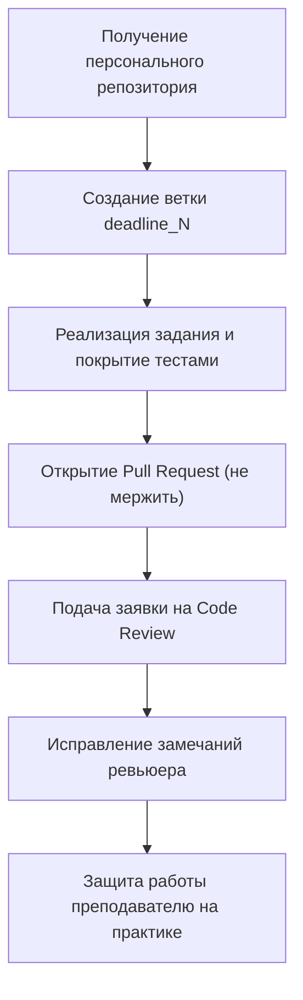
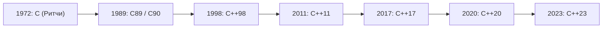
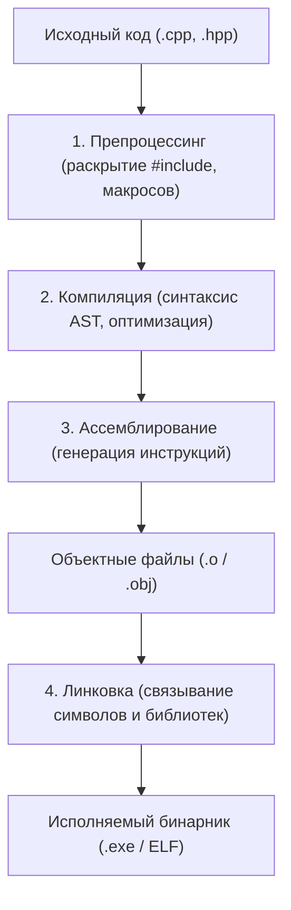
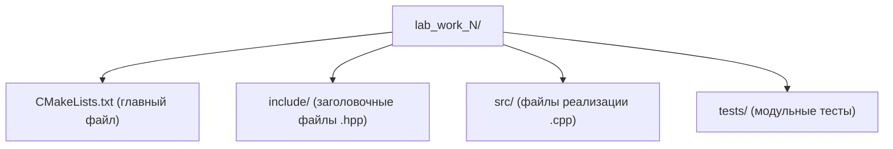

# Лекция 1: Введение в курс «Основы программирования на C++»

---

## 1. Организация курса и регламент

### Преподавательский состав
* **Лекторы курса:** Александр Павлович Хвастунов, Сергей Викторович Фадеев.
* **Учебная команда:** более 30 специалистов (лекторы, преподаватели практических занятий, менторы).

---

### Балльно-рейтинговая система (БРС)
Итоговая оценка формируется по накопительной системе из **100 базовых баллов**:

| Элемент контроля | Баллы | Описание |
| :--- | :---: | :--- |
| **Лабораторные работы** | **60** | 5 практических заданий в семестре |
| **Live Coding** | **10** | Написание и защита кода в реальном времени |
| **Итоговый зачёт** | **30** | Теоретический и практический срез знаний |
| **Дополнительные баллы** | **+ ...** | Активность на семинарах, решение бонусных задач |

* **Порог успешного прохождения курса:** минимум **60 баллов**.
* **Форма итоговой аттестации:** дифференцированный зачёт (проводится в конце семестра).
* **Семинарские занятия:** проводятся регулярно (в очном и дистанционном форматах). Посещение крайне рекомендуется — на них разбираются тонкости практической реализации и даются бонусные баллы.

---

## 2. Лабораторные работы и правила сдачи

### Ключевые требования к коду
1. **Строгий запрет генеративного ИИ:** использование LLM и любых ИИ-ассистентов при выполнении лабораторных работ категорически запрещено. Все решения проверяются автоматическими анализаторами и преподавателями на плагиат и заимствования.
2. **Стиль кода (Google Code Style):** код должен соответствовать стандарту оформления Google C++ Style Guide. Соблюдение форматирования контролируется инструментами статического анализа (`clang-format`, `clang-tidy`).
3. **Инструменты проекта:** все работы ведутся строго в системе контроля версий **Git** и собираются с помощью кроссплатформенной системы сборки **CMake**.

---

### Регламент дедлайнов (Soft Deadlines)
* На каждую лабораторную работу отводится базовый срок выполнения — **2 недели**.
* Для стимулирования ритмичной работы действует система понижающих коэффициентов при просрочке дедлайна:

| Срок сдачи | Коэффициент оценивания |
| :--- | :---: |
| В срок (до 2 недель) | **1.00** (100%) |
| Просрочка до 1 недели | **0.85** (85%) |
| Просрочка до 2 недель | **0.65** (65%) |
| Просрочка от 3 недель и более | **0.50** (50%) |

---

### Алгоритм сдачи лабораторной работы



1. **Персональный репозиторий:** под каждую лабораторную работу создается отдельный репозиторий на платформе курса.
2. **Работа в ветках:** разработка ведется в ветках с именованием `deadline_N` (начиная с `deadline_0` для первого срока сдачи).
3. **Оформление Pull Request:** решение оформляется в виде PR в основную ветку (`main`) строго **до дедлайна**. Самостоятельно мержить PR запрещено.
4. **Заявка на Code Review:** после отправки PR заполняется форма на проверку кода ментором курса.
5. **Исправление замечаний:** все комментарии ревьюера должны быть отработаны новыми коммитами в той же ветке.
6. **Защита на практике:** финальное начисление баллов происходит после очной или дистанционной демонстрации работы программы и ответов на вопросы преподавателя.

---

## 3. Цели курса и концепция языка C++

### Цели обучения
* **Фундаментальное понимание программирования:** выработка системного алгоритмического мышления («научиться точно и эффективно объяснять компьютеру свои мысли»).
* **Эволюция стандартов:** изучение возможностей языка в диапазоне от **C++98** до современных редакций **C++20** и **C++23**.
* **Парадигмы разработки:**
  * Процедурное программирование (структурирование алгоритмов, работа с памятью и указателями).
  * Объектно-ориентированное программирование (инкапсуляция, наследование, полиморфизм).
  * Обобщенное программирование (шаблоны, концепты).
* **Культура промышленной разработки:** основы архитектурного проектирования, применение модульности, написание тестируемого и поддерживаемого кода.

---

### Философия C++ и соотношение с C
* **Принцип нулевых накладных расходов (Zero-overhead principle):**
  1. То, чем вы не пользуетесь, не несет дополнительных затрат производительности или памяти.
  2. То, чем вы пользуетесь, невозможно написать вручную эффективнее, чем это генерирует компилятор.
* **Строгая статическая типизация:** строгий контроль компилятором корректности операций над типами на этапе сборки.
* **Низкоуровневый контроль и высокие абстракции:** язык сочетает прямой доступ к аппаратному обеспечению и ручное управление памятью с мощными абстракциями стандартной библиотеки (STL, умные указатели, потоки).
* **Связь C и C++:** C++ исторически вырос из языка C (проект Бьёрна Страуструпа *«C with Classes»*). Сегодня они имеют широкое общее синтаксическое подмножество, однако развиваются независимыми комитетами стандартизации. C++ не является строгим надмножеством C, имеет существенно более строгую типобезопасность и иные идиомы разработки.

---

## 4. История и стандартизация



| Год | Стандарт C++ | Ключевые нововведения |
| :---: | :--- | :--- |
| **1998** | **C++98 / C++03** | Шаблоны, пространства имен, библиотека STL (контейнеры, алгоритмы) |
| **2011** | **C++11** | Семантика перемещения, `auto`, лямбды, умные указатели (`unique_ptr`) |
| **2017** | **C++17** | `std::string_view`, `std::optional`, `std::variant`, `constexpr if` |
| **2020** | **C++20** | Концепты (`concepts`), диапазоны (`ranges`), модули, сопрограммы |
| **2023** | **C++23** | `std::print`, `std::expected`, расширения ranges |

### Стандарты языка C:
* **C89 / C90:** первая базовая стандартизация ANSI/ISO.
* **C99:** добавление `inline`-функций, переменных переменной длины (VLA), новых целочисленных типов (`<stdint.h>`).
* **C11:** поддержка многопоточности на уровне языка, атомарные операции (`<stdatomic.h>`), анонимные структуры.
* **C17 / C23:** оптимизации, устранение дефектов, атрибуты, директива `#embed`, ключевое слово `nullptr`.

### Стандарты языка C++:
* **Классический C++ (C++98 / C++03):** введение шаблонов, пространств имен, исключений и библиотеки STL (контейнеры, итераторы, алгоритмы).
* **Современный C++ (C++11 / C++14):** семантика перемещения (`rvalue references`), `auto`, лямбда-выражения, умные указатели (`unique_ptr`, `shared_ptr`), многопоточность.
* **C++17:** structured binding, `std::optional`, `std::variant`, `std::string_view`, `constexpr if`.
* **C++20:** концепты (`concepts`), диапазоны (`ranges`), сопрограммы (`coroutines`), модули (`modules`).
* **C++23 / C++26:** развитие библиотеки диапазонов, `std::print`, `std::expected`, подготовка к рефлексии и контрактам.

---

## 5. Инструменты разработки (Toolchain)

Для выполнения работ и сборки проектов используется следующий стек:

* **Компиляторы:**
  * `Clang` (рекомендуемый компилятор курса, основан на архитектуре LLVM).
  * `GCC` (GNU Compiler Collection).
  * `MSVC` (компилятор Microsoft Visual C++ под Windows).
* **Система сборки:**
  * `CMake` — стандарт де-факто для кроссплатформенного описания процесса сборки, поиска зависимостей и генерации конфигураций компиляторов.
* **Среды разработки (IDE) и редакторы:**
  * `Visual Studio Code` (с расширениями *C/C++*, *CMake Tools*, *Clangd*).
  * `CLion`, `Visual Studio`, `Qt Creator`.
* **Автоматизированное тестирование:**
  * `GoogleTest` (GTest) — фреймворк для написания модульных тестов.
  * `Catch2` — современный заголовочный фреймворк тестирования.
* **Анализ качества и отладка:**
  * `LLDB` / `GDB` — интерактивные отладчики.
  * **Санитайзеры LLVM:** `AddressSanitizer` (поиск утечек памяти и выходов за границы буфера), `UndefinedBehaviorSanitizer` (поиск неопределенного поведения), `ThreadSanitizer` (поиск состояний гонки).
  * `clang-format` и `clang-tidy` — автоматическое форматирование и статический анализ кода.

---

## 6. Первая программа: «Hello, World!» и сборка через CMake

### Исходный код (`hello-world.cpp`)

```cpp
#include <iostream>

int main() {
    std::cout << "Hello, world!\n";
    return 0;
}
```

### Пояснения к базовым элементам:
* `#include <iostream>` — директива препроцессора, подключающая стандартный заголовочный файл для работы с потоками ввода и вывода.
* `int main()` — точка входа в программу. Функция не принимает аргументов (в базовом варианте) и возвращает целочисленный код статуса завершения.
* `std::cout` — стандартный символьный поток вывода (консоль), определенный в пространстве имен `std`.
* `<<` — оператор вставки в поток (stream insertion operator).
* `"\n"` — символ перевода строки. В отличие от `std::endl`, не производит принудительного сброса буфера потока (`flush`), что обеспечивает более высокую производительность.
* `return 0;` — завершение функции `main` с кодом `0`, сигнализирующим операционной системе об успешном выполнении.

---

### Конфигурация сборки (`CMakeLists.txt`)

```cmake
cmake_minimum_required(VERSION 3.20)
project(HelloWorld LANGUAGES CXX)

set(CMAKE_CXX_STANDARD 20)
set(CMAKE_CXX_STANDARD_REQUIRED ON)

add_executable(hello_world hello-world.cpp)
```

### Команды сборки в консоли:

1. **Генерация файлов сборки в каталоге `build`:**
   ```bash
   cmake -B build
   ```
2. **Компиляция исполняемого файла:**
   ```bash
   cmake --build build
   ```
3. **Запуск программы:**
   * Под Linux / macOS:
     ```bash
     ./build/hello_world
     ```
   * Под Windows:
     ```cmd
     .\build\Debug\hello_world.exe
     ```

---

### Стадии компиляции программы на C++

Для понимания природы ошибок сборки (синтаксические ошибки против ошибок линковщика) важно знать модель трансляции:



* **Ошибка компиляции (`Compiler Error`):** нарушение синтаксиса или правил типов (например, обращение к несуществующему методу, несовпадение типов аргументов).
* **Ошибка линковки (`Linker Error`, `Undefined Reference` / `LNK2019`):** функция объявлена в `.hpp`, но её определение не найдено ни в одном `.cpp` или подключенной библиотеке.

---

### Типовая структура промышленного CMake-проекта

Рекомендуемая структура репозитория лабораторных работ курса:




---

## 7. Рекомендуемая литература

### Базовые руководства и справочники
* **Липпман С., Лажойе Ж., Му Б. — «C++ Primer»**
  * *Специфика:* Один из самых подробных и методически выверенных учебников для последовательного изучения языка с нуля.
  * *Чем полезна:* Подробно раскрывает базовые конструкции, типизацию, стандартную библиотеку STL, классы и основы обобщенного кода.
* **Страуструп Б. — «Язык программирования C++»**
  * *Специфика:* Фундаментальный труд от автора языка C++.
  * *Чем полезна:* Объясняет причины принятия тех или иных архитектурных решений в C++, философию языка, дизайн типов и модель абстракций.
* **Джосаттис Н. — «Стандартная библиотека C++. Справочное руководство»**
  * *Специфика:* Полное академическое руководство по устройствам контейнеров, итераторов, функторов и алгоритмов STL.
  * *Чем полезна:* Незаменима при реализации лабораторных работ для правильного и идиоматичного выбора алгоритмов и структур данных.
* **Керниган Б., Ритчи Д. — «Язык программирования C» (K&R)**
  * *Специфика:* Каноническое описание языка C от его непосредственных создателей.
  * *Чем полезна:* Позволяет освоить низкоуровневую модель памяти, работу с указателями и адресацией, лежащую в основе обоих языков.

### Продвинутый дизайн и идиоматический C++
* **Мейерс С. — «Эффективный и современный C++ (Effective Modern C++)»**
  * *Специфика:* Сборник из 42 практических правил и идиом современного C++ (C++11/C++14).
  * *Чем полезна:* Разбирает семантику перемещения, идеальную прямую передачу (`perfect forwarding`), лямбды и корректное использование умных указателей.
* **Саттер Г. — «Решение сложных задач на C++ (Exceptional C++)»**
  * *Специфика:* Практический разбор задач на управление ресурсами и безопасность исключений.
  * *Чем полезна:* Учит писать устойчивый к исключениям код, следовать идиоме RAII и принципам сокрытия деталей реализации (Pimpl).
* **Александреску А. — «Современное проектирование на C++»**
  * *Специфика:* Классическая работа по обобщенному программированию и шаблонному метапрограммированию на основе списков типов и паттернов на базе политик.
  * *Чем полезна:* Дает глубокое понимание статического полиморфизма и возможностей компилятора C++.
* **Гамма Э., Хелм Р., Джонсон Р., Влиссидес Дж. — «Паттерны объектно-ориентированного проектирования» (GoF)**
  * *Специфика:* Классический каталог архитектурных шаблонов проектирования.
  * *Чем полезна:* Формирует фундамент объектно-ориентированной декомпозиции систем и модульной архитектуры.

### Официальные онлайн-ресурсы
* **[cppreference.com](https://en.cppreference.com/)** — наиболее полный и актуальный справочник по ключевым словам, типам, функциям и стандартной библиотеке C и C++.
* **[Материалы и конспекты курса](https://is-itmo-c-26.github.io/lectures/)** — официальный репозиторий с расписанием, слайдами и конспектами занятий.
